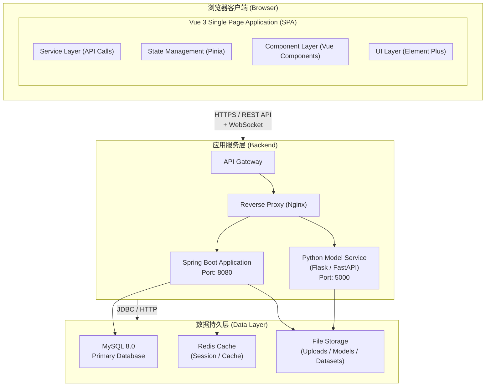
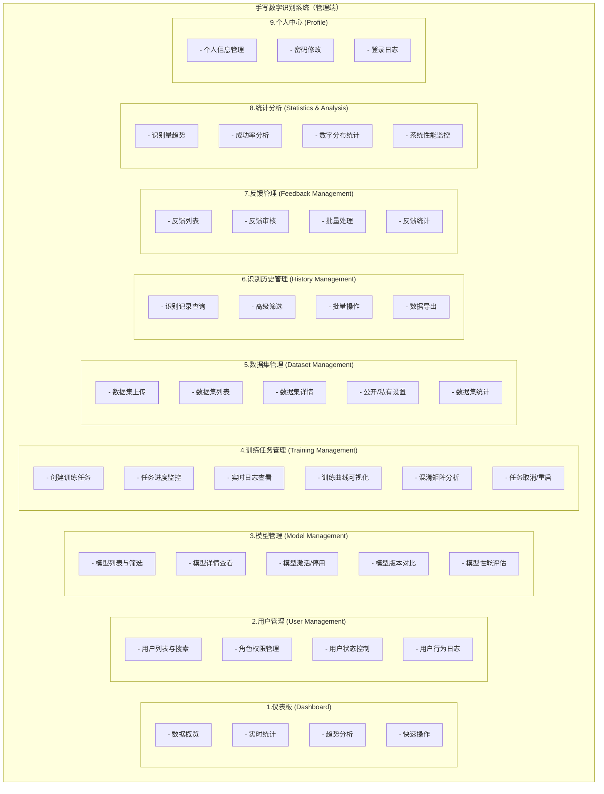

# 概要设计说明书 (High-Level Design Specification) 

------

## **手写数字识别系统（管理端）概要设计说明书**

**Intelligent Handwritten Digit Recognition System - Admin Console**
**High-Level Design Specification**

**版本:** 1.3.0
**日期:** 2025-12-01
**分支名称:** IHDRS-Admin
**编写人:** 刘家乐

------

## **目录**

[TOC]

------

## **1.引言**

### **1.1 编写目的**

本文档旨在描述手写数字识别系统管理端（Web端）的概要设计，为详细设计、开发实施和系统测试提供基础。主要读者包括：

- 系统架构师
- 前端开发工程师
- 后端开发工程师
- 测试工程师
- 项目管理人员

### **1.2 背景**

**项目名称:** 智能手写数字识别系统（管理端）
**开发单位:** 留学生第一组
**用户:** 系统管理员、模型管理员、数据分析师
**主要功能:**

- 用户管理与权限控制
- 模型训练与管理
- 数据集上传与管理
- 识别历史统计分析
- 用户反馈审核
- 系统监控与日志

### **1.3 定义与缩略语**

| 缩略语 | 英文全称                                         | 中文含义             |
| ------ | ------------------------------------------------ | -------------------- |
| IHDRS  | Intelligent Handwritten Digit Recognition System | 智能手写数字识别系统 |
| SPA    | Single Page Application                          | 单页应用             |
| RBAC   | Role-Based Access Control                        | 基于角色的访问控制   |
| CNN    | Convolutional Neural Network                     | 卷积神经网络         |
| UI/UX  | User Interface/User Experience                   | 用户界面/用户体验    |
| SSR    | Server-Side Rendering                            | 服务端渲染           |

### **1.4 参考资料**

1. IEEE Std 1016-2009 软件设计说明推荐实践
2. Vue.js 3.x 官方文档
3. Element Plus 组件库文档
4. ECharts 数据可视化文档
5. Vite 构建工具文档

------

## **2.系统概述**

### **2.1 系统目标**

开发一款基于Vue 3 + Vite的现代化Web管理平台，提供：

- **可视化数据分析**: 实时监控系统运行状态
- **模型全生命周期管理**: 从训练到部署的完整流程
- **数据集管理**: 支持上传、预览、标注
- **用户权限管理**: 细粒度的权限控制
- **智能反馈系统**: AI辅助的用户反馈处理

### **2.2 系统特点**

1. **现代化技术栈**: Vue 3 Composition API + Vite + Pinia
2. **响应式设计**: 支持桌面、平板、移动端
3. **实时数据**: WebSocket实时更新训练进度
4. **可视化分析**: ECharts多维度数据展示
5. **模块化架构**: 高内聚低耦合的组件设计

### **2.3 运行环境**

**客户端:**

- 现代浏览器: Chrome 90+, Firefox 88+, Safari 14+, Edge 90+
- 屏幕分辨率: 1280x720 及以上

**开发环境:**

- Node.js 16.x+
- npm 8.x+ / yarn 1.22+
- Vue 3.3+
- Vite 4.x+

**服务端:**

- Java 17+
- Spring Boot 3.2.0
- MySQL 8.0+
- Python 3.8+ (模型服务)

------

## **3.系统架构设计**

### **3.1 总体架构**

系统采用 **前后端分离 + 微服务** 架构：



### **3.2 前端架构**

采用 **MVVM模式 + 组件化** 设计：

```
src/
├── api/                    # API接口层
│   ├── admin.js           # 管理员API
│   ├── auth.js            # 认证API
│   ├── dataset.js         # 数据集API
│   ├── feedback.js        # 反馈API
│   ├── model.js           # 模型API
│   ├── recognition.js     # 识别API
│   ├── stats.js           # 统计API
│   ├── training.js        # 训练API
│   └── user.js            # 用户API
│
├── assets/                # 静态资源
│   ├── styles/            # 全局样式
│   └── images/            # 图片资源
│
├── components/            # 可复用组件
│   ├── common/            # 通用组件
│   ├── dataset/           # 数据集组件
│   ├── model/             # 模型组件
│   └── training/          # 训练组件
│
├── layouts/               # 布局组件
│   ├── BasicLayout.vue    # 基础布局
│   └── BlankLayout.vue    # 空白布局
│
├── router/                # 路由配置
│   └── index.js
│
├── stores/                # 状态管理 (Pinia)
│   ├── user.js            # 用户状态
│   ├── app.js             # 应用状态
│   └── permission.js      # 权限状态
│
├── utils/                 # 工具函数
│   ├── request.js         # Axios封装
│   ├── format.js          # 格式化工具
│   ├── validate.js        # 验证工具
│   └── export.js          # 导出工具
│
├── views/                 # 页面级组件
│   ├── auth/              # 认证页面
│   │   ├── Login.vue
│   │   └── Register.vue
│   ├── dashboard/         # 仪表板
│   │   └── index.vue
│   ├── dataset/           # 数据集管理
│   │   ├── DatasetList.vue
│   │   ├── DatasetUpload.vue
│   │   └── DatasetDetail.vue
│   ├── models/            # 模型管理
│   │   ├── ModelManagement.vue
│   │   └── Training.vue
│   ├── recognition/       # 识别管理
│   │   ├── HandwritingRecognition.vue
│   │   ├── HistoryManagement.vue
│   │   └── FeedbackManagement.vue
│   ├── statistics/        # 统计分析
│   │   └── overview.vue
│   ├── users/             # 用户管理
│   │   └── UserManagement.vue
│   └── profile/           # 个人中心
│       └── index.vue
│
├── App.vue                # 根组件
└── main.js                # 入口文件
```

### **3.3 技术选型**

| 技术类别       | 技术选型          | 版本  | 用途       |
| -------------- | ----------------- | ----- | ---------- |
| **框架**       | Vue.js            | 3.3+  | 核心框架   |
| **构建工具**   | Vite              | 4.x+  | 快速构建   |
| **状态管理**   | Pinia             | 2.1+  | 状态管理   |
| **路由**       | Vue Router        | 4.x+  | 路由管理   |
| **UI组件库**   | Element Plus      | 2.4+  | UI组件     |
| **HTTP客户端** | Axios             | 1.6+  | API请求    |
| **图表库**     | ECharts           | 5.4+  | 数据可视化 |
| **日期处理**   | Day.js            | 1.11+ | 日期格式化 |
| **进度条**     | NProgress         | 0.2+  | 加载进度   |
| **样式预处理** | Sass              | 1.69+ | CSS预处理  |
| **代码规范**   | ESLint + Prettier | -     | 代码质量   |

------

## **4.功能模块设计**

### **4.1 功能结构图**



### **4.2 核心功能详细描述**

#### **4.2.1 仪表板 (Dashboard)**

**功能描述:**
提供系统运行状态的全局视图，包括关键指标、趋势图表和快速操作入口。

**主要功能:**

1. **数据概览卡片**
   - 总识别次数
   - 注册用户数
   - 训练模型数
   - 今日识别量
   - 增长率趋势
2. **图表可视化**
   - 识别趋势图（折线图）
   - 数字分布图（饼图）
   - 准确率曲线
   - 系统资源使用
3. **最近活动**
   - 最近识别记录
   - 系统状态监控
4. **快速操作**
   - 开始训练模型
   - 查看识别记录
   - 用户管理
   - 模型管理

**技术实现:**

- ECharts 5.4 数据可视化
- WebSocket 实时数据推送
- 响应式布局适配

------

#### **4.2.2 用户管理 (User Management)**

**功能描述:**
管理系统用户，包括用户信息、角色权限、状态控制。

**主要功能:**

1. **用户列表**
   - 分页展示
   - 搜索：用户名、邮箱
   - 筛选：角色、状态
   - 排序：注册时间、登录次数
2. **用户操作**
   - 查看详情
   - 角色变更（USER/ADMIN）
   - 状态切换（启用/禁用）
   - 查看行为日志
3. **统计信息**
   - 总用户数
   - 管理员数量
   - 普通用户数量
   - 活跃用户数

**权限控制:**

- 仅ADMIN角色可访问
- 不能禁用自己
- 不能修改自己的角色

------

#### **4.2.3 模型管理 (Model Management)**

**功能描述:**
管理训练好的模型，包括模型激活、停用、版本对比。

**主要功能:**

1. **模型列表**
   - 模型名称、版本
   - 准确率、损失值
   - 训练样本数
   - 模型大小
   - 状态（TRAINING/COMPLETED/ACTIVE/DISABLED）
2. **模型操作**
   - 查看详情
   - 激活模型
   - 停用模型
   - 版本管理
   - 模型对比
   - 删除模型（非活跃）
3. **模型详情**
   - 基本信息
   - 训练配置
   - 性能指标
   - 训练历史
4. **版本对比**
   - 准确率对比
   - 损失值对比
   - 训练样本对比
   - 推荐建议

**业务规则:**

- 同一时间只能有一个活跃模型
- 活跃模型不能删除
- 激活新模型时自动停用旧模型

------

#### **4.2.4 训练任务管理 (Training Management)**

**功能描述:**
创建、监控、管理模型训练任务，提供实时进度和可视化分析。

**主要功能:**

1. **创建训练任务**
   - 基础配置
     - 任务名称
     - 数据集选择
   - 模型配置
     - 模型类型（CNN/ADVANCED_CNN/ResNet/VGG/MobileNet）
     - 隐藏层大小
     - 激活函数
     - Dropout率
     - 批归一化
   - 训练参数
     - 批次大小
     - 学习率
     - 优化器
     - 损失函数
     - 训练轮数
     - 早停策略
2. **任务监控**
   - 任务状态（PENDING/RUNNING/COMPLETED/FAILED/CANCELLED）
   - 训练进度百分比
   - 当前Epoch/总Epochs
   - 实时Batch进度条
3. **实时日志**
   - 终端输出
   - 自动滚动到最新
   - 日志汇总信息
4. **可视化分析**
   - 准确率曲线（训练集/验证集）
   - 损失曲线
   - 学习率曲线
   - 准确率差（过拟合观察）
   - 每个Epoch时长
   - 混淆矩阵（训练完成后）
5. **任务操作**
   - 查看详情
   - 取消任务（RUNNING状态）

**技术实现:**

- WebSocket 实时推送训练日志
- ECharts 动态更新曲线
- 热力图展示混淆矩阵
- 轮询机制（5秒刷新RUNNING任务）

------

#### **4.2.5 数据集管理 (Dataset Management)**

**功能描述:**
上传、管理训练数据集，支持公开/私有设置。

**主要功能:**

1. **数据集列表**
   - 我的数据集
   - 公开数据集
   - 状态筛选（可用/处理中/错误）
   - 搜索与过滤
2. **上传数据集**
   - 拖拽上传
   - 文件格式：ZIP
   - 大小限制：500MB
   - 目录结构验证
   - 上传进度展示
3. **数据集详情**
   - 基本信息
   - 数据统计（类别数、样本数）
   - 图像信息（尺寸、格式）
   - 类别列表
4. **数据集操作**
   - 编辑信息
   - 公开/私有切换
   - 删除

**数据集格式要求:**

```
dataset.zip
├── train/           # 训练集（必须）
│   ├── class_1/     # 类别1
│   │   ├── img1.jpg
│   │   └── img2.jpg
│   └── class_2/     # 类别2
│       └── ...
└── test/            # 测试集（可选）
    ├── class_1/
    └── class_2/
```

------

#### **4.2.6 识别历史管理 (History Management)**

**功能描述:**
查询、分析、导出识别历史记录。

**主要功能:**

1. **高级搜索**
   - 识别结果
   - 时间范围
   - 用户ID
   - 输入方式
2. **数据展示**
   - 识别图像预览
   - 识别结果
   - 置信度进度条
   - 模型信息
   - 处理时间
   - 正确性标记
3. **批量操作**
   - 批量删除
   - 批量导出
4. **数据导出**
   - Excel格式
   - CSV格式
   - PDF格式
   - 可选字段配置
   - 导出范围（当前页/全部）
5. **统计信息**
   - 总识别次数
   - 识别准确率
   - 平均响应时间
   - 今日识别量

------

#### **4.2.7 反馈管理 (Feedback Management)**

**功能描述:**
审核、处理用户提交的识别反馈。

**主要功能:**

1. **反馈列表**
   - 审核状态筛选（待审核/已接受/已拒绝）
   - 反馈类型筛选
   - 原始结果 vs 正确结果对比
   - 图像预览
   - 质量评分
2. **反馈审核**
   - 接受反馈
   - 拒绝反馈
   - 审核备注
   - 批量审核
3. **反馈详情**
   - 完整信息展示
   - 关联识别记录
   - 模型信息
   - 用户信息
4. **数据导出**
   - 反馈报表导出
   - 多种格式支持

------

#### **4.2.8 统计分析 (Statistics & Analysis)**

**功能描述:**
多维度数据统计与可视化分析。

**主要图表:**

1. **识别量趋势** - 折线图
2. **成功率趋势** - 折线图
3. **数字分布** - 饼图
4. **今日识别量分布** - 柱状图（24小时）
5. **系统资源使用** - 双轴折线图

**性能指标:**

- CPU使用率
- 内存使用率
- 小时请求数
- 活跃用户数

**最近记录:**

- 最新识别记录表格
- 置信度高亮
- 实时刷新

------

## **5.数据库设计概要**

### **5.1 核心数据表**

管理端核心表包括：

| 表名                    | 用途         | 关键字段                                         |
| ----------------------- | ------------ | ------------------------------------------------ |
| **users**               | 用户信息     | user_id, username, role, status                  |
| **models**              | 模型信息     | model_id, model_name, version, status, accuracy  |
| **training_tasks**      | 训练任务     | task_id, status, progress, current_epoch         |
| **training_logs**       | 训练日志     | log_id, task_id, epoch, loss, accuracy           |
| **datasets**            | 数据集       | dataset_id, dataset_name, status, is_public      |
| **recognition_records** | 识别记录     | record_id, user_id, model_id, result, confidence |
| **feedback_data**       | 用户反馈     | feedback_id, record_id, status, correct_result   |
| **operation_logs**      | 操作日志     | log_id, user_id, operation_type, result          |
| **user_log**            | 用户行为日志 | log_id, user_id, action, ip_address              |

### **5.2 数据访问策略**

**管理端特有功能:**

1. **用户管理**: 修改用户角色、状态
2. **模型管理**: 激活/停用模型
3. **反馈审核**: 修改反馈状态、添加审核备注
4. **日志查询**: 查看系统操作日志、用户行为日志

------

## **6.接口设计概要**

### **6.1 API分类**

| 分类           | 接口数量 | 主要功能                                         |
| -------------- | -------- | ------------------------------------------------ |
| **认证接口**   | 3        | 登录、注册、Token验证                            |
| **用户管理**   | 5        | 用户列表、角色管理、状态管理、日志查询           |
| **模型管理**   | 8        | 模型列表、详情、激活、停用、版本对比、删除       |
| **训练管理**   | 6        | 创建任务、任务列表、任务详情、取消任务、日志查询 |
| **数据集管理** | 6        | 上传、列表、详情、编辑、删除、公开设置           |
| **识别历史**   | 4        | 列表查询、详情、删除、导出                       |
| **反馈管理**   | 5        | 反馈列表、审核、批量审核、详情、导出             |
| **统计分析**   | 4        | 仪表板统计、性能指标、最近记录、趋势数据         |

### **6.2 关键接口示例**

**管理员用户列表:**

```
GET /api/admin/users
```

**创建训练任务:**

```
POST /api/training/tasks
Content-Type: application/json

{
  "taskName": "MNIST训练任务",
  "datasetId": 1,
  "modelType": "CNN",
  "trainingConfig": {
    "batchSize": 32,
    "learningRate": 0.001,
    "epochs": 50
  }
}
```

**模型激活:**

```
PUT /api/models/{modelId}/activate
```

------

## **7.安全性设计**

### **7.1 认证与授权**

**JWT Token机制:**

- Token有效期: 7天
- Refresh Token: 30天
- Token存储: LocalStorage
- 自动刷新机制

**RBAC权限控制:**

```
// 权限配置
const permissions = {
  'USER': [
    'recognition:view',
    'history:view',
    'feedback:submit',
    'profile:edit'
  ],
  'ADMIN': [
    '*:*'  // 全部权限
  ]
}
```

### **7.2 路由守卫**

```
router.beforeEach(async (to, from, next) => {
  const userStore = useUserStore()
  
  // 白名单路由
  const whiteList = ['/login', '/register']
  
  if (userStore.token) {
    // 已登录
    if (to.path === '/login') {
      next({ path: '/' })
    } else {
      // 验证Token有效性
      const valid = await userStore.validateToken()
      if (valid) {
        // 检查权限
        if (to.meta.requiresAdmin && !userStore.isAdmin) {
          next({ path: '/403' })
        } else {
          next()
        }
      } else {
        next({ path: '/login', query: { redirect: to.fullPath } })
      }
    }
  } else {
    // 未登录
    if (whiteList.includes(to.path)) {
      next()
    } else {
      next({ path: '/login', query: { redirect: to.fullPath } })
    }
  }
})
```

### **7.3 XSS防护**

**输入验证:**

```
// 用户名验证
const usernameRegex = /^[a-zA-Z0-9_]{3,50}$/

// HTML转义
function escapeHtml(text) {
  const map = {
    '&': '&amp;',
    '<': '&lt;',
    '>': '&gt;',
    '"': '&quot;',
    "'": '&#039;'
  }
  return text.replace(/[&<>"']/g, m => map[m])
}
```

### **7.4 CSRF防护**

- 使用JWT Token替代Cookie
- 验证Referer头
- 关键操作二次确认

------

## **8.性能设计**

### **8.1 性能指标**

| 指标          | 目标值  |
| ------------- | ------- |
| 首屏加载时间  | < 3s    |
| 路由切换时间  | < 500ms |
| API响应时间   | < 500ms |
| 图表渲染时间  | < 1s    |
| 大列表滚动FPS | > 50    |

### **8.2 优化策略**

**前端优化:**

1. **代码分割**

   ```
   // 路由懒加载
   const Dashboard = () => import('@/views/dashboard/index.vue')
   ```

2. **组件懒加载**

   ```
   const ECharts = defineAsyncComponent(() =>
     import('vue-echarts')
   )
   ```

3. **虚拟滚动**

   - 大数据列表使用虚拟滚动
   - 每页渲染可见项 + 缓冲区

4. **图片优化**

   - 懒加载
   - WebP格式
   - 缩略图

5. **缓存策略**

   ```
   // Axios请求缓存
   const cache = new Map()
   
   function getCachedData(url) {
     if (cache.has(url)) {
       const { data, timestamp } = cache.get(url)
       if (Date.now() - timestamp < 60000) { // 1分钟缓存
         return data
       }
     }
     return null
   }
   ```

**构建优化:**

```
// vite.config.js
export default {
  build: {
    rollupOptions: {
      output: {
        manualChunks: {
          'element-plus': ['element-plus'],
          'echarts': ['echarts', 'vue-echarts']
        }
      }
    },
    chunkSizeWarningLimit: 1000
  }
}
```

------

## **9.附录**

### **9.1 UI/UX设计规范**

**颜色系统:**

```
$primary: #667eea;      // 主色
$success: #67C23A;      // 成功
$warning: #E6A23C;      // 警告
$danger: #F56C6C;       // 危险
$info: #909399;         // 信息

$bg-primary: #f5f7fa;   // 背景色
$text-primary: #303133; // 主文本
$border: #dcdfe6;       // 边框
```

**间距系统:**

```
$spacing-xs: 4px;
$spacing-sm: 8px;
$spacing-md: 16px;
$spacing-lg: 24px;
$spacing-xl: 32px;
```

**圆角:**

```
$radius-sm: 4px;
$radius-md: 8px;
$radius-lg: 12px;
$radius-xl: 16px;
```

### **9.2 响应式断点**

```
$breakpoints: (
  xs: 0,
  sm: 576px,
  md: 768px,
  lg: 992px,
  xl: 1200px,
  xxl: 1600px
);
```