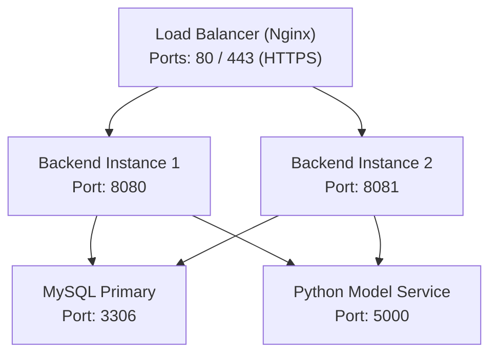
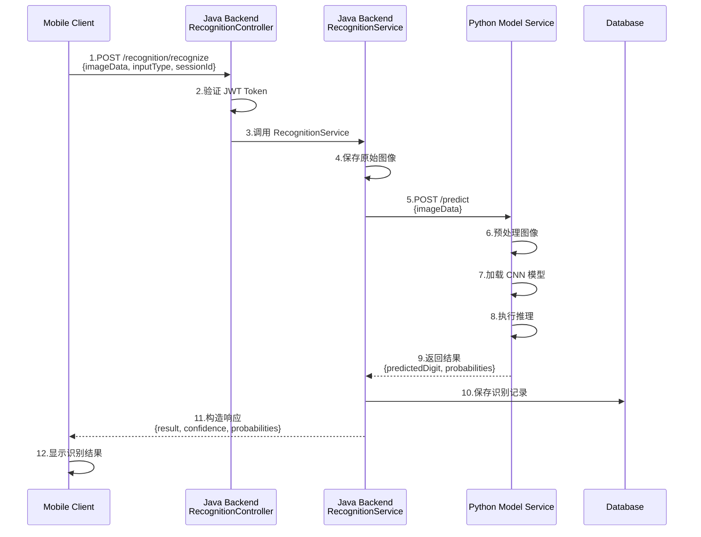
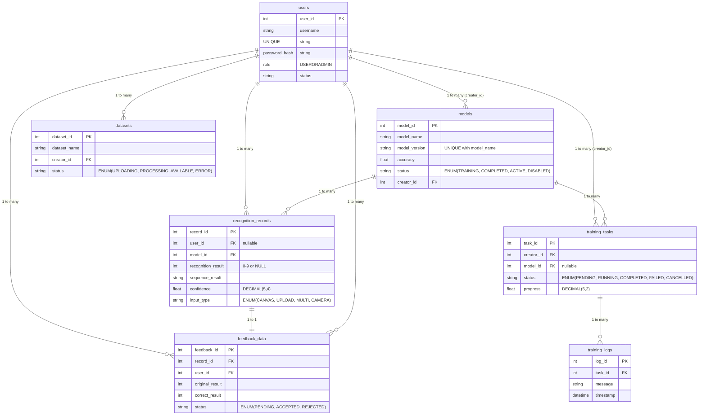
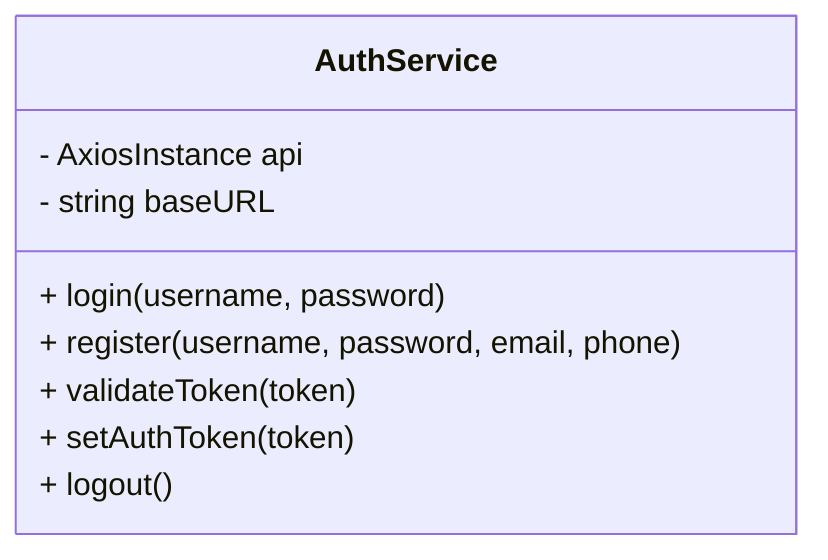
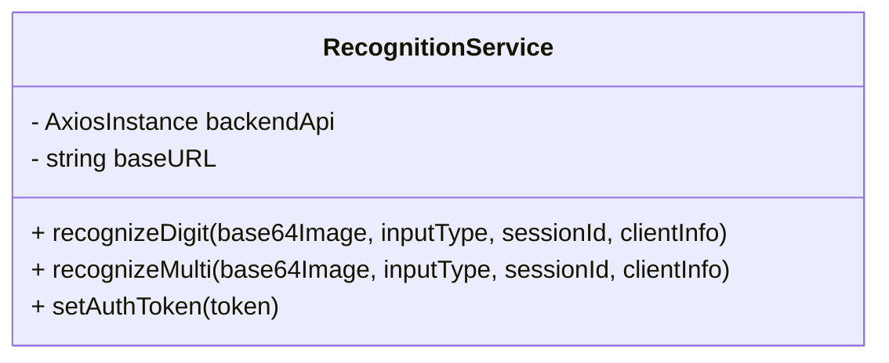
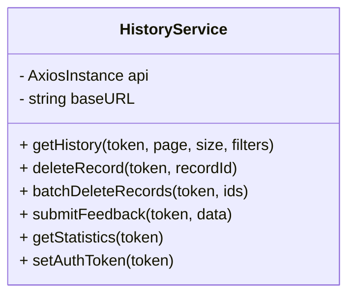
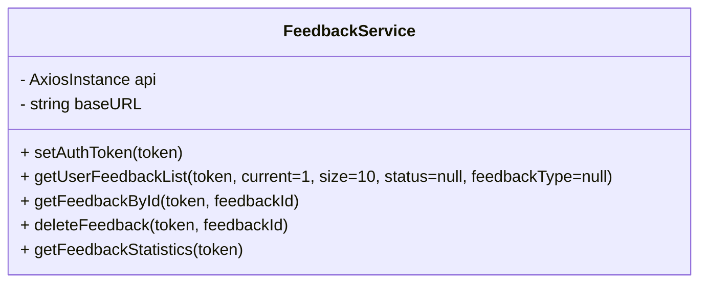
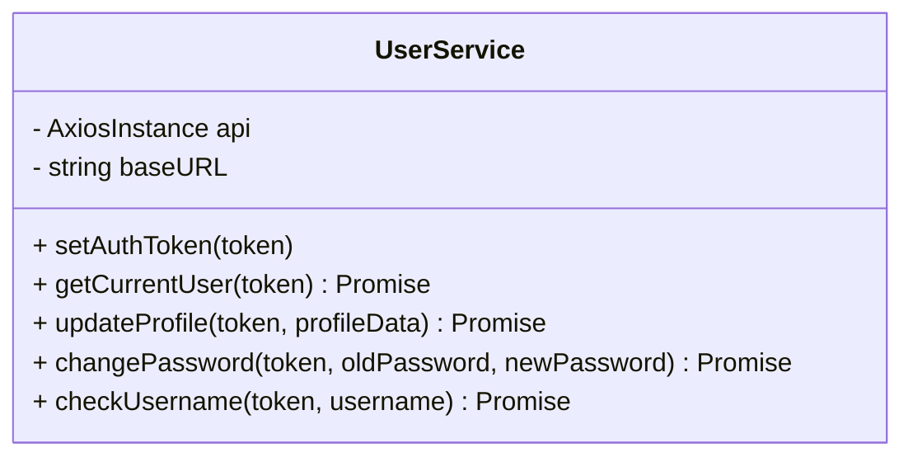

# 详细设计说明书 (Detailed Design Specification)

------

## **手写数字识别系统（用户端）详细设计说明书**

**Intelligent Handwritten Digit Recognition System - User Client**
**Detailed Design Specification**

**版本:** 1.4.0
**日期:** 2025-12-01
**项目代号:** IHDRS-Mobile
**编写人:** 刘家乐

------

## **目录**

[TOC]


------

## **1.引言**

### **1.1 编写目的**

本详细设计说明书在概要设计的基础上，深入描述系统各模块的内部结构、算法实现、数据库详细设计等，为编码实现提供直接指导。

### **1.2 范围**

本文档详细描述手写数字识别系统用户端的：

- 数据库表结构详细设计
- 核心模块类设计
- 关键算法设计
- 数据流设计

------

## **2.系统详细设计**

### **2.1 系统部署架构**



### **2.2 识别流程数据流设计**



------

## **3.数据库详细设计**

### **3.1 users 表（用户表）**

**表名:** `users`
**说明:** 存储系统用户信息

| 字段名          | 数据类型 | 长度 | 约束               | 默认值            | 说明                 |
| --------------- | -------- | ---- | ------------------ | ----------------- | -------------------- |
| user_id         | BIGINT   | -    | PK, AUTO_INCREMENT | -                 | 用户ID               |
| username        | VARCHAR  | 50   | NOT NULL, UNIQUE   | -                 | 用户名               |
| password_hash   | VARCHAR  | 255  | NOT NULL           | -                 | 密码哈希值           |
| salt            | VARCHAR  | 32   | NOT NULL           | -                 | 密码盐值             |
| role            | ENUM     | -    | NOT NULL           | 'USER'            | 用户角色：USER/ADMIN |
| email           | VARCHAR  | 100  | NULL               | NULL              | 邮箱地址             |
| phone           | VARCHAR  | 20   | NULL               | NULL              | 手机号码             |
| last_login_time | DATETIME | -    | NULL               | NULL              | 最后登录时间         |
| login_count     | INT      | -    | -                  | 0                 | 登录次数             |
| status          | TINYINT  | -    | -                  | 1                 | 状态：1-正常，0-禁用 |
| create_time     | DATETIME | -    | -                  | CURRENT_TIMESTAMP | 创建时间             |
| update_time     | DATETIME | -    | -                  | CURRENT_TIMESTAMP | 更新时间             |

**索引:**

```
PRIMARY KEY (user_id)
UNIQUE INDEX uk_username (username)
INDEX idx_status (status)
INDEX idx_role (role)
INDEX idx_email (email)
```

**业务规则:**

1. 用户名长度：3-50字符，仅支持字母、数字、下划线
2. 密码：BCrypt加密，加盐存储
3. 角色：默认为普通用户(USER)
4. Email格式：符合RFC 5322标准
5. Phone格式：中国大陆手机号 (1[3-9]\d{9})

------

### **3.2 models 表（模型表）**

**表名:** `models`
**说明:** 存储机器学习模型元数据

| 字段名           | 数据类型 | 长度   | 约束               | 默认值            | 说明                                     |
| ---------------- | -------- | ------ | ------------------ | ----------------- | ---------------------------------------- |
| model_id         | BIGINT   | -      | PK, AUTO_INCREMENT | -                 | 模型ID                                   |
| model_name       | VARCHAR  | 100    | NOT NULL           | -                 | 模型名称                                 |
| model_version    | VARCHAR  | 20     | NOT NULL           | -                 | 模型版本                                 |
| model_path       | VARCHAR  | 500    | NOT NULL           | -                 | 模型文件路径                             |
| model_type       | VARCHAR  | 50     | -                  | 'CNN'             | 模型类型                                 |
| accuracy         | DECIMAL  | (5,4)  | NULL               | NULL              | 模型准确率                               |
| loss             | DECIMAL  | (10,6) | NULL               | NULL              | 损失值                                   |
| training_samples | INT      | -      | NULL               | NULL              | 训练样本数                               |
| test_samples     | INT      | -      | NULL               | NULL              | 测试样本数                               |
| model_size       | BIGINT   | -      | NULL               | NULL              | 模型文件大小（字节）                     |
| status           | ENUM     | -      | -                  | 'TRAINING'        | 状态：TRAINING/COMPLETED/ACTIVE/DISABLED |
| description      | TEXT     | -      | NULL               | NULL              | 模型描述                                 |
| hyperparameters  | JSON     | -      | NULL               | NULL              | 超参数配置                               |
| creator_id       | BIGINT   | -      | NOT NULL, FK       | -                 | 创建者ID                                 |
| create_time      | DATETIME | -      | -                  | CURRENT_TIMESTAMP | 创建时间                                 |
| update_time      | DATETIME | -      | -                  | CURRENT_TIMESTAMP | 更新时间                                 |

**索引:**

```
PRIMARY KEY (model_id)
UNIQUE INDEX uk_model_version (model_name, model_version)
INDEX idx_creator_id (creator_id)
INDEX idx_status (status)
INDEX idx_accuracy (accuracy DESC)
```

**外键:**

```
FOREIGN KEY (creator_id) REFERENCES users(user_id) 
  ON DELETE RESTRICT ON UPDATE CASCADE
```

**业务规则:**

1. 同一模型名称下版本号唯一
2. Accuracy范围：0.0000 - 1.0000（保留4位小数）
3. 模型状态流转：TRAINING → COMPLETED → ACTIVE
4. 激活模型时，同类型其他模型自动设为DISABLED

------

### **3.3 recognition_records 表（识别记录表）**

**表名:** `recognition_records`
**说明:** 存储每次识别操作的详细记录

| 字段名             | 数据类型 | 长度  | 约束               | 默认值            | 说明                                 |
| ------------------ | -------- | ----- | ------------------ | ----------------- | ------------------------------------ |
| record_id          | BIGINT   | -     | PK, AUTO_INCREMENT | -                 | 记录ID                               |
| user_id            | BIGINT   | -     | NULL, FK           | NULL              | 用户ID（匿名识别为NULL）             |
| model_id           | BIGINT   | -     | NOT NULL, FK       | -                 | 使用的模型ID                         |
| recognition_result | INT      | -     | NULL               | NULL              | 识别结果（0-9）                      |
| confidence         | DECIMAL  | (5,4) | NOT NULL           | -                 | 置信度                               |
| image_data         | LONGBLOB | -     | NULL               | NULL              | 原始图像二进制数据                   |
| image_path         | VARCHAR  | 500   | NULL               | NULL              | 图像文件路径                         |
| sequence_result    | VARCHAR  | 500   | NULL               | NULL              | 多数字序列结果                       |
| image_hash         | VARCHAR  | 64    | NULL               | NULL              | 图像MD5哈希                          |
| input_type         | ENUM     | -     | -                  | 'CANVAS'          | 输入类型：CANVAS/UPLOAD/MULTI/CAMERA |
| processing_time    | INT      | -     | NULL               | NULL              | 处理时间（毫秒）                     |
| client_info        | JSON     | -     | NULL               | NULL              | 客户端信息                           |
| is_correct         | TINYINT  | -     | NULL               | NULL              | 是否正确：1-正确，0-错误，NULL-未知  |
| session_id         | VARCHAR  | 64    | NULL               | NULL              | 会话ID                               |
| create_time        | DATETIME | -     | -                  | CURRENT_TIMESTAMP | 创建时间                             |

**索引:**

```
PRIMARY KEY (record_id)
INDEX idx_user_id (user_id)
INDEX idx_model_id (model_id)
INDEX idx_create_time (create_time)
INDEX idx_result_confidence (recognition_result, confidence)
INDEX idx_session_id (session_id)
INDEX idx_image_hash (image_hash)
```

**外键:**

```
FOREIGN KEY (user_id) REFERENCES users(user_id) 
  ON DELETE SET NULL ON UPDATE CASCADE
FOREIGN KEY (model_id) REFERENCES models(model_id) 
  ON DELETE RESTRICT ON UPDATE CASCADE
```

**业务规则:**

1. `recognition_result`: 单数字识别时为0-9，多数字识别时为NULL
2. `sequence_result`: 多数字识别结果，如 "1234"
3. `confidence`: 范围 0.0000 - 1.0000
4. `image_hash`: MD5哈希，用于去重
5. `client_info`: JSON格式，包含设备、操作系统、应用版本等

**client_info JSON 示例:**

```
{
  "device": "iPhone 14 Pro",
  "os": "iOS 17.2",
  "app_version": "1.0.0",
  "screen_size": "1179x2556"
}
```

------

### **3.4 feedback_data 表（反馈数据表）**

**表名:** `feedback_data`
**说明:** 存储用户对识别结果的反馈

| 字段名          | 数据类型 | 长度 | 约束               | 默认值            | 说明                            |
| --------------- | -------- | ---- | ------------------ | ----------------- | ------------------------------- |
| feedback_id     | BIGINT   | -    | PK, AUTO_INCREMENT | -                 | 反馈ID                          |
| record_id       | BIGINT   | -    | NOT NULL, FK       | -                 | 关联的识别记录ID                |
| user_id         | BIGINT   | -    | NOT NULL, FK       | -                 | 反馈用户ID                      |
| original_result | INT      | -    | NOT NULL           | -                 | 原始识别结果                    |
| correct_result  | INT      | -    | NOT NULL           | -                 | 正确结果                        |
| feedback_type   | ENUM     | -    | -                  | 'WRONG_RESULT'    | 反馈类型                        |
| feedback_reason | VARCHAR  | 500  | NULL               | NULL              | 反馈原因                        |
| quality_score   | INT      | -    | NULL               | NULL              | 图像质量评分（1-5）             |
| status          | ENUM     | -    | -                  | 'PENDING'         | 状态：PENDING/ACCEPTED/REJECTED |
| reviewer_id     | BIGINT   | -    | NULL, FK           | NULL              | 审核者ID                        |
| review_time     | DATETIME | -    | NULL               | NULL              | 审核时间                        |
| review_note     | VARCHAR  | 500  | NULL               | NULL              | 审核备注                        |
| create_time     | DATETIME | -    | -                  | CURRENT_TIMESTAMP | 创建时间                        |

**索引:**

```
PRIMARY KEY (feedback_id)
INDEX idx_record_id (record_id)
INDEX idx_user_id (user_id)
INDEX idx_status (status)
INDEX idx_create_time (create_time)
```

**外键:**

```
FOREIGN KEY (record_id) REFERENCES recognition_records(record_id) 
  ON DELETE CASCADE ON UPDATE CASCADE
FOREIGN KEY (user_id) REFERENCES users(user_id) 
  ON DELETE CASCADE ON UPDATE CASCADE
FOREIGN KEY (reviewer_id) REFERENCES users(user_id) 
  ON DELETE SET NULL ON UPDATE CASCADE
```

**业务规则:**

1. `feedback_type`

    枚举值：

   - WRONG_RESULT: 识别结果错误
   - LOW_CONFIDENCE: 置信度过低
   - OTHER: 其他问题

2. `quality_score`: 1-5星评分，1表示质量很差，5表示质量优秀

3. 审核流程：PENDING → ACCEPTED/REJECTED

------

### **3.5 training_tasks 表（训练任务表）**

**表名:** `training_tasks`
**说明:** 存储模型训练任务信息

| 字段名           | 数据类型 | 长度   | 约束               | 默认值            | 说明             |
| ---------------- | -------- | ------ | ------------------ | ----------------- | ---------------- |
| task_id          | BIGINT   | -      | PK, AUTO_INCREMENT | -                 | 任务ID           |
| task_name        | VARCHAR  | 100    | NOT NULL           | -                 | 任务名称         |
| creator_id       | BIGINT   | -      | NOT NULL, FK       | -                 | 创建者ID         |
| model_id         | BIGINT   | -      | NULL, FK           | NULL              | 生成的模型ID     |
| dataset_config   | JSON     | -      | NOT NULL           | -                 | 数据集配置       |
| training_config  | JSON     | -      | NOT NULL           | -                 | 训练配置         |
| status           | ENUM     | -      | -                  | 'PENDING'         | 状态             |
| progress         | DECIMAL  | (5,2)  | -                  | 0.00              | 进度百分比       |
| current_epoch    | INT      | -      | -                  | 0                 | 当前训练轮数     |
| total_epochs     | INT      | -      | NOT NULL           | -                 | 总训练轮数       |
| best_accuracy    | DECIMAL  | (5,4)  | NULL               | NULL              | 最佳准确率       |
| final_accuracy   | DECIMAL  | (5,4)  | NULL               | NULL              | 最终准确率       |
| final_loss       | DECIMAL  | (10,6) | NULL               | NULL              | 最终损失值       |
| confusion_matrix | TEXT     | -      | NULL               | NULL              | 混淆矩阵         |
| class_names      | TEXT     | -      | NULL               | NULL              | 类别名称         |
| error_message    | TEXT     | -      | NULL               | NULL              | 错误信息         |
| start_time       | DATETIME | -      | NULL               | NULL              | 开始时间         |
| end_time         | DATETIME | -      | NULL               | NULL              | 结束时间         |
| estimated_time   | INT      | -      | NULL               | NULL              | 预估时间（分钟） |
| create_time      | DATETIME | -      | -                  | CURRENT_TIMESTAMP | 创建时间         |
| update_time      | DATETIME | -      | -                  | CURRENT_TIMESTAMP | 更新时间         |

**索引:**

```
PRIMARY KEY (task_id)
INDEX idx_creator_id (creator_id)
INDEX idx_status (status)
INDEX idx_create_time (create_time)
```

**外键:**

```
FOREIGN KEY (creator_id) REFERENCES users(user_id) 
  ON DELETE RESTRICT ON UPDATE CASCADE
FOREIGN KEY (model_id) REFERENCES models(model_id) 
  ON DELETE SET NULL ON UPDATE CASCADE
```

**dataset_config JSON 示例:**

```
{
  "dataset_id": 1,
  "train_split": 0.8,
  "val_split": 0.1,
  "test_split": 0.1,
  "augmentation": true
}
```

**training_config JSON 示例:**

```
{
  "batch_size": 32,
  "learning_rate": 0.001,
  "optimizer": "Adam",
  "loss_function": "categorical_crossentropy",
  "epochs": 50,
  "early_stopping": true,
  "patience": 5
}
```

------

### **3.6 datasets 表（数据集表）**

**表名:** `datasets`
**说明:** 存储训练数据集信息

| 字段名        | 数据类型 | 长度 | 约束               | 默认值                 | 说明                     |
| ------------- | -------- | ---- | ------------------ | ---------------------- | ------------------------ |
| dataset_id    | BIGINT   | -    | PK, AUTO_INCREMENT | -                      | 数据集ID                 |
| dataset_name  | VARCHAR  | 100  | NOT NULL           | -                      | 数据集名称               |
| dataset_type  | ENUM     | -    | NOT NULL           | 'IMAGE_CLASSIFICATION' | 数据集类型               |
| description   | TEXT     | -    | NULL               | NULL                   | 数据集描述               |
| file_path     | VARCHAR  | 500  | NOT NULL           | -                      | 数据集文件路径           |
| file_size     | BIGINT   | -    | NULL               | NULL                   | 文件大小（字节）         |
| num_classes   | INT      | -    | NULL               | NULL                   | 类别数量                 |
| num_samples   | INT      | -    | NULL               | NULL                   | 样本总数                 |
| train_samples | INT      | -    | NULL               | NULL                   | 训练集样本数             |
| test_samples  | INT      | -    | NULL               | NULL                   | 测试集样本数             |
| image_width   | INT      | -    | NULL               | NULL                   | 图像宽度                 |
| image_height  | INT      | -    | NULL               | NULL                   | 图像高度                 |
| class_names   | JSON     | -    | NULL               | NULL                   | 类别名称列表             |
| status        | ENUM     | -    | -                  | 'UPLOADING'            | 状态                     |
| error_message | TEXT     | -    | NULL               | NULL                   | 错误信息                 |
| is_public     | TINYINT  | -    | -                  | 0                      | 是否公开：1-公开，0-私有 |
| creator_id    | BIGINT   | -    | NOT NULL, FK       | -                      | 创建者ID                 |
| create_time   | DATETIME | -    | -                  | CURRENT_TIMESTAMP      | 创建时间                 |
| update_time   | DATETIME | -    | -                  | CURRENT_TIMESTAMP      | 更新时间                 |

**索引:**

```
PRIMARY KEY (dataset_id)
INDEX idx_creator_id (creator_id)
INDEX idx_status (status)
INDEX idx_type (dataset_type)
INDEX idx_is_public (is_public)
INDEX idx_create_time (create_time)
```

**class_names JSON 示例:**

```
["0", "1", "2", "3", "4", "5", "6", "7", "8", "9"]
```

------

### **3.7 数据库关系图**



------

## **4.模块详细设计**

### **4.1 认证模块 (authService.js)**



#### **4.1.1 方法详细设计**

**1.login(username, password)**

**功能:** 用户登录
**输入参数:**

- username: string - 用户名
- password: string - 密码

**输出:**

```
{
  success: boolean,
  data: {
    user: {
      userId: number,
      username: string,
      role: string,
      email: string
    },
    token: string
  },
  error: string | null
}
```

**处理流程:**

```
1.验证输入参数
   ├── 用户名不为空
   └── 密码不为空
2.发送POST请求到 /auth/login
3.解析响应
   ├── code === 200: 登录成功
   │   ├── 存储JWT token
   │   └── 返回用户数据
   └── code !== 200: 登录失败
       └── 返回错误信息
```

**异常处理:**

- 网络错误: 返回 "Login failed, please try again"
- 401 Unauthorized: 返回 "Invalid username or password"
- 500 Server Error: 返回 "Server error, please try again later"

------

**2.register(username, password, email, phone)**

**功能:** 用户注册
**输入参数:**

- username: string - 用户名 (3-50字符)
- password: string - 密码 (6-20字符)
- email: string | null - 邮箱（可选）
- phone: string | null - 手机号（可选）

**输出:**

```
{
  success: boolean,
  data: {
    userId: number,
    username: string
  },
  message: string,
  error: string | null
}
```

**验证规则:**

```
// 用户名验证
const usernameRegex = /^[a-zA-Z0-9_]{3,50}$/;

// 密码验证
const passwordMinLength = 6;
const passwordMaxLength = 20;

// 邮箱验证（可选）
const emailRegex = /^[^\s@]+@[^\s@]+\.[^\s@]+$/;

// 手机号验证（可选，中国大陆）
const phoneRegex = /^1[3-9]\d{9}$/;
```

------

### **4.2 识别模块 (recognitionService.js)**



#### **4.2.1 方法详细设计**

**1.recognizeDigit(base64Image, inputType, sessionId, clientInfo)**

**功能:** 单数字识别
**输入参数:**

- base64Image: string - Base64编码的图像数据（不含前缀）
- inputType: string - 输入类型 ('CANVAS' | 'UPLOAD' | 'CAMERA')
- sessionId: string | null - 会话ID
- clientInfo: object | null - 客户端信息

**输出:**

```
{
  success: boolean,
  data: {
    predictedDigit: number,      // 0-9
    confidence: number,           // 0.0000 - 1.0000
    processingTime: number,       // 毫秒
    needRewrite: boolean,         // 是否需要重写
    message: string,
    recordId: number,
    probabilities: number[],      // 10个概率值
    probabilitiesMap: {
      "0": number,
      "1": number,
      // ...
      "9": number
    }
  },
  raw: object,
  error: string | null
}
```

**处理流程:**

```
1.构造请求体
   {
     imageData: base64Image,
     inputType: inputType,
     sessionId: sessionId,
     clientInfo: JSON.stringify(clientInfo)
   }
2.发送POST请求到 /recognition/recognize
3.解析响应
   ├── code === 200: 识别成功
   │   ├── 提取识别结果
   │   ├── 计算置信度
   │   └── 返回概率分布
   └── code !== 200: 识别失败
       └── 返回错误信息
```

**clientInfo 示例:**

```
{
  device: "iPhone 14 Pro",
  os: "iOS 17.2",
  app_version: "1.0.0",
  browser: "Safari",
  screen_size: "1179x2556"
}
```

------

**2.recognizeMulti(base64Image, inputType, sessionId, clientInfo)**

**功能:** 多数字序列识别
**输入参数:** 同 `recognizeDigit`

**输出:**

```
{
  success: boolean,
  data: {
    sequence: string,           // 如 "1234"
    details: [
      {
        digit: number,
        confidence: number,
        position: number
      }
    ],
    averageConfidence: number,
    processingTime: number,
    recordId: number
  },
  error: string | null
}
```

------

### **4.3 历史模块 (historyService.js)**



#### **4.3.1 方法详细设计**

**1.getHistory(token, page, size, filters)**

**功能:** 获取识别历史记录（分页）
**输入参数:**

- token: string - JWT令牌

- page: number - 页码（从0开始）

- size: number - 每页大小

- filters: object - 过滤条件

  ```
  {
    result: number,        // 按结果过滤
    startTime: string,     // 开始时间
    endTime: string,       // 结束时间
    inputType: string      // 输入类型
  }
  ```

**输出:**

```
{
  success: boolean,
  data: {
    records: [
      {
        recordId: number,
        userId: number,
        modelId: number,
        recognitionResult: number,
        sequenceResult: string,
        confidence: number,
        imagePath: string,
        inputType: string,
        processingTime: number,
        isCorrect: boolean | null,
        createTime: string,
        probabilities: number[]
      }
    ],
    total: number,
    page: number,
    size: number,
    totalPages: number
  },
  error: string | null
}
```

------

**2.submitFeedback(token, feedbackData)**

**功能:** 提交识别结果反馈
**输入参数:**

- token: string - JWT令牌

- feedbackData: object

  ```
  {
    recordId: number,
    originalResult: number,
    correctResult: number,
    feedbackType: string,      // 'WRONG_RESULT' | 'LOW_CONFIDENCE' | 'OTHER'
    feedbackReason: string,
    qualityScore: number       // 1-5
  }
  ```

**输出:**

```
{
  success: boolean,
  message: string,
  error: string | null
}
```

------

### **4.4 反馈模块 (feedbackService.js)**



#### **4.4.1 方法详细设计**

**1.getUserFeedbackList(token, current, size, status, feedbackType)**

**功能:** 获取用户反馈列表
**输入参数:**

- token: string - JWT令牌
- current: number - 当前页（从1开始）
- size: number - 每页大小
- status: string | null - 状态过滤 ('PENDING' | 'ACCEPTED' | 'REJECTED')
- feedbackType: string | null - 类型过滤

**输出:**

```
{
  success: boolean,
  data: {
    records: [
      {
        feedbackId: number,
        recordId: number,
        userId: number,
        originalResult: number,
        correctResult: number,
        feedbackType: string,
        feedbackReason: string,
        qualityScore: number,
        status: string,
        reviewerName: string | null,
        reviewTime: string | null,
        reviewNote: string | null,
        createTime: string
      }
    ],
    total: number,
    current: number,
    size: number
  },
  error: string | null
}
```

------

### **4.5 用户模块 (userService.js)**



#### **4.5.1 方法详细设计**

**1.updateProfile(token, profileData)**

**功能:** 更新用户资料
**输入参数:**

- token: string - JWT令牌

- profileData: object

  ```
  {
    username: string,      // 只读，不可修改
    email: string | null,
    telephone: string | null
  }
  ```

**验证规则:**

```
// Email验证（可选）
if (email && !/^[^\s@]+@[^\s@]+\.[^\s@]+$/.test(email)) {
  throw new Error('邮箱格式不正确');
}

// Phone验证（可选）
if (telephone && !/^1[3-9]\d{9}$/.test(telephone)) {
  throw new Error('手机号格式不正确');
}
```

------

**2.changePassword(token, oldPassword, newPassword)**

**功能:** 修改密码
**输入参数:**

- token: string - JWT令牌
- oldPassword: string - 原密码
- newPassword: string - 新密码 (6-20字符)

**验证规则:**

```
// 密码长度验证
if (newPassword.length < 6 || newPassword.length > 20) {
  throw new Error('密码长度必须在6-20个字符之间');
}

// 新旧密码不能相同
if (oldPassword === newPassword) {
  throw new Error('新密码不能与原密码相同');
}
```

------

## **5.数据结构设计**

### **5.1 前端数据结构**

#### **5.1.1 User (用户对象)**

```
interface User {
  userId: number;
  username: string;
  role: 'USER' | 'ADMIN';
  email: string | null;
  phone: string | null;
  status: boolean;
  createTime: string;
  lastLoginTime: string | null;
  loginCount: number;
}
```

#### **5.1.2 RecognitionResult (识别结果)**

```
interface RecognitionResult {
  predictedDigit: number;        // 0-9
  confidence: number;             // 0.0 - 1.0
  processingTime: number;         // 毫秒
  needRewrite: boolean;
  message: string;
  recordId: number;
  probabilities: number[];        // 长度为10的数组
  probabilitiesMap: {
    [key: string]: number;        // "0" -> 0.95
  };
}
```

#### **5.1.3 HistoryRecord (历史记录)**

```
interface HistoryRecord {
  recordId: number;
  userId: number;
  modelId: number;
  modelName: string;
  modelVersion: string;
  recognitionResult: number | null;  // 单数字: 0-9, 多数字: null
  sequenceResult: string | null;     // 多数字结果: "1234"
  confidence: number;                 // 0.0 - 1.0
  imagePath: string;
  inputType: 'CANVAS' | 'UPLOAD' | 'MULTI' | 'CAMERA';
  processingTime: number;             // 毫秒
  isCorrect: boolean | null;
  createTime: string;                 // ISO 8601
  probabilities: number[] | null;
}
```

#### **5.1.4 FeedbackData (反馈数据)**

```
interface FeedbackData {
  feedbackId: number;
  recordId: number;
  userId: number;
  originalResult: number;
  correctResult: number;
  feedbackType: 'WRONG_RESULT' | 'LOW_CONFIDENCE' | 'OTHER';
  feedbackReason: string;
  qualityScore: number;               // 1-5
  status: 'PENDING' | 'ACCEPTED' | 'REJECTED';
  reviewerName: string | null;
  reviewTime: string | null;
  reviewNote: string | null;
  createTime: string;
  // 关联数据
  recordInfo: {
    imagePath: string;
    confidence: number;
    recognitionTime: string;
  };
  modelName: string;
  modelVersion: string;
}
```

#### **5.1.5 MultiRecognitionResult (多数字识别结果)**

```
interface MultiRecognitionResult {
  sequence: string;                   // "12345"
  count: number;                      // 数字个数
  results: Array<{
    digit: number;                    // 0-9
    confidence: number;               // 0.0 - 1.0
    position: number;                 // 位置索引
    boundingBox: {                    // 边界框（可选）
      x: number;
      y: number;
      width: number;
      height: number;
    };
  }>;
  averageConfidence: number;
  processingTime: number;
  recordId: number;
}
```

------

### **5.2 后端数据结构**

#### **5.2.1 统一响应格式**

```
/**
 * 统一API响应格式
 */
public class Result<T> {
    private Integer code;      // 状态码: 200-成功, 400-客户端错误, 500-服务器错误
    private String msg;        // 响应消息
    private T data;            // 响应数据
    private Long timestamp;    // 时间戳
    
    // 成功响应
    public static <T> Result<T> success(T data) {
        return new Result<>(200, "操作成功", data);
    }
    
    // 失败响应
    public static <T> Result<T> error(String msg) {
        return new Result<>(500, msg, null);
    }
    
    // 自定义响应
    public static <T> Result<T> build(Integer code, String msg, T data) {
        return new Result<>(code, msg, data);
    }
}
```

#### **5.2.2 分页响应格式**

```
/**
 * 分页响应数据
 */
public class PageResult<T> {
    private List<T> records;    // 数据列表
    private Long total;         // 总记录数
    private Long size;          // 每页大小
    private Long current;       // 当前页
    private Long pages;         // 总页数
    
    // MyBatis-Plus Page 转换
    public static <T> PageResult<T> from(IPage<T> page) {
        PageResult<T> result = new PageResult<>();
        result.setRecords(page.getRecords());
        result.setTotal(page.getTotal());
        result.setSize(page.getSize());
        result.setCurrent(page.getCurrent());
        result.setPages(page.getPages());
        return result;
    }
}
```

#### **5.2.3 识别请求DTO**

```
/**
 * 识别请求数据传输对象
 */
public class RecognitionRequest {
    @NotNull(message = "图像数据不能为空")
    private String imageData;           // Base64编码图像
    
    @NotNull(message = "输入类型不能为空")
    private String inputType;           // CANVAS/UPLOAD/CAMERA/MULTI
    
    private String sessionId;           // 会话ID
    private String clientInfo;          // 客户端信息（JSON字符串）
    
    // Getters and Setters
}
```

#### **5.2.4 识别响应DTO**

```
/**
 * 识别响应数据传输对象
 */
public class RecognitionResponse {
    private Integer recognitionResult;      // 识别结果 (0-9)
    private BigDecimal confidence;          // 置信度
    private Integer processingTime;         // 处理时间(ms)
    private Boolean needRewrite;            // 是否需要重写
    private String message;                 // 提示信息
    private Long recordId;                  // 记录ID
    private List<BigDecimal> probabilities; // 概率分布
    private Map<String, BigDecimal> probabilitiesMap;  // 概率Map
    
    // Getters and Setters
}
```

------

## **6.算法设计**

### **6.1 图像预处理算法**

#### **6.1.1 Base64解码与格式转换**

```
def preprocess_image(base64_image_data: str) -> np.ndarray:
    """
    图像预处理流程
    
    Args:
        base64_image_data: Base64编码的图像字符串
        
    Returns:
        预处理后的图像数组 (28, 28, 1)
    """
    # 1.Base64解码
    image_bytes = base64.b64decode(base64_image_data)
    
    # 2.转换为PIL Image
    image = Image.open(io.BytesIO(image_bytes))
    
    # 3.转换为灰度图
    if image.mode != 'L':
        image = image.convert('L')
    
    # 4.调整大小到28x28
    image = image.resize((28, 28), Image.Resampling.LANCZOS)
    
    # 5.转换为NumPy数组
    image_array = np.array(image, dtype=np.float32)
    
    # 6. 归一化到[0, 1]
    image_array = image_array / 255.0
    
    # 7.反转颜色（MNIST是白底黑字）
    image_array = 1.0 - image_array
    
    # 8.重塑为模型输入格式
    image_array = image_array.reshape(1, 28, 28, 1)
    
    return image_array
```

#### **6.1.2 多数字分割算法**

```
def segment_multi_digits(image: np.ndarray) -> List[np.ndarray]:
    """
    多数字分割算法
    
    Args:
        image: 原始图像 (H, W)
        
    Returns:
        分割后的数字列表 [(28, 28), ...]
    """
    # 1.二值化
    _, binary = cv2.threshold(image, 127, 255, cv2.THRESH_BINARY_INV)
    
    # 2.查找轮廓
    contours, _ = cv2.findContours(
        binary, 
        cv2.RETR_EXTERNAL, 
        cv2.CHAIN_APPROX_SIMPLE
    )
    
    # 3.过滤和排序轮廓
    digit_contours = []
    for contour in contours:
        x, y, w, h = cv2.boundingRect(contour)
        # 过滤过小的轮廓
        if w > 10 and h > 10:
            digit_contours.append((x, y, w, h))
    
    # 按X坐标排序（从左到右）
    digit_contours.sort(key=lambda c: c[0])
    
    # 4.提取并预处理每个数字
    digits = []
    for (x, y, w, h) in digit_contours:
        # 添加边距
        padding = 5
        x = max(0, x - padding)
        y = max(0, y - padding)
        w = min(image.shape[1] - x, w + 2 * padding)
        h = min(image.shape[0] - y, h + 2 * padding)
        
        # 提取数字区域
        digit_roi = image[y:y+h, x:x+w]
        
        # 调整大小并居中
        digit_processed = center_and_resize(digit_roi, (28, 28))
        
        digits.append(digit_processed)
    
    return digits

def center_and_resize(image: np.ndarray, size: tuple) -> np.ndarray:
    """
    将数字居中并调整大小
    """
    h, w = image.shape
    target_h, target_w = size
    
    # 计算缩放比例
    scale = min(target_w / w, target_h / h) * 0.9
    new_w = int(w * scale)
    new_h = int(h * scale)
    
    # 缩放
    resized = cv2.resize(image, (new_w, new_h), interpolation=cv2.INTER_AREA)
    
    # 创建空白画布
    canvas = np.zeros((target_h, target_w), dtype=np.uint8)
    
    # 计算居中位置
    x_offset = (target_w - new_w) // 2
    y_offset = (target_h - new_h) // 2
    
    # 粘贴到画布中心
    canvas[y_offset:y_offset+new_h, x_offset:x_offset+new_w] = resized
    
    return canvas
```

------

### **6.2 置信度计算算法**

```
def calculate_confidence_metrics(predictions: np.ndarray) -> dict:
    """
    计算识别置信度指标
    
    Args:
        predictions: 模型输出的概率分布 [10]
        
    Returns:
        置信度指标字典
    """
    # 1.最大概率（主要置信度）
    max_prob = float(np.max(predictions))
    predicted_digit = int(np.argmax(predictions))
    
    # 2. 次高概率
    sorted_probs = np.sort(predictions)[::-1]
    second_prob = float(sorted_probs[1])
    
    # 3. 置信度差值（margin）
    confidence_margin = max_prob - second_prob
    
    # 4. 熵（不确定性）
    entropy = -np.sum(predictions * np.log(predictions + 1e-10))
    
    # 5.判断是否需要重写
    need_rewrite = (
        max_prob < 0.8 or           # 置信度过低
        confidence_margin < 0.3 or   # 与次高概率差距小
        entropy > 1.5                # 熵值过高
    )
    
    return {
        'predicted_digit': predicted_digit,
        'confidence': max_prob,
        'second_confidence': second_prob,
        'confidence_margin': confidence_margin,
        'entropy': entropy,
        'need_rewrite': need_rewrite,
        'probabilities': predictions.tolist()
    }
```

------

### **6.3 图像哈希算法（去重）**

```
/**
 * 计算图像MD5哈希
 */
public class ImageHashUtil {
    
    public static String calculateMD5(byte[] imageData) {
        try {
            MessageDigest md = MessageDigest.getInstance("MD5");
            byte[] digest = md.digest(imageData);
            return bytesToHex(digest);
        } catch (NoSuchAlgorithmException e) {
            throw new RuntimeException("MD5算法不可用", e);
        }
    }
    
    private static String bytesToHex(byte[] bytes) {
        StringBuilder sb = new StringBuilder();
        for (byte b : bytes) {
            sb.append(String.format("%02x", b));
        }
        return sb.toString();
    }
    
    /**
     * 检查图像是否重复
     */
    public static boolean isDuplicate(String imageHash, Long userId, 
                                     RecognitionRecordMapper recordMapper) {
        // 查询最近1小时内相同用户的相同哈希
        LocalDateTime oneHourAgo = LocalDateTime.now().minusHours(1);
        
        return recordMapper.selectCount(
            new LambdaQueryWrapper<RecognitionRecord>()
                .eq(RecognitionRecord::getUserId, userId)
                .eq(RecognitionRecord::getImageHash, imageHash)
                .ge(RecognitionRecord::getCreateTime, oneHourAgo)
        ) > 0;
    }
}
```

------

### **6.4 JWT Token生成与验证**

```
/**
 * JWT工具类
 */
public class JwtUtil {
    
    private static final String SECRET_KEY = "your-256-bit-secret-key";
    private static final long EXPIRATION_TIME = 7 * 24 * 60 * 60 * 1000; // 7天
    
    /**
     * 生成JWT Token
     */
    public static String generateToken(User user) {
        Date now = new Date();
        Date expiration = new Date(now.getTime() + EXPIRATION_TIME);
        
        return Jwts.builder()
            .setSubject(user.getUsername())
            .claim("userId", user.getUserId())
            .claim("role", user.getRole())
            .setIssuedAt(now)
            .setExpiration(expiration)
            .signWith(SignatureAlgorithm.HS256, SECRET_KEY)
            .compact();
    }
    
    /**
     * 验证Token
     */
    public static Claims validateToken(String token) {
        try {
            return Jwts.parser()
                .setSigningKey(SECRET_KEY)
                .parseClaimsJws(token)
                .getBody();
        } catch (ExpiredJwtException e) {
            throw new AuthenticationException("Token已过期");
        } catch (JwtException e) {
            throw new AuthenticationException("Token无效");
        }
    }
    
    /**
     * 从Token中提取用户ID
     */
    public static Long getUserIdFromToken(String token) {
        Claims claims = validateToken(token);
        return claims.get("userId", Long.class);
    }
}
```

------

## **7.异常处理设计**

### **7.1 异常分类**

| 异常类型                        | HTTP状态码 | 说明                     |
| ------------------------------- | ---------- | ------------------------ |
| **ValidationException**         | 400        | 参数验证失败             |
| **AuthenticationException**     | 401        | 认证失败                 |
| **AuthorizationException**      | 403        | 权限不足                 |
| **ResourceNotFoundException**   | 404        | 资源不存在               |
| **DuplicateException**          | 409        | 资源冲突（如用户名重复） |
| **BusinessException**           | 422        | 业务逻辑错误             |
| **InternalServerException**     | 500        | 服务器内部错误           |
| **ServiceUnavailableException** | 503        | 服务不可用               |

------

### **7.2 全局异常处理器**

```
/**
 * 全局异常处理器
 */
@RestControllerAdvice
@Slf4j
public class GlobalExceptionHandler {
    
    /**
     * 处理验证异常
     */
    @ExceptionHandler(MethodArgumentNotValidException.class)
    public Result<? > handleValidationException(MethodArgumentNotValidException e) {
        log.warn("参数验证失败: {}", e.getMessage());
        
        String errorMsg = e.getBindingResult()
            .getFieldErrors()
            .stream()
            .map(FieldError::getDefaultMessage)
            .collect(Collectors.joining(", "));
        
        return Result.build(400, errorMsg, null);
    }
    
    /**
     * 处理认证异常
     */
    @ExceptionHandler(AuthenticationException.class)
    public Result<? > handleAuthenticationException(AuthenticationException e) {
        log.warn("认证失败: {}", e.getMessage());
        return Result.build(401, e.getMessage(), null);
    }
    
    /**
     * 处理业务异常
     */
    @ExceptionHandler(BusinessException.class)
    public Result<?> handleBusinessException(BusinessException e) {
        log.warn("业务异常: {}", e.getMessage());
        return Result.build(422, e.getMessage(), null);
    }
    
    /**
     * 处理系统异常
     */
    @ExceptionHandler(Exception.class)
    public Result<? > handleException(Exception e) {
        log.error("系统异常", e);
        return Result.build(500, "系统繁忙，请稍后重试", null);
    }
}
```

------

### **7.3 前端异常处理**

```
/**
 * 统一异常处理
 */
class ErrorHandler {
  
  static handleApiError(error, showAlert = true) {
    let message = '操作失败，请重试';
    
    if (error.response) {
      // 服务器响应错误
      const { status, data } = error.response;
      
      switch (status) {
        case 400:
          message = data.msg || '请求参数错误';
          break;
        case 401:
          message = '登录已过期，请重新登录';
          // 清除token，跳转登录页
          this.handleAuthError();
          break;
        case 403:
          message = '权限不足';
          break;
        case 404:
          message = '请求的资源不存在';
          break;
        case 422:
          message = data.msg || '业务处理失败';
          break;
        case 500:
          message = '服务器错误，请稍后重试';
          break;
        default:
          message = data.msg || '未知错误';
      }
    } else if (error.request) {
      // 网络错误
      message = '网络连接失败，请检查网络';
    }
    
    if (showAlert) {
      Alert.alert('错误', message);
    }
    
    return message;
  }
  
  static handleAuthError() {
    // 清除本地存储的token和用户信息
    AsyncStorage.removeItem('userToken');
    AsyncStorage.removeItem('userInfo');
    
    // 触发登出事件
    EventEmitter.emit('logout');
  }
}
```