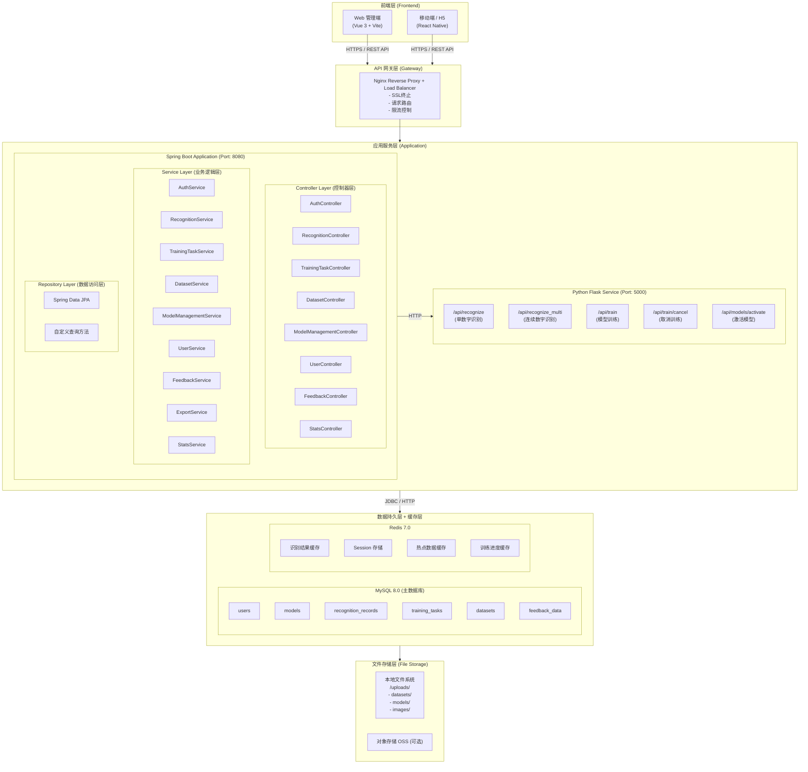
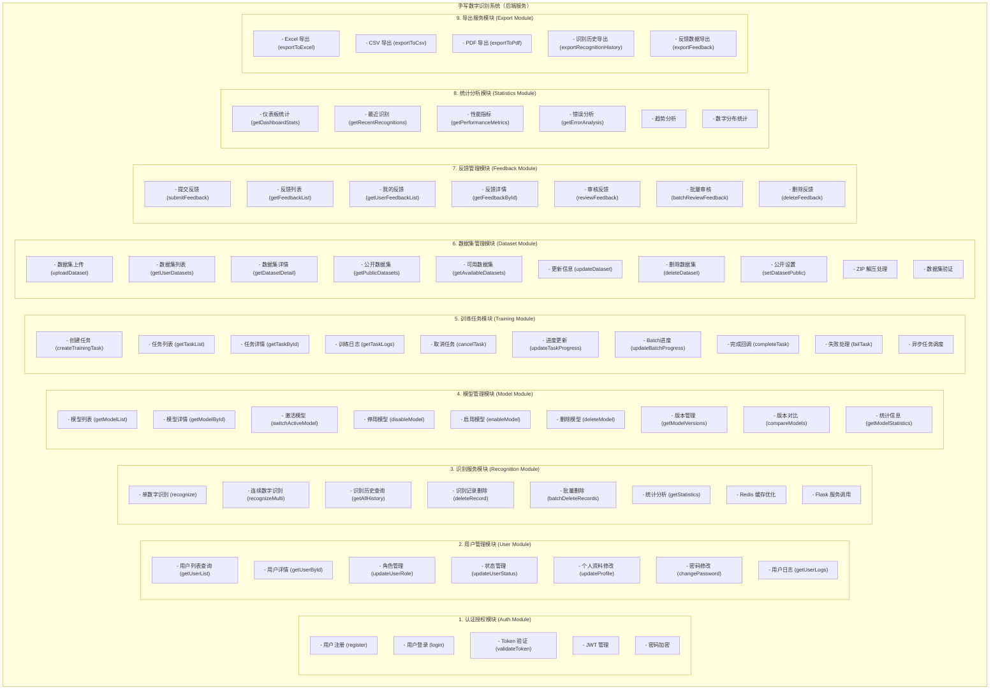
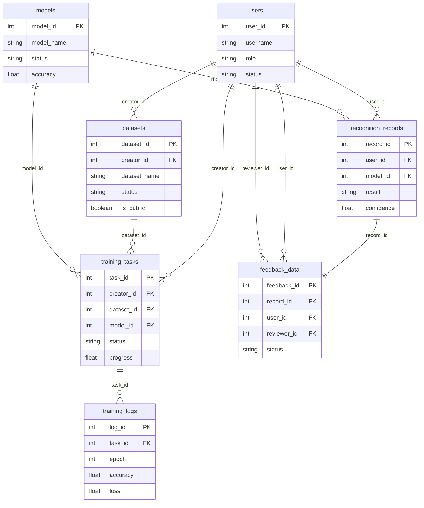

# 手写数字识别系统（后端）概要设计说明书

**Intelligent Handwritten Digit Recognition System - Backend**
**High-Level Design Specification**

**版本:** 1.0.0
**日期:** 2025-12-01
**分支名称:** IHDRS-Backend
**编写人:** 刘家乐

---

## **目录**

[TOC]

---

## **1.引言**

### **1.1 编写目的**

本文档旨在描述手写数字识别系统后端服务的概要设计，为详细设计、开发实施和系统测试提供基础。主要读者包括：
- 系统架构师
- 后端开发工程师
- 数据库管理员
- 测试工程师
- 运维工程师

### **1.2 背景**

**项目名称:** 智能手写数字识别系统（后端服务）
**开发单位:** 留学生第一组 
**技术栈:** Spring Boot 3.2 + MySQL 8.0 + Redis + Python Flask 
**主要功能:**

- RESTful API服务
- 用户认证与授权
- 模型训练任务管理
- 数据集管理
- 识别服务调度
- 反馈审核系统
- 统计分析服务

### **1.3 定义与缩略语**

| 缩略语 | 英文全称                        | 中文含义       |
| ------ | ------------------------------- | -------------- |
| REST   | Representational State Transfer | 表述性状态转移 |
| JWT    | JSON Web Token                  | JSON网络令牌   |
| JPA    | Java Persistence API            | Java持久化API  |
| DTO    | Data Transfer Object            | 数据传输对象   |
| VO     | Value Object                    | 值对象         |
| CORS   | Cross-Origin Resource Sharing   | 跨域资源共享   |
| ORM    | Object-Relational Mapping       | 对象关系映射   |
| CNN    | Convolutional Neural Network    | 卷积神经网络   |

### **1.4 参考资料**

1. Spring Boot 3.2 官方文档
2. Spring Data JPA 参考手册
3. MySQL 8.0 参考手册
4. Redis 7.0 文档
5. RESTful API 设计最佳实践

---

## **2.系统概述**

### **2.1 系统目标**

开发一款高性能、高可用的后端服务系统，提供：
- **高并发识别服务**: 支持1000+ TPS
- **分布式训练管理**: 异步任务调度与监控
- **数据安全保障**: 多层次安全防护
- **灵活扩展能力**: 微服务化架构
- **完善的监控体系**: 实时性能监控与告警

### **2.2 系统特点**

1. **微服务架构**: Spring Boot + Flask 服务分离
2. **异步处理**: CompletableFuture + 消息队列
3. **缓存优化**: Redis多级缓存策略
4. **数据库优化**: 索引优化 + 读写分离
5. **安全增强**: JWT + RBAC + 参数验证

### **2.3 运行环境**

**开发环境:**
- JDK 17+
- Maven 3.8+
- MySQL 8.0+
- Redis 7.0+
- Python 3.8+

**生产环境:**
- Linux CentOS 7.6+
- Docker 20.10+
- Kubernetes 1.24+ (可选)
- Nginx 1.20+

---

## **3.系统架构设计**

### **3.1 总体架构**



### **3.2 核心组件说明**

| 组件         | 技术栈                     | 职责                        |
| ------------ | -------------------------- | --------------------------- |
| **API网关**  | Nginx                      | 反向代理、负载均衡、SSL终止 |
| **认证服务** | Spring Security + JWT      | 用户认证、授权、Token管理   |
| **业务服务** | Spring Boot 3.2            | 核心业务逻辑处理            |
| **模型服务** | Flask + TensorFlow/PyTorch | AI模型推理与训练            |
| **数据访问** | Spring Data JPA            | ORM映射、数据CRUD           |
| **缓存服务** | Redis                      | 热点数据缓存、分布式锁      |
| **文件服务** | 本地文件系统/OSS           | 文件上传、存储、下载        |

### **3.3 技术选型**

| 技术类别       | 技术选型              | 版本    | 用途            |
| -------------- | --------------------- | ------- | --------------- |
| **核心框架**   | Spring Boot           | 3.2.0   | 应用框架        |
| **持久化**     | Spring Data JPA       | 3.2.0   | ORM框架         |
| **数据库**     | MySQL                 | 8.0+    | 关系型数据库    |
| **缓存**       | Redis                 | 7.0+    | 分布式缓存      |
| **安全**       | Spring Security       | 6.2.0   | 认证授权        |
| **JWT**        | jjwt                  | 0.12.3  | Token生成与验证 |
| **HTTP客户端** | RestTemplate          | 内置    | 服务间通信      |
| **文档**       | Swagger 3 (SpringDoc) | 2.2.0   | API文档         |
| **日志**       | Logback + SLF4J       | 内置    | 日志管理        |
| **数据验证**   | Hibernate Validator   | 内置    | 参数验证        |
| **Excel导出**  | Apache POI            | 5.2.3   | Excel操作       |
| **PDF导出**    | iText7                | 7.2.5   | PDF生成         |
| **AI框架**     | TensorFlow/PyTorch    | 2.x/2.x | 模型训练与推理  |

---

## **4.功能模块设计**

### **4.1 功能结构图**



### **4.2 核心功能详细描述**

#### **4.2.1 认证授权模块**

**功能描述:**  
提供用户注册、登录、Token验证等安全认证功能。

**主要功能:**

1. **用户注册 (register)**
   - 用户名唯一性验证
   - 邮箱唯一性验证
   - 密码强度验证
   - 密码加密存储（BCrypt）
   - 盐值生成

2. **用户登录 (login)**
   - 用户名密码验证
   - 账号状态检查
   - 登录次数统计
   - 最后登录时间更新
   - JWT Token生成

3. **Token验证 (validateToken)**
   - Token过期检查
   - Token签名验证
   - 用户状态验证
   - 用户信息返回

**安全措施:**
- BCrypt密码加密（强度10）
- JWT签名验证（HS256算法）
- Token有效期：24小时
- 登录失败记录（可扩展为限流）

---

#### **4.2.2 识别服务模块**

**功能描述:**  
提供手写数字识别的核心服务，支持单数字和连续数字识别。

**主要功能:**

1. **单数字识别 (recognize)**
   ```java
   输入: Base64编码的图像数据
   处理:
   1.Base64解码
   2.计算图像哈希
   3.检查Redis缓存
   4.调用Flask模型服务
   5.保存识别记录
   6.缓存结果(24小时)
   输出: 识别结果 + 置信度 + 概率分布
   ```

2. **连续数字识别 (recognizeMulti)**
   ```java
   输入: 包含多个数字的图像
   处理:
   1. 图像分割
   2.批量识别
   3.序列拼接
   4.平均置信度计算
   输出: 数字序列 + 每个数字的置信度
   ```

3. **识别历史查询 (getAllHistory)**
   - 分页查询
   - 多条件筛选（时间范围、结果、用户ID）
   - 关联查询（模型信息）

**性能优化:**
- Redis缓存识别结果
- 图像哈希去重
- 异步保存记录
- 数据库索引优化

---

#### **4.2.3 训练任务模块**

**功能描述:**  
管理深度学习模型的训练任务，提供实时进度监控。

**主要功能:**

1. **创建训练任务**
   ```java
   步骤:
   1.验证训练参数
   2.构建训练配置JSON
   3.构建数据集配置JSON
   4.创建任务记录
   5.异步调用Flask训练服务
   6.返回任务ID
   ```

2. **进度更新机制**
   ```
   Epoch级别更新:
   - updateTaskProgress() - 每个Epoch结束时调用
   - 更新当前Epoch、进度、准确率、损失
   - 保存TrainingLog记录
   
   Batch级别更新:
   - updateBatchProgress() - 每个Batch结束时调用
   - 存储到内存缓存（ConcurrentHashMap）
   - 前端轮询获取实时进度
   ```

3. **任务完成处理**
   ```java
   completeTask():
   1.接收最终结果（准确率、损失、模型路径）
   2.接收混淆矩阵和类别名称
   3.创建Model记录
   4.更新任务状态为COMPLETED
   5.保存混淆矩阵JSON
   ```

4. **任务失败处理**
   ```java
   failTask():
   1. 更新任务状态为FAILED
   2.记录错误信息
   3.设置结束时间
   ```

**异步调度设计:**
```java
// 使用独立线程提交训练任务
new Thread(() -> {
    try {
        String url = flaskBaseUrl + "/api/train";
        HttpEntity<Map> entity = new HttpEntity<>(requestBody, headers);
        restTemplate.exchange(url, HttpMethod.POST, entity, Map.class);
    } catch (Exception e) {
        updateTaskStatusToFailed(taskId, e.getMessage());
    }
}).start();
```

---

#### **4.2.4 数据集管理模块**

**功能描述:**  
管理训练数据集的上传、存储、验证和分享。

**主要功能:**

1. **数据集上传处理流程**
   ```
   1.文件验证 (validateFile)
      - 文件大小限制: 500MB
      - 文件格式检查: .zip
      - MIME类型验证
   
   2.创建目录 (createDatasetDirectory)
      - 命名规则: dataset_{userId}_{sanitizedName}_{timestamp}
      - 创建目录: /uploads/datasets/{dirName}
   
   3. 保存文件 (saveUploadedFile)
      - 保存为: dataset.zip
   
   4.创建数据库记录
      - 状态: UPLOADING
   
   5.异步处理 (processDatasetAsync)
      - 解压ZIP文件
      - 验证目录结构
      - 分析数据集信息
      - 更新状态: AVAILABLE
   ```

2. **数据集结构验证**
   ```
   标准结构:
   dataset.zip
   ├── train/           # 训练集（必须）
   │   ├── class_0/
   │   │   ├── img1.jpg
   │   │   └── img2.jpg
   │   └── class_1/
   │       └── ...
   └── test/            # 测试集（可选）
       ├── class_0/
       └── class_1/
   ```

3. **数据集信息提取**
   ```java
   analyzeDataset():
   - numClasses: 类别数量
   - numSamples: 总样本数
   - trainSamples: 训练样本数
   - testSamples: 测试样本数
   - imageWidth/Height: 图像尺寸
   - classNames: 类别名称列表
   ```

---

#### **4.2.5 导出服务模块**

**功能描述:**  
提供数据导出功能，支持多种格式。

**支持格式:**
1. **Excel (.xlsx)**
   - Apache POI 5.2.3
   - 自动列宽
   - 表头样式

2. **CSV (.csv)**
   - UTF-8 BOM
   - 逗号分隔
   - 双引号转义

3. **PDF (.pdf)**
   - iText7 7.2.5
   - 中文字体支持
   - 表格自动分页

**导出字段配置:**
```java
识别历史导出字段:
- recordId: 记录ID
- userId: 用户ID
- recognitionResult: 识别结果
- confidence: 置信度
- modelName: 模型名称
- modelVersion: 模型版本
- inputType: 输入类型
- processingTime: 处理时间
- isCorrect: 是否正确
- createTime: 创建时间
```

---

## **5.数据库设计概要**

### **5.1 E-R图**



### **5.2 核心数据表**

| 表名                    | 用途     | 主要字段                                                     |
| ----------------------- | -------- | ------------------------------------------------------------ |
| **users**               | 用户信息 | user_id, username, password_hash, role, status               |
| **models**              | 模型信息 | model_id, model_name, version, status, accuracy, model_path  |
| **training_tasks**      | 训练任务 | task_id, creator_id, dataset_id, status, progress, current_epoch |
| **training_logs**       | 训练日志 | log_id, task_id, epoch, loss, accuracy, val_loss, val_accuracy |
| **datasets**            | 数据集   | dataset_id, dataset_name, file_path, status, is_public, num_classes |
| **recognition_records** | 识别记录 | record_id, user_id, model_id, result, confidence, image_path |
| **feedback_data**       | 用户反馈 | feedback_id, record_id, original_result, correct_result, status |
| **user_log**            | 用户日志 | log_id, user_id, action, ip_address, create_time             |

### **5.3 索引设计**

```sql
-- users表
CREATE INDEX idx_username ON users(username);
CREATE INDEX idx_email ON users(email);
CREATE INDEX idx_status ON users(status);

-- recognition_records表
CREATE INDEX idx_user_create ON recognition_records(user_id, create_time DESC);
CREATE INDEX idx_model_id ON recognition_records(model_id);
CREATE INDEX idx_result ON recognition_records(recognition_result);
CREATE INDEX idx_create_time ON recognition_records(create_time);

-- training_tasks表
CREATE INDEX idx_creator_create ON training_tasks(creator_id, create_time DESC);
CREATE INDEX idx_status ON training_tasks(status);

-- models表
CREATE INDEX idx_status ON models(status);
CREATE INDEX idx_name_version ON models(model_name, model_version);

-- datasets表
CREATE INDEX idx_creator_id ON datasets(creator_id);
CREATE INDEX idx_is_public ON datasets(is_public);
CREATE INDEX idx_status ON datasets(status);
```

---

## **6. 接口设计概要**

### **6.1 API分类**

| 分类           | 接口数量 | Base Path         |
| -------------- | -------- | ----------------- |
| **认证接口**   | 3        | /api/auth         |
| **用户管理**   | 7        | /api/users        |
| **识别服务**   | 7        | /api/recognition  |
| **模型管理**   | 12       | /api/admin/models |
| **训练管理**   | 10       | /api/training     |
| **数据集管理** | 8        | /api/datasets     |
| **反馈管理**   | 7        | /api/feedback     |
| **统计分析**   | 4        | /api/stats        |

### **6.2 RESTful API设计规范**

**HTTP方法使用:**
- `GET`: 查询资源
- `POST`: 创建资源
- `PUT`: 更新资源
- `DELETE`: 删除资源

**统一响应格式:**
```json
{
  "code": 200,
  "msg": "success",
  "data": {...},
  "timestamp": 1638360000000
}
```

**分页响应格式:**
```json
{
  "code": 200,
  "data": {
    "records": [...],
    "total": 100,
    "size": 10,
    "current": 1,
    "pages": 10
  }
}
```

### **6.3 关键接口示例**

**用户登录:**
```http
POST /api/auth/login
Content-Type: application/json

{
  "username": "admin",
  "password": "password123"
}

Response 200:
{
  "code": 200,
  "msg": "登录成功",
  "data": {
    "token": "eyJhbGciOiJIUzI1NiIs...",
    "tokenType": "Bearer",
    "expiresIn": 86400,
    "userInfo": {
      "userId": 1,
      "username": "admin",
      "role": "ADMIN"
    }
  }
}
```

**数字识别:**
```http
POST /api/recognition/recognize
Authorization: Bearer {token}
Content-Type: application/json

{
  "imageData": "data:image/png;base64,iVBORw0KGgoAAAANS...",
  "inputType": "CANVAS",
  "sessionId": "session-123"
}

Response 200:
{
  "code": 200,
  "data": {
    "recordId": 1001,
    "recognitionResult": 5,
    "confidence": 0.9876,
    "probabilities": [0.001, 0.002, ..., 0.9876, ...],
    "processingTime": 120,
    "needRewrite": false,
    "message": "识别成功"
  }
}
```

---

## **7.安全性设计**

### **7.1 认证授权**

**JWT Token机制:**
```java
Token结构:
Header: {
  "alg": "HS256",
  "typ": "JWT"
}
Payload: {
  "sub": "userId",
  "username": "admin",
  "role": "ADMIN",
  "iat": 1638360000,
  "exp": 1638446400
}
Signature: HS256(base64UrlEncode(header) + "." + base64UrlEncode(payload), secret)
```

**RBAC权限控制:**
```java
角色定义:
- USER: 普通用户
  - 识别服务
  - 查看自己的历史
  - 提交反馈
  - 修改个人资料

- ADMIN: 管理员
  - USER的所有权限
  - 用户管理
  - 模型管理
  - 训练任务管理
  - 反馈审核
  - 统计分析
```

### **7.2 安全拦截器**

```java
@Component
public class JwtAuthenticationFilter extends OncePerRequestFilter {
    @Override
    protected void doFilterInternal(HttpServletRequest request,
                                    HttpServletResponse response,
                                    FilterChain filterChain) {
        // 1.提取Token
        String token = extractToken(request);
        
        // 2.验证Token
        if (token != null && jwtUtil.validateToken(token)) {
            // 3.获取用户信息
            Long userId = jwtUtil.getUserIdFromToken(token);
            String role = jwtUtil.getRoleFromToken(token);
            
            // 4.设置请求属性
            request.setAttribute("userId", userId);
            request.setAttribute("role", role);
        }
        
        filterChain.doFilter(request, response);
    }
}
```

### **7.3 安全措施**

1. **SQL注入防护**
   - 使用JPA参数化查询
   - 使用@Query的命名参数
2. **XSS防护**
   - 输入验证 (@Valid注解)
   - 输出编码
3. **CSRF防护**
   - 使用JWT替代Session
   - 验证Token来源
4. **文件上传安全**
   - 文件类型白名单
   - 文件大小限制
   - 路径遍历防护

---

## **8.性能设计**

### **8.1 性能指标**

| 指标             | 目标值      |
| ---------------- | ----------- |
| API响应时间      | P95 < 500ms |
| 识别服务响应时间 | P95 < 1s    |
| 数据库查询时间   | P95 < 100ms |
| 并发用户数       | > 1000      |
| TPS              | > 1000      |

### **8.2 缓存策略**

**Redis缓存设计:**
```java
缓存KEY设计:
- ihdrs:recognition:{imageHash} - 识别结果缓存(24h)
- ihdrs:model:active - 活跃模型缓存(1h)
- ihdrs:user:{userId} - 用户信息缓存(30min)
- ihdrs:batch:progress:{taskId} - 训练进度缓存(5min)
```

**缓存更新策略:**
- Cache Aside Pattern
- Write Through (关键数据)
- 缓存预热（活跃模型）

### **8.3 数据库优化**

**分页查询优化:**
```java
// 使用游标分页替代OFFSET
SELECT * FROM recognition_records 
WHERE record_id < ? 
ORDER BY record_id DESC 
LIMIT 10;
```

**批量操作优化:**
```java
// 使用JPA批量插入
@Modifying
@Query(value = "INSERT INTO training_logs (...) VALUES (...)", nativeQuery = true)
void batchInsert(@Param("logs") List<TrainingLog> logs);
```

### **8.4 异步处理**

**CompletableFuture异步识别:**
```java
public CompletableFuture<RecognitionResponse> recognizeAsync(RecognitionRequest request) {
    return CompletableFuture.supplyAsync(() -> {
        return recognize(request, userId);
    }, executor);
}
```

---

## **9.附录**

### **9.1 配置文件**

**application.yml:**
```yaml
server:
  port: 8080

spring:
  application:
    name: ihdrs-backend
  
  datasource:
    url: jdbc:mysql://localhost:3306/ihdrs_db? useUnicode=true&characterEncoding=utf8&serverTimezone=Asia/Shanghai
    username: root
    password: ${DB_PASSWORD:root}
    driver-class-name: com.mysql.cj.jdbc.Driver
    hikari:
      maximum-pool-size: 20
      minimum-idle: 5
      connection-timeout: 30000
      idle-timeout: 600000
      max-lifetime: 1800000
  
  jpa:
    hibernate:
      ddl-auto: update
    show-sql: false
    properties:
      hibernate:
        dialect: org.hibernate.dialect.MySQL8Dialect
        format_sql: true
  
  data:
    redis:
      host: localhost
      port: 6379
      database: 0
      timeout: 3000
      lettuce:
        pool:
          max-active: 8
          max-wait: -1ms
          max-idle: 8
          min-idle: 0

jwt:
  secret: ${JWT_SECRET:your-secret-key-minimum-256-bits-for-hs256-algorithm}
  expiration: 86400000

file:
  upload:
    path: /opt/ihdrs/uploads

model-service:
  base-url: http://localhost:5000
  timeout: 30000

logging:
  level:
    com.ihdrs: DEBUG
    org.hibernate.SQL: DEBUG
```

### **9.2 部署架构**

**Docker Compose部署:**
```yaml
version: '3.8'

services:
  mysql:
    image: mysql:8.0
    environment:
      MYSQL_ROOT_PASSWORD: root
      MYSQL_DATABASE: ihdrs_db
    ports:
      - "3306:3306"
    volumes:
      - mysql-data:/var/lib/mysql
  
  redis:
    image: redis:7.0
    ports:
      - "6379:6379"
  
  backend:
    build: .
    ports:
      - "8080:8080"
    depends_on:
      - mysql
      - redis
      - model-service
    environment:
      DB_PASSWORD: root
      REDIS_HOST: redis
      MODEL_SERVICE_URL: http://model-service:5000
  
  model-service:
    build: ./model-service
    ports:
      - "5000:5000"
    volumes:
      - models-data:/app/models

volumes:
  mysql-data:
  models-data:
```
