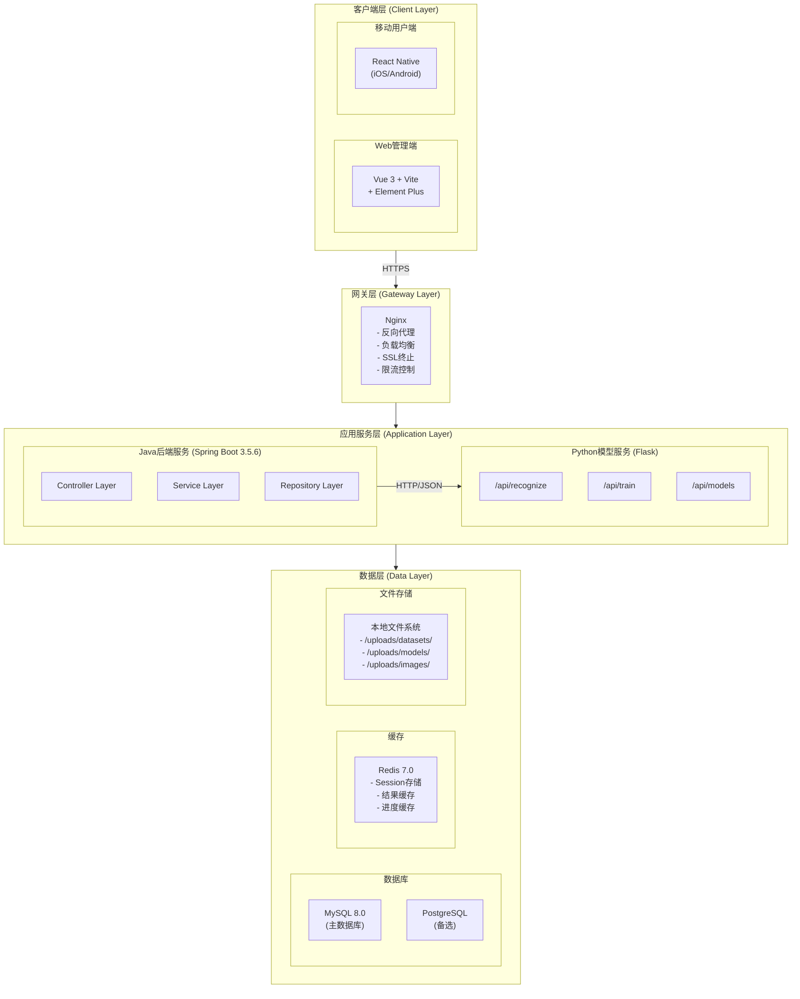

# 智能手写数字识别系统安装部署手册

**Intelligent Handwritten Digit Recognition System (IHDRS)**
**Installation & Deployment Manual**

---

**文档编号:** IHDRS-IDM-2025-001
**版本:** 1.0.0
**日期:** 2025-12-09
**编写人:** 刘家乐

---

## **修订历史**

| 版本号 | 修订日期   | 修订人 | 修订内容 |
| ------ | ---------- | ------ | -------- |
| 1.0.0  | 2025-12-09 | 刘家乐 | 初稿     |

---

## **目录**

[TOC]

---

## **1.概述**

### **1.1 文档目的**

本文档提供智能手写数字识别系统（IHDRS）的完整安装部署指南，包括环境准备、软件安装、系统配置、服务部署和验证测试等内容。

### **1.2 适用对象**

- 系统管理员
- 运维工程师
- 后端开发人员

### **1.3 系统架构概述**

IHDRS系统采用前后端分离的微服务架构，由以下组件组成：



## **2.环境要求**

### **2.1 硬件要求**

#### **2.1.1 最低配置**

| 配置项 | 最低要求  | 说明                 |
| ------ | --------- | -------------------- |
| CPU    | 4核       | 支持x86-64架构       |
| 内存   | 8GB       | 训练任务可能需要更多 |
| 存储   | 100GB SSD | 用于存储数据集和模型 |
| 网络   | 100Mbps   | 保证稳定连接         |

#### **2.1.2 推荐配置**

| 配置项 | 推荐配置         | 说明                 |
| ------ | ---------------- | -------------------- |
| CPU    | 8核及以上        | 提升并发处理能力     |
| 内存   | 16GB及以上       | 支持更大的训练任务   |
| 存储   | 500GB SSD        | 充足的数据存储空间   |
| GPU    | NVIDIA GTX 1060+ | 加速模型训练（可选） |
| 网络   | 1Gbps            | 高并发场景           |

### **2.2 软件要求**

#### **2.2.1 操作系统**

| 操作系统 | 版本要求      | 推荐 |
| -------- | ------------- | ---- |
| Ubuntu   | 20.04 LTS+    | 支持 |
| CentOS   | 7.6+ / 8.0+   | 支持 |
| Debian   | 10+           | 支持 |
| Windows  | Windows 10/11 | 推荐 |
| macOS    | 11.0+         | 支持 |

#### **2.2.2 依赖软件**

| 软件名称 | 版本要求   | 用途         | 必需 |
| -------- | ---------- | ------------ | ---- |
| JDK      | 17+        | Java运行环境 | 是   |
| Python   | 3.8+       | AI模型服务   | 是   |
| Node.js  | 16.x+      | 前端构建     | 是   |
| MySQL    | 8.0+       | 关系型数据库 | 是   |
| Redis    | 7.0+       | 缓存服务     | 是   |
| Nginx    | 1.20+      | 反向代理     | 是   |
| Maven    | 3.8+       | Java项目构建 | 是   |
| npm/yarn | 8.x+/1.22+ | 前端包管理   | 是   |
| Git      | 2.30+      | 版本控制     | 是   |

### **2.3 网络要求**

#### **2.3.1 端口要求**

| 端口 | 服务           | 协议 | 说明               |
| ---- | -------------- | ---- | ------------------ |
| 80   | Nginx HTTP     | TCP  | HTTP访问           |
| 443  | Nginx HTTPS    | TCP  | HTTPS访问          |
| 8080 | Java后端服务   | TCP  | API服务            |
| 5000 | Python模型服务 | TCP  | 模型推理/训练      |
| 3306 | MySQL          | TCP  | 数据库             |
| 6379 | Redis          | TCP  | 缓存               |
| 5173 | Vite开发服务器 | TCP  | 前端开发（仅开发） |

#### **2.3.2 防火墙配置**

```bash
# Ubuntu/Debian (ufw)
sudo ufw allow 80/tcp
sudo ufw allow 443/tcp
sudo ufw allow 8080/tcp
sudo ufw allow 5000/tcp
sudo ufw allow 3306/tcp
sudo ufw allow 6379/tcp

# CentOS/RHEL (firewalld)
sudo firewall-cmd --permanent --add-port=80/tcp
sudo firewall-cmd --permanent --add-port=443/tcp
sudo firewall-cmd --permanent --add-port=8080/tcp
sudo firewall-cmd --permanent --add-port=5000/tcp
sudo firewall-cmd --permanent --add-port=3306/tcp
sudo firewall-cmd --permanent --add-port=6379/tcp
sudo firewall-cmd --reload
```

---

## **3.手动部署**

### 3**.1 安装基础软件**

#### **3.1.1 安装JDK 17**

```bash
# Ubuntu/Debian
sudo apt-get update
sudo apt-get install -y openjdk-17-jdk

# CentOS/RHEL
sudo yum install -y java-17-openjdk-devel

# 验证安装
java -version
```

#### 3**.1.2 安装Python 3.8+**

```bash
# Ubuntu/Debian
sudo apt-get install -y python3.10 python3.10-venv python3-pip

# CentOS/RHEL
sudo yum install -y python310 python310-pip

# 验证安装
python3 --version
pip3 --version
```

#### **3.1.3 安装Node.js 16+**

```bash
# 使用NodeSource仓库
curl -fsSL https://deb.nodesource.com/setup_18.x | sudo -E bash -
sudo apt-get install -y nodejs

# 验证安装
node --version
npm --version
```

#### **3.1.4 安装MySQL 8.0**

```bash
# Ubuntu/Debian
sudo apt-get install -y mysql-server

# 启动服务
sudo systemctl start mysql
sudo systemctl enable mysql

# 安全配置
sudo mysql_secure_installation

# 验证安装
mysql --version
```

#### **3.1.5 安装Redis 7.0**

```bash
# Ubuntu/Debian
sudo apt-get install -y redis-server

# 启动服务
sudo systemctl start redis-server
sudo systemctl enable redis-server

# 验证安装
redis-cli ping
```

#### **3.1.6 安装Maven 3.8+**

```bash
# 下载Maven
wget https://archive.apache.org/dist/maven/maven-3/3.9.5/binaries/apache-maven-3.9.5-bin.tar.gz

# 解压
sudo tar -xzf apache-maven-3.9.5-bin.tar.gz -C /opt/

# 配置环境变量
echo 'export MAVEN_HOME=/opt/apache-maven-3.9.5' >> ~/.bashrc
echo 'export PATH=$MAVEN_HOME/bin:$PATH' >> ~/.bashrc
source ~/.bashrc

# 验证安装
mvn --version
```

#### **3.1.7 安装Nginx**

```bash
# Ubuntu/Debian
sudo apt-get install -y nginx

# 启动服务
sudo systemctl start nginx
sudo systemctl enable nginx

# 验证安装
nginx -v
```

### **3.2 数据库配置**

#### **3.2.1 创建数据库和用户**

```bash
# 登录MySQL
sudo mysql -u root -p
```

```sql
-- 创建数据库
CREATE DATABASE ihdrs CHARACTER SET utf8mb4 COLLATE utf8mb4_unicode_ci;

-- 创建用户
CREATE USER 'ihdrs_user'@'localhost' IDENTIFIED BY 'your_password_here';
CREATE USER 'ihdrs_user'@'%' IDENTIFIED BY 'your_password_here';

-- 授权
GRANT ALL PRIVILEGES ON ihdrs.* TO 'ihdrs_user'@'localhost';
GRANT ALL PRIVILEGES ON ihdrs.* TO 'ihdrs_user'@'%';
FLUSH PRIVILEGES;

-- 退出
EXIT;
```

#### **3.2.2 初始化数据库表**

```bash
# 导入初始化脚本
mysql -u ihdrs_user -p ihdrs < init.sql
```

初始化SQL脚本 `init.sql`

### **3.3 Redis配置**

#### **3.3.1 编辑Redis配置文件**

```bash
sudo nano /etc/redis/redis.conf
```

```conf
# 绑定地址（生产环境建议只绑定本地）
bind 127.0.0.1

# 端口
port 6379

# 设置密码
requirepass your_redis_password_here

# 持久化配置
appendonly yes
appendfilename "appendonly.aof"

# 最大内存限制
maxmemory 512mb
maxmemory-policy allkeys-lru

# 日志级别
loglevel notice
logfile /var/log/redis/redis-server.log
```

#### **3.3.2 重启Redis服务**

```bash
sudo systemctl restart redis-server

# 测试连接
redis-cli -a your_redis_password_here ping
```

### **3.4 部署Java后端服务**

#### **3.4.1 获取代码并构建**

```bash
# 克隆项目
git clone https://github.com/weiwo123/ihdrs-backend.git
cd ihdrs-backend

# 使用Maven构建
mvn clean package -DskipTests

# 构建产物位置
ls target/ihdrs-backend-*.jar
```

#### **3.4.2 配置应用**

创建生产环境配置文件 `application-prod.yml`：

```yaml
# application-prod.yml

server:
  port: 8080
  servlet:
    context-path: /

spring:
  # 数据源配置
  datasource:
    url: jdbc:mysql://localhost:3306/ihdrs? useSSL=false&allowPublicKeyRetrieval=true&serverTimezone=Asia/Shanghai&characterEncoding=utf8mb4
    username: ihdrs_user
    password:  your_db_password_here
    driver-class-name: com.mysql.cj.jdbc.Driver
    hikari:
      maximum-pool-size: 20
      minimum-idle: 5
      connection-timeout: 30000
      idle-timeout: 600000
      max-lifetime: 1800000

  # JPA配置
  jpa:
    hibernate: 
      ddl-auto: validate
    show-sql: false
    properties:
      hibernate: 
        dialect: org.hibernate.dialect.MySQL8Dialect
        format_sql: false

  # Redis配置
  data:
    redis:
      host: localhost
      port: 6379
      password: your_redis_password_here
      database: 0
      timeout: 5000ms
      lettuce:
        pool:
          max-active: 8
          max-idle: 8
          min-idle: 0
          max-wait: -1ms

  # 文件上传配置
  servlet:
    multipart:
      max-file-size: 500MB
      max-request-size: 500MB

# JWT配置
jwt:
  secret: your_jwt_secret_key_here_at_least_32_characters_long
  expiration: 86400

# 模型服务配置
model-service:
  base-url: http://localhost:5000

# 文件存储配置
file:
  upload-path: /opt/ihdrs/uploads
  datasets-path: /opt/ihdrs/uploads/datasets
  models-path:  /opt/ihdrs/uploads/models
  images-path: /opt/ihdrs/uploads/images

# 日志配置
logging:
  level:
    root: INFO
    com.ihdrs: INFO
    org.springframework: WARN
    org.hibernate: WARN
  file:
    name: /var/log/ihdrs/application.log
  pattern:
    file: "%d{yyyy-MM-dd HH:mm:ss.SSS} [%thread] %-5level %logger{36} - %msg%n"

# Actuator监控配置
management:
  endpoints:
    web:
      exposure:
        include: health,info,metrics,prometheus
  endpoint:
    health:
      show-details: when_authorized
```

#### **3.4.3 创建文件目录**

```bash
# 创建上传目录
sudo mkdir -p /opt/ihdrs/uploads/{datasets,models,images}
sudo mkdir -p /var/log/ihdrs

# 设置权限
sudo chown -R $USER:$USER /opt/ihdrs
sudo chown -R $USER:$USER /var/log/ihdrs
```

#### **3.4.4 创建系统服务**

创建systemd服务文件：

```bash
sudo nano /etc/systemd/system/ihdrs-backend.service
```

```ini
[Unit]
Description=IHDRS Backend Service
After=network.target mysql.service redis.service

[Service]
Type=simple
User=ihdrs
Group=ihdrs
WorkingDirectory=/opt/ihdrs
ExecStart=/usr/bin/java -Xms512m -Xmx2048m -jar /opt/ihdrs/ihdrs-backend.jar --spring.profiles.active=prod
Restart=always
RestartSec=10
StandardOutput=append:/var/log/ihdrs/stdout.log
StandardError=append:/var/log/ihdrs/stderr.log

# 环境变量
Environment=JAVA_HOME=/usr/lib/jvm/java-17-openjdk-amd64
Environment=SPRING_PROFILES_ACTIVE=prod

[Install]
WantedBy=multi-user.target
```

#### **3.4.5 部署并启动服务**

```bash
# 创建服务用户
sudo useradd -r -s /bin/false ihdrs

# 复制JAR文件
sudo cp target/ihdrs-backend-*.jar /opt/ihdrs/ihdrs-backend.jar
sudo cp src/main/resources/application-prod.yml /opt/ihdrs/

# 设置权限
sudo chown -R ihdrs:ihdrs /opt/ihdrs
sudo chown -R ihdrs:ihdrs /var/log/ihdrs

# 重新加载systemd配置
sudo systemctl daemon-reload

# 启动服务
sudo systemctl start ihdrs-backend
sudo systemctl enable ihdrs-backend

# 查看服务状态
sudo systemctl status ihdrs-backend

# 查看日志
sudo tail -f /var/log/ihdrs/application.log
```

### **3.5 部署Python模型服务**

#### **3.5.1 创建虚拟环境**

```bash
# 进入模型服务目录
cd ihdrs-model-service

# 创建虚拟环境
python3 -m venv venv

# 激活虚拟环境
source venv/bin/activate

# 升级pip
pip install --upgrade pip
```

#### **3.5.2 安装依赖**

```bash
# 安装依赖包
pip install -r requirements.txt
```

#### **3.5.3 配置模型服务**

创建配置文件 `config.py`：

```python
# config.py

import os
from dotenv import load_dotenv

load_dotenv()

class Config:
    """基础配置"""
    # Flask配置
    SECRET_KEY = os.getenv('SECRET_KEY', 'your-secret-key-here')
    DEBUG = False
    TESTING = False
    
    # 模型配置
    MODEL_PATH = os.getenv('MODEL_PATH', '/opt/ihdrs/uploads/models')
    DATASET_PATH = os.getenv('DATASET_PATH', '/opt/ihdrs/uploads/datasets')
    UPLOAD_PATH = os.getenv('UPLOAD_PATH', '/opt/ihdrs/uploads')
    
    # Spring Boot服务地址
    SPRINGBOOT_URL = os.getenv('SPRINGBOOT_URL', 'http://localhost:8080')
    
    # 训练配置
    MAX_CONCURRENT_TASKS = 3
    DEFAULT_BATCH_SIZE = 32
    DEFAULT_EPOCHS = 50
    DEFAULT_LEARNING_RATE = 0.001
    
    # GPU配置
    GPU_ENABLED = os.getenv('GPU_ENABLED', 'false').lower() == 'true'
    GPU_MEMORY_FRACTION = float(os.getenv('GPU_MEMORY_FRACTION', '0.8'))


class DevelopmentConfig(Config):
    """开发环境配置"""
    DEBUG = True


class ProductionConfig(Config):
    """生产环境配置"""
    DEBUG = False


class TestingConfig(Config):
    """测试环境配置"""
    TESTING = True


# 配置映射
config_map = {
    'development': DevelopmentConfig,
    'production': ProductionConfig,
    'testing': TestingConfig,
    'default': DevelopmentConfig
}


def get_config():
    """获取当前环境配置"""
    env = os.getenv('FLASK_ENV', 'development')
    return config_map.get(env, DevelopmentConfig)
```

#### **3.5.4 创建环境变量文件**

```bash
nano .env
```

```bash
# .env 文件
FLASK_ENV=production
SECRET_KEY=your_flask_secret_key_here
MODEL_PATH=/opt/ihdrs/uploads/models
DATASET_PATH=/opt/ihdrs/uploads/datasets
UPLOAD_PATH=/opt/ihdrs/uploads
SPRINGBOOT_URL=http://localhost:8080
GPU_ENABLED=false
GPU_MEMORY_FRACTION=0.8
```

#### **3.5.5 创建系统服务**

```bash
sudo nano /etc/systemd/system/ihdrs-model-service.service
```

```ini
[Unit]
Description=IHDRS Model Service (Python Flask)
After=network.target

[Service]
Type=simple
User=ihdrs
Group=ihdrs
WorkingDirectory=/opt/ihdrs/ihdrs-model-service
Environment=PATH=/opt/ihdrs/ihdrs-model-service/venv/bin
Environment=FLASK_ENV=production
ExecStart=/opt/ihdrs/ihdrs-model-service/venv/bin/gunicorn \
    --workers 2 \
    --threads 4 \
    --timeout 300 \
    --bind 0.0.0.0:5000 \
    --access-logfile /var/log/ihdrs/model-service-access.log \
    --error-logfile /var/log/ihdrs/model-service-error.log \
    app:app
Restart=always
RestartSec=10

[Install]
WantedBy=multi-user.target
```

#### **3.5.6 部署并启动服务**

```bash
# 复制模型服务代码
sudo cp -r ihdrs-model-service /opt/ihdrs/
sudo chown -R ihdrs:ihdrs /opt/ihdrs/ihdrs-model-service

# 重新加载systemd配置
sudo systemctl daemon-reload

# 启动服务
sudo systemctl start ihdrs-model-service
sudo systemctl enable ihdrs-model-service

# 查看服务状态
sudo systemctl status ihdrs-model-service

# 查看日志
sudo tail -f /var/log/ihdrs/model-service-error.log
```

### **3.6 部署Vue前端**

#### **3.6.1 构建前端**

```bash
# 进入前端目录
cd ihdrs-frontend

# 安装依赖
npm install

# 创建生产环境配置
nano .env.production
```

```bash
# .env.production
VITE_API_BASE_URL=/api
VITE_APP_TITLE=IHDRS管理控制台
```

```bash
# 构建生产版本
npm run build

# 构建产物在dist目录
ls dist/
```

#### **3.6.2 部署到Nginx**

```bash
# 复制构建产物到Nginx目录
sudo mkdir -p /var/www/ihdrs
sudo cp -r dist/* /var/www/ihdrs/
sudo chown -R www-data:www-data /var/www/ihdrs
```

### **3.7 配置Nginx**

#### **3.7.1 创建Nginx配置文件**

```bash
sudo nano /etc/nginx/sites-available/ihdrs
```

```nginx
# /etc/nginx/sites-available/ihdrs

# 上游服务器定义
upstream backend_server {
    server 127.0.0.1:8080;
    keepalive 32;
}

upstream model_server {
    server 127.0.0.1:5000;
    keepalive 16;
}

# HTTP服务器（重定向到HTTPS）
server {
    listen 80;
    server_name your-domain.com www.your-domain.com;
    
    # 如果只是内网使用，可以不配置HTTPS，直接使用以下配置
    # 否则取消注释下面的重定向
    # return 301 https://$server_name$request_uri;
    
    # 前端静态文件
    root /var/www/ihdrs;
    index index.html;
    
    # Gzip压缩
    gzip on;
    gzip_vary on;
    gzip_min_length 1024;
    gzip_proxied any;
    gzip_types text/plain text/css text/xml text/javascript application/javascript application/x-javascript application/xml application/json;
    gzip_disable "MSIE [1-6]\.";
    
    # 日志配置
    access_log /var/log/nginx/ihdrs-access.log;
    error_log /var/log/nginx/ihdrs-error.log;
    
    # 静态资源缓存
    location ~* \.(jpg|jpeg|png|gif|ico|css|js|woff|woff2|ttf|svg)$ {
        expires 30d;
        add_header Cache-Control "public, immutable";
    }
    
    # API代理 - Java后端
    location /api/ {
        proxy_pass http://backend_server/api/;
        proxy_http_version 1.1;
        proxy_set_header Host $host;
        proxy_set_header X-Real-IP $remote_addr;
        proxy_set_header X-Forwarded-For $proxy_add_x_forwarded_for;
        proxy_set_header X-Forwarded-Proto $scheme;
        proxy_set_header Connection "";
        
        # 超时配置
        proxy_connect_timeout 60s;
        proxy_send_timeout 60s;
        proxy_read_timeout 60s;
        
        # 文件上传大小限制
        client_max_body_size 500M;
        
        # 缓冲配置
        proxy_buffering on;
        proxy_buffer_size 4k;
        proxy_buffers 8 16k;
        proxy_busy_buffers_size 24k;
    }
    
    # WebSocket代理
    location /ws/ {
        proxy_pass http://backend_server/ws/;
        proxy_http_version 1.1;
        proxy_set_header Upgrade $http_upgrade;
        proxy_set_header Connection "upgrade";
        proxy_set_header Host $host;
        proxy_set_header X-Real-IP $remote_addr;
        proxy_set_header X-Forwarded-For $proxy_add_x_forwarded_for;
        proxy_read_timeout 86400;
    }
    
    # 模型服务代理（内部使用，可选暴露）
    location /model-api/ {
        proxy_pass http://model_server/;
        proxy_http_version 1.1;
        proxy_set_header Host $host;
        proxy_set_header X-Real-IP $remote_addr;
        proxy_set_header X-Forwarded-For $proxy_add_x_forwarded_for;
        
        # 训练任务可能耗时较长
        proxy_connect_timeout 300s;
        proxy_send_timeout 300s;
        proxy_read_timeout 300s;
    }
    
    # 上传文件访问
    location /uploads/ {
        alias /opt/ihdrs/uploads/;
        expires 7d;
        add_header Cache-Control "public";
    }
    
    # Vue Router history模式支持
    location / {
        try_files $uri $uri/ /index.html;
    }
    
    # 健康检查端点
    location /health {
        access_log off;
        return 200 "OK";
        add_header Content-Type text/plain;
    }
    
    # 禁止访问隐藏文件
    location ~ /\.{
        deny all;
    }
}

# HTTPS服务器（如需要，取消注释并配置SSL证书）
# server {
#     listen 443 ssl http2;
#     server_name your-domain.com www.your-domain.com;
#     
#     # SSL证书配置
#     ssl_certificate /etc/nginx/ssl/your-domain.crt;
#     ssl_certificate_key /etc/nginx/ssl/your-domain.key;
#     ssl_session_timeout 1d;
#     ssl_session_cache shared: SSL:50m;
#     ssl_session_tickets off;
#     
#     # SSL协议配置
#     ssl_protocols TLSv1.2 TLSv1.3;
#     ssl_ciphers ECDHE-ECDSA-AES128-GCM-SHA256:ECDHE-RSA-AES128-GCM-SHA256;
#     ssl_prefer_server_ciphers off;
#     
#     # HSTS
#     add_header Strict-Transport-Security "max-age=63072000" always;
#     
#     # 其余配置与HTTP相同...
# }
```

#### **3.7.2 启用站点配置**

```bash
# 创建软链接启用站点
sudo ln -s /etc/nginx/sites-available/ihdrs /etc/nginx/sites-enabled/

# 删除默认站点（可选）
sudo rm /etc/nginx/sites-enabled/default

# 测试配置
sudo nginx -t

# 重新加载Nginx
sudo systemctl reload nginx
```

---

## **4.服务管理**

### **4.1 服务启停命令**

#### **4.1.1 单个服务管理**

```bash
# Java后端服务
sudo systemctl start ihdrs-backend
sudo systemctl stop ihdrs-backend
sudo systemctl restart ihdrs-backend
sudo systemctl status ihdrs-backend

# Python模型服务
sudo systemctl start ihdrs-model-service
sudo systemctl stop ihdrs-model-service
sudo systemctl restart ihdrs-model-service
sudo systemctl status ihdrs-model-service

# MySQL
sudo systemctl start mysql
sudo systemctl stop mysql
sudo systemctl restart mysql

# Redis
sudo systemctl start redis-server
sudo systemctl stop redis-server
sudo systemctl restart redis-server

# Nginx
sudo systemctl start nginx
sudo systemctl stop nginx
sudo systemctl restart nginx
sudo systemctl reload nginx
```

#### **4.1.2 批量管理脚本**

创建服务管理脚本 `/opt/ihdrs/manage.sh`：

```bash
#!/bin/bash

# IHDRS服务管理脚本

SERVICES=("mysql" "redis-server" "ihdrs-backend" "ihdrs-model-service" "nginx")

case "$1" in
    start)
        echo "启动所有IHDRS服务..."
        for service in "${SERVICES[@]}"; do
            echo "启动 $service..."
            sudo systemctl start $service
        done
        echo "所有服务已启动"
        ;;
    stop)
        echo "停止所有IHDRS服务..."
        for service in "${SERVICES[@]}"; do
            echo "停止 $service..."
            sudo systemctl stop $service
        done
        echo "所有服务已停止"
        ;;
    restart)
        echo "重启所有IHDRS服务..."
        for service in "${SERVICES[@]}"; do
            echo "重启 $service..."
            sudo systemctl restart $service
        done
        echo "所有服务已重启"
        ;;
    status)
        echo "IHDRS服务状态："
        echo "================================"
        for service in "${SERVICES[@]}"; do
            status=$(sudo systemctl is-active $service)
            if [ "$status" = "active" ]; then
                echo "$service:  运行中"
            else
                echo "❌ $service:  已停止"
            fi
        done
        echo "================================"
        ;;
    *)
        echo "用法: $0 {start|stop|restart|status}"
        exit 1
        ;;
esac

exit 0
```

```bash
# 添加执行权限
chmod +x /opt/ihdrs/manage.sh

# 使用示例
/opt/ihdrs/manage.sh start
/opt/ihdrs/manage.sh status
/opt/ihdrs/manage.sh restart
/opt/ihdrs/manage.sh stop
```

### **4.2 日志管理**

#### **4.2.1 日志文件位置**

| 服务           | 日志文件位置                       |
| -------------- | ---------------------------------- |
| Java后端       | /var/log/ihdrs/application.log     |
| Python模型服务 | /var/log/ihdrs/model-service-*.log |
| Nginx访问日志  | /var/log/nginx/ihdrs-access.log    |
| Nginx错误日志  | /var/log/nginx/ihdrs-error.log     |
| MySQL          | /var/log/mysql/error.log           |
| Redis          | /var/log/redis/redis-server.log    |

#### **4.2.2 日志查看命令**

```bash
# 实时查看后端日志
tail -f /var/log/ihdrs/application.log

# 实时查看模型服务日志
tail -f /var/log/ihdrs/model-service-error.log

# 查看最近100行日志
tail -n 100 /var/log/ihdrs/application.log

# 搜索错误日志
grep -i "error" /var/log/ihdrs/application.log

# 查看指定时间段的日志
grep "2025-12-09 10:" /var/log/ihdrs/application.log
```

---

## **5.常见问题排查**

### **5.1 服务无法启动**

#### **问题：Java后端服务启动失败**

```bash
# 查看详细错误日志
sudo journalctl -u ihdrs-backend -n 50

# 常见原因及解决方法：
# 1.端口被占用
lsof -i :8080
kill -9 <PID>

# 2.数据库连接失败
mysql -u ihdrs_user -p -h localhost ihdrs

# 3.配置文件错误
cat /opt/ihdrs/application-prod.yml

# 4.JVM内存不足
# 修改服务文件中的-Xmx参数
```

#### **问题：Python模型服务启动失败**

```bash
# 查看详细错误日志
sudo journalctl -u ihdrs-model-service -n 50

# 常见原因及解决方法：
# 1.Python依赖未安装
source /opt/ihdrs/ihdrs-model-service/venv/bin/activate
pip install -r requirements.txt

# 2.TensorFlow版本问题
pip show tensorflow

# 3.模型文件不存在
ls -la /opt/ihdrs/uploads/models/
```

### **5.2 性能问题**

#### **问题：识别响应慢**

```bash
# 检查系统资源
htop

# 检查数据库慢查询
mysql -u root -p -e "SHOW PROCESSLIST;"

# 检查Redis性能
redis-cli -a your_password info stats

# 检查网络延迟
ping localhost
```

#### **问题：内存占用过高**

```bash
# 查看内存使用详情
free -h
ps aux --sort=-%mem | head -10

# 优化JVM内存配置
# 修改 /etc/systemd/system/ihdrs-backend.service
# ExecStart中的 -Xms 和 -Xmx 参数
```

### **5.3 网络问题**

#### **问题：无法访问前端页面**

```bash
# 检查Nginx状态
sudo systemctl status nginx
sudo nginx -t

# 检查防火墙
sudo ufw status
sudo iptables -L

# 检查端口监听
netstat -tlnp | grep :80
```

#### **问题：API请求失败**

```bash
# 检查后端服务
curl -v http://localhost:8080/actuator/health

# 检查Nginx代理配置
cat /etc/nginx/sites-available/ihdrs

# 查看Nginx错误日志
tail -f /var/log/nginx/ihdrs-error.log
```

### **5.4 数据库问题**

#### **问题：数据库连接池耗尽**

```bash
# 查看当前连接数
mysql -u root -p -e "SHOW STATUS LIKE 'Threads_connected';"

# 查看最大连接数
mysql -u root -p -e "SHOW VARIABLES LIKE 'max_connections';"

# 增加最大连接数
mysql -u root -p -e "SET GLOBAL max_connections = 200;"
```

### **5.5 联系方式**

如在安装部署过程中遇到问题，请通过以下方式获取支持：

- **技术支持邮箱**：1820221042@bit.edu.cn
- **GitHub Issues**：https://github.com/weiwo123/ihdrs-backend/issues
