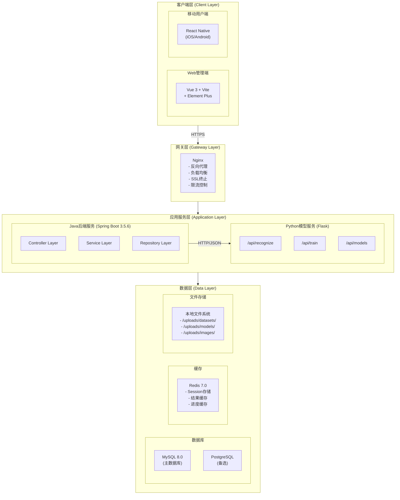
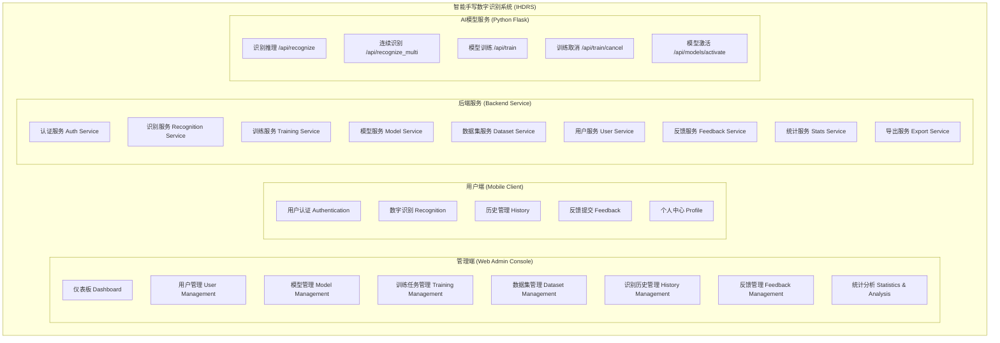
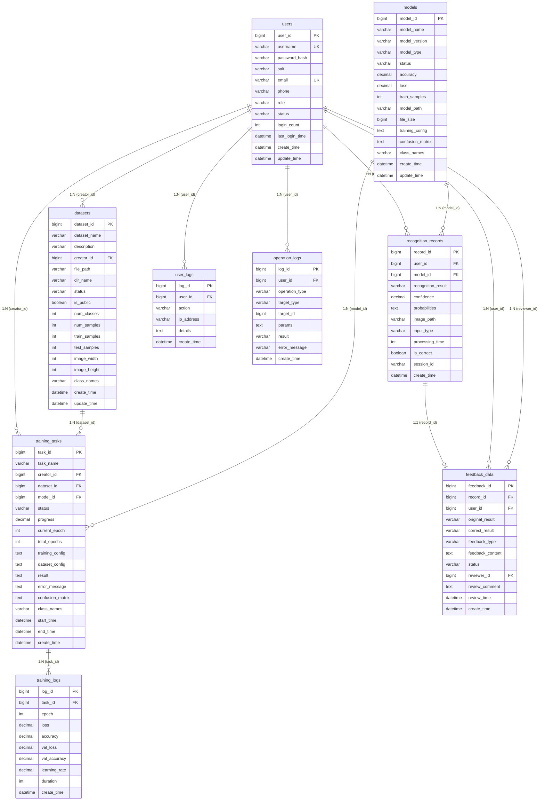

# 智能手写数字识别系统概要设计说明书

**Intelligent Handwritten Digit Recognition System (IHDRS)**
**High-Level Design Specification**

---

**文档编号:** IHDRS-HLD-2025-001
**版本:** 1.3.0
**日期:** 2025-12-01
**编写人:** 刘家乐

---

## **修订历史**

| 版本号 | 修订日期   | 修订人 | 修订内容             |
| ------ | ---------- | ------ | -------------------- |
| 1.0.0  | 2025-10-29 | 刘家乐 | 初稿                 |
| 1.1.0  | 2025-11-02 | 刘家乐 | 增加管理端设计       |
| 1.2.0  | 2025-11-09 | 刘家乐 | 增加用户端设计       |
| 1.3.0  | 2025-12-01 | 刘家乐 | 整合完整系统概要设计 |

---

## **目录**

[TOC]

---

## **1.引言**

### **1.1 编写目的**

本文档是智能手写数字识别系统（IHDRS）的概要设计说明书，旨在描述系统的总体架构、功能模块、数据库设计、接口设计和安全性设计，为后续的详细设计、编码实现、系统测试和运维部署提供技术依据和设计指导。

**主要读者包括：**
- 系统架构师
- 前端开发工程师
- 后端开发工程师
- 移动端开发工程师
- 测试工程师
- 项目管理人员

### **1.2 项目背景**

**项目名称:** 智能手写数字识别系统 (Intelligent Handwritten Digit Recognition System, IHDRS)

**开发单位:** 留学生第一组

**项目概述:**
本项目旨在开发一个基于深度学习的手写数字识别系统，提供高精度、低延迟的手写数字识别服务。系统采用前后端分离的微服务架构，包含Web管理端、移动用户端和后端服务三大核心子系统，支持模型训练、数据集管理、识别服务和用户反馈等完整的业务流程。

**系统组成:**
| 子系统       | 分支名称      | 技术栈                | 主要用户       |
| ------------ | ------------- | --------------------- | -------------- |
| **管理端**   | IHDRS-Admin   | Vue 3 + Vite + Pinia  | 管理员、分析师 |
| **用户端**   | IHDRS-Mobile  | React Native          | 普通用户       |
| **后端服务** | IHDRS-Backend | Spring Boot 3 + Flask | 系统服务       |

### **1.3 定义与缩略语**

| 缩略语 | 英文全称                                                | 中文含义             |
| ------ | ------------------------------------------------------- | -------------------- |
| IHDRS  | Intelligent Handwritten Digit Recognition System        | 智能手写数字识别系统 |
| CNN    | Convolutional Neural Network                            | 卷积神经网络         |
| MNIST  | Modified National Institute of Standards and Technology | MNIST手写数字数据集  |
| SPA    | Single Page Application                                 | 单页应用             |
| RBAC   | Role-Based Access Control                               | 基于角色的访问控制   |
| JWT    | JSON Web Token                                          | JSON网络令牌         |
| REST   | Representational State Transfer                         | 表述性状态转移       |
| JPA    | Java Persistence API                                    | Java持久化API        |
| DTO    | Data Transfer Object                                    | 数据传输对象         |
| ORM    | Object-Relational Mapping                               | 对象关系映射         |
| CORS   | Cross-Origin Resource Sharing                           | 跨域资源共享         |
| TPS    | Transactions Per Second                                 | 每秒事务处理数       |
| SSR    | Server-Side Rendering                                   | 服务端渲染           |
| UI/UX  | User Interface/User Experience                          | 用户界面/用户体验    |

### **1.4 参考资料**

1. IEEE Std 1016-2009 软件设计说明推荐实践
2. GB/T 8567-2006 计算机软件文档编制规范
3. Spring Boot 3.5.6 官方文档
4. Vue.js 3.x 官方文档
5. React Native 0.72 官方文档
6. MySQL 8.0 参考手册
7. Redis 7.0 文档
8. TensorFlow/PyTorch 官方文档
9. Element Plus 组件库文档
10. ECharts 数据可视化文档

---

## **2.系统概述**

### **2.1 系统目标**

开发一款基于深度学习的智能手写数字识别系统，实现以下核心目标：

1.  **高精度识别服务**: 基于CNN深度学习模型，识别准确率≥98%
2. **跨平台用户端**: 支持iOS、Android移动端和Web端访问
3. **完整管理功能**: 提供用户管理、模型管理、数据集管理等后台功能
4.  **模型全生命周期管理**: 支持模型训练、评估、部署、版本管理
5. **实时监控与分析**: 提供系统监控、统计分析、趋势预测
6. **用户反馈闭环**: 基于用户反馈持续优化模型性能

### **2.2 系统特点**

| 特点           | 描述                                   |
| -------------- | -------------------------------------- |
| **微服务架构** | Spring Boot + Flask 服务分离，独立部署 |
| **跨平台支持** | Web管理端 + React Native移动端         |
| **实时交互**   | WebSocket实时推送训练进度              |
| **高性能识别** | Redis缓存 + 异步处理，响应时间<1秒     |
| **可视化分析** | ECharts多维度数据展示                  |
| **模块化设计** | 高内聚低耦合，易于扩展维护             |
| **安全可靠**   | JWT认证 + RBAC权限 + 数据加密          |
| **容器化部署** | Docker + Docker Compose一键部署        |

### **2.3 运行环境**

#### **2.3.1 开发环境**

| 组件     | 版本要求     | 用途         |
| -------- | ------------ | ------------ |
| JDK      | 17+          | Java后端开发 |
| Node.js  | 16.x+        | 前端开发构建 |
| Python   | 3.8+         | AI模型服务   |
| Maven    | 3.8+         | Java项目构建 |
| npm/yarn | 8.x+ / 1.22+ | 前端包管理   |
| MySQL    | 8.0+         | 关系型数据库 |
| Redis    | 7.0+         | 缓存服务     |

#### **2.3.2 生产环境**

| 组件       | 版本要求     | 配置要求          |
| ---------- | ------------ | ----------------- |
| Linux      | CentOS 7.6+  | 服务器操作系统    |
| Docker     | 20.10+       | 容器运行时        |
| Nginx      | 1.20+        | 反向代理/负载均衡 |
| Kubernetes | 1.24+ (可选) | 容器编排          |

#### **2.3.3 客户端环境**

| 平台       | 版本要求                                      |
| ---------- | --------------------------------------------- |
| iOS        | 13.0+                                         |
| Android    | 8.0+ (API Level 26)                           |
| Web浏览器  | Chrome 90+, Firefox 88+, Safari 14+, Edge 90+ |
| 屏幕分辨率 | 1280x720及以上                                |

---

## **3. 系统架构设计**

### **3.1 总体架构图**

系统采用**前后端分离 + 微服务**架构，整体架构如下：



### **3.2 分层架构设计**

系统采用经典的分层架构，各层职责明确：

| 层次           | 职责                         | 主要技术                 |
| -------------- | ---------------------------- | ------------------------ |
| **表示层**     | 用户交互界面，展示数据       | Vue 3, React Native      |
| **网关层**     | 路由转发、负载均衡、安全控制 | Nginx                    |
| **控制层**     | 接收请求、参数验证、响应返回 | Spring MVC               |
| **业务层**     | 核心业务逻辑处理             | Spring Service           |
| **数据访问层** | 数据持久化操作               | Spring Data JPA          |
| **AI服务层**   | 模型训练、推理服务           | Flask + TensorFlow       |
| **数据层**     | 数据存储                     | MySQL, Redis, FileSystem |

### **3.3 技术选型总览**

#### **3.3.1 后端技术栈**

| 技术类别      | 技术选型          | 版本   | 用途            |
| ------------- | ----------------- | ------ | --------------- |
| **核心框架**  | Spring Boot       | 3.5.6  | Java应用框架    |
| **安全框架**  | Spring Security   | 6.x    | 认证授权        |
| **持久化**    | Spring Data JPA   | 3.x    | ORM框架         |
| **数据库**    | MySQL             | 8.0+   | 关系型数据库    |
| **缓存**      | Redis             | 7.0+   | 分布式缓存      |
| **JWT**       | jjwt              | 0.11.1 | Token生成与验证 |
| **API文档**   | SpringDoc OpenAPI | 2.2.0  | Swagger文档     |
| **Excel导出** | Apache POI        | 5.2.5  | Excel操作       |
| **PDF导出**   | iText7            | 7.2.5  | PDF生成         |
| **WebSocket** | Spring WebSocket  | 内置   | 实时通信        |

#### **3.3.2 管理端技术栈 (Vue 3)**

| 技术类别       | 技术选型     | 版本  | 用途       |
| -------------- | ------------ | ----- | ---------- |
| **框架**       | Vue.js       | 3.3+  | 核心框架   |
| **构建工具**   | Vite         | 4.x+  | 快速构建   |
| **状态管理**   | Pinia        | 2.1+  | 状态管理   |
| **路由**       | Vue Router   | 4.x+  | 路由管理   |
| **UI组件库**   | Element Plus | 2.4+  | UI组件     |
| **HTTP客户端** | Axios        | 1.6+  | API请求    |
| **图表库**     | ECharts      | 5.4+  | 数据可视化 |
| **样式预处理** | Sass         | 1.69+ | CSS预处理  |

#### **3.3.3 用户端技术栈 (React Native)**

| 技术类别       | 技术选型          | 版本  | 用途       |
| -------------- | ----------------- | ----- | ---------- |
| **框架**       | React Native      | 0.72+ | 跨平台框架 |
| **绘图**       | React Native Svg  | -     | 画布绘制   |
| **图片选择**   | Expo Image Picker | -     | 图片选择   |
| **HTTP客户端** | Axios             | -     | API请求    |
| **导航**       | React Navigation  | -     | 路由导航   |

#### **3.3.4 AI服务技术栈 (Python)**

| 技术类别     | 技术选型   | 版本 | 用途         |
| ------------ | ---------- | ---- | ------------ |
| **Web框架**  | Flask      | 2.x  | API服务      |
| **深度学习** | TensorFlow | 2.x  | 模型训练推理 |
| **备选框架** | PyTorch    | 2.x  | 模型训练推理 |
| **图像处理** | OpenCV     | 4.x  | 图像预处理   |
| **数值计算** | NumPy      | 1.x  | 数组运算     |

### **3.4 项目目录结构**

#### **3.4.1 后端项目结构 (Spring Boot)**

```
ihdrs-backend/
├── src/
│   └── main/
│       ├── java/com/ihdrs/
│       │   ├── config/              # 配置类
│       │   │   ├── SecurityConfig.java
│       │   │   ├── WebConfig.java
│       │   │   ├── RedisConfig.java
│       │   │   └── WebSocketConfig.java
│       │   ├── controller/          # 控制器层
│       │   │   ├── AuthController.java
│       │   │   ├── RecognitionController.java
│       │   │   ├── TrainingTaskController.java
│       │   │   ├── DatasetController.java
│       │   │   ├── ModelManagementController.java
│       │   │   ├── UserController.java
│       │   │   ├── FeedbackController.java
│       │   │   └── StatsController.java
│       │   ├── service/             # 业务逻辑层
│       │   │   ├── AuthService.java
│       │   │   ├── RecognitionService.java
│       │   │   ├── TrainingTaskService.java
│       │   │   ├── DatasetService.java
│       │   │   ├── ModelManagementService.java
│       │   │   ├── UserService.java
│       │   │   ├── FeedbackService.java
│       │   │   ├── ExportService.java
│       │   │   └── StatsService.java
│       │   ├── repository/          # 数据访问层
│       │   │   ├── UserRepository.java
│       │   │   ├── ModelRepository.java
│       │   │   ├── RecognitionRecordRepository.java
│       │   │   ├── TrainingTaskRepository.java
│       │   │   ├── DatasetRepository.java
│       │   │   └── FeedbackRepository.java
│       │   ├── entity/              # 实体类
│       │   │   ├── User.java
│       │   │   ├── Model.java
│       │   │   ├── RecognitionRecord.java
│       │   │   ├── TrainingTask.java
│       │   │   ├── TrainingLog.java
│       │   │   ├── Dataset.java
│       │   │   └── Feedback.java
│       │   ├── dto/                 # 数据传输对象
│       │   ├── util/                # 工具类
│       │   │   ├── JwtUtil.java
│       │   │   └── FileUtil.java
│       │   └── IhdrsBackendApplication.java
│       └── resources/
│           ├── application.yml
│           └── application-prod.yml
├── pom.xml
├── Dockerfile
└── docker-compose.yml
```

#### **3.4.2 Python模型服务结构**

```
ihdrs-model-service/
├── api/                    # API蓝图
│   ├── __init__.py
│   ├── recognize.py        # 识别API
│   ├── train.py            # 训练API
│   └── models.py           # 模型管理API
├── models/                 # 模型文件存储
│   └── active_model.h5
├── models_code/            # 模型定义代码
│   ├── cnn.py
│   ├── advanced_cnn.py
│   ├── resnet.py
│   ├── vgg.py
│   └── mobilenet.py
├── services/               # 业务服务
│   ├── recognition_service.py
│   ├── training_service.py
│   └── model_service.py
├── utils/                  # 工具函数
│   ├── image_processor.py
│   └── data_loader.py
├── tests/                  # 测试用例
├── app.py                  # 主应用
├── config.py               # 配置文件
├── requirements.txt        # 依赖清单
├── run.py                  # 启动脚本
└── Dockerfile
```

#### **3.4.3 管理端项目结构 (Vue 3)**

```
ihdrs-frontend/
├── src/
│   ├── api/                    # API接口层
│   │   ├── admin.js
│   │   ├── auth.js
│   │   ├── dataset.js
│   │   ├── feedback.js
│   │   ├── model.js
│   │   ├── recognition.js
│   │   ├── stats.js
│   │   ├── training.js
│   │   └── user.js
│   ├── assets/                 # 静态资源
│   │   ├── styles/
│   │   └── images/
│   ├── components/             # 可复用组件
│   │   ├── common/
│   │   ├── dataset/
│   │   ├── model/
│   │   └── training/
│   ├── layouts/                # 布局组件
│   │   ├── BasicLayout.vue
│   │   └── BlankLayout.vue
│   ├── router/                 # 路由配置
│   │   └── index.js
│   ├── stores/                 # 状态管理 (Pinia)
│   │   ├── user.js
│   │   ├── app.js
│   │   └── permission.js
│   ├── utils/                  # 工具函数
│   │   ├── request.js
│   │   ├── format.js
│   │   ├── validate.js
│   │   └── export.js
│   ├── views/                  # 页面组件
│   │   ├── auth/
│   │   ├── dashboard/
│   │   ├── dataset/
│   │   ├── models/
│   │   ├── recognition/
│   │   ├── statistics/
│   │   ├── users/
│   │   └── profile/
│   ├── App.vue
│   └── main.js
├── vite.config.js
├── package.json
└── index.html
```

#### **3.4.4 用户端项目结构 (React Native)**

```
ihdrs-mobile/
├── src/
│   ├── components/             # 可复用组件
│   │   ├── DrawingCanvas.js
│   │   ├── ImagePickerComponent.js
│   │   └── RecognitionHistory.js
│   ├── screens/                # 页面组件
│   │   ├── MainScreen.js
│   │   ├── LoginScreen.js
│   │   ├── RegisterScreen.js
│   │   ├── ProfileScreen.js
│   │   ├── HistoryScreen.js
│   │   └── FeedbackScreen.js
│   ├── services/               # 业务服务
│   │   ├── authService.js
│   │   ├── recognitionService.js
│   │   ├── historyService.js
│   │   ├── feedbackService.js
│   │   └── userService.js
│   └── config/                 # 配置文件
│       └── api.js
├── App.js
├── package.json
└── metro.config.js
```

---

## **4. 功能模块设计**

### **4.1 系统功能总览**



### **4.2 管理端功能模块**

#### **4.2.1 仪表板 (Dashboard)**

| 功能项       | 功能描述                                       |
| ------------ | ---------------------------------------------- |
| 数据概览卡片 | 总识别次数、注册用户数、训练模型数、今日识别量 |
| 识别趋势图   | 折线图展示近期识别量变化趋势                   |
| 数字分布图   | 饼图展示各数字识别比例                         |
| 准确率曲线   | 展示模型识别准确率变化                         |
| 最近活动     | 最近识别记录、系统状态监控                     |
| 快速操作     | 开始训练、查看记录、用户管理入口               |

#### **4.2.2 用户管理 (User Management)**

| 功能项   | 功能描述                       |
| -------- | ------------------------------ |
| 用户列表 | 分页展示、搜索、筛选、排序     |
| 角色管理 | USER/ADMIN角色变更             |
| 状态管理 | 用户启用/禁用                  |
| 用户日志 | 查看用户行为日志               |
| 统计信息 | 总用户数、管理员数、活跃用户数 |

#### **4.2.3 模型管理 (Model Management)**

| 功能项   | 功能描述                             |
| -------- | ------------------------------------ |
| 模型列表 | 名称、版本、准确率、状态、创建时间   |
| 模型详情 | 基本信息、训练配置、性能指标         |
| 模型激活 | 设置为当前活跃模型（同时只能有一个） |
| 模型停用 | 停用非活跃模型                       |
| 版本对比 | 多模型性能对比分析                   |
| 模型删除 | 删除非活跃模型                       |

#### **4.2.4 训练任务管理 (Training Management)**

| 功能项         | 功能描述                                 |
| -------------- | ---------------------------------------- |
| 创建训练任务   | 任务名称、数据集选择、模型类型、训练参数 |
| 任务列表       | 状态筛选、进度展示                       |
| 实时进度监控   | 当前Epoch、Batch进度、训练日志           |
| 训练曲线可视化 | 准确率曲线、损失曲线、学习率曲线         |
| 混淆矩阵分析   | 训练完成后展示混淆矩阵热力图             |
| 任务控制       | 取消任务、查看详情                       |

**支持的模型类型:**
- CNN (基础卷积神经网络)
- ADVANCED_CNN (增强型CNN)
- ResNet (残差网络)
- VGG (VGG网络)
- MobileNet (轻量级网络)

**可配置训练参数:**

| 参数         | 说明             | 默认值       |
| ------------ | ---------------- | ------------ |
| batchSize    | 批次大小         | 32           |
| learningRate | 学习率           | 0.001        |
| epochs       | 训练轮数         | 50           |
| optimizer    | 优化器           | Adam         |
| lossFunction | 损失函数         | CrossEntropy |
| hiddenSize   | 隐藏层大小       | 128          |
| dropout      | Dropout率        | 0.5          |
| batchNorm    | 是否使用批归一化 | true         |
| earlyStop    | 早停策略         | true         |

#### **4.2.5 数据集管理 (Dataset Management)**

| 功能项     | 功能描述                           |
| ---------- | ---------------------------------- |
| 数据集上传 | 拖拽上传、格式验证、进度展示       |
| 我的数据集 | 用户上传的数据集列表               |
| 公开数据集 | 公开共享的数据集                   |
| 数据集详情 | 类别数、样本数、图像信息、类别列表 |
| 公开设置   | 设置数据集公开/私有                |
| 数据集删除 | 删除数据集及相关文件               |

**数据集格式要求:**
```
dataset.zip
├── train/              # 训练集（必须）
│   ├── 0/              # 类别0
│   │   ├── img001.jpg
│   │   └── img002.jpg
│   ├── 1/              # 类别1
│   └── ...
└── test/               # 测试集（可选）
    ├── 0/
    ├── 1/
    └── ...
```

#### **4.2.6 识别历史管理 (History Management)**

| 功能项   | 功能描述                             |
| -------- | ------------------------------------ |
| 高级搜索 | 结果、时间范围、用户ID、输入方式     |
| 数据展示 | 图像预览、识别结果、置信度、模型信息 |
| 批量操作 | 批量删除、批量导出                   |
| 数据导出 | Excel、CSV、PDF格式，可选字段配置    |
| 统计信息 | 总识别次数、准确率、平均响应时间     |

#### **4.2.7 反馈管理 (Feedback Management)**

| 功能项   | 功能描述                         |
| -------- | -------------------------------- |
| 反馈列表 | 状态筛选、类型筛选、图像预览     |
| 反馈审核 | 接受/拒绝反馈、添加审核备注      |
| 批量审核 | 批量接受、批量拒绝               |
| 反馈详情 | 完整信息、关联识别记录、用户信息 |
| 数据导出 | 反馈报表导出                     |

#### **4.2.8 统计分析 (Statistics & Analysis)**

| 图表类型     | 展示内容                       |
| ------------ | ------------------------------ |
| 识别量趋势图 | 折线图展示每日/每周/每月识别量 |
| 成功率趋势图 | 折线图展示识别准确率变化       |
| 数字分布图   | 饼图展示各数字识别比例         |
| 小时分布图   | 柱状图展示24小时识别量分布     |
| 系统资源图   | CPU使用率、内存使用率、请求数  |

### **4.3 用户端功能模块**

#### **4.3.1 用户认证 (Authentication)**

| 功能项    | 功能描述                      |
| --------- | ----------------------------- |
| 用户注册  | 用户名、密码、邮箱验证        |
| 用户登录  | 用户名密码验证、Token获取     |
| Token验证 | 验证Token有效性、获取用户信息 |
| 自动登录  | Token持久化存储、自动续期     |

#### **4.3.2 数字识别 (Recognition)**

| 功能项         | 功能描述                     |
| -------------- | ---------------------------- |
| 画布手写识别   | 在画布上绘制数字，实时识别   |
| 图片上传识别   | 从相册选择图片进行识别       |
| 相机拍照识别   | 使用相机拍摄数字图片识别     |
| 多数字序列识别 | 识别包含多个数字的图片       |
| 结果展示       | 识别结果、置信度、概率分布图 |

#### **4.3.3 历史管理 (History)**

| 功能项       | 功能描述                   |
| ------------ | -------------------------- |
| 历史记录查询 | 分页查询用户的识别历史     |
| 记录详情     | 查看图片、置信度、概率分布 |
| 记录删除     | 支持单个或批量删除记录     |

#### **4.3.4 反馈提交 (Feedback)**

| 功能项   | 功能描述                     |
| -------- | ---------------------------- |
| 提交反馈 | 标记错误结果，提供正确答案   |
| 反馈列表 | 查询用户提交的反馈记录       |
| 反馈详情 | 查看反馈的详细信息和处理状态 |

#### **4.3.5 个人中心 (Profile)**

| 功能项       | 功能描述               |
| ------------ | ---------------------- |
| 个人信息查看 | 显示用户账户信息       |
| 个人信息修改 | 修改邮箱、手机号等信息 |
| 密码修改     | 修改登录密码           |

---

## **5. 数据库设计**

### **5.1 数据库概述**

| 配置项         | 值                 |
| -------------- | ------------------ |
| 数据库管理系统 | MySQL 8.0          |
| 字符集         | UTF8MB4            |
| 排序规则       | utf8mb4_unicode_ci |
| 存储引擎       | InnoDB             |

### **5.2 E-R图**



### **5.3 核心数据表设计**

#### **5.3.1 用户表 (users)**

| 字段名          | 数据类型     | 约束        | 说明                  |
| --------------- | ------------ | ----------- | --------------------- |
| user_id         | BIGINT       | PK, AUTO    | 用户ID                |
| username        | VARCHAR(50)  | UNIQUE, NN  | 用户名                |
| password_hash   | VARCHAR(255) | NN          | 密码哈希              |
| salt            | VARCHAR(32)  | NN          | 密码盐值              |
| email           | VARCHAR(100) | UNIQUE      | 邮箱                  |
| phone           | VARCHAR(20)  |             | 手机号                |
| role            | ENUM         | NN, DEFAULT | 角色(USER/ADMIN)      |
| status          | ENUM         | NN, DEFAULT | 状态(ACTIVE/DISABLED) |
| login_count     | INT          | DEFAULT 0   | 登录次数              |
| last_login_time | DATETIME     |             | 最后登录时间          |
| create_time     | DATETIME     | NN          | 创建时间              |
| update_time     | DATETIME     |             | 更新时间              |

#### **5.3.2 模型表 (models)**

| 字段名           | 数据类型      | 约束     | 说明                                     |
| ---------------- | ------------- | -------- | ---------------------------------------- |
| model_id         | BIGINT        | PK, AUTO | 模型ID                                   |
| model_name       | VARCHAR(100)  | NN       | 模型名称                                 |
| model_version    | VARCHAR(50)   |          | 模型版本                                 |
| model_type       | VARCHAR(50)   |          | 模型类型                                 |
| status           | ENUM          | NN       | 状态(TRAINING/COMPLETED/ACTIVE/DISABLED) |
| accuracy         | DECIMAL(5,4)  |          | 准确率                                   |
| loss             | DECIMAL(10,6) |          | 损失值                                   |
| train_samples    | INT           |          | 训练样本数                               |
| model_path       | VARCHAR(255)  |          | 模型文件路径                             |
| file_size        | BIGINT        |          | 文件大小(字节)                           |
| training_config  | JSON          |          | 训练配置                                 |
| confusion_matrix | JSON          |          | 混淆矩阵                                 |
| class_names      | VARCHAR(255)  |          | 类别名称                                 |
| create_time      | DATETIME      | NN       | 创建时间                                 |
| update_time      | DATETIME      |          | 更新时间                                 |

#### **5.3.3 识别记录表 (recognition_records)**

| 字段名             | 数据类型     | 约束     | 说明                           |
| ------------------ | ------------ | -------- | ------------------------------ |
| record_id          | BIGINT       | PK, AUTO | 记录ID                         |
| user_id            | BIGINT       | FK       | 用户ID                         |
| model_id           | BIGINT       | FK       | 模型ID                         |
| recognition_result | VARCHAR(50)  |          | 识别结果                       |
| confidence         | DECIMAL(5,4) |          | 置信度                         |
| probabilities      | JSON         |          | 概率分布                       |
| image_path         | VARCHAR(255) |          | 图像路径                       |
| input_type         | ENUM         |          | 输入类型(CANVAS/UPLOAD/CAMERA) |
| processing_time    | INT          |          | 处理时间(毫秒)                 |
| is_correct         | BOOLEAN      |          | 是否正确                       |
| session_id         | VARCHAR(100) |          | 会话ID                         |
| create_time        | DATETIME     | NN       | 创建时间                       |

#### **5.3.4 训练任务表 (training_tasks)**

| 字段名           | 数据类型     | 约束      | 说明                                             |
| ---------------- | ------------ | --------- | ------------------------------------------------ |
| task_id          | BIGINT       | PK, AUTO  | 任务ID                                           |
| task_name        | VARCHAR(100) | NN        | 任务名称                                         |
| creator_id       | BIGINT       | FK, NN    | 创建者ID                                         |
| dataset_id       | BIGINT       | FK, NN    | 数据集ID                                         |
| model_id         | BIGINT       | FK        | 模型ID(训练完成后)                               |
| status           | ENUM         | NN        | 状态(PENDING/RUNNING/COMPLETED/FAILED/CANCELLED) |
| progress         | DECIMAL(5,2) | DEFAULT 0 | 进度百分比                                       |
| current_epoch    | INT          | DEFAULT 0 | 当前Epoch                                        |
| total_epochs     | INT          |           | 总Epochs                                         |
| training_config  | JSON         |           | 训练配置JSON                                     |
| dataset_config   | JSON         |           | 数据集配置JSON                                   |
| result           | JSON         |           | 训练结果                                         |
| error_message    | TEXT         |           | 错误信息                                         |
| confusion_matrix | JSON         |           | 混淆矩阵                                         |
| class_names      | VARCHAR(255) |           | 类别名称                                         |
| start_time       | DATETIME     |           | 开始时间                                         |
| end_time         | DATETIME     |           | 结束时间                                         |
| create_time      | DATETIME     | NN        | 创建时间                                         |

#### **5.3.5 训练日志表 (training_logs)**

| 字段名        | 数据类型      | 约束     | 说明       |
| ------------- | ------------- | -------- | ---------- |
| log_id        | BIGINT        | PK, AUTO | 日志ID     |
| task_id       | BIGINT        | FK, NN   | 任务ID     |
| epoch         | INT           | NN       | Epoch编号  |
| loss          | DECIMAL(10,6) |          | 训练损失   |
| accuracy      | DECIMAL(5,4)  |          | 训练准确率 |
| val_loss      | DECIMAL(10,6) |          | 验证损失   |
| val_accuracy  | DECIMAL(5,4)  |          | 验证准确率 |
| learning_rate | DECIMAL(10,8) |          | 学习率     |
| duration      | INT           |          | 耗时(秒)   |
| create_time   | DATETIME      | NN       | 创建时间   |

#### **5.3.6 数据集表 (datasets)**

| 字段名        | 数据类型     | 约束      | 说明                                       |
| ------------- | ------------ | --------- | ------------------------------------------ |
| dataset_id    | BIGINT       | PK, AUTO  | 数据集ID                                   |
| dataset_name  | VARCHAR(100) | NN        | 数据集名称                                 |
| description   | TEXT         |           | 描述                                       |
| creator_id    | BIGINT       | FK, NN    | 创建者ID                                   |
| file_path     | VARCHAR(255) |           | 文件路径                                   |
| dir_name      | VARCHAR(100) |           | 目录名称                                   |
| status        | ENUM         | NN        | 状态(UPLOADING/PROCESSING/AVAILABLE/ERROR) |
| is_public     | BOOLEAN      | DEFAULT 0 | 是否公开                                   |
| num_classes   | INT          |           | 类别数量                                   |
| num_samples   | INT          |           | 总样本数                                   |
| train_samples | INT          |           | 训练样本数                                 |
| test_samples  | INT          |           | 测试样本数                                 |
| image_width   | INT          |           | 图像宽度                                   |
| image_height  | INT          |           | 图像高度                                   |
| class_names   | VARCHAR(255) |           | 类别名称列表                               |
| create_time   | DATETIME     | NN        | 创建时间                                   |
| update_time   | DATETIME     |           | 更新时间                                   |

#### **5.3.7 反馈数据表 (feedback_data)**

| 字段名           | 数据类型    | 约束     | 说明                            |
| ---------------- | ----------- | -------- | ------------------------------- |
| feedback_id      | BIGINT      | PK, AUTO | 反馈ID                          |
| record_id        | BIGINT      | FK, NN   | 识别记录ID                      |
| user_id          | BIGINT      | FK, NN   | 提交用户ID                      |
| original_result  | VARCHAR(50) |          | 原识别结果                      |
| correct_result   | VARCHAR(50) |          | 正确结果                        |
| feedback_type    | VARCHAR(50) |          | 反馈类型                        |
| feedback_content | TEXT        |          | 反馈内容                        |
| status           | ENUM        | NN       | 状态(PENDING/ACCEPTED/REJECTED) |
| reviewer_id      | BIGINT      | FK       | 审核人ID                        |
| review_comment   | TEXT        |          | 审核备注                        |
| review_time      | DATETIME    |          | 审核时间                        |
| create_time      | DATETIME    | NN       | 创建时间                        |

**5.3.8  操作日志表（operation_logs）**

| 字段名           | 数据类型                  | 约束                                  | 说明                    |
| ---------------- | ------------------------- | ------------------------------------- | ----------------------- |
| log_id           | bigint                    | PRIMARY KEY, AUTO_INCREMENT, NOT NULL | 日志ID                  |
| user_id          | bigint                    | DEFAULT NULL                          | 操作用户ID              |
| operation_type   | varchar(50)               | NOT NULL                              | 操作类型                |
| operation_object | varchar(100)              | DEFAULT NULL                          | 操作对象                |
| operation_detail | json                      | DEFAULT NULL                          | 操作详情                |
| ip_address       | varchar(45)               | DEFAULT NULL                          | IP地址                  |
| user_agent       | varchar(500)              | DEFAULT NULL                          | 用户代理（浏览器UA 等） |
| execution_time   | int                       | DEFAULT NULL                          | 执行时间（毫秒）        |
| result           | enum('SUCCESS','FAILURE') | DEFAULT 'SUCCESS'                     | 操作结果                |
| error_message    | text                      | DEFAULT NULL                          | 错误信息                |
| create_time      | datetime                  | DEFAULT CURRENT_TIMESTAMP             | 创建时间                |

**5.3.9 用户行为日志表 (user_log)**

| 字段名      | 数据类型     | 约束                        | 说明         |
| ----------- | ------------ | --------------------------- | ------------ |
| log_id      | BIGINT       | PRIMARY KEY, AUTO_INCREMENT | 日志ID       |
| user_id     | BIGINT       | NOT NULL                    | 用户ID       |
| action      | VARCHAR(50)  | NOT NULL                    | 用户行为动作 |
| ip_address  | VARCHAR(50)  | DEFAULT NULL                | IP地址       |
| user_agent  | VARCHAR(500) | DEFAULT NULL                | 浏览器 UA    |
| create_time | DATETIME     | NOT NULL                    | 创建时间     |

### **5.4 索引设计**

```sql
-- users表索引
CREATE UNIQUE INDEX idx_users_username ON users(username);
CREATE UNIQUE INDEX idx_users_email ON users(email);
CREATE INDEX idx_users_status ON users(status);
CREATE INDEX idx_users_role ON users(role);

-- recognition_records表索引
CREATE INDEX idx_records_user_time ON recognition_records(user_id, create_time DESC);
CREATE INDEX idx_records_model ON recognition_records(model_id);
CREATE INDEX idx_records_result ON recognition_records(recognition_result);
CREATE INDEX idx_records_time ON recognition_records(create_time);

-- training_tasks表索引
CREATE INDEX idx_tasks_creator_time ON training_tasks(creator_id, create_time DESC);
CREATE INDEX idx_tasks_status ON training_tasks(status);
CREATE INDEX idx_tasks_dataset ON training_tasks(dataset_id);

-- training_logs表索引
CREATE INDEX idx_logs_task_epoch ON training_logs(task_id, epoch);

-- models表索引
CREATE INDEX idx_models_status ON models(status);
CREATE INDEX idx_models_name_version ON models(model_name, model_version);

-- datasets表索引
CREATE INDEX idx_datasets_creator ON datasets(creator_id);
CREATE INDEX idx_datasets_public ON datasets(is_public);
CREATE INDEX idx_datasets_status ON datasets(status);

-- feedback_data表索引
CREATE INDEX idx_feedback_record ON feedback_data(record_id);
CREATE INDEX idx_feedback_user ON feedback_data(user_id);
CREATE INDEX idx_feedback_status ON feedback_data(status);
```

---

## **6. 接口设计**

### **6.1 API设计规范**

#### **6.1.1 基础信息**

| 配置项        | 值                          |
| ------------- | --------------------------- |
| 基础URL       | `http://localhost:8080/api` |
| Python服务URL | `http://localhost:5000`     |
| 协议          | HTTPS (生产环境)            |
| 数据格式      | JSON                        |
| 字符编码      | UTF-8                       |

#### **6.1.2 统一响应格式**

**成功响应:**
```json
{
  "code": 200,
  "msg": "success",
  "data": { ... },
  "timestamp": 1701388800000
}
```

**分页响应:**
```json
{
  "code": 200,
  "msg": "success",
  "data": {
    "records": [ ...],
    "total": 100,
    "size": 10,
    "current": 1,
    "pages": 10
  }
}
```

**错误响应:**
```json
{
  "code": 401,
  "msg": "用户名或密码错误",
  "data": null,
  "timestamp": 1701388800000
}
```

#### **6.1.3 HTTP状态码**

| 状态码 | 说明           |
| ------ | -------------- |
| 200    | 请求成功       |
| 201    | 创建成功       |
| 400    | 请求参数错误   |
| 401    | 未认证         |
| 403    | 无权限         |
| 404    | 资源不存在     |
| 500    | 服务器内部错误 |

### **6.2 API接口总览**

| 模块           | 接口数量 | Base Path                    | 说明                 |
| -------------- | -------- | ---------------------------- | -------------------- |
| **认证接口**   | 3        | /api/auth                    | 登录、注册、验证     |
| **用户管理**   | 8        | /api/users, /api/admin/users | 用户CRUD、角色管理   |
| **识别服务**   | 7        | /api/recognition             | 识别、历史、删除     |
| **模型管理**   | 12       | /api/admin/models            | 模型CRUD、激活、对比 |
| **训练管理**   | 10       | /api/training                | 任务创建、进度、日志 |
| **数据集管理** | 8        | /api/datasets                | 上传、列表、详情     |
| **反馈管理**   | 7        | /api/feedback                | 提交、审核、列表     |
| **统计分析**   | 4        | /api/stats                   | 仪表板、性能、趋势   |
| **导出服务**   | 3        | /api/export                  | Excel、CSV、PDF      |

### **6.3 核心接口详细设计**

#### **6.3.1 认证接口**

**用户登录**
```http
POST /api/auth/login
Content-Type: application/json

{
  "username": "admin",
  "password": "password123"
}

Response 200:
{
  "code": 200,
  "msg": "登录成功",
  "data": {
    "token": "eyJhbGciOiJIUzI1NiIs...",
    "tokenType": "Bearer",
    "expiresIn": 86400,
    "userInfo": {
      "userId": 1,
      "username": "admin",
      "role": "ADMIN",
      "email": "admin@ihdrs.com"
    }
  }
}
```

**用户注册**
```http
POST /api/auth/register
Content-Type: application/json

{
  "username": "newuser",
  "password": "password123",
  "email": "newuser@example.com"
}

Response 201:
{
  "code": 201,
  "msg": "注册成功",
  "data": {
    "userId": 10,
    "username": "newuser"
  }
}
```

**Token验证**
```http
POST /api/auth/validate
Authorization: Bearer {token}

Response 200:
{
  "code": 200,
  "msg": "Token有效",
  "data": {
    "valid": true,
    "userInfo": { ...}
  }
}
```

#### **6.3.2 识别服务接口**

**单数字识别**
```http
POST /api/recognition/recognize
Authorization: Bearer {token}
Content-Type: application/json

{
  "imageData": "data:image/png;base64,iVBORw0KGgoAAAANS...",
  "inputType": "CANVAS",
  "sessionId": "session-uuid-123"
}

Response 200:
{
  "code": 200,
  "msg": "识别成功",
  "data": {
    "recordId": 1001,
    "recognitionResult": "5",
    "confidence": 0.9876,
    "probabilities": [0.001, 0.002, 0.005, 0.001, 0.002, 0.9876, 0.001, 0.001, 0.001, 0.001],
    "processingTime": 120,
    "modelName": "CNN-v1.0",
    "needRewrite": false,
    "message": "识别成功"
  }
}
```

**连续数字识别**
```http
POST /api/recognition/recognize_multi
Authorization: Bearer {token}
Content-Type: application/json

{
  "imageData": "data:image/png;base64,..."
}

Response 200:
{
  "code": 200,
  "data": {
    "digits": ["1", "2", "3", "4", "5"],
    "sequence": "12345",
    "confidences": [0.95, 0.98, 0.92, 0.97, 0.96],
    "averageConfidence": 0.956
  }
}
```

**识别历史查询**
```http
GET /api/recognition/history_user? page=1&size=10&startDate=2025-01-01&endDate=2025-12-31
Authorization: Bearer {token}

Response 200:
{
  "code": 200,
  "data": {
    "records": [
      {
        "recordId": 1001,
        "recognitionResult": "5",
        "confidence": 0.9876,
        "imagePath": "/uploads/images/xxx.png",
        "inputType": "CANVAS",
        "processingTime": 120,
        "createTime": "2025-12-01T10:30:00"
      }
    ],
    "total": 100,
    "current": 1,
    "size": 10
  }
}
```

#### **6.3.3 训练任务接口**

**创建训练任务**
```http
POST /api/training/tasks
Authorization: Bearer {token}
Content-Type: application/json

{
  "taskName": "MNIST训练任务-v2",
  "datasetId": 1,
  "modelType": "CNN",
  "trainingConfig": {
    "batchSize": 32,
    "learningRate": 0.001,
    "epochs": 50,
    "optimizer": "adam",
    "lossFunction": "cross_entropy",
    "hiddenSize": 128,
    "activation": "relu",
    "dropout": 0.5,
    "batchNorm": true,
    "earlyStop": true,
    "earlyStopPatience": 5
  }
}

Response 201:
{
  "code": 201,
  "msg": "训练任务创建成功",
  "data": {
    "taskId": 15,
    "taskName": "MNIST训练任务-v2",
    "status": "PENDING"
  }
}
```

**获取任务进度**
```http
GET /api/training/tasks/{taskId}
Authorization: Bearer {token}

Response 200:
{
  "code": 200,
  "data": {
    "taskId": 15,
    "taskName": "MNIST训练任务-v2",
    "status": "RUNNING",
        "progress": 45.5,
    "currentEpoch": 23,
    "totalEpochs": 50,
    "remainingTime": 1200,
    "trainingLogs": [
      {
        "epoch": 23,
        "loss": 0.1234,
        "accuracy": 0.9650,
        "valLoss": 0.1100,
        "valAccuracy": 0.9600
      }
    ]
  }
}
```

#### **6.3.4 数据集接口**

**上传数据集**

```
POST /api/datasets/upload
Authorization: Bearer {token}
Content-Type: multipart/form-data; boundary=----WebKitFormBoundary7MA4YWxkTrZu0gW

------WebKitFormBoundary7MA4YWxkTrZu0gW
Content-Disposition: form-data; name="file"; filename="mnist_subset.zip"
Content-Type: application/zip

(Binary Data)
------WebKitFormBoundary7MA4YWxkTrZu0gW
Content-Disposition: form-data; name="datasetName"

MNIST-Handwritten-v1
------WebKitFormBoundary7MA4YWxkTrZu0gW
Content-Disposition: form-data; name="isPublic"

true
------WebKitFormBoundary7MA4YWxkTrZu0gW--

Response 200:
{
  "code": 200,
  "msg": "上传成功，正在处理中",
  "data": {
    "datasetId": 20,
    "status": "PROCESSING"
  }
}
```

#### **6.3.5 模型管理接口**

**激活模型**

```
PUT /api/admin/models/{modelId}/activate
Authorization: Bearer {token}

Response 200:
{
  "code": 200,
  "msg": "模型激活成功",
  "data": {
    "modelId": 5,
    "modelName": "ResNet-Best-v2",
    "status": "ACTIVE",
    "previousActiveModelId": 3
  }
}
```

#### **6.3.6 反馈接口**

**提交反馈**

```
POST /api/feedback
Authorization: Bearer {token}
Content-Type: application/json

{
  "recordId": 1001,
  "correctResult": "6",
  "feedbackType": "WRONG_RECOGNITION",
  "content": "看起来像5，实际上我写的是6"
}

Response 200:
{
  "code": 200,
  "msg": "反馈提交成功"
}
```

------

## **7.安全性设计**

### **7.1 认证与授权架构**

系统采用 **JWT (JSON Web Token)** + **RBAC (Role-Based Access Control)** 的安全架构。

1. **认证流程**:
   - 用户登录成功后，服务器签发JWT Token（包含用户ID、角色、过期时间）。
   - Token有效期设置为 **24小时**。
   - 客户端将Token存储在 LocalStorage (Web) 或 SecureStore (Mobile)。
   - 每次API请求需在 Header 中携带 `Authorization: Bearer {token}`。
2. **权限控制**:
   - **Spring Security过滤器链**: 拦截所有请求，验证Token签名及有效性。
   - 角色权限矩阵:
     - `ROLE_USER`: 访问 `/api/recognition/**`, `/api/feedback/**`, `/api/users/profile`。
     - `ROLE_ADMIN`: 访问 `/api/**` (全量权限)，特别是 `/api/admin/**`, `/api/training/**`。

### **7.2 数据安全**

1. **密码存储**:
   - 严禁明文存储密码。
   - 采用 **BCrypt** 算法进行哈希加密，强度系数设置为 10。
   - 每个用户生成独立的随机盐值（Salt）。
2. **传输加密**:
   - 生产环境强制使用 **HTTPS (TLS 1.2+)** 协议。
   - API网关（Nginx）配置SSL证书，负责SSL终止。
3. **敏感信息保护**:
   - 用户手机号、邮箱在前端展示时进行脱敏处理（如 `138****1234`）。
   - 日志中严禁打印用户密码、Token等敏感信息。

### **7.3 网络安全防护**

1. **API限流 (Rate Limiting)**:
   - 针对IP地址进行限流，防止暴力破解和DDoS攻击。
   - 限制：每分钟不超过 60 次请求（登录接口每分钟不超过 5 次）。
2. **输入验证**:
   - **SQL注入防护**: 使用 JPA/Hibernate 预编译语句。
   - **XSS防护**: 对用户提交的文本内容（如反馈详情）进行HTML转义。
   - 文件上传安全:
     - 校验文件扩展名（仅限 `.zip` 为数据集, `.png/.jpg` 为识别图）。
     - 校验文件 Magic Number (文件头)。
     - 限制文件大小（数据集<500MB，图片<5MB）。
3. **CORS策略**:
   - 仅允许来自信任域名的跨域请求（如开发环境的 `localhost:5173` 和生产环境域名）。

------

## **8.性能设计**

### **8.1 响应速度优化**

| 场景           | 目标响应时间 | 优化策略                                                     |
| :------------- | :----------- | :----------------------------------------------------------- |
| **单数字识别** | < 500ms      | 1.Redis缓存常见图像哈希结果。<br>2.保持Python模型服务常驻内存。<br>3.图像预处理在内存中完成，不落盘。 |
| **列表查询**   | < 200ms      | 1.数据库字段建立合适索引。<br>2.分页查询避免全表扫描。<br>3.返回数据DTO精简，不返回大字段（如Base64）。 |
| **静态资源**   | < 100ms      | 1.使用 Nginx 托管静态资源。<br>2.开启 Gzip 压缩。<br>3.设置浏览器缓存策略 (Cache-Control)。 |

### **8.2 缓存策略 (Redis)**

系统使用 Redis 7.0 构建多级缓存体系：

1. **识别结果缓存**:
   - **Key**: `ihdrs:recog:{imageHash}`
   - **Value**: `{result: "5", confidence: 0.99}`
   - **TTL**: 24小时
   - **目的**: 对重复上传的相同图片直接返回结果，节省GPU计算资源。
2. **训练进度缓存**:
   - **Key**: `ihdrs:training:progress:{taskId}`
   - **Value**: `{epoch: 10, progress: 20%}`
   - **TTL**: 任务结束后5分钟
   - **目的**: 减少数据库高频写入，前端轮询时直接读Redis。
3. **用户信息缓存**:
   - **Key**: `ihdrs:user:{userId}`
   - **TTL**: 30分钟
   - **目的**: 减少鉴权时的数据库查询。

### **8.3 异步处理与并发**

1. **模型训练**:
   - 这是一个长耗时操作（数分钟到数小时）。
   - 后端接收请求后，立即返回 `taskId`。
   - 使用 **Spring `@Async`** 或 **消息队列** 异步调用 Python 服务。
   - 前端通过 WebSocket 或 轮询 获取进度。
2. **日志记录**:
   - 操作日志、识别记录的写入采用异步线程池处理，不阻塞主业务流程。
3. **数据库连接池**:
   - 使用 **HikariCP** 连接池。
   - 配置：`maximum-pool-size: 20`, `connection-timeout: 30000`。

------

## **9.部署与运维设计**

### **9.1 容器化部署 (Docker)**

系统采用 Docker Compose 进行编排部署，包含以下服务容器：

1. `ihdrs-mysql`: 数据库服务
2. `ihdrs-redis`: 缓存服务
3. `ihdrs-backend`: Java后端应用
4. `ihdrs-model-service`: Python模型服务
5. `ihdrs-nginx`: 反向代理与前端静态资源服务器

**docker-compose.yml 示例:**

```
version: '3.8'
services:
  backend:
    build: ./ihdrs-backend
    ports:
      - "8080:8080"
    environment:
      - SPRING_PROFILES_ACTIVE=prod
      - DB_HOST=mysql
      - REDIS_HOST=redis
    depends_on:
      - mysql
      - redis
  
  model-service:
    build: ./ihdrs-model-service
    ports:
      - "5000:5000"
    volumes:
      - ./uploads/models:/app/models

  mysql:
    image: mysql:8.0
    volumes:
      - mysql_data:/var/lib/mysql
  
  redis:
    image: redis:7.0
```

### **9.2 监控与日志**

1. **应用监控**:
   - 集成 **Spring Boot Actuator**。
   - 监控端点: `/actuator/health`, `/actuator/metrics`, `/actuator/prometheus`。
2. **日志管理**:
   - 统一日志目录: `/var/log/ihdrs/`。
   - Java日志: `application.log` (按天滚动，保留30天)。
   - Python日志: `model_service.log`。
   - **错误告警**: 关键错误（如模型服务断连、OOM）通过邮件或Webhook通知管理员。

------

## **10.附录**

### **10.1 全局错误码表**

| 错误码   | 错误信息 (Message)        | 说明              |
| :------- | :------------------------ | :---------------- |
| **200**  | success                   | 操作成功          |
| **400**  | bad request               | 参数错误          |
| **401**  | unauthorized              | 未认证或Token失效 |
| **403**  | forbidden                 | 权限不足          |
| **404**  | not found                 | 资源不存在        |
| **500**  | internal server error     | 服务器内部错误    |
| **1001** | user already exists       | 用户名已存在      |
| **2001** | model service unavailable | 模型服务不可用    |
| **2002** | image process error       | 图像处理失败      |
| **3001** | dataset format error      | 数据集格式错误    |

### **10.2 默认文件路径配置**

| 类型       | 路径                 | 说明                         |
| :--------- | :------------------- | :--------------------------- |
| 数据集上传 | `/uploads/datasets/` | 存放用户上传的zip及解压文件  |
| 模型文件   | `/uploads/models/`   | 存放 .h5 / .pth 模型文件     |
| 识别图片   | `/uploads/images/`   | 存放用户上传或绘制的识别原图 |