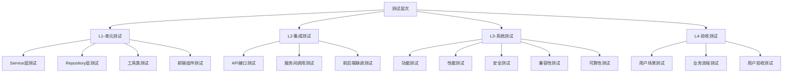

# 智能手写数字识别系统测试计划书

**Intelligent Handwritten Digit Recognition System (IHDRS)**
**Software Test Plan**

---

**文档编号:** IHDRS-STP-2025-001
**版本:** 2.0.0
**日期:** 2025-12-02
**编写人:** 刘家乐

---

## **修订历史**

| 版本号 | 修订日期   | 修订人 | 修订内容     |
| ------ | ---------- | ------ | ------------ |
| 1.0.0  | 2025-11-22 | 刘家乐 | 初稿         |
| 2.0.0  | 2025-12-02 | 刘家乐 | 修改测试用例 |

---

## **目录**

[TOC]

---

## **1.引言**

### **1.1 编写目的**

本文档是智能手写数字识别系统（IHDRS）的测试计划书，旨在描述系统测试的范围、策略、方法、资源、进度和交付物，为测试活动提供指导和规范。

**本文档面向以下读者：**

| 读者角色     | 使用目的                   |
| ------------ | -------------------------- |
| 测试工程师   | 作为测试设计、执行的依据   |
| 开发工程师   | 了解测试范围，配合测试活动 |
| 项目管理人员 | 监控测试进度，评估质量状态 |
| 质量保证人员 | 评审测试过程，确保质量标准 |

### **1.2 项目背景**

**项目名称：** 智能手写数字识别系统（Intelligent Handwritten Digit Recognition System, IHDRS）

**系统组成：**

| 子系统   | 技术栈                      | 主要功能                     |
| -------- | --------------------------- | ---------------------------- |
| 后端服务 | Spring Boot 3.5.6 + JDK 17  | 业务逻辑处理、数据持久化     |
| 模型服务 | Python Flask + TensorFlow   | 深度学习模型训练与推理       |
| 管理端   | Vue 3 + Vite + Element Plus | 系统管理、模型管理、数据分析 |
| 用户端   | React Native                | 手写识别、历史查询、反馈提交 |

### **1.3 术语定义**

| 术语       | 定义                                          |
| ---------- | --------------------------------------------- |
| 测试用例   | 描述测试输入、执行条件和预期结果的文档        |
| 测试套件   | 一组相关测试用例的集合                        |
| 冒烟测试   | 验证系统核心功能是否可用的快速测试            |
| 回归测试   | 验证修改后的系统是否引入新缺陷的测试          |
| 边界值分析 | 使用边界值作为测试数据的测试技术              |
| 等价类划分 | 将输入数据划分为等价类进行测试的技术          |
| 置信度     | 模型对识别结果正确性的确信程度，取值范围为0-1 |
| 活跃模型   | 当前系统用于识别服务的模型                    |

### **1.4 参考资料**

| 序号 | 文档名称                           | 文档编号           |
| ---- | ---------------------------------- | ------------------ |
| 1    | 智能手写数字识别系统需求规格说明书 | IHDRS-SRS-2025-001 |
| 2    | 智能手写数字识别系统概要设计说明书 | IHDRS-HLD-2025-001 |
| 3    | 智能手写数字识别系统详细设计说明书 | IHDRS-DDS-2025-001 |
| 4    | 智能手写数字识别系统项目计划书     | IHDRS-PP-2025-001  |

---

## **2.测试概述**

### **2.1 测试目标**

| 目标编号 | 目标描述                             | 优先级 |
| -------- | ------------------------------------ | ------ |
| TO-001   | 验证所有P0/P1功能需求正确实现        | 高     |
| TO-002   | 验证识别准确率达到90%以上            | 高     |
| TO-003   | 验证系统性能满足响应时间≤2秒要求     | 高     |
| TO-004   | 验证系统在100并发用户下稳定运行      | 高     |
| TO-005   | 验证系统安全性，无高危安全漏洞       | 高     |
| TO-006   | 验证前后端接口符合设计规范           | 中     |
| TO-007   | 验证用户界面符合设计原型和可用性要求 | 中     |
| TO-008   | 验证系统在不同平台/浏览器的兼容性    | 中     |

### **2.2 测试范围**

#### **2.2.1 测试范围内**

| 子系统   | 测试内容                                                     |
| -------- | ------------------------------------------------------------ |
| 后端服务 | 认证服务、用户服务、识别服务、模型服务、训练服务、数据集服务、反馈服务、统计服务、导出服务 |
| 模型服务 | 识别推理API、训练API、模型管理API                            |
| 管理端   | 仪表板、用户管理、模型管理、训练管理、数据集管理、识别历史、反馈管理、统计分析 |
| 用户端   | 用户认证、手写识别、历史记录、反馈提交、个人中心             |
| 数据库   | 数据完整性、数据一致性、索引性能                             |
| 接口     | 全部REST API接口                                             |

#### **2.2.2 测试范围外**

| 排除项                 | 原因             |
| ---------------------- | ---------------- |
| 第三方服务（如云存储） | 不在本期实现范围 |
| 分布式部署测试         | 不在本期实现范围 |
| 灾难恢复测试           | 资源限制         |
| 国际化/本地化测试      | 不在本期实现范围 |

### **2.3 测试类型**

| 测试类型   | 描述                         | 执行阶段 |
| ---------- | ---------------------------- | -------- |
| 单元测试   | 验证代码模块的正确性         | 开发阶段 |
| 集成测试   | 验证模块间接口和交互的正确性 | 开发阶段 |
| 系统测试   | 验证系统整体功能和非功能需求 | 测试阶段 |
| 接口测试   | 验证REST API接口的正确性     | 测试阶段 |
| 性能测试   | 验证系统响应时间和吞吐量     | 测试阶段 |
| 安全测试   | 验证系统安全机制和漏洞       | 测试阶段 |
| 兼容性测试 | 验证不同平台/浏览器的兼容性  | 测试阶段 |
| 验收测试   | 验证系统满足用户需求         | 验收阶段 |
| 回归测试   | 验证修复后不引入新问题       | 持续进行 |

---

## **3. 测试策略**

### **3.1 测试层次**



### **3.2 测试方法**

#### **3.2.1 黑盒测试方法**

| 方法名称     | 适用场景         | 应用范围           |
| ------------ | ---------------- | ------------------ |
| 等价类划分   | 输入域较大的功能 | 表单输入、参数验证 |
| 边界值分析   | 有数值边界的功能 | 分页、限制值       |
| 决策表测试   | 多条件组合的功能 | 业务规则验证       |
| 状态转换测试 | 有状态流转的功能 | 任务状态、模型状态 |
| 场景测试     | 业务流程测试     | 端到端流程         |

#### **3.2.2 白盒测试方法**

| 方法名称 | 适用场景     | 应用范围     |
| -------- | ------------ | ------------ |
| 语句覆盖 | 基本代码执行 | 单元测试     |
| 分支覆盖 | 条件判断逻辑 | 单元测试     |
| 路径覆盖 | 复杂逻辑流程 | 关键业务逻辑 |

### **3.3 测试优先级策略**

| 优先级 | 定义         | 测试深度 | 覆盖要求 |
| ------ | ------------ | -------- | -------- |
| P0     | 核心必须功能 | 全面测试 | 100%     |
| P1     | 重要增强功能 | 详细测试 | ≥90%     |
| P2     | 改进优化功能 | 基本测试 | ≥80%     |
| P3     | 未来扩展功能 | 简单验证 | 按需     |

### **3.4 缺陷管理策略**

#### **3.4.1 缺陷严重程度定义**

| 级别 | 定义                         | 示例                       |
| ---- | ---------------------------- | -------------------------- |
| 致命 | 系统崩溃或核心功能完全不可用 | 系统无法启动、识别服务宕机 |
| 严重 | 主要功能无法使用，无替代方案 | 登录失败、训练任务无法创建 |
| 一般 | 功能部分受影响，有替代方案   | 导出格式错误、UI显示异常   |
| 轻微 | 不影响功能使用，体验问题     | 文案错误、布局微调         |
| 建议 | 改进建议，非缺陷             | 交互优化建议               |

#### **3.4.2 缺陷处理优先级**

| 优先级 | 处理时限     | 适用缺陷   |
| ------ | ------------ | ---------- |
| 紧急   | 4小时内修复  | 致命级缺陷 |
| 高     | 24小时内修复 | 严重级缺陷 |
| 中     | 3天内修复    | 一般级缺陷 |
| 低     | 版本内修复   | 轻微级缺陷 |

---

## **4. 测试环境**

### **4.1 硬件环境**

#### **4.1.1 测试服务器**

| 配置项 | 规格要求   | 数量 | 用途       |
| ------ | ---------- | ---- | ---------- |
| CPU    | 8核及以上  | 1台  | 应用服务器 |
| 内存   | 16GB及以上 | 1台  | 应用服务器 |
| 存储   | 200GB SSD  | 1台  | 应用服务器 |
| 网络   | 1Gbps      | -    | 网络连接   |

#### **4.1.2 测试终端**

| 设备类型    | 规格要求               | 数量 | 用途       |
| ----------- | ---------------------- | ---- | ---------- |
| PC          | Windows 10/11, 8GB RAM | 6台  | 管理端测试 |
| Android手机 | Android 10.0+, 4GB RAM | 6台  | 用户端测试 |

### **4.2 软件环境**

#### **4.2.1 服务器软件**

| 软件名称       | 版本要求 | 用途         |
| -------------- | -------- | ------------ |
| Windows        | 11       | 操作系统     |
| JDK            | 17+      | Java运行环境 |
| Python         | 3.8+     | AI模型服务   |
| MySQL          | 8.0+     | 数据库       |
| Redis          | 7.0+     | 缓存         |
| Docker         | 20.10+   | 容器运行时   |
| Docker Compose | 2.0+     | 容器编排     |
| Nginx          | 1.20+    | 反向代理     |

#### **4.2.2 测试工具**

| 工具名称  | 版本  | 用途           |
| --------- | ----- | -------------- |
| JUnit 5   | 5.9+  | Java单元测试   |
| Mockito   | 5.0+  | Mock框架       |
| pytest    | 7.0+  | Python单元测试 |
| Postman   | 10.0+ | API接口测试    |
| JMeter    | 5.5+  | 性能测试       |
| Selenium  | 4.0+  | UI自动化测试   |
| OWASP ZAP | 2.12+ | 安全测试       |
| SonarQube | 9.0+  | 代码质量分析   |
| Jacoco    | 0.8+  | 代码覆盖率     |

#### **4.2.3 浏览器环境**

| 浏览器名称 | 最低版本 | 测试优先级 |
| ---------- | -------- | ---------- |
| Chrome     | 90+      | 高         |
| Firefox    | 88+      | 中         |
| Safari     | 14+      | 中         |
| Edge       | 90+      | 高         |

### **4.3 测试数据**

#### **4.3.1 测试账号**

| 账号类型     | 用户名       | 角色  | 用途           |
| ------------ | ------------ | ----- | -------------- |
| 管理员账号   | admin        | ADMIN | 管理端功能测试 |
| 普通用户账号 | testuser1    | USER  | 用户端功能测试 |
| 普通用户账号 | testuser2    | USER  | 并发/权限测试  |
| 被禁用账号   | disableduser | USER  | 状态验证测试   |

#### **4.3.2 测试数据集**

| 数据集名称        | 样本数量 | 类别数 | 用途           |
| ----------------- | -------- | ------ | -------------- |
| MNIST-Test-Small  | 1,000    | 10     | 快速功能测试   |
| MNIST-Test-Medium | 10,000   | 10     | 常规测试       |
| MNIST-Test-Full   | 60,000   | 10     | 完整训练测试   |
| Custom-Dataset    | 500      | 10     | 数据集上传测试 |

---

## **5. 功能测试设计**

### **5.1 用户端功能测试**

#### **5.1.1 用户认证模块测试 (TC-AUTH)**

##### **TC-AUTH-001 用户注册-正常流程**

| 测试项     | 内容                                                         |
| ---------- | ------------------------------------------------------------ |
| 测试用例ID | TC-AUTH-001                                                  |
| 测试功能   | 用户注册                                                     |
| 需求追溯   | FR-U001                                                      |
| 优先级     | P0                                                           |
| 前置条件   | 1.系统正常运行<br>2.测试用户名未被注册                       |
| 测试步骤   | 1.打开注册页面<br>2. 输入用户名：newuser001<br>3. 输入密码：Test@123<br>4.输入确认密码：Test@123<br>5.输入邮箱：newuser@test.com<br>6.点击注册按钮 |
| 测试数据   | 用户名：newuser001<br>密码：Test@123<br>邮箱：newuser@test.com |
| 预期结果   | 1.注册成功<br>2.提示"注册成功"<br>3.跳转至登录页面           |
| 实际结果   | 【待填写】                                                   |
| 测试状态   | 【待执行】                                                   |

##### **TC-AUTH-002 用户注册-用户名已存在**

| 测试项     | 内容                                                         |
| ---------- | ------------------------------------------------------------ |
| 测试用例ID | TC-AUTH-002                                                  |
| 测试功能   | 用户注册                                                     |
| 需求追溯   | FR-U001                                                      |
| 优先级     | P0                                                           |
| 前置条件   | 1.系统正常运行<br>2.用户名admin已存在                        |
| 测试步骤   | 1.打开注册页面<br>2.输入用户名：admin<br>3.输入密码：Test@123<br>4.点击注册按钮 |
| 测试数据   | 用户名：admin                                                |
| 预期结果   | 1.注册失败<br>2.提示"用户名已存在"<br>3.错误码1001           |
| 实际结果   | 【待填写】                                                   |
| 测试状态   | 【待执行】                                                   |

##### **TC-AUTH-003 用户注册-用户名长度边界值**

| 测试项     | 内容                  |
| ---------- | --------------------- |
| 测试用例ID | TC-AUTH-003           |
| 测试功能   | 用户注册-用户名边界值 |
| 需求追溯   | FR-U001               |
| 优先级     | P1                    |
| 前置条件   | 系统正常运行          |
| 测试数据   | 见下表                |

| 子用例 | 用户名长度 | 测试数据                                         | 预期结果               |
| ------ | ---------- | ------------------------------------------------ | ---------------------- |
| 003-1  | 3字符      | usr                                              | 注册失败，提示长度不足 |
| 003-2  | 4字符      | user                                             | 注册成功               |
| 003-3  | 50字符     | user_xxxxxxxxxxxxxxxxxxxxxxxxxxxxxxxxxxxxxxxxxx  | 注册成功               |
| 003-4  | 51字符     | user_xxxxxxxxxxxxxxxxxxxxxxxxxxxxxxxxxxxxxxxxxxx | 注册失败，提示长度超限 |

##### **TC-AUTH-004 用户注册-密码强度验证**

| 测试项     | 内容              |
| ---------- | ----------------- |
| 测试用例ID | TC-AUTH-004       |
| 测试功能   | 用户注册-密码强度 |
| 需求追溯   | FR-U001           |
| 优先级     | P1                |
| 前置条件   | 系统正常运行      |

| 子用例 | 密码                            | 预期结果                  |
| ------ | ------------------------------- | ------------------------- |
| 004-1  | 12345                           | 注册失败，密码长度不足6位 |
| 004-2  | 123456                          | 注册成功                  |
| 004-3  | 12345678901234567890（20字符）  | 注册成功                  |
| 004-4  | 123456789012345678901（21字符） | 注册失败，密码超长        |

##### **TC-AUTH-005 用户登录-正常流程**

| 测试项     | 内容                                                         |
| ---------- | ------------------------------------------------------------ |
| 测试用例ID | TC-AUTH-005                                                  |
| 测试功能   | 用户登录                                                     |
| 需求追溯   | FR-U002                                                      |
| 优先级     | P0                                                           |
| 前置条件   | 1.系统正常运行<br>2.测试账号已注册                           |
| 测试步骤   | 1.打开登录页面<br>2.输入用户名：testuser1<br>3.输入密码：Test@123<br>4.点击登录按钮 |
| 测试数据   | 用户名：testuser1<br>密码：Test@123                          |
| 预期结果   | 1.登录成功<br>2.返回JWT Token<br>3.跳转至主页面              |
| 实际结果   | 【待填写】                                                   |
| 测试状态   | 【待执行】                                                   |

##### **TC-AUTH-006 用户登录-密码错误**

| 测试项     | 内容                                                 |
| ---------- | ---------------------------------------------------- |
| 测试用例ID | TC-AUTH-006                                          |
| 测试功能   | 用户登录-密码错误                                    |
| 需求追溯   | FR-U002                                              |
| 优先级     | P0                                                   |
| 前置条件   | 系统正常运行，测试账号已注册                         |
| 测试步骤   | 1.输入正确用户名<br>2.输入错误密码<br>3.点击登录     |
| 测试数据   | 用户名：testuser1<br>密码：wrongpassword             |
| 预期结果   | 1.登录失败<br>2.提示"用户名或密码错误"<br>3.HTTP 401 |
| 实际结果   | 【待填写】                                           |
| 测试状态   | 【待执行】                                           |

##### **TC-AUTH-007 用户登录-账户被禁用**

| 测试项     | 内容                                             |
| ---------- | ------------------------------------------------ |
| 测试用例ID | TC-AUTH-007                                      |
| 测试功能   | 用户登录-账户状态验证                            |
| 需求追溯   | FR-U002                                          |
| 优先级     | P1                                               |
| 前置条件   | 账户disableduser状态为DISABLED                   |
| 测试步骤   | 使用被禁用账户尝试登录                           |
| 预期结果   | 1.登录失败<br>2.提示"账户已被禁用"<br>3.HTTP 403 |

##### **TC-AUTH-008 Token验证-有效Token**

| 测试项     | 内容                          |
| ---------- | ----------------------------- |
| 测试用例ID | TC-AUTH-008                   |
| 测试功能   | Token验证                     |
| 需求追溯   | FR-U003                       |
| 优先级     | P0                            |
| 前置条件   | 用户已登录，持有有效Token     |
| 测试步骤   | 调用需认证接口，携带有效Token |
| 预期结果   | 1.请求成功<br>2.返回正确数据  |

##### **TC-AUTH-009 Token验证-过期Token**

| 测试项     | 内容                                          |
| ---------- | --------------------------------------------- |
| 测试用例ID | TC-AUTH-009                                   |
| 测试功能   | Token验证-过期处理                            |
| 需求追溯   | FR-U003                                       |
| 优先级     | P0                                            |
| 前置条件   | 持有已过期的Token                             |
| 测试步骤   | 调用需认证接口，携带过期Token                 |
| 预期结果   | 1.请求失败<br>2.HTTP 401<br>3.提示Token已过期 |

#### **5.1.2 手写识别模块测试 (TC-REC)**

##### **TC-REC-001 画布手写识别-正常流程**

| 测试项     | 内容                                                         |
| ---------- | ------------------------------------------------------------ |
| 测试用例ID | TC-REC-001                                                   |
| 测试功能   | 实时手写识别                                                 |
| 需求追溯   | FR-U004                                                      |
| 优先级     | P0                                                           |
| 前置条件   | 1.用户已登录<br>2.系统有活跃模型                             |
| 测试步骤   | 1.进入手写识别页面<br>2. 在画布上书写数字5<br>3. 点击识别按钮 |
| 测试数据   | 手写数字5的图像                                              |
| 预期结果   | 1.识别成功<br>2.返回结果为"5"<br>3.置信度≥0.8<br>4.响应时间≤500ms |
| 实际结果   | 【待填写】                                                   |
| 测试状态   | 【待执行】                                                   |

##### **TC-REC-002 画布手写识别-各数字识别**

| 测试项     | 内容                       |
| ---------- | -------------------------- |
| 测试用例ID | TC-REC-002                 |
| 测试功能   | 0-9各数字识别              |
| 需求追溯   | FR-U004                    |
| 优先级     | P0                         |
| 前置条件   | 用户已登录，系统有活跃模型 |

| 子用例 | 书写数字 | 预期识别结果 | 置信度要求 |
| ------ | -------- | ------------ | ---------- |
| 002-1  | 0        | 0            | ≥0.7       |
| 002-2  | 1        | 1            | ≥0.7       |
| 002-3  | 2        | 2            | ≥0.7       |
| 002-4  | 3        | 3            | ≥0.7       |
| 002-5  | 4        | 4            | ≥0.7       |
| 002-6  | 5        | 5            | ≥0.7       |
| 002-7  | 6        | 6            | ≥0.7       |
| 002-8  | 7        | 7            | ≥0.7       |
| 002-9  | 8        | 8            | ≥0.7       |
| 002-10 | 9        | 9            | ≥0.7       |

##### **TC-REC-003 画布手写识别-空白画布**

| 测试项     | 内容                                                      |
| ---------- | --------------------------------------------------------- |
| 测试用例ID | TC-REC-003                                                |
| 测试功能   | 空白画布处理                                              |
| 需求追溯   | FR-U004                                                   |
| 优先级     | P1                                                        |
| 前置条件   | 用户已登录                                                |
| 测试步骤   | 1.进入手写识别页面<br>2. 不在画布上书写<br>3.点击识别按钮 |
| 预期结果   | 1.提示"请先书写数字"<br>2.不发送识别请求                  |

##### **TC-REC-004 画布手写识别-清除功能**

| 测试项     | 内容                             |
| ---------- | -------------------------------- |
| 测试用例ID | TC-REC-004                       |
| 测试功能   | 画布清除功能                     |
| 需求追溯   | FR-U004                          |
| 优先级     | P1                               |
| 前置条件   | 用户已登录，画布上有书写内容     |
| 测试步骤   | 1.在画布上书写<br>2.点击清除按钮 |
| 预期结果   | 1.画布清空<br>2. 可重新书写      |

##### **TC-REC-005 图片上传识别-PNG格式**

| 测试项     | 内容                                                  |
| ---------- | ----------------------------------------------------- |
| 测试用例ID | TC-REC-005                                            |
| 测试功能   | 图片上传识别                                          |
| 需求追溯   | FR-U006                                               |
| 优先级     | P1                                                    |
| 前置条件   | 用户已登录，准备包含数字的PNG图片                     |
| 测试步骤   | 1.点击上传图片<br>2.选择PNG格式图片<br>3.等待识别结果 |
| 测试数据   | test_digit_5.png (包含数字5的图片)                    |
| 预期结果   | 1.上传成功<br>2.识别结果正确<br>3. 返回置信度         |

##### **TC-REC-006 图片上传识别-JPG格式**

| 测试项     | 内容                 |
| ---------- | -------------------- |
| 测试用例ID | TC-REC-006           |
| 测试功能   | 图片上传识别-JPG格式 |
| 需求追溯   | FR-U006              |
| 优先级     | P1                   |
| 测试数据   | test_digit_8.jpg     |
| 预期结果   | 识别成功，结果正确   |

##### **TC-REC-007 图片上传识别-不支持的格式**

| 测试项     | 内容                                                   |
| ---------- | ------------------------------------------------------ |
| 测试用例ID | TC-REC-007                                             |
| 测试功能   | 图片格式验证                                           |
| 需求追溯   | FR-U006                                                |
| 优先级     | P1                                                     |
| 测试数据   | test_image.gif, test_image.bmp                         |
| 预期结果   | 1.上传失败<br>2.提示"不支持的图片格式"<br>3.错误码2004 |

##### **TC-REC-008 图片上传识别-文件大小超限**

| 测试项     | 内容                                                      |
| ---------- | --------------------------------------------------------- |
| 测试用例ID | TC-REC-008                                                |
| 测试功能   | 图片大小验证                                              |
| 需求追溯   | FR-U006                                                   |
| 优先级     | P1                                                        |
| 测试数据   | large_image.png (6MB)                                     |
| 预期结果   | 1.上传失败<br>2.提示"图片大小不能超过5MB"<br>3.错误码2005 |

##### **TC-REC-009 连续数字识别**

| 测试项     | 内容                                                      |
| ---------- | --------------------------------------------------------- |
| 测试用例ID | TC-REC-009                                                |
| 测试功能   | 连续数字识别                                              |
| 需求追溯   | FR-U005                                                   |
| 优先级     | P2                                                        |
| 测试数据   | 包含"12345"的图片                                         |
| 预期结果   | 1.识别成功<br>2.返回数字序列"12345"<br>3.返回各数字置信度 |

##### **TC-REC-010 模型服务不可用处理**

| 测试项     | 内容                                        |
| ---------- | ------------------------------------------- |
| 测试用例ID | TC-REC-010                                  |
| 测试功能   | 异常处理-模型服务不可用                     |
| 需求追溯   | FR-U004                                     |
| 优先级     | P1                                          |
| 前置条件   | 模型服务（Flask）停止运行                   |
| 测试步骤   | 尝试进行识别操作                            |
| 预期结果   | 1. 提示"模型服务暂时不可用"<br>2.错误码2001 |

#### **5.1.3 历史记录模块测试 (TC-HIST)**

##### **TC-HIST-001 历史记录查询-正常流程**

| 测试项     | 内容                                                       |
| ---------- | ---------------------------------------------------------- |
| 测试用例ID | TC-HIST-001                                                |
| 测试功能   | 历史记录查询                                               |
| 需求追溯   | FR-U007                                                    |
| 优先级     | P1                                                         |
| 前置条件   | 用户已登录，存在历史识别记录                               |
| 测试步骤   | 1.进入历史记录页面<br>2.查看记录列表                       |
| 预期结果   | 1.显示用户的识别记录<br>2.包含图像预览、结果、置信度、时间 |

##### **TC-HIST-002 历史记录查询-分页功能**

| 测试项     | 内容                                           |
| ---------- | ---------------------------------------------- |
| 测试用例ID | TC-HIST-002                                    |
| 测试功能   | 历史记录分页                                   |
| 需求追溯   | FR-U007                                        |
| 优先级     | P1                                             |
| 前置条件   | 用户有超过10条识别记录                         |
| 测试步骤   | 1.查看第1页（10条）<br>2. 点击第2页            |
| 预期结果   | 1.每页显示10条<br>2.翻页正常<br>3.显示总记录数 |

##### **TC-HIST-003 历史记录查询-时间筛选**

| 测试项     | 内容                                           |
| ---------- | ---------------------------------------------- |
| 测试用例ID | TC-HIST-003                                    |
| 测试功能   | 历史记录时间筛选                               |
| 需求追溯   | FR-U007                                        |
| 优先级     | P1                                             |
| 测试步骤   | 1.设置开始日期<br>2.设置结束日期<br>3.点击查询 |
| 预期结果   | 只显示指定时间范围内的记录                     |

##### **TC-HIST-004 历史记录删除-单条删除**

| 测试项     | 内容                                       |
| ---------- | ------------------------------------------ |
| 测试用例ID | TC-HIST-004                                |
| 测试功能   | 历史记录删除                               |
| 需求追溯   | FR-U008                                    |
| 优先级     | P1                                         |
| 前置条件   | 存在可删除的记录                           |
| 测试步骤   | 1.选择一条记录<br>2.点击删除<br>3.确认删除 |
| 预期结果   | 1.记录从列表中移除<br>2.提示"删除成功"     |

##### **TC-HIST-005 历史记录删除-权限验证**

| 测试项     | 内容                                       |
| ---------- | ------------------------------------------ |
| 测试用例ID | TC-HIST-005                                |
| 测试功能   | 删除权限验证                               |
| 需求追溯   | FR-U008                                    |
| 优先级     | P1                                         |
| 测试步骤   | 尝试删除其他用户的记录（通过API）          |
| 预期结果   | 1.删除失败<br>2.HTTP 403<br>3.提示"无权限" |

#### **5.1.4 反馈提交模块测试 (TC-FB)**

##### **TC-FB-001 错误反馈提交-正常流程**

| 测试项     | 内容                                                         |
| ---------- | ------------------------------------------------------------ |
| 测试用例ID | TC-FB-001                                                    |
| 测试功能   | 错误反馈提交                                                 |
| 需求追溯   | FR-U009                                                      |
| 优先级     | P1                                                           |
| 前置条件   | 用户已登录，存在识别记录                                     |
| 测试步骤   | 1.选择一条识别记录<br>2.点击"反馈错误"<br>3.输入正确结果<br>4.提交反馈 |
| 测试数据   | 记录ID：1001，正确结果：6                                    |
| 预期结果   | 1.反馈提交成功<br>2.提示"反馈已提交"                         |

##### **TC-FB-002 错误反馈提交-正确结果验证**

| 测试项     | 内容                                  |
| ---------- | ------------------------------------- |
| 测试用例ID | TC-FB-002                             |
| 测试功能   | 反馈内容验证                          |
| 需求追溯   | FR-U009                               |
| 优先级     | P1                                    |
| 测试数据   | 正确结果输入非数字字符                |
| 预期结果   | 1.提交失败<br>2.提示"请输入0-9的数字" |

##### **TC-FB-003 反馈记录查询**

| 测试项     | 内容                             |
| ---------- | -------------------------------- |
| 测试用例ID | TC-FB-003                        |
| 测试功能   | 反馈记录查询                     |
| 需求追溯   | FR-U010                          |
| 优先级     | P1                               |
| 前置条件   | 用户已提交反馈                   |
| 测试步骤   | 进入我的反馈页面                 |
| 预期结果   | 显示用户提交的反馈列表，包含状态 |

#### **5.1.5 个人中心模块测试 (TC-PROFILE)**

##### **TC-PROFILE-001 个人信息查看**

| 测试项     | 内容                                     |
| ---------- | ---------------------------------------- |
| 测试用例ID | TC-PROFILE-001                           |
| 测试功能   | 个人信息查看                             |
| 需求追溯   | FR-U011                                  |
| 优先级     | P1                                       |
| 前置条件   | 用户已登录                               |
| 测试步骤   | 进入个人中心页面                         |
| 预期结果   | 显示用户名、邮箱、注册时间、识别次数统计 |

##### **TC-PROFILE-002 个人信息修改-邮箱**

| 测试项     | 内容                                         |
| ---------- | -------------------------------------------- |
| 测试用例ID | TC-PROFILE-002                               |
| 测试功能   | 修改邮箱                                     |
| 需求追溯   | FR-U012                                      |
| 优先级     | P1                                           |
| 测试步骤   | 1.进入信息修改页面<br>2. 修改邮箱<br>3. 保存 |
| 测试数据   | 新邮箱：newemail@test.com                    |
| 预期结果   | 1.修改成功<br>2.邮箱更新为新值               |

##### **TC-PROFILE-003 密码修改-正常流程**

| 测试项     | 内容                                                   |
| ---------- | ------------------------------------------------------ |
| 测试用例ID | TC-PROFILE-003                                         |
| 测试功能   | 密码修改                                               |
| 需求追溯   | FR-U013                                                |
| 优先级     | P1                                                     |
| 测试步骤   | 1.输入原密码<br>2.输入新密码<br>3.确认新密码<br>4.提交 |
| 预期结果   | 1.修改成功<br>2.需重新登录                             |

##### **TC-PROFILE-004 密码修改-原密码错误**

| 测试项     | 内容                             |
| ---------- | -------------------------------- |
| 测试用例ID | TC-PROFILE-004                   |
| 测试功能   | 密码修改-验证原密码              |
| 需求追溯   | FR-U013                          |
| 优先级     | P1                               |
| 测试数据   | 输入错误的原密码                 |
| 预期结果   | 1.修改失败<br>2.提示"原密码错误" |

### **5.2 管理端功能测试**

#### **5.2.1 仪表板模块测试 (TC-DASH)**

##### **TC-DASH-001 数据概览显示**

| 测试项     | 内容                                               |
| ---------- | -------------------------------------------------- |
| 测试用例ID | TC-DASH-001                                        |
| 测试功能   | 数据概览                                           |
| 需求追溯   | FR-M001                                            |
| 优先级     | P0                                                 |
| 前置条件   | 管理员已登录                                       |
| 测试步骤   | 进入仪表板页面                                     |
| 预期结果   | 显示总识别次数、注册用户数、训练模型数、今日识别量 |

##### **TC-DASH-002 识别趋势图**

| 测试项     | 内容                                                     |
| ---------- | -------------------------------------------------------- |
| 测试用例ID | TC-DASH-002                                              |
| 测试功能   | 识别趋势图                                               |
| 需求追溯   | FR-M002                                                  |
| 优先级     | P1                                                       |
| 测试步骤   | 1.查看默认7天趋势图<br>2. 切换至30天<br>3.自定义时间范围 |
| 预期结果   | 正确显示各时间范围的识别量趋势折线图                     |

##### **TC-DASH-003 数字分布图**

| 测试项     | 内容                            |
| ---------- | ------------------------------- |
| 测试用例ID | TC-DASH-003                     |
| 测试功能   | 数字分布图                      |
| 需求追溯   | FR-M003                         |
| 优先级     | P1                              |
| 预期结果   | 正确显示0-9各数字的识别比例饼图 |

#### **5.2.2 用户管理模块测试 (TC-USER)**

##### **TC-USER-001 用户列表查询**

| 测试项     | 内容                                                     |
| ---------- | -------------------------------------------------------- |
| 测试用例ID | TC-USER-001                                              |
| 测试功能   | 用户列表管理                                             |
| 需求追溯   | FR-M004                                                  |
| 优先级     | P0                                                       |
| 前置条件   | 管理员已登录                                             |
| 测试步骤   | 进入用户管理页面                                         |
| 预期结果   | 显示用户列表，包含ID、用户名、邮箱、角色、状态、注册时间 |

##### **TC-USER-002 用户列表搜索**

| 测试项     | 内容                             |
| ---------- | -------------------------------- |
| 测试用例ID | TC-USER-002                      |
| 测试功能   | 用户搜索                         |
| 需求追溯   | FR-M004                          |
| 优先级     | P1                               |
| 测试步骤   | 1.输入用户名关键词<br>2.点击搜索 |
| 预期结果   | 显示匹配的用户                   |

##### **TC-USER-003 用户角色修改**

| 测试项     | 内容                                                      |
| ---------- | --------------------------------------------------------- |
| 测试用例ID | TC-USER-003                                               |
| 测试功能   | 用户角色管理                                              |
| 需求追溯   | FR-M005                                                   |
| 优先级     | P0                                                        |
| 测试步骤   | 1.选择普通用户<br>2.点击修改角色<br>3.选择ADMIN<br>4.确认 |
| 预期结果   | 1.角色修改成功<br>2. 用户角色更新为ADMIN                  |

##### **TC-USER-004 禁止修改自己的角色**

| 测试项     | 内容                                     |
| ---------- | ---------------------------------------- |
| 测试用例ID | TC-USER-004                              |
| 测试功能   | 角色修改限制                             |
| 需求追溯   | FR-M005                                  |
| 优先级     | P1                                       |
| 测试步骤   | 管理员尝试修改自己的角色                 |
| 预期结果   | 1.操作失败<br>2.提示"不能修改自己的角色" |

##### **TC-USER-005 用户状态禁用**

| 测试项     | 内容                                       |
| ---------- | ------------------------------------------ |
| 测试用例ID | TC-USER-005                                |
| 测试功能   | 用户状态管理                               |
| 需求追溯   | FR-M006                                    |
| 优先级     | P0                                         |
| 测试步骤   | 1.选择普通用户<br>2.点击禁用<br>3.确认     |
| 预期结果   | 1.用户状态变为DISABLED<br>2.该用户无法登录 |

#### **5.2.3 模型管理模块测试 (TC-MODEL)**

##### **TC-MODEL-001 模型列表查询**

| 测试项     | 内容                                             |
| ---------- | ------------------------------------------------ |
| 测试用例ID | TC-MODEL-001                                     |
| 测试功能   | 模型列表管理                                     |
| 需求追溯   | FR-M007                                          |
| 优先级     | P0                                               |
| 前置条件   | 管理员已登录，系统存在模型                       |
| 测试步骤   | 进入模型管理页面                                 |
| 预期结果   | 显示模型列表，包含名称、版本、类型、准确率、状态 |

##### **TC-MODEL-002 模型详情查看**

| 测试项     | 内容                                       |
| ---------- | ------------------------------------------ |
| 测试用例ID | TC-MODEL-002                               |
| 测试功能   | 模型详情查看                               |
| 需求追溯   | FR-M008                                    |
| 优先级     | P1                                         |
| 测试步骤   | 点击模型详情按钮                           |
| 预期结果   | 显示基本信息、训练配置、性能指标、混淆矩阵 |

##### **TC-MODEL-003 模型激活**

| 测试项     | 内容                                                         |
| ---------- | ------------------------------------------------------------ |
| 测试用例ID | TC-MODEL-003                                                 |
| 测试功能   | 模型激活                                                     |
| 需求追溯   | FR-M009                                                      |
| 优先级     | P0                                                           |
| 前置条件   | 存在状态为COMPLETED的模型                                    |
| 测试步骤   | 1.选择已完成模型<br>2.点击激活<br>3.确认                     |
| 预期结果   | 1.模型状态变为ACTIVE<br>2. 原活跃模型变为DISABLED<br>3.识别服务使用新模型 |

##### **TC-MODEL-004 模型激活-同时只能有一个活跃模型**

| 测试项     | 内容                         |
| ---------- | ---------------------------- |
| 测试用例ID | TC-MODEL-004                 |
| 测试功能   | 活跃模型唯一性               |
| 需求追溯   | FR-M009                      |
| 优先级     | P0                           |
| 测试步骤   | 激活新模型后查询所有模型状态 |
| 预期结果   | 只有一个模型状态为ACTIVE     |

##### **TC-MODEL-005 模型删除**

| 测试项     | 内容                                         |
| ---------- | -------------------------------------------- |
| 测试用例ID | TC-MODEL-005                                 |
| 测试功能   | 模型删除                                     |
| 需求追溯   | FR-M011                                      |
| 优先级     | P1                                           |
| 前置条件   | 存在非活跃状态的模型                         |
| 测试步骤   | 1.选择非活跃模型<br>2. 点击删除<br>3. 确认   |
| 预期结果   | 1.模型从列表中移除<br>2.模型文件从服务器删除 |

##### **TC-MODEL-006 活跃模型禁止删除**

| 测试项     | 内容                                    |
| ---------- | --------------------------------------- |
| 测试用例ID | TC-MODEL-006                            |
| 测试功能   | 删除限制                                |
| 需求追溯   | FR-M011                                 |
| 优先级     | P1                                      |
| 测试步骤   | 尝试删除活跃模型                        |
| 预期结果   | 1. 删除失败<br>2.提示"活跃模型不能删除" |

#### **5.2.4 训练任务模块测试 (TC-TRAIN)**

##### **TC-TRAIN-001 创建训练任务-正常流程**

| 测试项     | 内容                                                         |
| ---------- | ------------------------------------------------------------ |
| 测试用例ID | TC-TRAIN-001                                                 |
| 测试功能   | 创建训练任务                                                 |
| 需求追溯   | FR-M013                                                      |
| 优先级     | P0                                                           |
| 前置条件   | 1.管理员已登录<br>2.存在可用数据集                           |
| 测试步骤   | 1. 点击创建训练任务<br>2.输入任务名称<br>3. 选择数据集<br>4.选择模型类型CNN<br>5. 配置训练参数<br>6. 提交 |
| 测试数据   | 任务名称：Test-CNN-001<br>模型类型：CNN<br>Epochs：10<br>BatchSize：32 |
| 预期结果   | 1.任务创建成功<br>2. 状态变为PENDING，随后变为RUNNING        |

##### **TC-TRAIN-002 训练任务列表**

| 测试项     | 内容                                         |
| ---------- | -------------------------------------------- |
| 测试用例ID | TC-TRAIN-002                                 |
| 测试功能   | 训练任务列表                                 |
| 需求追溯   | FR-M014                                      |
| 优先级     | P0                                           |
| 测试步骤   | 进入训练管理页面                             |
| 预期结果   | 显示任务列表，包含名称、状态、进度、创建时间 |

##### **TC-TRAIN-003 训练进度监控**

| 测试项     | 内容                                            |
| ---------- | ----------------------------------------------- |
| 测试用例ID | TC-TRAIN-003                                    |
| 测试功能   | 训练进度监控                                    |
| 需求追溯   | FR-M015                                         |
| 优先级     | P0                                              |
| 前置条件   | 存在运行中的训练任务                            |
| 测试步骤   | 查看运行中任务的详情                            |
| 预期结果   | 显示当前Epoch、进度百分比、当前损失、当前准确率 |

##### **TC-TRAIN-004 训练曲线可视化**

| 测试项     | 内容                         |
| ---------- | ---------------------------- |
| 测试用例ID | TC-TRAIN-004                 |
| 测试功能   | 训练曲线可视化               |
| 需求追溯   | FR-M016                      |
| 优先级     | P1                           |
| 前置条件   | 存在训练日志                 |
| 测试步骤   | 查看训练任务的曲线图表       |
| 预期结果   | 正确显示准确率曲线、损失曲线 |

##### **TC-TRAIN-005 混淆矩阵分析**

| 测试项     | 内容                                         |
| ---------- | -------------------------------------------- |
| 测试用例ID | TC-TRAIN-005                                 |
| 测试功能   | 混淆矩阵分析                                 |
| 需求追溯   | FR-M017                                      |
| 优先级     | P1                                           |
| 前置条件   | 训练任务已完成                               |
| 测试步骤   | 查看已完成任务的混淆矩阵                     |
| 预期结果   | 显示10x10混淆矩阵热力图，各类别精确率/召回率 |

##### **TC-TRAIN-006 取消训练任务**

| 测试项     | 内容                                       |
| ---------- | ------------------------------------------ |
| 测试用例ID | TC-TRAIN-006                               |
| 测试功能   | 取消训练任务                               |
| 需求追溯   | FR-M018                                    |
| 优先级     | P1                                         |
| 前置条件   | 存在运行中的训练任务                       |
| 测试步骤   | 1. 选择运行中任务<br>2.点击取消<br>3.确认  |
| 预期结果   | 1.任务状态变为CANCELLED<br>2. 训练进程终止 |

##### **TC-TRAIN-007 训练参数边界值测试**

| 测试项     | 内容         |
| ---------- | ------------ |
| 测试用例ID | TC-TRAIN-007 |
| 测试功能   | 训练参数验证 |
| 需求追溯   | FR-M013      |
| 优先级     | P1           |

| 子用例 | 参数         | 测试值  | 预期结果              |
| ------ | ------------ | ------- | --------------------- |
| 007-1  | batchSize    | 7       | 失败，提示最小值为8   |
| 007-2  | batchSize    | 8       | 成功                  |
| 007-3  | batchSize    | 256     | 成功                  |
| 007-4  | batchSize    | 257     | 失败，提示最大值为256 |
| 007-5  | epochs       | 0       | 失败，提示最小值为1   |
| 007-6  | epochs       | 1       | 成功                  |
| 007-7  | epochs       | 200     | 成功                  |
| 007-8  | epochs       | 201     | 失败，提示最大值为200 |
| 007-9  | learningRate | 0.00009 | 失败，提示最小值      |
| 007-10 | learningRate | 0.0001  | 成功                  |
| 007-11 | learningRate | 0.1     | 成功                  |
| 007-12 | learningRate | 0.11    | 失败，提示最大值      |

##### **TC-TRAIN-008 支持的模型类型测试**

| 测试项     | 内容           |
| ---------- | -------------- |
| 测试用例ID | TC-TRAIN-008   |
| 测试功能   | 多模型类型支持 |
| 需求追溯   | FR-M013        |
| 优先级     | P0             |

| 子用例 | 模型类型     | 预期结果 |
| ------ | ------------ | -------- |
| 008-1  | CNN          | 训练成功 |
| 008-2  | ADVANCED_CNN | 训练成功 |
| 008-3  | ResNet       | 训练成功 |
| 008-4  | VGG          | 训练成功 |
| 008-5  | MobileNet    | 训练成功 |

#### **5.2.5 数据集管理模块测试 (TC-DATASET)**

##### **TC-DATASET-001 数据集上传-正常流程**

| 测试项     | 内容                                                         |
| ---------- | ------------------------------------------------------------ |
| 测试用例ID | TC-DATASET-001                                               |
| 测试功能   | 数据集上传                                                   |
| 需求追溯   | FR-M019                                                      |
| 优先级     | P0                                                           |
| 前置条件   | 管理员已登录，准备符合格式的数据集                           |
| 测试步骤   | 1.点击上传数据集<br>2.选择ZIP文件<br>3.输入数据集名称<br>4.提交 |
| 测试数据   | mnist_subset.zip（符合目录结构要求）                         |
| 预期结果   | 1.上传成功<br>2.状态变为PROCESSING<br>3. 解析完成后状态变为AVAILABLE |

##### **TC-DATASET-002 数据集上传-目录结构验证**

| 测试项     | 内容                                                 |
| ---------- | ---------------------------------------------------- |
| 测试用例ID | TC-DATASET-002                                       |
| 测试功能   | 数据集格式验证                                       |
| 需求追溯   | FR-M019                                              |
| 优先级     | P1                                                   |
| 测试数据   | invalid_structure.zip（缺少train目录）               |
| 预期结果   | 1.上传失败<br>2.提示"数据集格式错误"<br>3.错误码3001 |

##### **TC-DATASET-003 数据集上传-文件大小限制**

| 测试项     | 内容                                          |
| ---------- | --------------------------------------------- |
| 测试用例ID | TC-DATASET-003                                |
| 测试功能   | 数据集大小验证                                |
| 需求追溯   | FR-M019                                       |
| 优先级     | P1                                            |
| 测试数据   | large_dataset.zip（600MB）                    |
| 预期结果   | 1.上传失败<br>2.提示"数据集大小不能超过500MB" |

##### **TC-DATASET-004 数据集列表查询**

| 测试项     | 内容                                           |
| ---------- | ---------------------------------------------- |
| 测试用例ID | TC-DATASET-004                                 |
| 测试功能   | 数据集列表管理                                 |
| 需求追溯   | FR-M020                                        |
| 优先级     | P0                                             |
| 测试步骤   | 进入数据集管理页面                             |
| 预期结果   | 显示数据集列表，包含名称、类别数、样本数、状态 |

##### **TC-DATASET-005 数据集详情查看**

| 测试项     | 内容                                               |
| ---------- | -------------------------------------------------- |
| 测试用例ID | TC-DATASET-005                                     |
| 测试功能   | 数据集详情                                         |
| 需求追溯   | FR-M021                                            |
| 优先级     | P1                                                 |
| 测试步骤   | 点击数据集详情                                     |
| 预期结果   | 显示类别列表、各类别样本数、图像尺寸信息、样本预览 |

##### **TC-DATASET-006 数据集删除**

| 测试项     | 内容                                        |
| ---------- | ------------------------------------------- |
| 测试用例ID | TC-DATASET-006                              |
| 测试功能   | 数据集删除                                  |
| 需求追溯   | FR-M022                                     |
| 优先级     | P1                                          |
| 前置条件   | 数据集未被训练任务使用                      |
| 测试步骤   | 1.选择数据集<br>2. 点击删除<br>3. 确认      |
| 预期结果   | 1.数据集从列表中移除<br>2. 文件从服务器删除 |

##### **TC-DATASET-007 被使用的数据集禁止删除**

| 测试项     | 内容                                              |
| ---------- | ------------------------------------------------- |
| 测试用例ID | TC-DATASET-007                                    |
| 测试功能   | 数据集删除限制                                    |
| 需求追溯   | FR-M022                                           |
| 优先级     | P1                                                |
| 前置条件   | 数据集已被训练任务使用                            |
| 测试步骤   | 尝试删除该数据集                                  |
| 预期结果   | 1. 删除失败<br>2.提示"数据集正在被使用，无法删除" |

#### **5.2.6 识别历史管理模块测试 (TC-ADMIN-HIST)**

##### **TC-ADMIN-HIST-001 识别历史查询**

| 测试项     | 内容                       |
| ---------- | -------------------------- |
| 测试用例ID | TC-ADMIN-HIST-001          |
| 测试功能   | 识别历史查询               |
| 需求追溯   | FR-M023                    |
| 优先级     | P1                         |
| 前置条件   | 管理员已登录               |
| 测试步骤   | 进入识别历史管理页面       |
| 预期结果   | 显示所有用户的识别记录列表 |

##### **TC-ADMIN-HIST-002 高级筛选功能**

| 测试项     | 内容              |
| ---------- | ----------------- |
| 测试用例ID | TC-ADMIN-HIST-002 |
| 测试功能   | 识别历史高级筛选  |
| 需求追溯   | FR-M023           |
| 优先级     | P1                |

| 子用例 | 筛选条件 | 预期结果                              |
| ------ | -------- | ------------------------------------- |
| 002-1  | 时间范围 | 只显示指定时间内的记录                |
| 002-2  | 用户ID   | 只显示指定用户的记录                  |
| 002-3  | 识别结果 | 只显示指定数字的记录                  |
| 002-4  | 输入方式 | 只显示指定方式（CANVAS/UPLOAD）的记录 |

##### **TC-ADMIN-HIST-003 数据导出-Excel格式**

| 测试项     | 内容                                            |
| ---------- | ----------------------------------------------- |
| 测试用例ID | TC-ADMIN-HIST-003                               |
| 测试功能   | 识别历史导出                                    |
| 需求追溯   | FR-M024                                         |
| 优先级     | P1                                              |
| 测试步骤   | 1.设置筛选条件<br>2.选择Excel格式<br>3.点击导出 |
| 预期结果   | 1.下载Excel文件<br>2.文件内容正确               |

##### **TC-ADMIN-HIST-004 数据导出-CSV格式**

| 测试项     | 内容              |
| ---------- | ----------------- |
| 测试用例ID | TC-ADMIN-HIST-004 |
| 测试功能   | 识别历史导出CSV   |
| 需求追溯   | FR-M024           |
| 优先级     | P1                |
| 预期结果   | 下载正确的CSV文件 |

##### **TC-ADMIN-HIST-005 批量删除**

| 测试项     | 内容                                       |
| ---------- | ------------------------------------------ |
| 测试用例ID | TC-ADMIN-HIST-005                          |
| 测试功能   | 识别历史批量删除                           |
| 需求追溯   | FR-M025                                    |
| 优先级     | P1                                         |
| 测试步骤   | 1.选择多条记录<br>2.点击批量删除<br>3.确认 |
| 预期结果   | 选中的记录全部删除成功                     |

#### **5.2.7 反馈管理模块测试 (TC-ADMIN-FB)**

##### **TC-ADMIN-FB-001 反馈列表查询**

| 测试项     | 内容                                             |
| ---------- | ------------------------------------------------ |
| 测试用例ID | TC-ADMIN-FB-001                                  |
| 测试功能   | 反馈列表管理                                     |
| 需求追溯   | FR-M026                                          |
| 优先级     | P1                                               |
| 前置条件   | 管理员已登录，存在反馈数据                       |
| 测试步骤   | 进入反馈管理页面                                 |
| 预期结果   | 显示反馈列表，包含原结果、正确结果、提交者、状态 |

##### **TC-ADMIN-FB-002 反馈审核-接受**

| 测试项     | 内容                                                       |
| ---------- | ---------------------------------------------------------- |
| 测试用例ID | TC-ADMIN-FB-002                                            |
| 测试功能   | 反馈审核                                                   |
| 需求追溯   | FR-M027                                                    |
| 优先级     | P1                                                         |
| 前置条件   | 存在待审核反馈                                             |
| 测试步骤   | 1.选择待审核反馈<br>2.点击接受<br>3.输入审核备注<br>4.确认 |
| 预期结果   | 1.反馈状态变为ACCEPTED<br>2. 记录审核人和时间              |

##### **TC-ADMIN-FB-003 反馈审核-拒绝**

| 测试项     | 内容                                                        |
| ---------- | ----------------------------------------------------------- |
| 测试用例ID | TC-ADMIN-FB-003                                             |
| 测试功能   | 反馈审核-拒绝                                               |
| 需求追溯   | FR-M027                                                     |
| 优先级     | P1                                                          |
| 测试步骤   | 1.选择待审核反馈<br>2.点击拒绝<br>3. 输入拒绝原因<br>4.确认 |
| 预期结果   | 1.反馈状态变为REJECTED<br>2.记录审核备注                    |

##### **TC-ADMIN-FB-004 批量审核**

| 测试项     | 内容                                            |
| ---------- | ----------------------------------------------- |
| 测试用例ID | TC-ADMIN-FB-004                                 |
| 测试功能   | 反馈批量审核                                    |
| 需求追溯   | FR-M028                                         |
| 优先级     | P2                                              |
| 测试步骤   | 1.选择多条反馈<br>2.点击批量接受/拒绝<br>3.确认 |
| 预期结果   | 选中的反馈全部更新状态                          |

#### **5.2.8 统计分析模块测试 (TC-STATS)**

##### **TC-STATS-001 识别量趋势统计**

| 测试项     | 内容                                     |
| ---------- | ---------------------------------------- |
| 测试用例ID | TC-STATS-001                             |
| 测试功能   | 识别统计分析                             |
| 需求追溯   | FR-M029                                  |
| 优先级     | P1                                       |
| 测试步骤   | 1.进入统计分析页面<br>2.查看识别量趋势图 |
| 预期结果   | 正确显示每日/每周/每月识别量趋势         |

##### **TC-STATS-002 成功率趋势统计**

| 测试项     | 内容                       |
| ---------- | -------------------------- |
| 测试用例ID | TC-STATS-002               |
| 测试功能   | 成功率趋势统计             |
| 需求追溯   | FR-M029                    |
| 优先级     | P1                         |
| 预期结果   | 正确显示识别成功率变化趋势 |

##### **TC-STATS-003 数字分布统计**

| 测试项     | 内容                            |
| ---------- | ------------------------------- |
| 测试用例ID | TC-STATS-003                    |
| 测试功能   | 数字分布统计                    |
| 需求追溯   | FR-M029                         |
| 优先级     | P1                              |
| 预期结果   | 正确显示0-9各数字的识别比例饼图 |

##### **TC-STATS-004 系统性能监控**

| 测试项     | 内容                                  |
| ---------- | ------------------------------------- |
| 测试用例ID | TC-STATS-004                          |
| 测试功能   | 系统性能监控                          |
| 需求追溯   | FR-M030                               |
| 优先级     | P1                                    |
| 预期结果   | 显示平均响应时间、QPS、系统资源使用率 |

---

## **6.接口测试设计**

### **6.1 认证接口测试**

#### **API-AUTH-001 用户注册接口**

| 测试项   | 内容                    |
| -------- | ----------------------- |
| 接口地址 | POST /api/auth/register |
| 需求追溯 | FR-U001                 |
| 优先级   | P0                      |

| 用例编号 | 测试场景     | 请求参数                                                     | 预期响应码 | 预期响应                      |
| -------- | ------------ | ------------------------------------------------------------ | ---------- | ----------------------------- |
| 001-1    | 正常注册     | {"username":"newuser","password":"Test@123","email":"test@test.com"} | 201        | code:201, msg:"注册成功"      |
| 001-2    | 用户名已存在 | {"username":"admin","password":"Test@123"}                   | 400        | code:1001, msg:"用户名已存在" |
| 001-3    | 用户名过短   | {"username":"usr","password":"Test@123"}                     | 400        | 参数验证失败                  |
| 001-4    | 密码过短     | {"username":"newuser2","password":"12345"}                   | 400        | code:1002, msg:"密码强度不足" |
| 001-5    | 邮箱格式错误 | {"username":"newuser3","password":"Test@123","email":"invalid"} | 400        | 邮箱格式错误                  |
| 001-6    | 缺少必填字段 | {"username":"newuser4"}                                      | 400        | 参数验证失败                  |

#### **API-AUTH-002 用户登录接口**

| 测试项   | 内容                 |
| -------- | -------------------- |
| 接口地址 | POST /api/auth/login |
| 需求追溯 | FR-U002              |
| 优先级   | P0                   |

| 用例编号 | 测试场景   | 请求参数                                          | 预期响应码 | 预期响应               |
| -------- | ---------- | ------------------------------------------------- | ---------- | ---------------------- |
| 002-1    | 正常登录   | {"username":"testuser1","password":"Test@123"}    | 200        | 返回token              |
| 002-2    | 密码错误   | {"username":"testuser1","password":"wrong"}       | 401        | msg:"用户名或密码错误" |
| 002-3    | 用户不存在 | {"username":"notexist","password":"Test@123"}     | 401        | msg:"用户名或密码错误" |
| 002-4    | 账户被禁用 | {"username":"disableduser","password":"Test@123"} | 403        | msg:"账户已被禁用"     |
| 002-5    | 缺少密码   | {"username":"testuser1"}                          | 400        | 参数验证失败           |

#### **API-AUTH-003 Token验证接口**

| 测试项   | 内容                   |
| -------- | ---------------------- |
| 接口地址 | GET /api/auth/validate |
| 需求追溯 | FR-U003                |
| 优先级   | P0                     |

| 用例编号 | 测试场景  | 请求头                                | 预期响应码 | 预期响应                   |
| -------- | --------- | ------------------------------------- | ---------- | -------------------------- |
| 003-1    | 有效Token | Authorization: Bearer {valid_token}   | 200        | valid:true, userInfo:{...} |
| 003-2    | 过期Token | Authorization: Bearer {expired_token} | 401        | msg:"Token已过期"          |
| 003-3    | 无效Token | Authorization: Bearer invalid_token   | 401        | msg:"Token无效"            |
| 003-4    | 无Token   | 无Authorization头                     | 401        | msg:"未认证"               |
| 003-5    | 格式错误  | Authorization: {token}（无Bearer）    | 401        | msg:"Token格式错误"        |

### **6.2 识别接口测试**

#### **API-REC-001 单数字识别接口**

| 测试项   | 内容                            |
| -------- | ------------------------------- |
| 接口地址 | POST /api/recognition/recognize |
| 需求追溯 | FR-U004                         |
| 优先级   | P0                              |

| 用例编号 | 测试场景       | 请求参数                                       | 预期响应码 | 预期响应                                     |
| -------- | -------------- | ---------------------------------------------- | ---------- | -------------------------------------------- |
| 001-1    | 正常识别       | {"imageData":"base64...","inputType":"CANVAS"} | 200        | recognitionResult, confidence, probabilities |
| 001-2    | 无效图像数据   | {"imageData":"invalid","inputType":"CANVAS"}   | 400        | code:2002, msg:"图像处理失败"                |
| 001-3    | 缺少图像数据   | {"inputType":"CANVAS"}                         | 400        | 参数验证失败                                 |
| 001-4    | 未登录         | 无Token                                        | 401        | msg:"未认证"                                 |
| 001-5    | 模型服务不可用 | 正常请求，但模型服务关闭                       | 503        | code:2001, msg:"模型服务不可用"              |

#### **API-REC-002 连续数字识别接口**

| 测试项   | 内容                                  |
| -------- | ------------------------------------- |
| 接口地址 | POST /api/recognition/recognize_multi |
| 需求追溯 | FR-U005                               |
| 优先级   | P2                                    |

| 用例编号 | 测试场景       | 预期响应                                    |
| -------- | -------------- | ------------------------------------------- |
| 002-1    | 正常多数字识别 | digits数组, sequence字符串, confidences数组 |
| 002-2    | 分割失败       | code:2003, msg:"数字分割失败"               |

### **6.3 模型管理接口测试**

#### **API-MODEL-001 模型列表接口**

| 测试项   | 内容                  |
| -------- | --------------------- |
| 接口地址 | GET /api/admin/models |
| 需求追溯 | FR-M007               |
| 优先级   | P0                    |

| 用例编号 | 测试场景     | 请求参数          | 预期响应码 | 预期响应         |
| -------- | ------------ | ----------------- | ---------- | ---------------- |
| 001-1    | 正常查询     | page=1&size=10    | 200        | 模型列表         |
| 001-2    | 按状态筛选   | status=ACTIVE     | 200        | 筛选后的模型列表 |
| 001-3    | 普通用户访问 | 使用USER角色Token | 403        | msg:"无权限"     |

#### **API-MODEL-002 模型激活接口**

| 测试项   | 内容                                |
| -------- | ----------------------------------- |
| 接口地址 | PUT /api/admin/models/{id}/activate |
| 需求追溯 | FR-M009                             |
| 优先级   | P0                                  |

| 用例编号 | 测试场景              | 预期响应码 | 预期响应                   |
| -------- | --------------------- | ---------- | -------------------------- |
| 002-1    | 激活COMPLETED状态模型 | 200        | 激活成功，返回原活跃模型ID |
| 002-2    | 激活TRAINING状态模型  | 400        | msg:"模型尚未完成训练"     |
| 002-3    | 激活不存在的模型      | 404        | msg:"模型不存在"           |
| 002-4    | 普通用户操作          | 403        | msg:"无权限"               |

### **6.4 训练任务接口测试**

#### **API-TRAIN-001 创建训练任务接口**

| 测试项   | 内容                     |
| -------- | ------------------------ |
| 接口地址 | POST /api/training/tasks |
| 需求追溯 | FR-M013                  |
| 优先级   | P0                       |

| 用例编号 | 测试场景       | 预期响应码 | 预期响应                            |
| -------- | -------------- | ---------- | ----------------------------------- |
| 001-1    | 正常创建任务   | 201        | taskId, status:"PENDING"            |
| 001-2    | 数据集不存在   | 404        | msg:"数据集不存在"                  |
| 001-3    | 参数超出范围   | 400        | 参数验证失败                        |
| 001-4    | 运行任务数超限 | 429        | code:5001, msg:"训练任务数达到上限" |

### **6.5 数据集接口测试**

#### **API-DATASET-001 数据集上传接口**

| 测试项   | 内容                      |
| -------- | ------------------------- |
| 接口地址 | POST /api/datasets/upload |
| 需求追溯 | FR-M019                   |
| 优先级   | P0                        |

| 用例编号 | 测试场景  | 预期响应码 | 预期响应                        |
| -------- | --------- | ---------- | ------------------------------- |
| 001-1    | 正常上传  | 200        | datasetId, status:"PROCESSING"  |
| 001-2    | 文件过大  | 400        | msg:"文件大小不能超过500MB"     |
| 001-3    | 格式错误  | 400        | code:3001, msg:"数据集格式错误" |
| 001-4    | 非ZIP文件 | 400        | msg:"仅支持ZIP格式"             |

---

## **7. 性能测试设计**

### **7.1 性能测试目标**

| 指标编号 | 性能指标         | 目标值  | 测试条件         |
| -------- | ---------------- | ------- | ---------------- |
| PT-001   | 识别响应时间     | ≤500ms  | 正常负载         |
| PT-002   | 识别响应时间     | ≤2000ms | 100并发          |
| PT-003   | 登录响应时间     | ≤1000ms | 正常负载         |
| PT-004   | 页面加载时间     | ≤3000ms | 首次加载         |
| PT-005   | 并发用户支持     | ≥100    | 持续5分钟        |
| PT-006   | 识别服务QPS      | ≥50     | 峰值请求         |
| PT-007   | 训练任务启动时间 | ≤30秒   | 从创建到开始训练 |
| PT-008   | 系统可用性       | ≥99%    | 7×24小时运行     |

### **7.2 性能测试用例**

#### **PT-TC-001 识别接口响应时间测试**

| 测试项     | 内容                                                         |
| ---------- | ------------------------------------------------------------ |
| 测试用例ID | PT-TC-001                                                    |
| 测试类型   | 响应时间测试                                                 |
| 测试目标   | 验证识别接口响应时间≤500ms                                   |
| 测试工具   | JMeter                                                       |
| 测试配置   | 线程数：1，循环次数：100                                     |
| 测试步骤   | 1.准备100个不同的测试图像<br>2.连续发送识别请求<br>3.记录每次响应时间 |
| 通过标准   | 1.平均响应时间≤500ms<br>2.95%请求响应时间≤800ms<br>3.最大响应时间≤2000ms |

#### **PT-TC-002 识别接口并发测试**

| 测试项     | 内容                                                         |
| ---------- | ------------------------------------------------------------ |
| 测试用例ID | PT-TC-002                                                    |
| 测试类型   | 并发测试                                                     |
| 测试目标   | 验证100并发下系统稳定运行                                    |
| 测试工具   | JMeter                                                       |
| 测试配置   | 线程数：100，Ramp-Up时间：10秒，持续时间：5分钟              |
| 测试步骤   | 1.逐步增加并发用户至100<br>2.持续发送识别请求5分钟<br>3.监控系统资源使用 |
| 通过标准   | 1.成功率≥99%<br>2. 平均响应时间≤2000ms<br>3.系统无崩溃       |

#### **PT-TC-003 识别接口压力测试**

| 测试项     | 内容                                              |
| ---------- | ------------------------------------------------- |
| 测试用例ID | PT-TC-003                                         |
| 测试类型   | 压力测试                                          |
| 测试目标   | 确定系统最大承载能力                              |
| 测试工具   | JMeter                                            |
| 测试配置   | 线程数：逐步增加（50→100→150→200），每级持续2分钟 |
| 通过标准   | 记录系统出现性能下降或错误的临界点                |

#### **PT-TC-004 登录接口响应时间测试**

| 测试项     | 内容                    |
| ---------- | ----------------------- |
| 测试用例ID | PT-TC-004               |
| 测试类型   | 响应时间测试            |
| 测试目标   | 验证登录响应时间≤1秒    |
| 测试配置   | 线程数：1，循环次数：50 |
| 通过标准   | 平均响应时间≤1000ms     |

#### **PT-TC-005 页面加载时间测试**

| 测试项     | 内容                                        |
| ---------- | ------------------------------------------- |
| 测试用例ID | PT-TC-005                                   |
| 测试类型   | 页面性能测试                                |
| 测试目标   | 验证管理端首页加载时间≤3秒                  |
| 测试工具   | Chrome DevTools / Lighthouse                |
| 测试页面   | 仪表板、用户管理、模型管理、训练管理        |
| 通过标准   | 1.首次内容绘制(FCP)≤1.5秒<br>2.完全加载≤3秒 |

#### **PT-TC-006 数据库查询性能测试**

| 测试项     | 内容               |
| ---------- | ------------------ |
| 测试用例ID | PT-TC-006          |
| 测试类型   | 数据库性能测试     |
| 测试目标   | 验证数据库查询性能 |

| 查询场景         | 数据量        | 目标响应时间 |
| ---------------- | ------------- | ------------ |
| 用户列表查询     | 10,000用户    | ≤200ms       |
| 识别记录分页查询 | 1,000,000记录 | ≤500ms       |
| 统计聚合查询     | 1,000,000记录 | ≤1000ms      |

#### **PT-TC-007 长时间稳定性测试**

| 测试项     | 内容                                                   |
| ---------- | ------------------------------------------------------ |
| 测试用例ID | PT-TC-007                                              |
| 测试类型   | 稳定性测试                                             |
| 测试目标   | 验证系统7×24小时稳定运行                               |
| 测试配置   | 50并发用户，持续24小时                                 |
| 监控指标   | 响应时间、错误率、内存使用、CPU使用                    |
| 通过标准   | 1.无内存泄漏<br>2. 无响应时间持续上升<br>3.错误率≤0.1% |

### **7.3 性能测试脚本示例（JMeter）**

```xml
<!-- 识别接口性能测试计划 -->
<ThreadGroup>
    <name>Recognition API Load Test</name>
    <numThreads>100</numThreads>
    <rampTime>10</rampTime>
    <duration>300</duration>
    
    <HTTPSampler>
        <domain>localhost</domain>
        <port>8080</port>
        <path>/api/recognition/recognize</path>
        <method>POST</method>
        <header>
            <name>Authorization</name>
            <value>Bearer ${token}</value>
        </header>
        <header>
            <name>Content-Type</name>
            <value>application/json</value>
        </header>
        <body>
            {"imageData":"${imageBase64}","inputType":"CANVAS"}
        </body>
    </HTTPSampler>
    
    <ResponseAssertion>
        <testField>response_code</testField>
        <pattern>200</pattern>
    </ResponseAssertion>
    
    <DurationAssertion>
        <duration>2000</duration>
    </DurationAssertion>
</ThreadGroup>
```

---

## **8. 安全测试设计**

### **8.1 安全测试目标**

| 目标编号 | 安全测试目标           | 优先级 |
| -------- | ---------------------- | ------ |
| ST-001   | 验证身份认证机制有效性 | 高     |
| ST-002   | 验证权限控制正确性     | 高     |
| ST-003   | 验证SQL注入防护有效性  | 高     |
| ST-004   | 验证XSS攻击防护有效性  | 高     |
| ST-005   | 验证敏感数据保护措施   | 高     |
| ST-006   | 验证文件上传安全性     | 中     |
| ST-007   | 验证API访问限流有效性  | 中     |

### **8.2 安全测试用例**

#### **ST-TC-001 SQL注入测试**

| 测试项     | 内容               |
| ---------- | ------------------ |
| 测试用例ID | ST-TC-001          |
| 测试类型   | SQL注入测试        |
| 测试工具   | OWASP ZAP / sqlmap |

| 子用例 | 测试场景    | 注入点      | 测试Payload               | 预期结果     |
| ------ | ----------- | ----------- | ------------------------- | ------------ |
| 001-1  | 登录SQL注入 | 用户名字段  | `admin' OR '1'='1`        | 登录失败     |
| 001-2  | 登录SQL注入 | 密码字段    | `' OR '1'='1' --`         | 登录失败     |
| 001-3  | 搜索SQL注入 | 搜索关键词  | `'; DROP TABLE users; --` | 搜索正常返回 |
| 001-4  | ID参数注入  | 用户ID参数  | `1 OR 1=1`                | 返回正确结果 |
| 001-5  | 排序注入    | orderBy参数 | `id; DELETE FROM users`   | 参数验证失败 |

#### **ST-TC-002 XSS攻击测试**

| 测试项     | 内容                   |
| ---------- | ---------------------- |
| 测试用例ID | ST-TC-002              |
| 测试类型   | XSS攻击测试            |
| 测试工具   | OWASP ZAP / Burp Suite |

| 子用例 | 测试场景  | 注入点     | 测试Payload                        | 预期结果   |
| ------ | --------- | ---------- | ---------------------------------- | ---------- |
| 002-1  | 反射型XSS | 搜索框     | `<script>alert('XSS')</script>`    | 脚本被转义 |
| 002-2  | 存储型XSS | 反馈内容   | `` | 脚本被转义 |
| 002-3  | DOM型XSS  | URL参数    | `javascript:alert('XSS')`          | 脚本不执行 |
| 002-4  | 用户名XSS | 注册用户名 | `<script>document.cookie</script>` | 脚本被转义 |

#### **ST-TC-003 越权访问测试**

| 测试项     | 内容         |
| ---------- | ------------ |
| 测试用例ID | ST-TC-003    |
| 测试类型   | 权限控制测试 |

| 子用例 | 测试场景                      | 测试方法                           | 预期结果      |
| ------ | ----------------------------- | ---------------------------------- | ------------- |
| 003-1  | 水平越权-查看他人记录         | 修改请求中的recordId为其他用户的ID | 返回403禁止   |
| 003-2  | 水平越权-删除他人记录         | 修改请求中的recordId为其他用户的ID | 返回403禁止   |
| 003-3  | 垂直越权-普通用户访问管理接口 | 使用USER Token访问/api/admin/*     | 返回403禁止   |
| 003-4  | 垂直越权-未登录访问受保护资源 | 不携带Token访问需认证接口          | 返回401未认证 |

#### **ST-TC-004 Token安全测试**

| 测试项     | 内容          |
| ---------- | ------------- |
| 测试用例ID | ST-TC-004     |
| 测试类型   | Token安全测试 |

| 子用例 | 测试场景  | 测试方法            | 预期结果 |
| ------ | --------- | ------------------- | -------- |
| 004-1  | Token伪造 | 使用伪造的JWT Token | 返回401  |
| 004-2  | Token篡改 | 修改Token中的用户ID | 返回401  |
| 004-3  | Token重放 | 使用已注销的Token   | 返回401  |
| 004-4  | Token过期 | 使用过期Token       | 返回401  |

#### **ST-TC-005 文件上传安全测试**

| 测试项     | 内容             |
| ---------- | ---------------- |
| 测试用例ID | ST-TC-005        |
| 测试类型   | 文件上传安全测试 |

| 子用例 | 测试场景       | 测试方法                 | 预期结果   |
| ------ | -------------- | ------------------------ | ---------- |
| 005-1  | 上传恶意文件   | 上传.php/.jsp/.exe文件   | 上传被拒绝 |
| 005-2  | 绕过扩展名检查 | 修改Content-Type伪装图片 | 上传被拒绝 |
| 005-3  | 文件大小超限   | 上传超过限制大小的文件   | 上传被拒绝 |
| 005-4  | 路径遍历       | 文件名包含../            | 上传被拒绝 |

#### **ST-TC-006 暴力破解防护测试**

| 测试项     | 内容                                                     |
| ---------- | -------------------------------------------------------- |
| 测试用例ID | ST-TC-006                                                |
| 测试类型   | 暴力破解防护测试                                         |
| 测试步骤   | 连续使用错误密码登录同一账户10次                         |
| 预期结果   | 1.账户被临时锁定<br>2.提示"登录失败次数过多，请稍后重试" |

#### **ST-TC-007 API限流测试**

| 测试项     | 内容                                |
| ---------- | ----------------------------------- |
| 测试用例ID | ST-TC-007                           |
| 测试类型   | API限流测试                         |
| 测试步骤   | 同一IP在1分钟内发送超过60次API请求  |
| 预期结果   | 超过限制后返回429 Too Many Requests |

### **8.3 安全测试工具配置**

```yaml
# OWASP ZAP配置示例
zap:
  target: http://localhost:8080
  spider:
    maxDepth: 5
    threadCount: 5
  activeScan:
    policy: Default Policy
    strength: MEDIUM
    threshold: LOW
  authentication:
    method: form
    loginUrl: /api/auth/login
    usernameField: username
    passwordField: password
    loggedInIndicator: token
```

---

## **9.兼容性测试设计**

### **9.1 浏览器兼容性测试**

| 测试用例ID | 浏览器  | 版本 | 操作系统   | 测试页面       | 预期结果         |
| ---------- | ------- | ---- | ---------- | -------------- | ---------------- |
| CT-001     | Chrome  | 90+  | Windows 10 | 全部管理端页面 | 功能正常，UI正常 |
| CT-002     | Chrome  | 90+  | macOS 12+  | 全部管理端页面 | 功能正常，UI正常 |
| CT-003     | Firefox | 88+  | Windows 10 | 全部管理端页面 | 功能正常，UI正常 |
| CT-004     | Firefox | 88+  | macOS 12+  | 全部管理端页面 | 功能正常，UI正常 |
| CT-005     | Safari  | 14+  | macOS 12+  | 全部管理端页面 | 功能正常，UI正常 |
| CT-006     | Edge    | 90+  | Windows 10 | 全部管理端页面 | 功能正常，UI正常 |

### **9.2 移动端兼容性测试**

| 测试用例ID | 平台    | 版本  | 设备型号       | 测试内容       | 预期结果 |
| ---------- | ------- | ----- | -------------- | -------------- | -------- |
| MT-001     | Android | 8.0   | 小米/华为/三星 | 全部用户端功能 | 功能正常 |
| MT-002     | Android | 10.0  | 小米/华为/三星 | 全部用户端功能 | 功能正常 |
| MT-003     | Android | 12.0+ | 小米/华为/三星 | 全部用户端功能 | 功能正常 |
| MT-004     | iOS     | 13.0  | iPhone 7/8     | 全部用户端功能 | 功能正常 |
| MT-005     | iOS     | 15.0+ | iPhone X及以上 | 全部用户端功能 | 功能正常 |

## **10. 测试进度计划**

### **10.1 测试阶段划分**

| 阶段     | 开始日期   | 结束日期   | 工作内容                     |
| -------- | ---------- | ---------- | ---------------------------- |
| 测试准备 | 2025-11-24 | 2025-11-25 | 环境搭建、用例评审、数据准备 |
| 单元测试 | 2025-11-24 | 2025-11-26 | 后端Service层、前端组件测试  |
| 集成测试 | 2025-11-25 | 2025-11-27 | API接口测试、服务间调用测试  |
| 系统测试 | 2025-11-26 | 2025-11-29 | 功能测试、性能测试、安全测试 |
| 回归测试 | 2025-11-28 | 2025-11-30 | Bug修复后回归测试            |
| 验收测试 | 2025-12-01 | 2025-12-03 | 用户验收测试                 |

### **10.2 测试里程碑**

| 里程碑 | 日期       | 交付物                     | 验收标准           |
| ------ | ---------- | -------------------------- | ------------------ |
| TM-1   | 2025-11-25 | 测试计划、测试用例         | 评审通过           |
| TM-2   | 2025-11-27 | 单元测试报告、集成测试报告 | 覆盖率≥80%         |
| TM-3   | 2025-11-29 | 系统测试报告               | P0/P1用例全部通过  |
| TM-4   | 2025-11-30 | 性能测试报告、安全测试报告 | 满足性能和安全指标 |
| TM-5   | 2025-12-03 | 验收测试报告、测试总结报告 | 验收通过           |

### **10.3 测试任务分配**

| 测试类型     | 负责人       |
| ------------ | ------------ |
| 测试计划编写 | 刘家乐       |
| 测试用例设计 | 各模块开发者 |
| 单元测试执行 | 各模块开发者 |
| 接口测试执行 | 刘家乐       |
| 功能测试执行 | 各模块开发者 |
| 性能测试执行 | 刘家乐       |
| 安全测试执行 | 刘家乐       |
| 兼容性测试   | 刘家乐       |

---

## **11. 测试交付物**

### **11.1 交付物清单**

| 文档名称     | 文档编号           | 交付时间   | 负责人 |
| ------------ | ------------------ | ---------- | ------ |
| 测试计划书   | IHDRS-STP-2025-001 | 2025-11-25 | 刘家乐 |
| 测试用例文档 | IHDRS-STC-2025-001 | 2025-11-25 | 刘家乐 |
| 单元测试报告 | IHDRS-UTR-2025-001 | 2025-11-27 | 刘家乐 |
| 集成测试报告 | IHDRS-ITR-2025-001 | 2025-11-27 | 刘家乐 |
| 系统测试报告 | IHDRS-STR-2025-001 | 2025-11-29 | 刘家乐 |
| 性能测试报告 | IHDRS-PTR-2025-001 | 2025-11-30 | 刘家乐 |
| 安全测试报告 | IHDRS-SEC-2025-001 | 2025-11-30 | 刘家乐 |
| 验收测试报告 | IHDRS-UAT-2025-001 | 2025-12-03 | 刘家乐 |
| 测试总结报告 | IHDRS-TSR-2025-001 | 2025-12-03 | 刘家乐 |

### **11.2 测试报告模板**

#### **11.2.1 测试执行报告模板**

```markdown
# 测试执行报告

## 1.报告概述
- 报告日期：
- 测试阶段：
- 测试版本：
- 编写人：

## 2.测试执行情况
### 2.1 用例执行统计
| 优先级 | 计划数 | 执行数 | 通过数 | 失败数 | 阻塞数 | 通过率 |
| ------ | ------ | ------ | ------ | ------ | ------ | ------ |
| P0     |        |        |        |        |        |        |
| P1     |        |        |        |        |        |        |
| P2     |        |        |        |        |        |        |
| 合计   |        |        |        |        |        |        |

### 2.2 缺陷统计
| 严重程度 | 新增 | 已修复 | 待修复 | 关闭 |
| -------- | ---- | ------ | ------ | ---- |
| 致命     |      |        |        |      |
| 严重     |      |        |        |      |
| 一般     |      |        |        |      |
| 轻微     |      |        |        |      |

## 3.遗留问题
## 4.风险评估
## 5.结论与建议
```
