# 智能手写数字识别系统详细设计说明书

**Intelligent Handwritten Digit Recognition System (IHDRS)**
**Detailed Design Specification**

---

**文档编号:** IHDRS-DDS-2025-001
**版本:** 1.3.0
**日期:** 2025-12-01
**编写人:** 刘家乐

---

## **修订历史**

| 版本号 | 修订日期   | 修订人 | 修订内容             |
| ------ | ---------- | ------ | -------------------- |
| 1.0.0  | 2025-10-29 | 刘家乐 | 初稿                 |
| 1.1.0  | 2025-11-02 | 刘家乐 | 增加管理端详细设计   |
| 1.2.0  | 2025-11-09 | 刘家乐 | 增加用户端详细设计   |
| 1.3.0  | 2025-12-02 | 刘家乐 | 整合完整系统详细设计 |

---

## **目录**

[TOC]

---

## **1.引言**

### **1.1 编写目的**

本文档是智能手写数字识别系统（IHDRS）的详细设计说明书，在概要设计的基础上，进一步细化系统各模块的内部结构、类设计、方法接口、算法实现和数据库详细设计。本文档为开发人员提供直接的编码指导，为测试人员提供测试依据。

**主要读者包括：**

- 后端开发工程师
- 前端开发工程师
- 移动端开发工程师
- AI算法工程师
- 测试工程师
- 代码审查人员

### **1.2 文档范围**

本文档详细描述以下内容：

1. 后端服务层详细设计（Java Spring Boot）
2. AI模型服务详细设计（Python Flask）
3. 管理端前端详细设计（Vue 3）
4. 用户端详细设计（React Native）
5. 数据库详细设计

### **1.3 术语与约定**

| 术语       | 说明                             |
| ---------- | -------------------------------- |
| Entity     | 数据库实体类，与数据库表一一对应 |
| DTO        | 数据传输对象，用于层间数据传递   |
| VO         | 视图对象，用于前端展示           |
| BO         | 业务对象，封装业务逻辑           |
| Repository | 数据访问层接口                   |
| Service    | 业务逻辑层                       |
| Controller | 控制层，处理HTTP请求             |

------

## **2.系统总体结构**

### **2.1 系统分层架构**

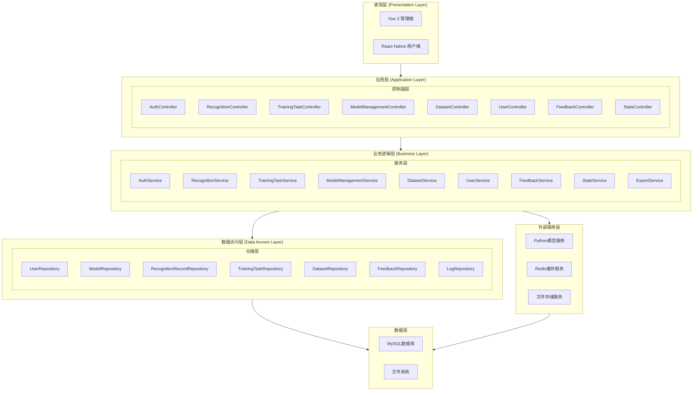

### **2.2 模块依赖关系**

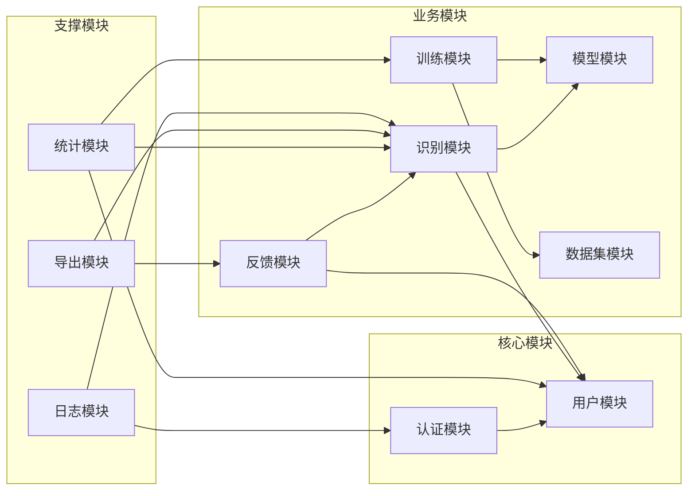

------

## **3.后端服务详细设计**

### **3.1 实体类设计**

#### **3.1.1 User 实体类**

**类名:** `com.ihdrs.entity.User`

**类图:**

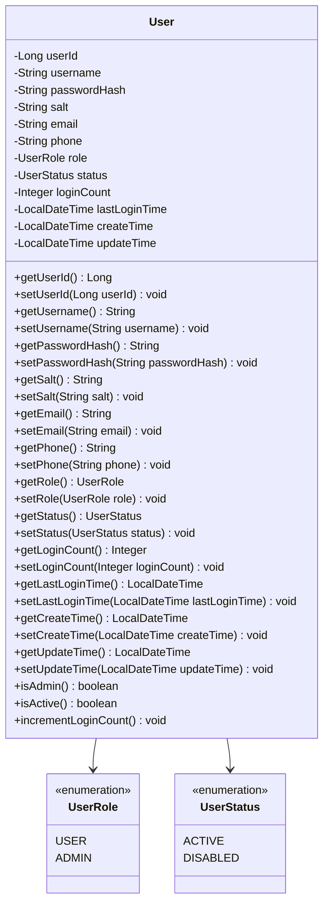

**属性说明:**

| 属性名        | 类型          | 数据库映射      | 约束                       | 说明                         |
| ------------- | ------------- | --------------- | -------------------------- | ---------------------------- |
| userId        | Long          | user_id         | PK, AUTO_INCREMENT         | 用户唯一标识                 |
| username      | String        | username        | UNIQUE, NOT NULL, 长度3-50 | 用户名，仅支持字母数字下划线 |
| passwordHash  | String        | password_hash   | NOT NULL, 长度255          | BCrypt加密后的密码哈希值     |
| salt          | String        | salt            | NOT NULL, 长度32           | 密码加密盐值                 |
| email         | String        | email           | UNIQUE, 长度100            | 邮箱地址，可为空             |
| phone         | String        | phone           | 长度20                     | 手机号码，可为空             |
| role          | UserRole      | role            | NOT NULL, DEFAULT 'USER'   | 用户角色枚举                 |
| status        | UserStatus    | status          | NOT NULL, DEFAULT 'ACTIVE' | 用户状态枚举                 |
| loginCount    | Integer       | login_count     | DEFAULT 0                  | 累计登录次数                 |
| lastLoginTime | LocalDateTime | last_login_time | 可为空                     | 最后一次登录时间             |
| createTime    | LocalDateTime | create_time     | NOT NULL                   | 账户创建时间                 |
| updateTime    | LocalDateTime | update_time     | 可为空                     | 最后更新时间                 |

**JPA注解配置:**

| 注解              | 位置             | 参数                           | 说明             |
| ----------------- | ---------------- | ------------------------------ | ---------------- |
| @Entity           | 类               | -                              | 标识为JPA实体    |
| @Table            | 类               | name="users"                   | 指定数据库表名   |
| @Id               | userId字段       | -                              | 标识主键         |
| @GeneratedValue   | userId字段       | strategy=IDENTITY              | 自增主键策略     |
| @Column           | 各字段           | name, nullable, unique, length | 列映射配置       |
| @Enumerated       | role, status字段 | EnumType.STRING                | 枚举存储为字符串 |
| @CreatedDate      | createTime字段   | -                              | 自动填充创建时间 |
| @LastModifiedDate | updateTime字段   | -                              | 自动填充更新时间 |

**业务方法说明:**

| 方法名                | 返回值  | 参数 | 说明                          |
| --------------------- | ------- | ---- | ----------------------------- |
| isAdmin()             | boolean | 无   | 判断用户是否为管理员角色      |
| isActive()            | boolean | 无   | 判断用户是否处于激活状态      |
| incrementLoginCount() | void    | 无   | 登录次数加1并更新最后登录时间 |

------

#### **3.1.2 Model 实体类**

**类名:** `com.ihdrs.entity.Model`

**类图:**

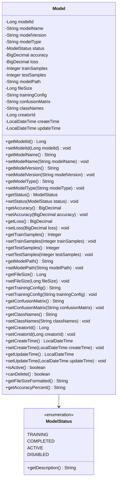

**属性说明:**

| 属性名          | 类型          | 数据库映射       | 约束               | 说明                             |
| --------------- | ------------- | ---------------- | ------------------ | -------------------------------- |
| modelId         | Long          | model_id         | PK, AUTO_INCREMENT | 模型唯一标识                     |
| modelName       | String        | model_name       | NOT NULL, 长度100  | 模型名称                         |
| modelVersion    | String        | model_version    | 长度50             | 模型版本号，如v1.0.0             |
| modelType       | String        | model_type       | 长度50             | 模型架构类型（CNN/ResNet/VGG等） |
| status          | ModelStatus   | status           | NOT NULL           | 模型状态枚举                     |
| accuracy        | BigDecimal    | accuracy         | DECIMAL(5,4)       | 测试准确率，范围0.0000-1.0000    |
| loss            | BigDecimal    | loss             | DECIMAL(10,6)      | 最终损失值                       |
| trainSamples    | Integer       | train_samples    | 可为空             | 训练样本数量                     |
| testSamples     | Integer       | test_samples     | 可为空             | 测试样本数量                     |
| modelPath       | String        | model_path       | 长度255            | 模型文件存储路径                 |
| fileSize        | Long          | file_size        | 可为空             | 模型文件大小（字节）             |
| trainingConfig  | String        | training_config  | JSON类型           | 训练配置JSON字符串               |
| confusionMatrix | String        | confusion_matrix | JSON类型           | 混淆矩阵JSON字符串               |
| classNames      | String        | class_names      | 长度255            | 类别名称，逗号分隔               |
| creatorId       | Long          | creator_id       | FK, NOT NULL       | 创建者用户ID                     |
| createTime      | LocalDateTime | create_time      | NOT NULL           | 创建时间                         |
| updateTime      | LocalDateTime | update_time      | 可为空             | 更新时间                         |

**ModelStatus枚举值说明:**

| 枚举值    | 数据库值    | 说明                         |
| --------- | ----------- | ---------------------------- |
| TRAINING  | "TRAINING"  | 训练中，模型正在训练过程中   |
| COMPLETED | "COMPLETED" | 训练完成，但未激活使用       |
| ACTIVE    | "ACTIVE"    | 激活状态，当前系统使用的模型 |
| DISABLED  | "DISABLED"  | 已停用，不可用于识别         |

**业务方法说明:**

| 方法名                 | 返回值  | 参数 | 说明                                               |
| ---------------------- | ------- | ---- | -------------------------------------------------- |
| isActive()             | boolean | 无   | 判断模型是否为当前激活模型                         |
| canDelete()            | boolean | 无   | 判断模型是否可删除（非ACTIVE和TRAINING状态可删除） |
| getFileSizeFormatted() | String  | 无   | 返回格式化的文件大小（如"12.5 MB"）                |
| getAccuracyPercent()   | String  | 无   | 返回百分比格式的准确率（如"98.76%"）               |

------

#### **3.1.3 RecognitionRecord 实体类**

**类名:** `com.ihdrs.entity.RecognitionRecord`

**类图:**

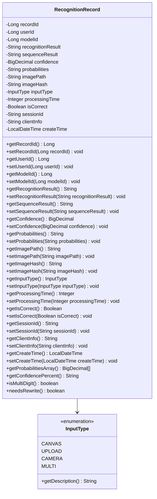

**属性说明:**

| 属性名            | 类型          | 数据库映射         | 约束                   | 说明                         |
| ----------------- | ------------- | ------------------ | ---------------------- | ---------------------------- |
| recordId          | Long          | record_id          | PK, AUTO_INCREMENT     | 识别记录唯一标识             |
| userId            | Long          | user_id            | FK, 可为空             | 用户ID，匿名识别时为空       |
| modelId           | Long          | model_id           | FK, NOT NULL           | 使用的模型ID                 |
| recognitionResult | String        | recognition_result | 长度50                 | 单数字识别结果（0-9）        |
| sequenceResult    | String        | sequence_result    | 长度500                | 多数字序列识别结果           |
| confidence        | BigDecimal    | confidence         | DECIMAL(5,4), NOT NULL | 识别置信度                   |
| probabilities     | String        | probabilities      | JSON类型               | 各数字概率分布JSON数组       |
| imagePath         | String        | image_path         | 长度255                | 原始图像存储路径             |
| imageHash         | String        | image_hash         | 长度64                 | 图像MD5哈希值，用于去重      |
| inputType         | InputType     | input_type         | NOT NULL               | 输入方式枚举                 |
| processingTime    | Integer       | processing_time    | 可为空                 | 处理耗时（毫秒）             |
| isCorrect         | Boolean       | is_correct         | 可为空                 | 识别是否正确，null表示未确认 |
| sessionId         | String        | session_id         | 长度100                | 会话标识                     |
| clientInfo        | String        | client_info        | JSON类型               | 客户端设备信息JSON           |
| createTime        | LocalDateTime | create_time        | NOT NULL               | 识别时间                     |

**InputType枚举值说明:**

| 枚举值 | 数据库值 | 说明           |
| ------ | -------- | -------------- |
| CANVAS | "CANVAS" | 画布手写输入   |
| UPLOAD | "UPLOAD" | 图片上传       |
| CAMERA | "CAMERA" | 相机拍照       |
| MULTI  | "MULTI"  | 多数字序列识别 |

**业务方法说明:**

| 方法名                  | 返回值       | 参数 | 说明                       |
| ----------------------- | ------------ | ---- | -------------------------- |
| getProbabilitiesArray() | BigDecimal[] | 无   | 解析JSON字符串返回概率数组 |
| getConfidencePercent()  | String       | 无   | 返回百分比格式置信度       |
| isMultiDigit()          | boolean      | 无   | 判断是否为多数字识别记录   |
| needsRewrite()          | boolean      | 无   | 根据置信度判断是否建议重写 |

------

#### **3.1.4 TrainingTask 实体类**

**类名:** `com.ihdrs.entity.TrainingTask`

**类图:**

```mermaid
classDiagram
    class TrainingTask {
        -Long taskId
        -String taskName
        -Long creatorId
        -Long datasetId
        -Long modelId
        -TaskStatus status
        -BigDecimal progress
        -Integer currentEpoch
        -Integer totalEpochs
        -String trainingConfig
        -String datasetConfig
        -BigDecimal bestAccuracy
        -BigDecimal finalAccuracy
        -BigDecimal finalLoss
        -String confusionMatrix
        -String classNames
        -String errorMessage
        -LocalDateTime startTime
        -LocalDateTime endTime
        -LocalDateTime createTime
        -LocalDateTime updateTime
        +getTaskId() Long
        +setTaskId(Long taskId) void
        +getTaskName() String
        +setTaskName(String taskName) void
        +getCreatorId() Long
        +setCreatorId(Long creatorId) void
        +getDatasetId() Long
        +setDatasetId(Long datasetId) void
        +getModelId() Long
        +setModelId(Long modelId) void
        +getStatus() TaskStatus
        +setStatus(TaskStatus status) void
        +getProgress() BigDecimal
        +setProgress(BigDecimal progress) void
        +getCurrentEpoch() Integer
        +setCurrentEpoch(Integer currentEpoch) void
        +getTotalEpochs() Integer
        +setTotalEpochs(Integer totalEpochs) void
        +getTrainingConfig() String
        +setTrainingConfig(String trainingConfig) void
        +getDatasetConfig() String
        +setDatasetConfig(String datasetConfig) void
        +getBestAccuracy() BigDecimal
        +setBestAccuracy(BigDecimal bestAccuracy) void
        +getFinalAccuracy() BigDecimal
        +setFinalAccuracy(BigDecimal finalAccuracy) void
        +getFinalLoss() BigDecimal
        +setFinalLoss(BigDecimal finalLoss) void
        +getConfusionMatrix() String
        +setConfusionMatrix(String confusionMatrix) void
        +getClassNames() String
        +setClassNames(String classNames) void
        +getErrorMessage() String
        +setErrorMessage(String errorMessage) void
        +getStartTime() LocalDateTime
        +setStartTime(LocalDateTime startTime) void
        +getEndTime() LocalDateTime
        +setEndTime(LocalDateTime endTime) void
        +getCreateTime() LocalDateTime
        +setCreateTime(LocalDateTime createTime) void
        +getUpdateTime() LocalDateTime
        +setUpdateTime(LocalDateTime updateTime) void
        +isRunning() boolean
        +canCancel() boolean
        +getDuration() Long
        +getProgressPercent() String
        +getEstimatedRemainingTime() Long
    }

    class TaskStatus {
        <<enumeration>>
        PENDING
        RUNNING
        COMPLETED
        FAILED
        CANCELLED
        +getDescription() String
        +isTerminal() boolean
    }

    TrainingTask --> TaskStatus
```

**属性说明:**

| 属性名          | 类型          | 数据库映射       | 约束                    | 说明                     |
| --------------- | ------------- | ---------------- | ----------------------- | ------------------------ |
| taskId          | Long          | task_id          | PK, AUTO_INCREMENT      | 任务唯一标识             |
| taskName        | String        | task_name        | NOT NULL, 长度100       | 任务名称                 |
| creatorId       | Long          | creator_id       | FK, NOT NULL            | 创建者用户ID             |
| datasetId       | Long          | dataset_id       | FK, NOT NULL            | 使用的数据集ID           |
| modelId         | Long          | model_id         | FK, 可为空              | 训练生成的模型ID         |
| status          | TaskStatus    | status           | NOT NULL                | 任务状态枚举             |
| progress        | BigDecimal    | progress         | DECIMAL(5,2), DEFAULT 0 | 训练进度百分比（0-100）  |
| currentEpoch    | Integer       | current_epoch    | DEFAULT 0               | 当前训练轮次             |
| totalEpochs     | Integer       | total_epochs     | NOT NULL                | 总训练轮次               |
| trainingConfig  | String        | training_config  | JSON类型                | 训练超参数配置JSON       |
| datasetConfig   | String        | dataset_config   | JSON类型                | 数据集配置JSON           |
| bestAccuracy    | BigDecimal    | best_accuracy    | DECIMAL(5,4)            | 训练过程中最佳验证准确率 |
| finalAccuracy   | BigDecimal    | final_accuracy   | DECIMAL(5,4)            | 最终测试准确率           |
| finalLoss       | BigDecimal    | final_loss       | DECIMAL(10,6)           | 最终损失值               |
| confusionMatrix | String        | confusion_matrix | JSON类型                | 混淆矩阵JSON             |
| classNames      | String        | class_names      | 长度255                 | 类别名称列表             |
| errorMessage    | String        | error_message    | TEXT类型                | 失败时的错误信息         |
| startTime       | LocalDateTime | start_time       | 可为空                  | 实际开始训练时间         |
| endTime         | LocalDateTime | end_time         | 可为空                  | 训练结束时间             |
| createTime      | LocalDateTime | create_time      | NOT NULL                | 任务创建时间             |
| updateTime      | LocalDateTime | update_time      | 可为空                  | 最后更新时间             |

**TaskStatus枚举值说明:**

| 枚举值    | 数据库值    | 说明                     | isTerminal |
| --------- | ----------- | ------------------------ | ---------- |
| PENDING   | "PENDING"   | 等待中，任务已创建待执行 | false      |
| RUNNING   | "RUNNING"   | 运行中，正在训练         | false      |
| COMPLETED | "COMPLETED" | 已完成，训练成功         | true       |
| FAILED    | "FAILED"    | 已失败，训练出错         | true       |
| CANCELLED | "CANCELLED" | 已取消，用户手动取消     | true       |

**业务方法说明:**

| 方法名                      | 返回值  | 参数 | 说明                                               |
| --------------------------- | ------- | ---- | -------------------------------------------------- |
| isRunning()                 | boolean | 无   | 判断任务是否正在运行                               |
| canCancel()                 | boolean | 无   | 判断任务是否可以取消（PENDING或RUNNING状态可取消） |
| getDuration()               | Long    | 无   | 计算任务执行时长（秒）                             |
| getProgressPercent()        | String  | 无   | 返回格式化的进度百分比                             |
| getEstimatedRemainingTime() | Long    | 无   | 根据当前进度预估剩余时间（秒）                     |

------

#### **3.1.5 TrainingLog 实体类**

**类名:** `com.ihdrs.entity.TrainingLog`

**类图:**

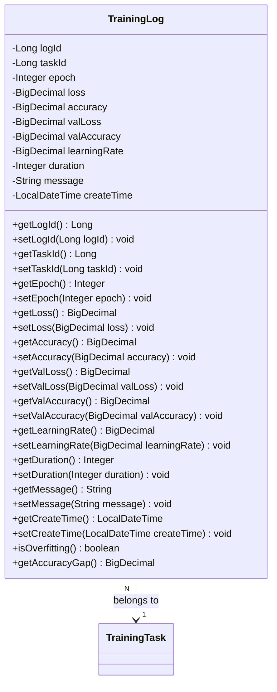

**属性说明:**

| 属性名       | 类型          | 数据库映射    | 约束               | 说明             |
| ------------ | ------------- | ------------- | ------------------ | ---------------- |
| logId        | Long          | log_id        | PK, AUTO_INCREMENT | 日志唯一标识     |
| taskId       | Long          | task_id       | FK, NOT NULL       | 关联的训练任务ID |
| epoch        | Integer       | epoch         | NOT NULL           | 当前轮次编号     |
| loss         | BigDecimal    | loss          | DECIMAL(10,6)      | 训练集损失值     |
| accuracy     | BigDecimal    | accuracy      | DECIMAL(5,4)       | 训练集准确率     |
| valLoss      | BigDecimal    | val_loss      | DECIMAL(10,6)      | 验证集损失值     |
| valAccuracy  | BigDecimal    | val_accuracy  | DECIMAL(5,4)       | 验证集准确率     |
| learningRate | BigDecimal    | learning_rate | DECIMAL(10,8)      | 当前学习率       |
| duration     | Integer       | duration      | 可为空             | 该轮次耗时（秒） |
| message      | String        | message       | TEXT类型           | 日志消息或输出   |
| createTime   | LocalDateTime | create_time   | NOT NULL           | 记录创建时间     |

**业务方法说明:**

| 方法名           | 返回值     | 参数 | 说明                                             |
| ---------------- | ---------- | ---- | ------------------------------------------------ |
| isOverfitting()  | boolean    | 无   | 判断是否存在过拟合（训练准确率远高于验证准确率） |
| getAccuracyGap() | BigDecimal | 无   | 计算训练准确率与验证准确率的差值                 |

------

#### **3.1.6 Dataset 实体类**

**类名:** `com.ihdrs.entity.Dataset`

**类图:**

```mermaid
classDiagram
    class Dataset {
        -Long datasetId
        -String datasetName
        -String description
        -Long creatorId
        -String filePath
        -String dirName
        -DatasetStatus status
        -Boolean isPublic
        -Integer numClasses
        -Integer numSamples
        -Integer trainSamples
        -Integer testSamples
        -Integer imageWidth
        -Integer imageHeight
        -String imageFormat
        -String classNames
        -Long fileSize
        -String errorMessage
        -LocalDateTime createTime
        -LocalDateTime updateTime
        +getDatasetId() Long
        +setDatasetId(Long datasetId) void
        +getDatasetName() String
        +setDatasetName(String datasetName) void
        +getDescription() String
        +setDescription(String description) void
        +getCreatorId() Long
        +setCreatorId(Long creatorId) void
        +getFilePath() String
        +setFilePath(String filePath) void
        +getDirName() String
        +setDirName(String dirName) void
        +getStatus() DatasetStatus
        +setStatus(DatasetStatus status) void
        +getIsPublic() Boolean
        +setIsPublic(Boolean isPublic) void
        +getNumClasses() Integer
        +setNumClasses(Integer numClasses) void
        +getNumSamples() Integer
        +setNumSamples(Integer numSamples) void
        +getTrainSamples() Integer
        +setTrainSamples(Integer trainSamples) void
        +getTestSamples() Integer
        +setTestSamples(Integer testSamples) void
        +getImageWidth() Integer
        +setImageWidth(Integer imageWidth) void
        +getImageHeight() Integer
        +setImageHeight(Integer imageHeight) void
        +getImageFormat() String
        +setImageFormat(String imageFormat) void
        +getClassNames() String
        +setClassNames(String classNames) void
        +getFileSize() Long
        +setFileSize(Long fileSize) void
        +getErrorMessage() String
        +setErrorMessage(String errorMessage) void
        +getCreateTime() LocalDateTime
        +setCreateTime(LocalDateTime createTime) void
        +getUpdateTime() LocalDateTime
        +setUpdateTime(LocalDateTime updateTime) void
        +isAvailable() boolean
        +canDelete() boolean
        +getClassNamesList() List~String~
        +getFileSizeFormatted() String
        +getImageDimensions() String
    }

    class DatasetStatus {
        <<enumeration>>
        UPLOADING
        PROCESSING
        AVAILABLE
        ERROR
        +getDescription() String
    }

    Dataset --> DatasetStatus
```

**属性说明:**

| 属性名       | 类型          | 数据库映射    | 约束               | 说明                   |
| ------------ | ------------- | ------------- | ------------------ | ---------------------- |
| datasetId    | Long          | dataset_id    | PK, AUTO_INCREMENT | 数据集唯一标识         |
| datasetName  | String        | dataset_name  | NOT NULL, 长度100  | 数据集名称             |
| description  | String        | description   | TEXT类型           | 数据集描述             |
| creatorId    | Long          | creator_id    | FK, NOT NULL       | 创建者用户ID           |
| filePath     | String        | file_path     | 长度255            | 压缩包文件路径         |
| dirName      | String        | dir_name      | 长度100            | 解压后的目录名         |
| status       | DatasetStatus | status        | NOT NULL           | 数据集状态枚举         |
| isPublic     | Boolean       | is_public     | DEFAULT false      | 是否公开               |
| numClasses   | Integer       | num_classes   | 可为空             | 类别数量               |
| numSamples   | Integer       | num_samples   | 可为空             | 总样本数               |
| trainSamples | Integer       | train_samples | 可为空             | 训练集样本数           |
| testSamples  | Integer       | test_samples  | 可为空             | 测试集样本数           |
| imageWidth   | Integer       | image_width   | 可为空             | 图像宽度（像素）       |
| imageHeight  | Integer       | image_height  | 可为空             | 图像高度（像素）       |
| imageFormat  | String        | image_format  | 长度20             | 图像格式（PNG/JPG等）  |
| classNames   | String        | class_names   | 长度255            | 类别名称，逗号分隔     |
| fileSize     | Long          | file_size     | 可为空             | 压缩包文件大小（字节） |
| errorMessage | String        | error_message | TEXT类型           | 处理失败的错误信息     |
| createTime   | LocalDateTime | create_time   | NOT NULL           | 创建时间               |
| updateTime   | LocalDateTime | update_time   | 可为空             | 更新时间               |

**DatasetStatus枚举值说明:**

| 枚举值     | 数据库值     | 说明                   |
| ---------- | ------------ | ---------------------- |
| UPLOADING  | "UPLOADING"  | 上传中                 |
| PROCESSING | "PROCESSING" | 处理中，正在解压和验证 |
| AVAILABLE  | "AVAILABLE"  | 可用，可用于训练       |
| ERROR      | "ERROR"      | 错误，处理失败         |

**业务方法说明:**

| 方法名                 | 返回值       | 参数 | 说明                                             |
| ---------------------- | ------------ | ---- | ------------------------------------------------ |
| isAvailable()          | boolean      | 无   | 判断数据集是否可用于训练                         |
| canDelete()            | boolean      | 无   | 判断数据集是否可删除（未被训练任务使用时可删除） |
| getClassNamesList()    | List<String> | 无   | 将逗号分隔的类名解析为列表                       |
| getFileSizeFormatted() | String       | 无   | 返回格式化的文件大小                             |
| getImageDimensions()   | String       | 无   | 返回图像尺寸字符串（如"28x28"）                  |

------

#### **3.1.7 Feedback 实体类**

**类名:** `com.ihdrs.entity.Feedback`

**类图:**

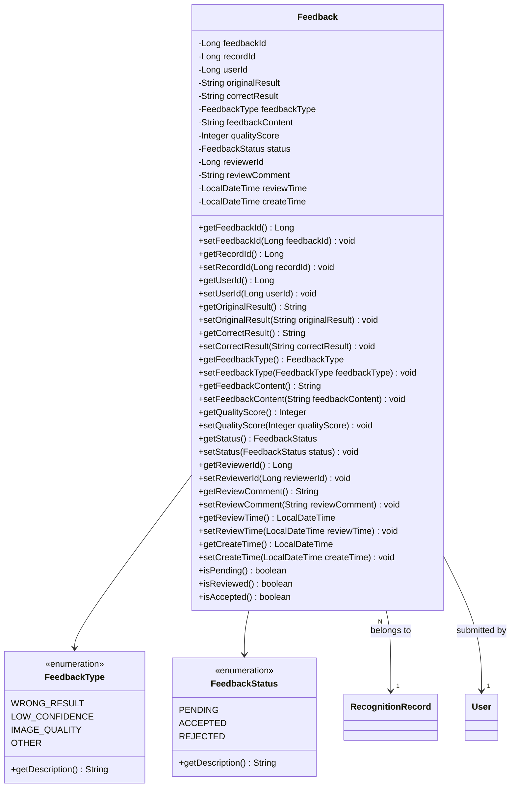

**属性说明:**

| 属性名          | 类型           | 数据库映射       | 约束                      | 说明               |
| --------------- | -------------- | ---------------- | ------------------------- | ------------------ |
| feedbackId      | Long           | feedback_id      | PK, AUTO_INCREMENT        | 反馈唯一标识       |
| recordId        | Long           | record_id        | FK, NOT NULL              | 关联的识别记录ID   |
| userId          | Long           | user_id          | FK, NOT NULL              | 提交反馈的用户ID   |
| originalResult  | String         | original_result  | 长度50                    | 原始识别结果       |
| correctResult   | String         | correct_result   | 长度50                    | 用户提供的正确结果 |
| feedbackType    | FeedbackType   | feedback_type    | NOT NULL                  | 反馈类型枚举       |
| feedbackContent | String         | feedback_content | TEXT类型                  | 反馈详细内容       |
| qualityScore    | Integer        | quality_score    | 范围1-5                   | 图像质量评分       |
| status          | FeedbackStatus | status           | NOT NULL, DEFAULT PENDING | 反馈处理状态       |
| reviewerId      | Long           | reviewer_id      | FK, 可为空                | 审核人员用户ID     |
| reviewComment   | String         | review_comment   | TEXT类型                  | 审核备注           |
| reviewTime      | LocalDateTime  | review_time      | 可为空                    | 审核时间           |
| createTime      | LocalDateTime  | create_time      | NOT NULL                  | 反馈提交时间       |

**FeedbackType枚举值说明:**

| 枚举值         | 数据库值         | 说明         |
| -------------- | ---------------- | ------------ |
| WRONG_RESULT   | "WRONG_RESULT"   | 识别结果错误 |
| LOW_CONFIDENCE | "LOW_CONFIDENCE" | 置信度过低   |
| IMAGE_QUALITY  | "IMAGE_QUALITY"  | 图像质量问题 |
| OTHER          | "OTHER"          | 其他问题     |

**FeedbackStatus枚举值说明:**

| 枚举值   | 数据库值   | 说明             |
| -------- | ---------- | ---------------- |
| PENDING  | "PENDING"  | 待审核           |
| ACCEPTED | "ACCEPTED" | 已接受，反馈有效 |
| REJECTED | "REJECTED" | 已拒绝，反馈无效 |

------

#### **3.1.8 OperationLog 实体类**

**类名:** `com.ihdrs.entity.OperationLog`

**类图:**

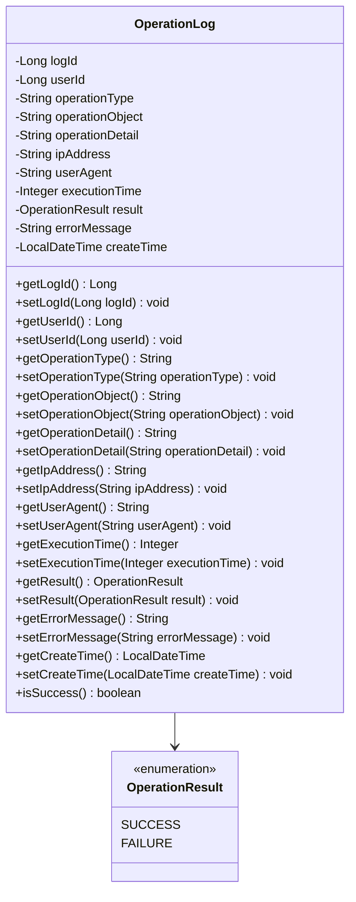

------

#### **3.1.9 UserLog 实体类**

**类名:** `com.ihdrs.entity.UserLog`

**类图:**

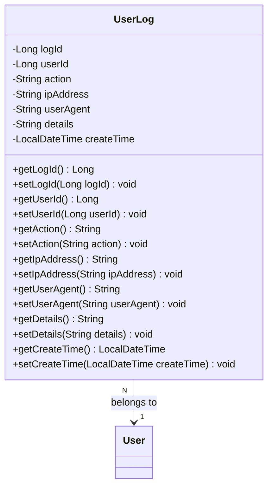

**用户行为动作类型:**

| 动作值          | 说明         |
| --------------- | ------------ |
| LOGIN           | 用户登录     |
| LOGOUT          | 用户登出     |
| REGISTER        | 用户注册     |
| PASSWORD_CHANGE | 修改密码     |
| PROFILE_UPDATE  | 更新个人信息 |
| RECOGNITION     | 执行识别     |
| FEEDBACK_SUBMIT | 提交反馈     |

------

### **3.2 数据传输对象（DTO）设计**

#### **3.2.1 认证相关DTO**

**LoginRequest DTO**

| 属性名   | 类型   | 验证规则                        | 说明   |
| -------- | ------ | ------------------------------- | ------ |
| username | String | @NotBlank, @Size(min=3, max=50) | 用户名 |
| password | String | @NotBlank, @Size(min=6, max=20) | 密码   |

**LoginResponse DTO**

| 属性名    | 类型     | 说明                     |
| --------- | -------- | ------------------------ |
| token     | String   | JWT令牌                  |
| tokenType | String   | 令牌类型，固定为"Bearer" |
| expiresIn | Long     | 过期时间（秒）           |
| userInfo  | UserInfo | 用户基本信息             |

**UserInfo DTO**

| 属性名   | 类型   | 说明               |
| -------- | ------ | ------------------ |
| userId   | Long   | 用户ID             |
| username | String | 用户名             |
| role     | String | 用户角色           |
| email    | String | 邮箱               |
| phone    | String | 手机号（脱敏显示） |

**RegisterRequest DTO**

| 属性名   | 类型   | 验证规则                                                     | 说明           |
| -------- | ------ | ------------------------------------------------------------ | -------------- |
| username | String | @NotBlank, @Size(min=3, max=50), @Pattern(regexp="^[a-zA-Z0-9_]+$") | 用户名         |
| password | String | @NotBlank, @Size(min=6, max=20)                              | 密码           |
| email    | String | @Email, @Size(max=100)                                       | 邮箱（可选）   |
| phone    | String | @Pattern(regexp="^1[3-9]\d{9}$")                             | 手机号（可选） |

------

#### **3.2.2 识别相关DTO**

**RecognitionRequest DTO**

| 属性名     | 类型   | 验证规则                                                    | 说明                 |
| ---------- | ------ | ----------------------------------------------------------- | -------------------- |
| imageData  | String | @NotBlank                                                   | Base64编码的图像数据 |
| inputType  | String | @NotBlank, @Pattern(regexp="CANVAS\|UPLOAD\|CAMERA\|MULTI") | 输入类型             |
| sessionId  | String | 可选                                                        | 会话标识             |
| clientInfo | String | 可选                                                        | 客户端信息JSON       |

**RecognitionResponse DTO**

| 属性名            | 类型                    | 说明                  |
| ----------------- | ----------------------- | --------------------- |
| recordId          | Long                    | 识别记录ID            |
| recognitionResult | String                  | 识别结果（单数字0-9） |
| sequenceResult    | String                  | 序列结果（多数字）    |
| confidence        | BigDecimal              | 置信度                |
| probabilities     | List<BigDecimal>        | 各数字概率分布        |
| probabilitiesMap  | Map<String, BigDecimal> | 概率分布映射          |
| processingTime    | Integer                 | 处理时间（毫秒）      |
| modelName         | String                  | 使用的模型名称        |
| modelVersion      | String                  | 模型版本              |
| needRewrite       | Boolean                 | 是否建议重写          |
| message           | String                  | 提示信息              |

**MultiRecognitionResponse DTO**

| 属性名            | 类型              | 说明           |
| ----------------- | ----------------- | -------------- |
| sequence          | String            | 识别的数字序列 |
| count             | Integer           | 数字个数       |
| digits            | List<DigitResult> | 各数字识别详情 |
| averageConfidence | BigDecimal        | 平均置信度     |
| processingTime    | Integer           | 处理时间       |
| recordId          | Long              | 记录ID         |

**DigitResult DTO**

| 属性名      | 类型        | 说明       |
| ----------- | ----------- | ---------- |
| digit       | String      | 识别的数字 |
| confidence  | BigDecimal  | 置信度     |
| position    | Integer     | 位置索引   |
| boundingBox | BoundingBox | 边界框信息 |

------

#### **3.2.3 训练相关DTO**

**CreateTrainingTaskRequest DTO**

| 属性名         | 类型           | 验证规则                  | 说明     |
| -------------- | -------------- | ------------------------- | -------- |
| taskName       | String         | @NotBlank, @Size(max=100) | 任务名称 |
| datasetId      | Long           | @NotNull, @Positive       | 数据集ID |
| modelType      | String         | @NotBlank                 | 模型类型 |
| trainingConfig | TrainingConfig | @Valid, @NotNull          | 训练配置 |

**TrainingConfig DTO**

| 属性名            | 类型       | 验证规则                                  | 默认值          | 说明             |
| ----------------- | ---------- | ----------------------------------------- | --------------- | ---------------- |
| batchSize         | Integer    | @Min(8), @Max(256)                        | 32              | 批次大小         |
| learningRate      | BigDecimal | @DecimalMin("0.0001"), @DecimalMax("0.1") | 0.001           | 学习率           |
| epochs            | Integer    | @Min(1), @Max(500)                        | 50              | 训练轮数         |
| optimizer         | String     | @Pattern(regexp="adam\|sgd\|rmsprop")     | "adam"          | 优化器           |
| lossFunction      | String     | @Pattern(regexp="cross_entropy\|mse")     | "cross_entropy" | 损失函数         |
| hiddenSize        | Integer    | @Min(32), @Max(1024)                      | 128             | 隐藏层大小       |
| activation        | String     | @Pattern(regexp="relu\|sigmoid\|tanh")    | "relu"          | 激活函数         |
| dropout           | BigDecimal | @DecimalMin("0"), @DecimalMax("0.9")      | 0.5             | Dropout率        |
| batchNorm         | Boolean    | -                                         | true            | 是否使用批归一化 |
| earlyStop         | Boolean    | -                                         | true            | 是否启用早停     |
| earlyStopPatience | Integer    | @Min(1), @Max(20)                         | 5               | 早停耐心值       |
| validationSplit   | BigDecimal | @DecimalMin("0.05"), @DecimalMax("0.3")   | 0.2             | 验证集比例       |
| dataAugmentation  | Boolean    | -                                         | false           | 是否数据增强     |

**TrainingTaskResponse DTO**

| 属性名         | 类型           | 说明         |
| -------------- | -------------- | ------------ |
| taskId         | Long           | 任务ID       |
| taskName       | String         | 任务名称     |
| status         | String         | 任务状态     |
| progress       | BigDecimal     | 进度百分比   |
| currentEpoch   | Integer        | 当前轮次     |
| totalEpochs    | Integer        | 总轮次       |
| bestAccuracy   | BigDecimal     | 最佳准确率   |
| finalAccuracy  | BigDecimal     | 最终准确率   |
| finalLoss      | BigDecimal     | 最终损失值   |
| trainingConfig | TrainingConfig | 训练配置     |
| datasetName    | String         | 数据集名称   |
| modelId        | Long           | 生成的模型ID |
| modelName      | String         | 模型名称     |
| creatorName    | String         | 创建者用户名 |
| startTime      | LocalDateTime  | 开始时间     |
| endTime        | LocalDateTime  | 结束时间     |
| createTime     | LocalDateTime  | 创建时间     |
| errorMessage   | String         | 错误信息     |

**TrainingProgressResponse DTO**

| 属性名             | 类型                   | 说明               |
| ------------------ | ---------------------- | ------------------ |
| taskId             | Long                   | 任务ID             |
| status             | String                 | 当前状态           |
| progress           | BigDecimal             | 进度百分比         |
| currentEpoch       | Integer                | 当前轮次           |
| totalEpochs        | Integer                | 总轮次             |
| currentBatch       | Integer                | 当前批次           |
| totalBatches       | Integer                | 总批次             |
| msPerStep          | Long                   | 每步耗时（毫秒）   |
| estimatedRemaining | Long                   | 预计剩余时间（秒） |
| logs               | List<TrainingLogEntry> | 最近的训练日志     |

**TrainingLogEntry DTO**

| 属性名       | 类型          | 说明       |
| ------------ | ------------- | ---------- |
| epoch        | Integer       | 轮次       |
| loss         | BigDecimal    | 训练损失   |
| accuracy     | BigDecimal    | 训练准确率 |
| valLoss      | BigDecimal    | 验证损失   |
| valAccuracy  | BigDecimal    | 验证准确率 |
| learningRate | BigDecimal    | 当前学习率 |
| duration     | Integer       | 耗时（秒） |
| timestamp    | LocalDateTime | 记录时间   |

------

#### **3.2.4 数据集相关DTO**

**DatasetUploadRequest DTO**

| 属性名      | 类型          | 验证规则                  | 说明                |
| ----------- | ------------- | ------------------------- | ------------------- |
| file        | MultipartFile | @NotNull, 大小<=500MB     | 数据集ZIP文件       |
| datasetName | String        | @NotBlank, @Size(max=100) | 数据集名称          |
| description | String        | @Size(max=500)            | 数据集描述          |
| isPublic    | Boolean       | -                         | 是否公开，默认false |

**DatasetResponse DTO**

| 属性名            | 类型          | 说明             |
| ----------------- | ------------- | ---------------- |
| datasetId         | Long          | 数据集ID         |
| datasetName       | String        | 数据集名称       |
| description       | String        | 描述             |
| status            | String        | 状态             |
| isPublic          | Boolean       | 是否公开         |
| numClasses        | Integer       | 类别数           |
| numSamples        | Integer       | 总样本数         |
| trainSamples      | Integer       | 训练集样本数     |
| testSamples       | Integer       | 测试集样本数     |
| imageWidth        | Integer       | 图像宽度         |
| imageHeight       | Integer       | 图像高度         |
| imageFormat       | String        | 图像格式         |
| classNames        | List<String>  | 类别名称列表     |
| fileSize          | Long          | 文件大小         |
| fileSizeFormatted | String        | 格式化的文件大小 |
| creatorId         | Long          | 创建者ID         |
| creatorName       | String        | 创建者用户名     |
| createTime        | LocalDateTime | 创建时间         |
| updateTime        | LocalDateTime | 更新时间         |
| errorMessage      | String        | 错误信息         |

------

#### **3.2.5 模型相关DTO**

**ModelResponse DTO**

| 属性名            | 类型                | 说明             |
| ----------------- | ------------------- | ---------------- |
| modelId           | Long                | 模型ID           |
| modelName         | String              | 模型名称         |
| modelVersion      | String              | 模型版本         |
| modelType         | String              | 模型类型         |
| status            | String              | 模型状态         |
| accuracy          | BigDecimal          | 准确率           |
| accuracyPercent   | String              | 百分比格式准确率 |
| loss              | BigDecimal          | 损失值           |
| trainSamples      | Integer             | 训练样本数       |
| testSamples       | Integer             | 测试样本数       |
| fileSize          | Long                | 文件大小         |
| fileSizeFormatted | String              | 格式化文件大小   |
| trainingConfig    | Object              | 训练配置         |
| confusionMatrix   | List<List<Integer>> | 混淆矩阵         |
| classNames        | List<String>        | 类别名称         |
| creatorId         | Long                | 创建者ID         |
| creatorName       | String              | 创建者用户名     |
| createTime        | LocalDateTime       | 创建时间         |
| updateTime        | LocalDateTime       | 更新时间         |

**ModelCompareRequest DTO**

| 属性名   | 类型 | 验证规则            | 说明         |
| -------- | ---- | ------------------- | ------------ |
| modelId1 | Long | @NotNull, @Positive | 第一个模型ID |
| modelId2 | Long | @NotNull, @Positive | 第二个模型ID |

**ModelCompareResponse DTO**

| 属性名            | 类型                 | 说明       |
| ----------------- | -------------------- | ---------- |
| model1            | ModelResponse        | 模型1信息  |
| model2            | ModelResponse        | 模型2信息  |
| accuracyDiff      | BigDecimal           | 准确率差值 |
| lossDiff          | BigDecimal           | 损失值差值 |
| recommendation    | String               | 推荐建议   |
| comparisonDetails | List<ComparisonItem> | 详细对比项 |

------

#### **3.2.6 反馈相关DTO**

**FeedbackRequest DTO**

| 属性名          | 类型    | 验证规则                              | 说明       |
| --------------- | ------- | ------------------------------------- | ---------- |
| recordId        | Long    | @NotNull, @Positive                   | 识别记录ID |
| correctResult   | String  | @NotBlank, @Pattern(regexp="^[0-9]$") | 正确结果   |
| feedbackType    | String  | @NotBlank                             | 反馈类型   |
| feedbackContent | String  | @Size(max=500)                        | 反馈内容   |
| qualityScore    | Integer | @Min(1), @Max(5)                      | 质量评分   |

**FeedbackReviewRequest DTO**

| 属性名        | 类型   | 验证规则                                         | 说明     |
| ------------- | ------ | ------------------------------------------------ | -------- |
| status        | String | @NotBlank, @Pattern(regexp="ACCEPTED\|REJECTED") | 审核状态 |
| reviewComment | String | @Size(max=500)                                   | 审核备注 |

**BatchReviewRequest DTO**

| 属性名        | 类型       | 验证规则       | 说明       |
| ------------- | ---------- | -------------- | ---------- |
| feedbackIds   | List<Long> | @NotEmpty      | 反馈ID列表 |
| status        | String     | @NotBlank      | 审核状态   |
| reviewComment | String     | @Size(max=500) | 审核备注   |

**FeedbackResponse DTO**

| 属性名         | 类型   | 说明       |
| -------------- | ------ | ---------- |
| feedbackId     | Long   | 反馈ID     |
| recordId       | Long   | 识别记录ID |
| userId         | Long   | 提交用户ID |
| username       | String | 提交用户名 |
| originalResult | String | 原识别结果 |
| correctResult   | String        | 用户提供的正确结果  |
| feedbackType    | String        | 反馈类型            |
| feedbackContent | String        | 反馈详细内容        |
| qualityScore    | Integer       | 图像质量评分（1-5） |
| status          | String        | 审核状态            |
| reviewerId      | Long          | 审核人ID            |
| reviewerName    | String        | 审核人用户名        |
| reviewComment   | String        | 审核备注            |
| reviewTime      | LocalDateTime | 审核时间            |
| createTime      | LocalDateTime | 提交时间            |
| imagePath       | String        | 关联的识别图像路径  |
| confidence      | BigDecimal    | 原识别置信度        |
| modelName       | String        | 使用的模型名称      |

------

#### **3.2.7 统计相关DTO**

**DashboardStatsResponse DTO**

| 属性名                | 类型       | 说明                   |
| --------------------- | ---------- | ---------------------- |
| totalRecognitions     | Long       | 总识别次数             |
| totalUsers            | Long       | 总用户数               |
| totalModels           | Long       | 总模型数               |
| todayRecognitions     | Long       | 今日识别量             |
| recognitionGrowthRate | BigDecimal | 识别量增长率（较昨日） |
| userGrowthRate        | BigDecimal | 用户增长率             |
| averageAccuracy       | BigDecimal | 平均识别准确率         |
| averageProcessingTime | Integer    | 平均处理时间（毫秒）   |
| activeModelName       | String     | 当前活跃模型名称       |
| activeModelAccuracy   | BigDecimal | 活跃模型准确率         |

**RecognitionTrendResponse DTO**

| 属性名       | 类型             | 说明               |
| ------------ | ---------------- | ------------------ |
| dates        | List<String>     | 日期列表           |
| counts       | List<Long>       | 对应日期的识别数量 |
| successRates | List<BigDecimal> | 对应日期的成功率   |

**DigitDistributionResponse DTO**

| 属性名      | 类型             | 说明            |
| ----------- | ---------------- | --------------- |
| labels      | List<String>     | 数字标签（0-9） |
| values      | List<Long>       | 各数字识别次数  |
| percentages | List<BigDecimal> | 各数字占比      |

**HourlyDistributionResponse DTO**

| 属性名 | 类型          | 说明             |
| ------ | ------------- | ---------------- |
| hours  | List<Integer> | 小时列表（0-23） |
| counts | List<Long>    | 各小时识别数量   |

**SystemPerformanceResponse DTO**

| 属性名              | 类型       | 说明                 |
| ------------------- | ---------- | -------------------- |
| cpuUsage            | BigDecimal | CPU使用率            |
| memoryUsage         | BigDecimal | 内存使用率           |
| diskUsage           | BigDecimal | 磁盘使用率           |
| activeConnections   | Integer    | 活跃连接数           |
| requestsPerMinute   | Long       | 每分钟请求数         |
| averageResponseTime | Integer    | 平均响应时间（毫秒） |
| modelServiceStatus  | String     | 模型服务状态         |
| databaseStatus      | String     | 数据库状态           |
| cacheStatus         | String     | 缓存状态             |

------

#### **3.2.8 用户管理相关DTO**

**UserListResponse DTO**

| 属性名           | 类型          | 说明           |
| ---------------- | ------------- | -------------- |
| userId           | Long          | 用户ID         |
| username         | String        | 用户名         |
| email            | String        | 邮箱（脱敏）   |
| phone            | String        | 手机号（脱敏） |
| role             | String        | 用户角色       |
| status           | String        | 用户状态       |
| loginCount       | Integer       | 登录次数       |
| lastLoginTime    | LocalDateTime | 最后登录时间   |
| createTime       | LocalDateTime | 注册时间       |
| recognitionCount | Long          | 识别次数       |
| feedbackCount    | Long          | 反馈次数       |

**UpdateUserRoleRequest DTO**

| 属性名 | 类型   | 验证规则                                  | 说明   |
| ------ | ------ | ----------------------------------------- | ------ |
| role   | String | @NotBlank, @Pattern(regexp="USER\|ADMIN") | 新角色 |

**UpdateUserStatusRequest DTO**

| 属性名 | 类型    | 验证规则 | 说明                  |
| ------ | ------- | -------- | --------------------- |
| status | Boolean | @NotNull | true=启用, false=禁用 |

**UpdateProfileRequest DTO**

| 属性名 | 类型   | 验证规则                         | 说明   |
| ------ | ------ | -------------------------------- | ------ |
| email  | String | @Email, @Size(max=100)           | 邮箱   |
| phone  | String | @Pattern(regexp="^1[3-9]\d{9}$") | 手机号 |

**ChangePasswordRequest DTO**

| 属性名      | 类型   | 验证规则                        | 说明   |
| ----------- | ------ | ------------------------------- | ------ |
| oldPassword | String | @NotBlank                       | 原密码 |
| newPassword | String | @NotBlank, @Size(min=6, max=20) | 新密码 |

------

#### **3.2.9 导出相关DTO**

**ExportRequest DTO**

| 属性名  | 类型         | 验证规则                                      | 说明         |
| ------- | ------------ | --------------------------------------------- | ------------ |
| format  | String       | @NotBlank, @Pattern(regexp="excel\|csv\|pdf") | 导出格式     |
| scope   | String       | @Pattern(regexp="current\|all")               | 导出范围     |
| fields  | List<String> | 可选                                          | 导出字段列表 |
| filters | ExportFilter | 可选                                          | 筛选条件     |

**ExportFilter DTO**

| 属性名    | 类型      | 说明         |
| --------- | --------- | ------------ |
| startDate | LocalDate | 开始日期     |
| endDate   | LocalDate | 结束日期     |
| userId    | Long      | 用户ID筛选   |
| result    | String    | 结果筛选     |
| inputType | String    | 输入类型筛选 |
| status    | String    | 状态筛选     |

------

#### **3.2.10 分页相关DTO**

**PageRequest DTO**

| 属性名    | 类型    | 验证规则                     | 默认值       | 说明     |
| --------- | ------- | ---------------------------- | ------------ | -------- |
| page      | Integer | @Min(1)                      | 1            | 当前页码 |
| size      | Integer | @Min(1), @Max(100)           | 10           | 每页大小 |
| sortBy    | String  | 可选                         | "createTime" | 排序字段 |
| sortOrder | String  | @Pattern(regexp="asc\|desc") | "desc"       | 排序方向 |

**PageResponse DTO**

| 属性名      | 类型    | 说明         |
| ----------- | ------- | ------------ |
| records     | List<T> | 数据列表     |
| total       | Long    | 总记录数     |
| size        | Integer | 每页大小     |
| current     | Integer | 当前页码     |
| pages       | Integer | 总页数       |
| hasNext     | Boolean | 是否有下一页 |
| hasPrevious | Boolean | 是否有上一页 |

------

### **3.3 Repository接口设计**

#### **3.3.1 UserRepository**

**接口名:** `com.ihdrs.repository.UserRepository`

**继承:** `JpaRepository<User, Long>`, `JpaSpecificationExecutor<User>`

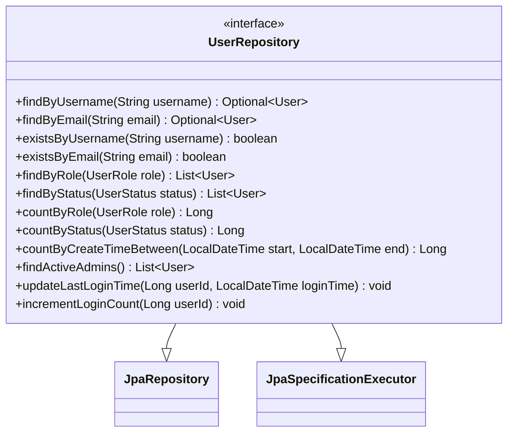

**方法说明:**

| 方法名                   | 返回值         | 参数                                   | SQL/JPQL                                                     | 说明                   |
| ------------------------ | -------------- | -------------------------------------- | ------------------------------------------------------------ | ---------------------- |
| findByUsername           | Optional<User> | String username                        | 自动生成                                                     | 根据用户名查询         |
| findByEmail              | Optional<User> | String email                           | 自动生成                                                     | 根据邮箱查询           |
| existsByUsername         | boolean        | String username                        | 自动生成                                                     | 检查用户名是否存在     |
| existsByEmail            | boolean        | String email                           | 自动生成                                                     | 检查邮箱是否存在       |
| findByRole               | List<User>     | UserRole role                          | 自动生成                                                     | 按角色查询用户         |
| findByStatus             | List<User>     | UserStatus status                      | 自动生成                                                     | 按状态查询用户         |
| countByRole              | Long           | UserRole role                          | 自动生成                                                     | 统计角色用户数         |
| countByStatus            | Long           | UserStatus status                      | 自动生成                                                     | 统计状态用户数         |
| countByCreateTimeBetween | Long           | LocalDateTime start, LocalDateTime end | 自动生成                                                     | 统计时间段内注册用户数 |
| findActiveAdmins         | List<User>     | 无                                     | @Query("SELECT u FROM User u WHERE u.role = 'ADMIN' AND u.status = 'ACTIVE'") | 查询所有活跃管理员     |
| updateLastLoginTime      | void           | Long userId, LocalDateTime loginTime   | @Modifying @Query("UPDATE User u SET u.lastLoginTime = :loginTime WHERE u.userId = :userId") | 更新最后登录时间       |
| incrementLoginCount      | void           | Long userId                            | @Modifying @Query("UPDATE User u SET u.loginCount = u.loginCount + 1 WHERE u.userId = :userId") | 登录次数加1            |

------

#### **3.3.2 ModelRepository**

**接口名:** `com.ihdrs.repository.ModelRepository`

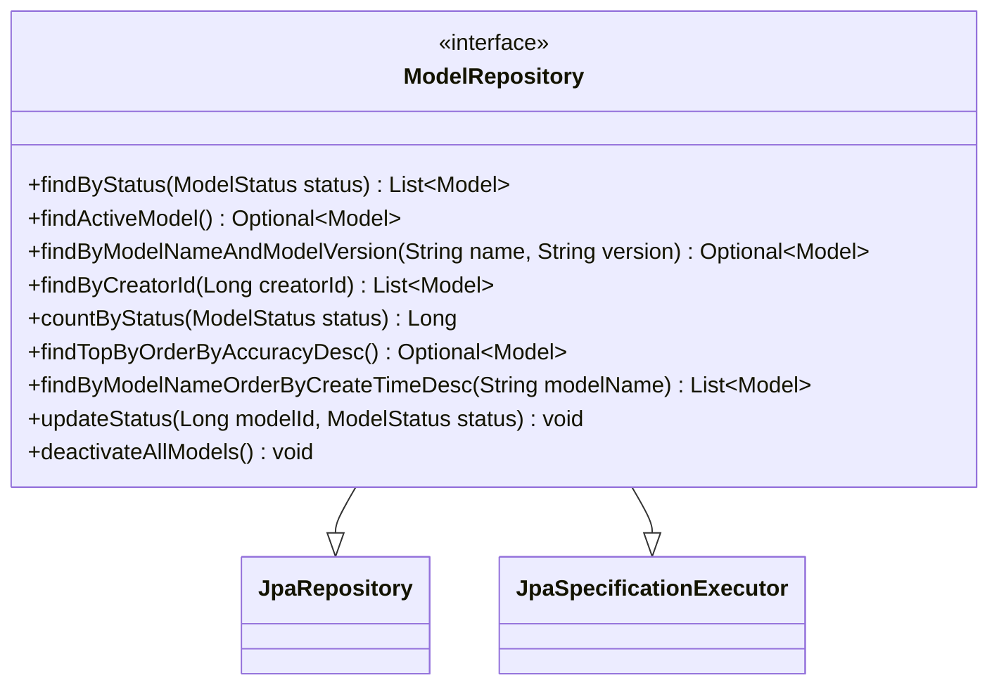

**方法说明:**

| 方法名                               | 返回值          | 参数                             | SQL/JPQL                                                     | 说明                 |
| ------------------------------------ | --------------- | -------------------------------- | ------------------------------------------------------------ | -------------------- |
| findByStatus                         | List<Model>     | ModelStatus status               | 自动生成                                                     | 按状态查询模型       |
| findActiveModel                      | Optional<Model> | 无                               | @Query("SELECT m FROM Model m WHERE m.status = 'ACTIVE'")    | 查询当前活跃模型     |
| findByModelNameAndModelVersion       | Optional<Model> | String name, String version      | 自动生成                                                     | 根据名称和版本查询   |
| findByCreatorId                      | List<Model>     | Long creatorId                   | 自动生成                                                     | 查询用户创建的模型   |
| countByStatus                        | Long            | ModelStatus status               | 自动生成                                                     | 统计状态模型数       |
| findTopByOrderByAccuracyDesc         | Optional<Model> | 无                               | 自动生成                                                     | 查询准确率最高的模型 |
| findByModelNameOrderByCreateTimeDesc | List<Model>     | String modelName                 | 自动生成                                                     | 按名称查询所有版本   |
| updateStatus                         | void            | Long modelId, ModelStatus status | @Modifying @Query                                            | 更新模型状态         |
| deactivateAllModels                  | void            | 无                               | @Modifying @Query("UPDATE Model m SET m.status = 'DISABLED' WHERE m.status = 'ACTIVE'") | 停用所有活跃模型     |

------

#### **3.3.3 RecognitionRecordRepository**

**接口名:** `com.ihdrs.repository.RecognitionRecordRepository`

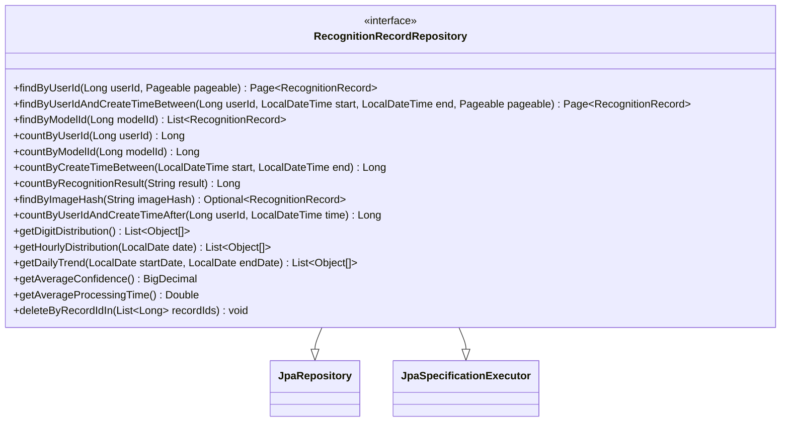

**方法说明:**

| 方法名                           | 返回值                      | 参数                                                         | SQL/JPQL                                                     | 说明                       |
| -------------------------------- | --------------------------- | ------------------------------------------------------------ | ------------------------------------------------------------ | -------------------------- |
| findByUserId                     | Page<RecognitionRecord>     | Long userId, Pageable pageable                               | 自动生成                                                     | 分页查询用户识别记录       |
| findByUserIdAndCreateTimeBetween | Page<RecognitionRecord>     | Long userId, LocalDateTime start, LocalDateTime end, Pageable pageable | 自动生成                                                     | 按时间范围查询             |
| countByUserId                    | Long                        | Long userId                                                  | 自动生成                                                     | 统计用户识别次数           |
| countByCreateTimeBetween         | Long                        | LocalDateTime start, LocalDateTime end                       | 自动生成                                                     | 统计时间段识别次数         |
| countByRecognitionResult         | Long                        | String result                                                | 自动生成                                                     | 统计各数字识别次数         |
| findByImageHash                  | Optional<RecognitionRecord> | String imageHash                                             | 自动生成                                                     | 根据图像哈希查询（去重用） |
| getDigitDistribution             | List<Object[]>              | 无                                                           | @Query("SELECT r.recognitionResult, COUNT(r) FROM RecognitionRecord r GROUP BY r.recognitionResult") | 获取数字分布统计           |
| getHourlyDistribution            | List<Object[]>              | LocalDate date                                               | @Query("SELECT HOUR(r.createTime), COUNT(r) FROM RecognitionRecord r WHERE DATE(r.createTime) = :date GROUP BY HOUR(r.createTime)") | 获取24小时分布             |
| getDailyTrend                    | List<Object[]>              | LocalDate startDate, LocalDate endDate                       | @Query 自定义                                                | 获取每日趋势               |
| getAverageConfidence             | BigDecimal                  | 无                                                           | @Query("SELECT AVG(r.confidence) FROM RecognitionRecord r")  | 计算平均置信度             |
| getAverageProcessingTime         | Double                      | 无                                                           | @Query("SELECT AVG(r.processingTime) FROM RecognitionRecord r") | 计算平均处理时间           |
| deleteByRecordIdIn               | void                        | List<Long> recordIds                                         | 自动生成                                                     | 批量删除记录               |

------

#### **3.3.4 TrainingTaskRepository**

**接口名:** `com.ihdrs.repository.TrainingTaskRepository`

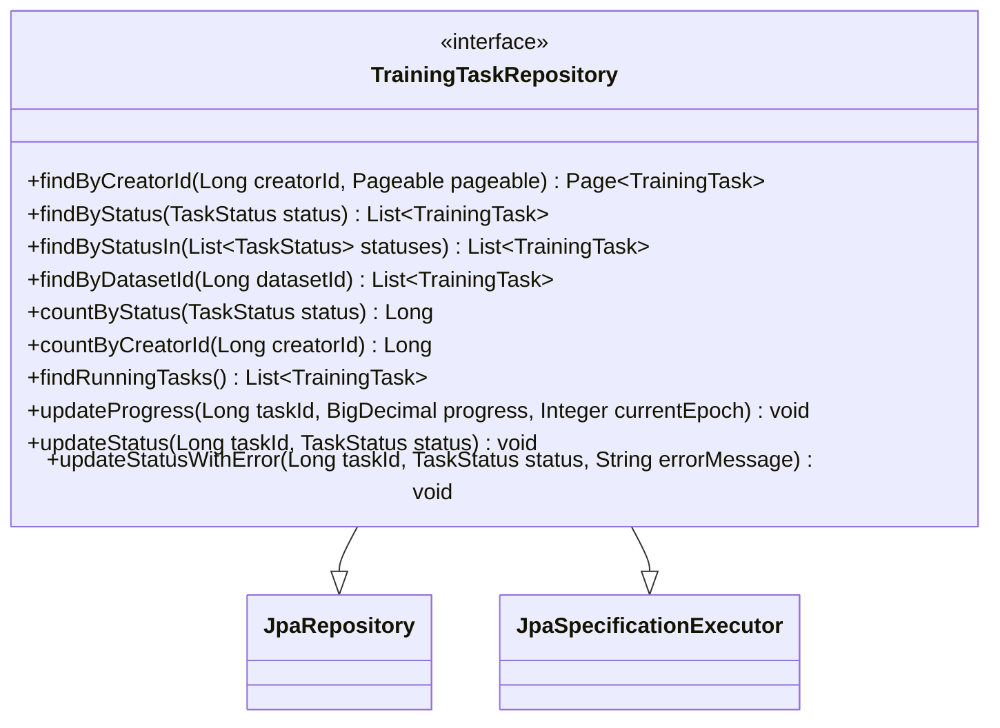

**方法说明:**

| 方法名                | 返回值             | 参数                                                   | SQL/JPQL                                                     | 说明                     |
| --------------------- | ------------------ | ------------------------------------------------------ | ------------------------------------------------------------ | ------------------------ |
| findByCreatorId       | Page<TrainingTask> | Long creatorId, Pageable pageable                      | 自动生成                                                     | 分页查询用户任务         |
| findByStatus          | List<TrainingTask> | TaskStatus status                                      | 自动生成                                                     | 按状态查询任务           |
| findByStatusIn        | List<TrainingTask> | List<TaskStatus> statuses                              | 自动生成                                                     | 按多个状态查询           |
| findByDatasetId       | List<TrainingTask> | Long datasetId                                         | 自动生成                                                     | 查询使用指定数据集的任务 |
| countByStatus         | Long               | TaskStatus status                                      | 自动生成                                                     | 统计状态任务数           |
| findRunningTasks      | List<TrainingTask> | 无                                                     | @Query("SELECT t FROM TrainingTask t WHERE t.status = 'RUNNING'") | 查询运行中任务           |
| updateProgress        | void               | Long taskId, BigDecimal progress, Integer currentEpoch | @Modifying @Query                                            | 更新任务进度             |
| updateStatus          | void               | Long taskId, TaskStatus status                         | @Modifying @Query                                            | 更新任务状态             |
| updateStatusWithError | void               | Long taskId, TaskStatus status, String errorMessage    | @Modifying @Query                                            | 更新状态并记录错误       |

------

#### **3.3.5 TrainingLogRepository**

**接口名:** `com.ihdrs.repository.TrainingLogRepository`

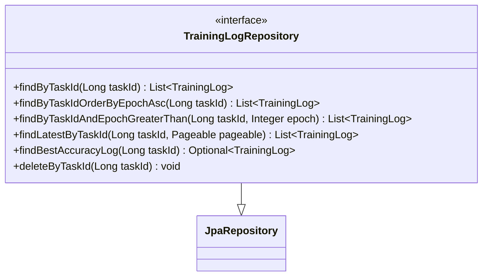

**方法说明:**

| 方法名                          | 返回值                | 参数                           | SQL/JPQL                                                     | 说明                     |
| ------------------------------- | --------------------- | ------------------------------ | ------------------------------------------------------------ | ------------------------ |
| findByTaskId                    | List<TrainingLog>     | Long taskId                    | 自动生成                                                     | 查询任务所有日志         |
| findByTaskIdOrderByEpochAsc     | List<TrainingLog>     | Long taskId                    | 自动生成                                                     | 按轮次排序查询           |
| findByTaskIdAndEpochGreaterThan | List<TrainingLog>     | Long taskId, Integer epoch     | 自动生成                                                     | 查询指定轮次之后的日志   |
| findLatestByTaskId              | List<TrainingLog>     | Long taskId, Pageable pageable | @Query                                                       | 查询最新N条日志          |
| findBestAccuracyLog             | Optional<TrainingLog> | Long taskId                    | @Query("SELECT l FROM TrainingLog l WHERE l.taskId = :taskId ORDER BY l.valAccuracy DESC LIMIT 1") | 查询最佳验证准确率的日志 |
| deleteByTaskId                  | void                  | Long taskId                    | 自动生成                                                     | 删除任务所有日志         |

------

#### **3.3.6 DatasetRepository**

**接口名:** `com.ihdrs.repository.DatasetRepository`

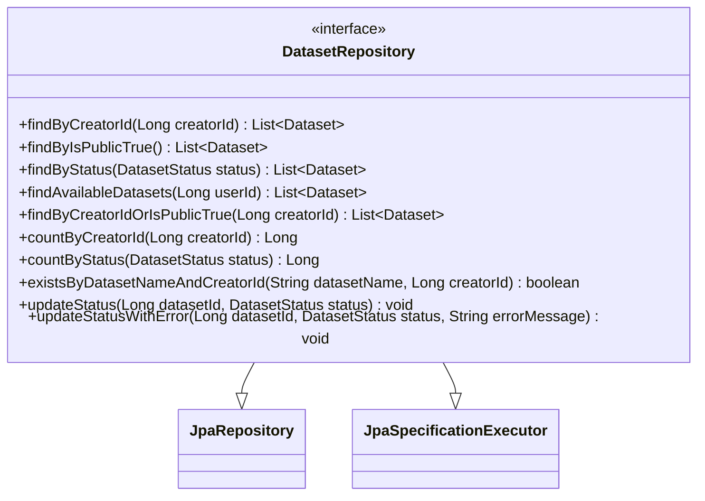

**方法说明:**

| 方法名                          | 返回值        | 参数                                 | SQL/JPQL                                                     | 说明                   |
| ------------------------------- | ------------- | ------------------------------------ | ------------------------------------------------------------ | ---------------------- |
| findByCreatorId                 | List<Dataset> | Long creatorId                       | 自动生成                                                     | 查询用户数据集         |
| findByIsPublicTrue              | List<Dataset> | 无                                   | 自动生成                                                     | 查询公开数据集         |
| findByStatus                    | List<Dataset> | DatasetStatus status                 | 自动生成                                                     | 按状态查询             |
| findAvailableDatasets           | List<Dataset> | Long userId                          | @Query("SELECT d FROM Dataset d WHERE (d.creatorId = :userId OR d.isPublic = true) AND d.status = 'AVAILABLE'") | 查询用户可用数据集     |
| existsByDatasetNameAndCreatorId | boolean       | String datasetName, Long creatorId   | 自动生成                                                     | 检查数据集名称是否重复 |
| updateStatus                    | void          | Long datasetId, DatasetStatus status | @Modifying @Query                                            | 更新数据集状态         |

------

#### **3.3.7 FeedbackRepository**

**接口名:** `com.ihdrs.repository.FeedbackRepository`

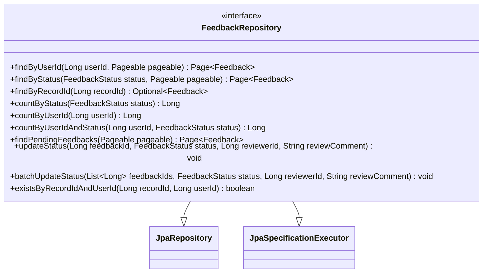

**方法说明:**

| 方法名                    | 返回值             | 参数                                                         | SQL/JPQL                                                     | 说明                           |
| ------------------------- | ------------------ | ------------------------------------------------------------ | ------------------------------------------------------------ | ------------------------------ |
| findByUserId              | Page<Feedback>     | Long userId, Pageable pageable                               | 自动生成                                                     | 分页查询用户反馈               |
| findByStatus              | Page<Feedback>     | FeedbackStatus status, Pageable pageable                     | 自动生成                                                     | 按状态分页查询                 |
| findByRecordId            | Optional<Feedback> | Long recordId                                                | 自动生成                                                     | 根据识别记录查询反馈           |
| countByStatus             | Long               | FeedbackStatus status                                        | 自动生成                                                     | 统计状态反馈数                 |
| countByUserId             | Long               | Long userId                                                  | 自动生成                                                     | 统计用户反馈数                 |
| findPendingFeedbacks      | Page<Feedback>     | Pageable pageable                                            | @Query("SELECT f FROM Feedback f WHERE f.status = 'PENDING' ORDER BY f.createTime ASC") | 查询待审核反馈                 |
| updateStatus              | void               | Long feedbackId, FeedbackStatus status, Long reviewerId, String reviewComment | @Modifying @Query                                            | 更新反馈状态                   |
| batchUpdateStatus         | void               | List<Long> feedbackIds, FeedbackStatus status, Long reviewerId, String reviewComment | @Modifying @Query                                            | 批量更新状态                   |
| existsByRecordIdAndUserId | boolean            | Long recordId, Long userId                                   | 自动生成                                                     | 检查用户是否已对该记录提交反馈 |

------

#### **3.3.8 OperationLogRepository**

**接口名:** `com.ihdrs.repository.OperationLogRepository`

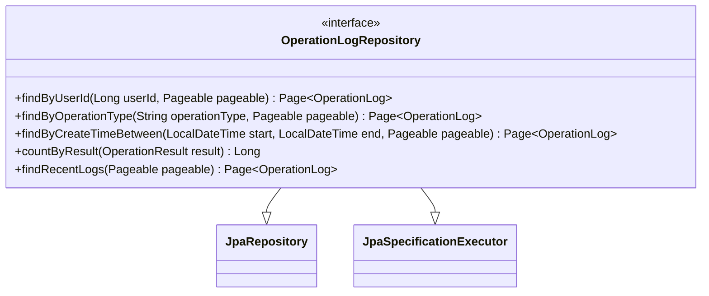

------

#### **3.3.9 UserLogRepository**

**接口名:** `com.ihdrs.repository.UserLogRepository`

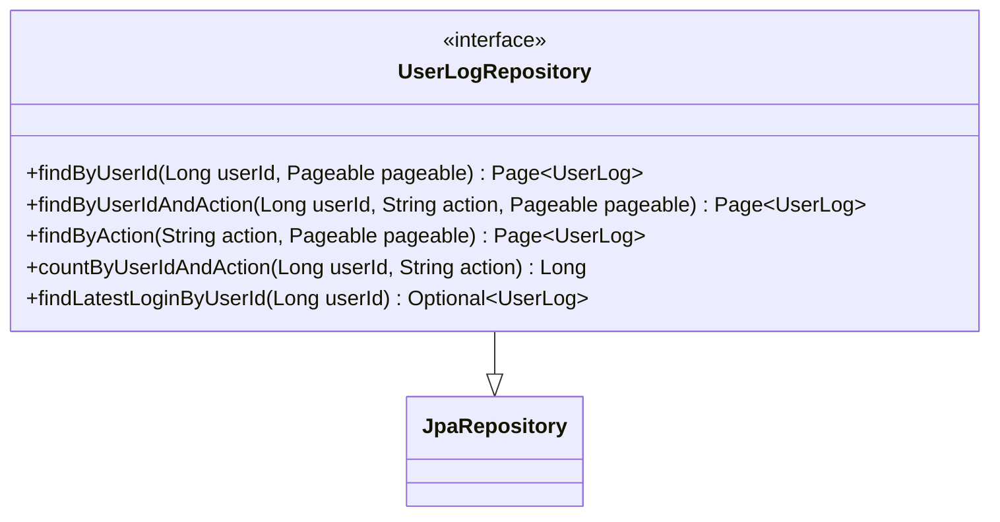

------

### **3.4 Service层详细设计**

#### **3.4.1 AuthService**

**类名:** `com.ihdrs.service.AuthService`

**类图:**

```mermaid
classDiagram
    class AuthService {
        -UserRepository userRepository
        -UserLogRepository userLogRepository
        -PasswordEncoder passwordEncoder
        -JwtUtil jwtUtil
        -RedisTemplate redisTemplate
        +login(LoginRequest request, HttpServletRequest httpRequest) LoginResponse
        +register(RegisterRequest request) RegisterResponse
        +validateToken(String token) UserInfo
        +logout(String token) void
        +refreshToken(String token) String
        -generateSalt() String
        -hashPassword(String password, String salt) String
        -verifyPassword(String rawPassword, String salt, String hashedPassword) boolean
        -recordLoginLog(User user, HttpServletRequest request) void
        -validateUsername(String username) void
        -validatePassword(String password) void
    }

    AuthService --> UserRepository
    AuthService --> UserLogRepository
    AuthService --> PasswordEncoder
    AuthService --> JwtUtil
    AuthService --> RedisTemplate
```

**方法详细设计:**

**login方法**

| 项目     | 描述                                                         |
| -------- | ------------------------------------------------------------ |
| 方法签名 | `LoginResponse login(LoginRequest request, HttpServletRequest httpRequest)` |
| 功能描述 | 用户登录认证                                                 |
| 输入参数 | request: 登录请求对象（包含username, password）<br>httpRequest: HTTP请求对象（用于获取IP、UA） |
| 输出     | LoginResponse: 包含token和用户信息                           |
| 异常     | AuthenticationException: 用户名或密码错误<br>AccountDisabledException: 账户已禁用 |

**处理流程:**

```
1.根据username查询用户
   ├── 用户不存在 → 抛出AuthenticationException("用户名或密码错误")
   └── 用户存在 → 继续

2.验证密码
   ├── 调用verifyPassword(rawPassword, user.salt, user.passwordHash)
   ├── 验证失败 → 抛出AuthenticationException("用户名或密码错误")
   └── 验证成功 → 继续

3.检查用户状态
   ├── status == DISABLED → 抛出AccountDisabledException("账户已被禁用")
   └── status == ACTIVE → 继续

4.生成JWT Token
   ├── 调用jwtUtil.generateToken(user)
   └── 设置过期时间为24小时

5.更新用户登录信息
   ├── 调用userRepository.updateLastLoginTime(userId, now)
   ├── 调用userRepository.incrementLoginCount(userId)
   └── 异步记录登录日志 recordLoginLog(user, httpRequest)

6.缓存Token到Redis（可选，用于单点登录控制）
   └── redisTemplate.opsForValue().set("token:" + userId, token, 24, TimeUnit.HOURS)

7.构建并返回LoginResponse
   └── 包含token, tokenType, expiresIn, userInfo
```

**算法说明 - 密码验证:**

```
输入: rawPassword (用户输入的明文密码)
      salt (数据库存储的盐值)
      hashedPassword (数据库存储的哈希密码)

步骤:
1.将rawPassword与salt拼接: combined = rawPassword + salt
2.使用BCrypt进行哈希: computedHash = BCrypt.hash(combined)
3.比较computedHash与hashedPassword
4.返回比较结果

注: 实际使用BCryptPasswordEncoder时，salt已内嵌在hash中，
    直接调用passwordEncoder.matches(rawPassword, hashedPassword)即可
```

------

**register方法**

| 项目     | 描述                                                         |
| -------- | ------------------------------------------------------------ |
| 方法签名 | `RegisterResponse register(RegisterRequest request)`         |
| 功能描述 | 用户注册                                                     |
| 输入参数 | request: 注册请求对象（包含username, password, email, phone） |
| 输出     | RegisterResponse: 包含新用户ID和用户名                       |
| 异常     | DuplicateException: 用户名或邮箱已存在<br>ValidationException: 参数验证失败 |

**处理流程:**

```
1.验证用户名格式
   ├── 长度3-50字符
   ├── 仅包含字母、数字、下划线
   └── 不满足 → 抛出ValidationException

2.验证密码强度
   ├── 长度6-20字符
   └── 不满足 → 抛出ValidationException

3.检查用户名唯一性
   ├── 调用userRepository.existsByUsername(username)
   ├── 存在 → 抛出DuplicateException("用户名已存在")
   └── 不存在 → 继续

4.检查邮箱唯一性（如提供）
   ├── 调用userRepository.existsByEmail(email)
   ├── 存在 → 抛出DuplicateException("邮箱已被注册")
   └── 不存在 → 继续

5.生成密码盐值和哈希
   ├── salt = generateSalt() // 32位随机字符串
   └── hashedPassword = hashPassword(password, salt)

6.创建用户实体
   ├── 设置username, passwordHash, salt
   ├── 设置email, phone（可选）
   ├── 设置role = USER, status = ACTIVE
   ├── 设置loginCount = 0
   └── 设置createTime = now

7.保存用户
   └── userRepository.save(user)

8.构建并返回RegisterResponse
   └── 包含userId, username
```

------

**validateToken方法**

| 项目     | 描述                                       |
| -------- | ------------------------------------------ |
| 方法签名 | `UserInfo validateToken(String token)`     |
| 功能描述 | 验证JWT Token有效性并返回用户信息          |
| 输入参数 | token: JWT令牌字符串                       |
| 输出     | UserInfo: 用户基本信息                     |
| 异常     | AuthenticationException: Token无效或已过期 |

**处理流程:**

```
1.解析Token
   ├── 调用jwtUtil.parseToken(token)
   ├── 解析失败 → 抛出AuthenticationException("Token无效")
   └── 解析成功 → 获取Claims

2.检查Token是否过期
   ├── 获取expiration时间
   ├── expiration < now → 抛出AuthenticationException("Token已过期")
   └── 未过期 → 继续

3.提取用户ID
   └── userId = claims.get("userId", Long.class)

4.查询用户信息
   ├── 先从Redis缓存查询
   ├── 缓存命中 → 返回缓存的UserInfo
   └── 缓存未命中 → 从数据库查询

5.验证用户状态
   ├── status == DISABLED → 抛出AuthenticationException("账户已被禁用")
   └── status == ACTIVE → 继续

6.构建UserInfo并缓存
   ├── 缓存到Redis，TTL = 30分钟
   └── 返回UserInfo
```

------

#### **3.4.2 RecognitionService**

**类名:** `com.ihdrs.service.RecognitionService`

**类图:**

```mermaid
classDiagram
    class RecognitionService {
        -RecognitionRecordRepository recordRepository
        -ModelRepository modelRepository
        -UserRepository userRepository
        -RedisTemplate redisTemplate
        -RestTemplate restTemplate
        -FileStorageService fileStorageService
        -String pythonServiceUrl
        +recognize(RecognitionRequest request, Long userId) RecognitionResponse
        +recognizeMulti(RecognitionRequest request, Long userId) MultiRecognitionResponse
        +getHistory(Long userId, PageRequest pageRequest, HistoryFilter filter) PageResponse~RecognitionRecordVO~
        +getRecordDetail(Long recordId, Long userId) RecognitionRecordVO
        +deleteRecord(Long recordId, Long userId) void
        +batchDeleteRecords(List~Long~ recordIds, Long userId) void
        -callPythonService(String imageData, String endpoint) PythonRecognitionResult
        -saveRecognitionRecord(RecognitionRequest request, PythonRecognitionResult result, Long userId, Long modelId) RecognitionRecord
        -calculateImageHash(String imageData) String
        -checkDuplicateImage(String imageHash, Long userId) Optional~RecognitionRecord~
        -saveImageFile(String imageData) String
        -determineNeedRewrite(BigDecimal confidence) boolean
    }

    RecognitionService --> RecognitionRecordRepository
    RecognitionService --> ModelRepository
    RecognitionService --> RedisTemplate
    RecognitionService --> RestTemplate
    RecognitionService --> FileStorageService
```

**方法详细设计:**

**recognize方法**

| 项目     | 描述                                                         |
| -------- | ------------------------------------------------------------ |
| 方法签名 | `RecognitionResponse recognize(RecognitionRequest request, Long userId)` |
| 功能描述 | 执行单数字识别                                               |
| 输入参数 | request: 识别请求（包含imageData, inputType, sessionId, clientInfo）<br>userId: 当前用户ID（可为null表示匿名） |
| 输出     | RecognitionResponse: 识别结果                                |
| 异常     | ServiceUnavailableException: Python服务不可用<br>ImageProcessException: 图像处理失败 |

**处理流程:**

```
1.计算图像哈希值
   └── imageHash = calculateImageHash(request.imageData)

2.检查缓存（Redis）
   ├── cacheKey = "ihdrs:recog:" + imageHash
   ├── 缓存命中 → 直接返回缓存结果
   └── 缓存未命中 → 继续

3.检查重复图像（数据库，最近1小时内）
   ├── 调用checkDuplicateImage(imageHash, userId)
   ├── 存在重复 → 可选：返回历史结果或继续识别
   └── 无重复 → 继续

4.获取当前活跃模型
   ├── 调用modelRepository.findActiveModel()
   ├── 无活跃模型 → 抛出ServiceUnavailableException("无可用识别模型")
   └── 有活跃模型 → 获取modelId

5.调用Python识别服务
   ├── 记录开始时间 startTime = System.currentTimeMillis()
   ├── 调用callPythonService(request.imageData, "/api/recognize")
   ├── 记录处理时间 processingTime = currentTime - startTime
   ├── 调用失败 → 抛出ServiceUnavailableException
   └── 调用成功 → 获取PythonRecognitionResult

6.保存识别图像文件
   └── imagePath = saveImageFile(request.imageData)

7.保存识别记录到数据库
   ├── 构建RecognitionRecord实体
   ├── 设置userId, modelId, recognitionResult, confidence
   ├── 设置probabilities, imagePath, imageHash
   ├── 设置inputType, processingTime, sessionId, clientInfo
   ├── 设置createTime = now
   └── 调用recordRepository.save(record)

8.缓存识别结果（Redis）
   ├── 构建缓存对象
   └── redisTemplate.opsForValue().set(cacheKey, result, 24, TimeUnit.HOURS)

9.判断是否需要重写
   └── needRewrite = determineNeedRewrite(confidence)

10.构建并返回RecognitionResponse
    ├── 设置recordId, recognitionResult, confidence
    ├── 设置probabilities, probabilitiesMap
    ├── 设置processingTime, modelName, modelVersion
    ├── 设置needRewrite, message
    └── 返回
```

**算法说明 - 判断是否需要重写:**

```
输入: confidence (置信度，BigDecimal)

规则:
1.如果 confidence < 0.8（80%），返回 true
2.如果最高置信度与次高置信度差值 < 0.3，返回 true
3.否则，返回 false

伪代码:
function determineNeedRewrite(confidence, probabilities):
    if confidence < 0.8:
        return true
    
    sortedProbs = sort(probabilities, descending)
    margin = sortedProbs[0] - sortedProbs[1]
    
    if margin < 0.3:
        return true
    
    return false
```

------

**recognizeMulti方法**

| 项目     | 描述                                                         |
| -------- | ------------------------------------------------------------ |
| 方法签名 | `MultiRecognitionResponse recognizeMulti(RecognitionRequest request, Long userId)` |
| 功能描述 | 执行多数字序列识别                                           |
| 输入参数 | request: 识别请求<br>userId: 当前用户ID                      |
| 输出     | MultiRecognitionResponse: 多数字识别结果                     |
| 异常     | ServiceUnavailableException: Python服务不可用<br>ImageProcessException: 图像处理失败 |

**处理流程:**

```
1.调用Python多数字识别服务
   ├── 调用callPythonService(request.imageData, "/api/recognize_multi")
   └── 获取MultiDigitResult（包含分割后的各数字及其结果）

2.处理识别结果
   ├── 遍历各数字结果
   ├── 构建DigitResult列表
   └── 计算平均置信度

3.保存识别记录
   ├── 构建RecognitionRecord
   ├── 设置inputType = MULTI
   ├── 设置sequenceResult = 拼接的数字序列
   └── 保存到数据库

4.构建并返回MultiRecognitionResponse
   ├── 设置sequence, count, digits
   ├── 设置averageConfidence, processingTime, recordId
   └── 返回
```

------

**callPythonService方法**

| 项目     | 描述                                                         |
| -------- | ------------------------------------------------------------ |
| 方法签名 | `private PythonRecognitionResult callPythonService(String imageData, String endpoint)` |
| 功能描述 | 调用Python模型服务进行识别                                   |
| 输入参数 | imageData: Base64图像数据<br>endpoint: API端点（如"/api/recognize"） |
| 输出     | PythonRecognitionResult: Python服务返回的识别结果            |
| 异常     | ServiceUnavailableException: 服务不可用或超时                |

**处理流程:**

```
1.构建请求体
   ├── PythonRecognitionRequest request = new PythonRecognitionRequest()
   └── request.setImageData(imageData)

2.设置HTTP请求头
   ├── headers.setContentType(MediaType.APPLICATION_JSON)
   └── HttpEntity<PythonRecognitionRequest> entity = new HttpEntity<>(request, headers)

3.发送HTTP请求
   ├── url = pythonServiceUrl + endpoint
   ├── 设置超时时间：连接5秒，读取30秒
   ├── try:
   │   └── response = restTemplate.postForEntity(url, entity, PythonRecognitionResult.class)
   └── catch (Exception e):
       └── throw new ServiceUnavailableException("模型服务不可用: " + e.getMessage())

4.处理响应
   ├── if response.getStatusCode() != 200:
   │   └── throw new ServiceUnavailableException("模型服务返回错误")
   └── return response.getBody()
```

------

#### **3.4.3 TrainingTaskService**

**类名:** `com.ihdrs.service.TrainingTaskService`

**类图:**

```mermaid
classDiagram
    class TrainingTaskService {
        -TrainingTaskRepository taskRepository
        -TrainingLogRepository logRepository
        -DatasetRepository datasetRepository
        -ModelRepository modelRepository
        -UserRepository userRepository
        -RedisTemplate redisTemplate
        -RestTemplate restTemplate
        -WebSocketService webSocketService
        -String pythonServiceUrl
        -ExecutorService executorService
        +createTask(CreateTrainingTaskRequest request, Long userId) TrainingTaskResponse
        +getTaskList(Long userId, PageRequest pageRequest, TaskFilter filter) PageResponse~TrainingTaskResponse~
        +getTaskDetail(Long taskId, Long userId) TrainingTaskResponse
        +getTaskProgress(Long taskId) TrainingProgressResponse
        +getTaskLogs(Long taskId, Integer fromEpoch) List~TrainingLogEntry~
        +cancelTask(Long taskId, Long userId) void
        +getConfusionMatrix(Long taskId) ConfusionMatrixResponse
        -startTrainingAsync(TrainingTask task) void
        -callPythonTrainService(TrainingTask task) void
        -updateTaskProgress(Long taskId, TrainingProgressUpdate update) void
        -handleTrainingCompleted(Long taskId, TrainingResult result) void
        -handleTrainingFailed(Long taskId, String errorMessage) void
        -createModelFromTask(TrainingTask task, TrainingResult result) Model
        -saveTrainingLog(Long taskId, EpochResult epochResult) void
        -notifyProgressViaWebSocket(Long taskId, TrainingProgressResponse progress) void
    }

    TrainingTaskService --> TrainingTaskRepository
    TrainingTaskService --> TrainingLogRepository
    TrainingTaskService --> DatasetRepository
    TrainingTaskService --> ModelRepository
    TrainingTaskService --> RedisTemplate
    TrainingTaskService --> RestTemplate
    TrainingTaskService --> WebSocketService
    TrainingTaskService --> ExecutorService
```

**方法详细设计:**

**createTask方法**

| 项目     | 描述                                                         |
| -------- | ------------------------------------------------------------ |
| 方法签名 | `TrainingTaskResponse createTask(CreateTrainingTaskRequest request, Long userId)` |
| 功能描述 | 创建训练任务并启动异步训练                                   |
| 输入参数 | request: 创建任务请求<br>userId: 创建者用户ID                |
| 输出     | TrainingTaskResponse: 任务信息                               |
| 异常     | ResourceNotFoundException: 数据集不存在<br>ValidationException: 配置参数无效 |

**处理流程:**

```
1.验证数据集
   ├── 调用datasetRepository.findById(request.datasetId)
   ├── 数据集不存在 → 抛出ResourceNotFoundException
   ├── 数据集状态 != AVAILABLE → 抛出ValidationException("数据集不可用")
   └── 验证用户是否有权限使用该数据集

2.验证训练配置
   ├── 验证modelType是否支持
   ├── 验证trainingConfig各参数范围
   └── 验证不通过 → 抛出ValidationException

3.创建训练任务实体
   ├── 设置taskName, creatorId, datasetId
   ├── 设置status = PENDING
   ├── 设置progress = 0, currentEpoch = 0
   ├── 设置totalEpochs = request.trainingConfig.epochs
   ├── 设置trainingConfig = JSON.stringify(request.trainingConfig)
   ├── 设置datasetConfig（从数据集信息构建）
   ├── 设置createTime = now
   └── 保存到数据库 taskRepository.save(task)

4.启动异步训练
   └── executorService.submit(() -> startTrainingAsync(task))

5.构建并返回TrainingTaskResponse
   └── 包含taskId, taskName, status, progress等信息
```

------

**startTrainingAsync方法**

| 项目     | 描述                                                 |
| -------- | ---------------------------------------------------- |
| 方法签名 | `private void startTrainingAsync(TrainingTask task)` |
| 功能描述 | 异步执行训练任务                                     |
| 输入参数 | task: 训练任务实体                                   |
| 输出     | 无（异步执行）                                       |

**处理流程:**

```
1.更新任务状态为RUNNING
   ├── task.setStatus(RUNNING)
   ├── task.setStartTime(now)
   └── taskRepository.save(task)

2.调用Python训练服务
   ├── try:
   │   └── callPythonTrainService(task)
   └── catch (Exception e):
       ├── handleTrainingFailed(task.taskId, e.getMessage())
       └── return

3.轮询训练进度（或通过回调接收）
   ├── while task is running:
   │   ├── 从Redis获取进度信息
   │   ├── 更新数据库进度
   │   ├── 保存Epoch日志
   │   ├── 通过WebSocket推送进度
   │   └── sleep(1000) // 每秒检查一次
   └── 任务完成时处理结果

4.处理训练完成
   ├── if success:
   │   └── handleTrainingCompleted(taskId, result)
   └── if failed:
       └── handleTrainingFailed(taskId, errorMessage)
```

------

**handleTrainingCompleted方法**

| 项目     | 描述                                                         |
| -------- | ------------------------------------------------------------ |
| 方法签名 | `private void handleTrainingCompleted(Long taskId, TrainingResult result)` |
| 功能描述 | 处理训练完成逻辑                                             |
| 输入参数 | taskId: 任务ID<br>result: 训练结果                           |

**处理流程:**

```
1.获取任务信息
   └── task = taskRepository.findById(taskId).orElseThrow()

2.创建模型记录
   └── model = createModelFromTask(task, result)

3.更新任务信息
   ├── task.setStatus(COMPLETED)
   ├── task.setProgress(100)
   ├── task.setCurrentEpoch(task.totalEpochs)
   ├── task.setFinalAccuracy(result.accuracy)
   ├── task.setFinalLoss(result.loss)
   ├── task.setBestAccuracy(result.bestAccuracy)
   ├── task.setConfusionMatrix(JSON.stringify(result.confusionMatrix))
   ├── task.setClassNames(result.classNames)
   ├── task.setModelId(model.modelId)
   ├── task.setEndTime(now)
   └── taskRepository.save(task)

4.清理Redis缓存
   └── redisTemplate.delete("ihdrs:training:progress:" + taskId)

5.发送WebSocket通知
   └── notifyProgressViaWebSocket(taskId, buildCompletedProgress(task))
```

------

**cancelTask方法**

| 项目     | 描述                                                         |
| -------- | ------------------------------------------------------------ |
| 方法签名 | `void cancelTask(Long taskId, Long userId)`                  |
| 功能描述 | 取消训练任务                                                 |
| 输入参数 | taskId: 任务ID<br>userId: 操作用户ID                         |
| 异常     | ResourceNotFoundException: 任务不存在<br>ForbiddenException: 无权限<br>BusinessException: 任务状态不允许取消 |

**处理流程:**

```
1.获取任务信息
   ├── task = taskRepository.findById(taskId).orElseThrow()
   └── 任务不存在 → 抛出ResourceNotFoundException

2.验证权限
   ├── if task.creatorId != userId && ! user.isAdmin():
   │   └── 抛出ForbiddenException("无权限取消此任务")
   └── 权限验证通过 → 继续

3.验证任务状态
   ├── if task.status not in [PENDING, RUNNING]:
   │   └── 抛出BusinessException("任务状态不允许取消")
   └── 状态允许 → 继续

4.调用Python服务取消训练
   ├── if task.status == RUNNING:
   │   └── restTemplate.post(pythonServiceUrl + "/api/train/cancel", taskId)
   └── 继续

5.更新任务状态
   ├── task.setStatus(CANCELLED)
   ├── task.setEndTime(now)
   ├── task.setErrorMessage("用户取消")
   └── taskRepository.save(task)

6.清理Redis缓存
   └── redisTemplate.delete("ihdrs:training:progress:" + taskId)

7.发送WebSocket通知
   └── notifyProgressViaWebSocket(taskId, buildCancelledProgress(task))
```

------

#### **3.4.4 ModelManagementService**

**类名:** `com.ihdrs.service.ModelManagementService`

**类图:**

```mermaid
classDiagram
    class ModelManagementService {
        -ModelRepository modelRepository
        -RecognitionRecordRepository recordRepository
        -TrainingTaskRepository taskRepository
        -RestTemplate restTemplate
        -String pythonServiceUrl
        +getModelList(PageRequest pageRequest, ModelFilter filter) PageResponse~ModelResponse~
        +getModelDetail(Long modelId) ModelResponse
        +activateModel(Long modelId, Long userId) ModelResponse
        +disableModel(Long modelId, Long userId) void
        +enableModel(Long modelId, Long userId) void
        +deleteModel(Long modelId, Long userId) void
        +batchDeleteModels(List~Long~ modelIds, Long userId) void
        +getModelVersions(String modelName) List~ModelResponse~
        +compareModels(Long modelId1, Long modelId2) ModelCompareResponse
        +getModelStatistics() ModelStatisticsResponse
        -notifyPythonServiceModelChange(Long modelId) void
        -validateModelDeletable(Model model) void
    }

    ModelManagementService --> ModelRepository
    ModelManagementService --> RecognitionRecordRepository
    ModelManagementService --> TrainingTaskRepository
    ModelManagementService --> RestTemplate
```

**方法详细设计:**

**activateModel方法**

| 项目     | 描述                                                         |
| -------- | ------------------------------------------------------------ |
| 方法签名 | `ModelResponse activateModel(Long modelId, Long userId)`     |
| 功能描述 | 激活指定模型为当前使用模型                                   |
| 输入参数 | modelId: 要激活的模型ID<br>userId: 操作用户ID（需要管理员权限） |
| 输出     | ModelResponse: 激活后的模型信息                              |
| 异常     | ResourceNotFoundException: 模型不存在<br>BusinessException: 模型状态不允许激活 |

**处理流程:**

```
1.获取模型信息
   ├── model = modelRepository.findById(modelId).orElseThrow()
   └── 模型不存在 → 抛出ResourceNotFoundException

2.验证模型状态
   ├── if model.status == TRAINING:
   │   └── 抛出BusinessException("训练中的模型不能激活")
   ├── if model.status == ACTIVE:
   │   └── 返回当前模型信息（已经是活跃状态）
   └── 状态允许 → 继续

3.停用当前活跃模型（事务内）
   ├── 调用modelRepository.deactivateAllModels()
   └── 将所有ACTIVE状态的模型设为DISABLED

4.激活目标模型
   ├── model.setStatus(ACTIVE)
   ├── model.setUpdateTime(now)
   └── modelRepository.save(model)

5.通知Python服务更换模型
   └── notifyPythonServiceModelChange(modelId)

6.构建并返回ModelResponse
   └── 包含模型完整信息
```

------

**compareModels方法**

| 项目     | 描述                                                         |
| -------- | ------------------------------------------------------------ |
| 方法签名 | `ModelCompareResponse compareModels(Long modelId1, Long modelId2)` |
| 功能描述 | 对比两个模型的性能指标                                       |
| 输入参数 | modelId1: 第一个模型ID<br>modelId2: 第二个模型ID             |
| 输出     | ModelCompareResponse: 对比结果                               |
| 异常     | ResourceNotFoundException: 模型不存在                        |

**处理流程:**

```
1.获取两个模型信息
   ├── model1 = modelRepository.findById(modelId1).orElseThrow()
   └── model2 = modelRepository.findById(modelId2).orElseThrow()

2.计算差值
   ├── accuracyDiff = model1.accuracy - model2.accuracy
   └── lossDiff = model1.loss - model2.loss

3.生成对比详情列表
   ├── 对比项：准确率、损失值、训练样本数、文件大小、创建时间
   └── 每项标注优劣（BETTER/WORSE/EQUAL）

4.生成推荐建议
   ├── if accuracyDiff > 0.01:
   │   └── recommendation = "推荐使用模型1，准确率更高"
   ├── elif accuracyDiff < -0.01:
   │   └── recommendation = "推荐使用模型2，准确率更高"
   └── else:
       └── recommendation = "两个模型性能相近，建议选择较新的版本"

5.构建并返回ModelCompareResponse
   └── 包含model1, model2, accuracyDiff, lossDiff, recommendation, comparisonDetails
```

------

#### **3.4.5 DatasetService**

**类名:** `com.ihdrs.service.DatasetService`

**类图:**

```mermaid
classDiagram
    class DatasetService {
        -DatasetRepository datasetRepository
        -TrainingTaskRepository taskRepository
        -FileStorageService fileStorageService
        -ExecutorService executorService
        -String uploadPath
        +uploadDataset(MultipartFile file, DatasetUploadRequest request, Long userId) DatasetResponse
        +getMyDatasets(Long userId, PageRequest pageRequest) PageResponse~DatasetResponse~
        +getPublicDatasets(PageRequest pageRequest) PageResponse~DatasetResponse~
        +getAvailableDatasets(Long userId) List~DatasetResponse~
        +getDatasetDetail(Long datasetId, Long userId) DatasetResponse
        +updateDataset(Long datasetId, DatasetUpdateRequest request, Long userId) DatasetResponse
        +setDatasetPublic(Long datasetId, Boolean isPublic, Long userId) void
        +deleteDataset(Long datasetId, Long userId) void
        -processDatasetAsync(Dataset dataset, String filePath) void
        -extractAndValidateDataset(String zipPath, String extractPath) DatasetInfo
        -validateDatasetStructure(String extractPath) void
        -analyzeDatasetImages(String extractPath) ImageAnalysisResult
        -countSamples(String path) SampleCount
        -deleteDatasetFiles(Dataset dataset) void
    }

    DatasetService --> DatasetRepository
    DatasetService --> TrainingTaskRepository
    DatasetService --> FileStorageService
    DatasetService --> ExecutorService
```

**方法详细设计:**

**uploadDataset方法**

| 项目     | 描述                                                         |
| -------- | ------------------------------------------------------------ |
| 方法签名 | `DatasetResponse uploadDataset(MultipartFile file, DatasetUploadRequest request, Long userId)` |
| 功能描述 | 上传数据集ZIP文件并异步处理                                  |
| 输入参数 | file: ZIP文件<br>request: 上传请求信息<br>userId: 上传用户ID |
| 输出     | DatasetResponse: 数据集信息（状态为PROCESSING）              |
| 异常     | ValidationException: 文件格式或大小不符<br>DuplicateException: 数据集名称重复 |

**处理流程:**

```
1.验证文件
   ├── 检查文件是否为空
   ├── 检查文件大小 <= 500MB
   ├── 检查文件扩展名为.zip
   ├── 检查文件Magic Number（PK\x03\x04）
   └── 验证不通过 → 抛出ValidationException

2.检查数据集名称唯一性
   ├── 调用datasetRepository.existsByDatasetNameAndCreatorId(name, userId)
   ├── 存在 → 抛出DuplicateException("数据集名称已存在")
   └── 不存在 → 继续

3.保存文件到临时目录
   ├── fileName = UUID.randomUUID() + ".zip"
   ├── filePath = uploadPath + "/datasets/" + fileName
   └── file.transferTo(new File(filePath))

4.创建数据集记录
   ├── dataset.setDatasetName(request.datasetName)
   ├── dataset.setDescription(request.description)
   ├── dataset.setCreatorId(userId)
   ├── dataset.setFilePath(filePath)
   ├── dataset.setStatus(UPLOADING)
   ├── dataset.setIsPublic(request.isPublic ?: false)
   ├── dataset.setFileSize(file.getSize())
   ├── dataset.setCreateTime(now)
   └── datasetRepository.save(dataset)

5.启动异步处理
   └── executorService.submit(() -> processDatasetAsync(dataset, filePath))

6.构建并返回DatasetResponse
   └── 状态为PROCESSING，提示"正在处理中"
```

------

**processDatasetAsync方法**

| 项目     | 描述                                                         |
| -------- | ------------------------------------------------------------ |
| 方法签名 | `private void processDatasetAsync(Dataset dataset, String filePath)` |
| 功能描述 | 异步处理上传的数据集（解压、验证、分析）                     |
| 输入参数 | dataset: 数据集实体<br>filePath: ZIP文件路径                 |

**处理流程:**

```
1.更新状态为PROCESSING
   ├── dataset.setStatus(PROCESSING)
   └── datasetRepository.save(dataset)

2.解压文件
   ├── extractPath = uploadPath + "/datasets/" + dataset.datasetId
   ├── try:
   │   └── ZipUtil.unzip(filePath, extractPath)
   └── catch (Exception e):
       ├── dataset.setStatus(ERROR)
       ├── dataset.setErrorMessage("解压失败: " + e.getMessage())
       ├── datasetRepository.save(dataset)
       └── return

3.验证数据集结构
   ├── try:
   │   └── validateDatasetStructure(extractPath)
   └── catch (ValidationException e):
       ├── dataset.setStatus(ERROR)
       ├── dataset.setErrorMessage(e.getMessage())
       ├── deleteDirectory(extractPath)
       ├── datasetRepository.save(dataset)
       └── return

4.分析数据集
   ├── 统计类别数量
   ├── 统计训练集样本数
   ├── 统计测试集样本数（如有）
   ├── 分析图像尺寸和格式
   └── 获取类别名称列表

5.更新数据集信息
   ├── dataset.setDirName(extractPath)
   ├── dataset.setNumClasses(classCount)
   ├── dataset.setNumSamples(totalSamples)
   ├── dataset.setTrainSamples(trainCount)
   ├── dataset.setTestSamples(testCount)
   ├── dataset.setImageWidth(imageWidth)
   ├── dataset.setImageHeight(imageHeight)
   ├── dataset.setImageFormat(imageFormat)
   ├── dataset.setClassNames(String.join(",", classNames))
   ├── dataset.setStatus(AVAILABLE)
   ├── dataset.setUpdateTime(now)
   └── datasetRepository.save(dataset)

6.清理临时ZIP文件（可选）
   └── new File(filePath).delete()
```

------

**validateDatasetStructure方法**

| 项目     | 描述                                                        |
| -------- | ----------------------------------------------------------- |
| 方法签名 | `private void validateDatasetStructure(String extractPath)` |
| 功能描述 | 验证数据集目录结构是否符合要求                              |
| 输入参数 | extractPath: 解压后的目录路径                               |
| 异常     | ValidationException: 结构不符合要求                         |

**验证规则:**

```
期望的目录结构:
dataset/
├── train/              # 必须存在
│   ├── 0/              # 类别目录（数字或名称）
│   │   ├── img001.jpg  # 图像文件
│   │   └── img002.png
│   ├── 1/
│   └── ...
└── test/               # 可选
    ├── 0/
    ├── 1/
    └── ...

验证步骤:
1.检查train目录是否存在
   └── 不存在 → 抛出ValidationException("缺少train目录")

2.检查train目录下是否有子目录（类别）
   └── 无子目录 → 抛出ValidationException("train目录下无类别子目录")

3.检查每个类别目录下是否有图像文件
   ├── 遍历train下的每个子目录
   ├── 检查是否包含.jpg/.jpeg/.png/.bmp文件
   └── 无图像 → 抛出ValidationException("类别目录[X]下无图像文件")

4.检查类别数量
   ├── classCount < 2 → 抛出ValidationException("至少需要2个类别")
   └── classCount > 100 → 抛出ValidationException("类别数量不能超过100")

5.如存在test目录，验证其结构与train一致
   └── 类别应与train相同
```

------

**deleteDataset方法**

| 项目     | 描述                                                         |
| -------- | ------------------------------------------------------------ |
| 方法签名 | `void deleteDataset(Long datasetId, Long userId)`            |
| 功能描述 | 删除数据集                                                   |
| 输入参数 | datasetId: 数据集ID<br>userId: 操作用户ID                    |
| 异常     | ResourceNotFoundException: 数据集不存在<br>ForbiddenException: 无权限<br>BusinessException: 数据集被使用中 |

**处理流程:**

```
1.获取数据集信息
   └── dataset = datasetRepository.findById(datasetId).orElseThrow()

2.验证权限
   ├── if dataset.creatorId != userId && !user.isAdmin():
   │   └── 抛出ForbiddenException("无权限删除此数据集")
   └── 权限验证通过 → 继续

3.检查数据集是否被训练任务使用
   ├── tasks = taskRepository.findByDatasetId(datasetId)
   ├── runningTasks = tasks.filter(t -> t.status in [PENDING, RUNNING])
   ├── if runningTasks.isNotEmpty():
   │   └── 抛出BusinessException("数据集正在被训练任务使用")
   └── 无运行中任务 → 继续

4.删除文件
   ├── 删除解压目录 deleteDirectory(dataset.dirName)
   └── 删除ZIP文件 new File(dataset.filePath).delete()

5.删除数据库记录
   └── datasetRepository.delete(dataset)
```

------

#### **3.4.6 FeedbackService**

**类名:** `com.ihdrs.service.FeedbackService`

**类图:**

```mermaid
classDiagram
    class FeedbackService {
        -FeedbackRepository feedbackRepository
        -RecognitionRecordRepository recordRepository
        -UserRepository userRepository
        +submitFeedback(FeedbackRequest request, Long userId) FeedbackResponse
        +getUserFeedbackList(Long userId, PageRequest pageRequest, FeedbackFilter filter) PageResponse~FeedbackResponse~
        +getAllFeedbackList(PageRequest pageRequest, FeedbackFilter filter) PageResponse~FeedbackResponse~
        +getFeedbackDetail(Long feedbackId, Long userId) FeedbackResponse
        +reviewFeedback(Long feedbackId, FeedbackReviewRequest request, Long reviewerId) FeedbackResponse
        +batchReviewFeedback(BatchReviewRequest request, Long reviewerId) BatchReviewResponse
        +deleteFeedback(Long feedbackId, Long userId) void
        +getFeedbackStatistics(Long userId) FeedbackStatisticsResponse
        -validateFeedbackSubmission(Long recordId, Long userId) RecognitionRecord
        -buildFeedbackResponse(Feedback feedback) FeedbackResponse
    }

    FeedbackService --> FeedbackRepository
    FeedbackService --> RecognitionRecordRepository
    FeedbackService --> UserRepository
```

**方法详细设计:**

**submitFeedback方法**

| 项目     | 描述                                                         |
| -------- | ------------------------------------------------------------ |
| 方法签名 | `FeedbackResponse submitFeedback(FeedbackRequest request, Long userId)` |
| 功能描述 | 用户提交识别反馈                                             |
| 输入参数 | request: 反馈请求<br>userId: 提交用户ID                      |
| 输出     | FeedbackResponse: 反馈信息                                   |
| 异常     | ResourceNotFoundException: 识别记录不存在<br>DuplicateException: 已提交过反馈<br>ForbiddenException: 无权限 |

**处理流程:**

```
1.验证识别记录
   ├── record = recordRepository.findById(request.recordId).orElseThrow()
   ├── 记录不存在 → 抛出ResourceNotFoundException
   └── 继续

2.验证用户权限
   ├── if record.userId != null && record.userId != userId:
   │   └── 抛出ForbiddenException("只能对自己的识别记录提交反馈")
   └── 权限验证通过 → 继续

3.检查是否已提交反馈
   ├── exists = feedbackRepository.existsByRecordIdAndUserId(recordId, userId)
   ├── if exists:
   │   └── 抛出DuplicateException("已对该记录提交过反馈")
   └── 未提交过 → 继续

4.创建反馈记录
   ├── feedback.setRecordId(request.recordId)
   ├── feedback.setUserId(userId)
   ├── feedback.setOriginalResult(record.recognitionResult)
   ├── feedback.setCorrectResult(request.correctResult)
   ├── feedback.setFeedbackType(request.feedbackType)
   ├── feedback.setFeedbackContent(request.feedbackContent)
   ├── feedback.setQualityScore(request.qualityScore)
   ├── feedback.setStatus(PENDING)
   ├── feedback.setCreateTime(now)
   └── feedbackRepository.save(feedback)

5.更新识别记录的正确性标记
   ├── isCorrect = record.recognitionResult.equals(request.correctResult)
   ├── record.setIsCorrect(isCorrect)
   └── recordRepository.save(record)

6.构建并返回FeedbackResponse
   └── 调用buildFeedbackResponse(feedback)
```

------

**reviewFeedback方法**

| 项目     | 描述                                                         |
| -------- | ------------------------------------------------------------ |
| 方法签名 | `FeedbackResponse reviewFeedback(Long feedbackId, FeedbackReviewRequest request, Long reviewerId)` |
| 功能描述 | 管理员审核反馈                                               |
| 输入参数 | feedbackId: 反馈ID<br>request: 审核请求<br>reviewerId: 审核人ID |
| 输出     | FeedbackResponse: 审核后的反馈信息                           |
| 异常     | ResourceNotFoundException: 反馈不存在<br>BusinessException: 反馈已审核 |

**处理流程:**

```
1.获取反馈信息
   └── feedback = feedbackRepository.findById(feedbackId).orElseThrow()

2.验证反馈状态
   ├── if feedback.status != PENDING:
   │   └── 抛出BusinessException("该反馈已审核")
   └── 状态为PENDING → 继续

3.更新反馈状态
   ├── feedback.setStatus(FeedbackStatus.valueOf(request.status))
   ├── feedback.setReviewerId(reviewerId)
   ├── feedback.setReviewComment(request.reviewComment)
   ├── feedback.setReviewTime(now)
   └── feedbackRepository.save(feedback)

4.如果反馈被接受，可用于模型改进
   ├── if request.status == "ACCEPTED":
   │   └── // 标记该数据可用于后续训练数据增强
   └── 继续

5.构建并返回FeedbackResponse
   └── 调用buildFeedbackResponse(feedback)
```

------

**batchReviewFeedback方法**

| 项目     | 描述                                                         |
| -------- | ------------------------------------------------------------ |
| 方法签名 | `BatchReviewResponse batchReviewFeedback(BatchReviewRequest request, Long reviewerId)` |
| 功能描述 | 批量审核反馈                                                 |
| 输入参数 | request: 批量审核请求<br>reviewerId: 审核人ID                |
| 输出     | BatchReviewResponse: 批量审核结果                            |

**处理流程:**

```
1.验证请求
   ├── if request.feedbackIds.isEmpty():
   │   └── 抛出ValidationException("反馈ID列表不能为空")
   └── 继续

2.批量更新
   ├── 调用feedbackRepository.batchUpdateStatus(
   │       request.feedbackIds,
   │       FeedbackStatus.valueOf(request.status),
   │       reviewerId,
   │       request.reviewComment
   │   )
   └── 获取更新数量

3.构建并返回BatchReviewResponse
   ├── successCount: 成功更新的数量
   ├── failedCount: 失败的数量（状态不为PENDING的）
   └── message: 处理结果消息
```

------

#### **3.4.7 UserService**

**类名:** `com.ihdrs.service.UserService`

**类图:**

```mermaid
classDiagram
    class UserService {
        -UserRepository userRepository
        -UserLogRepository userLogRepository
        -RecognitionRecordRepository recordRepository
        -FeedbackRepository feedbackRepository
        -PasswordEncoder passwordEncoder
        +getCurrentUser(Long userId) UserInfo
        +updateProfile(Long userId, UpdateProfileRequest request) UserInfo
        +changePassword(Long userId, ChangePasswordRequest request) void
        +checkUsername(String username) UsernameCheckResponse
        +getUserList(PageRequest pageRequest, UserFilter filter) PageResponse~UserListResponse~
        +updateUserRole(Long userId, UpdateUserRoleRequest request, Long operatorId) void
        +updateUserStatus(Long userId, UpdateUserStatusRequest request, Long operatorId) void
        +getUserLogs(Long userId, PageRequest pageRequest) PageResponse~UserLogResponse~
        -validateEmailUnique(String email, Long excludeUserId) void
        -recordUserLog(Long userId, String action, String details) void
    }

    UserService --> UserRepository
    UserService --> UserLogRepository
    UserService --> RecognitionRecordRepository
    UserService --> FeedbackRepository
    UserService --> PasswordEncoder
```

**方法详细设计:**

**updateProfile方法**

| 项目     | 描述                                                         |
| -------- | ------------------------------------------------------------ |
| 方法签名 | `UserInfo updateProfile(Long userId, UpdateProfileRequest request)` |
| 功能描述 | 更新用户个人信息                                             |
| 输入参数 | userId: 用户ID<br>request: 更新请求（email, phone）          |
| 输出     | UserInfo: 更新后的用户信息                                   |
| 异常     | DuplicateException: 邮箱已被使用                             |

**处理流程:**

```
1.获取用户信息
   └── user = userRepository.findById(userId).orElseThrow()

2.验证邮箱唯一性（如有更新）
   ├── if request.email != null && !request.email.equals(user.email):
   │   ├── validateEmailUnique(request.email, userId)
   │   └── user.setEmail(request.email)
   └── 继续

3.更新手机号（如有）
   ├── if request.phone != null:
   │   └── user.setPhone(request.phone)
   └── 继续

4.保存更新
   ├── user.setUpdateTime(now)
   └── userRepository.save(user)

5.记录用户日志
   └── recordUserLog(userId, "PROFILE_UPDATE", "更新个人信息")

6.构建并返回UserInfo
   └── 返回更新后的用户信息
```

------

**changePassword方法**

| 项目     | 描述                                                         |
| -------- | ------------------------------------------------------------ |
| 方法签名 | `void changePassword(Long userId, ChangePasswordRequest request)` |
| 功能描述 | 修改用户密码                                                 |
| 输入参数 | userId: 用户ID<br>request: 修改密码请求（oldPassword, newPassword） |
| 异常     | AuthenticationException: 原密码错误<br>ValidationException: 新密码不符合要求 |

**处理流程:**

```
1.获取用户信息
   └── user = userRepository.findById(userId).orElseThrow()

2.验证原密码
   ├── if ! passwordEncoder.matches(request.oldPassword, user.passwordHash):
   │   └── 抛出AuthenticationException("原密码错误")
   └── 密码正确 → 继续

3.验证新密码
   ├── if request.newPassword.length() < 6 || request.newPassword.length() > 20:
   │   └── 抛出ValidationException("密码长度必须在6-20位之间")
   ├── if request.newPassword.equals(request.oldPassword):
   │   └── 抛出ValidationException("新密码不能与原密码相同")
   └── 验证通过 → 继续

4.更新密码
   ├── newHash = passwordEncoder.encode(request.newPassword)
   ├── user.setPasswordHash(newHash)
   ├── user.setUpdateTime(now)
   └── userRepository.save(user)

5.记录用户日志
   └── recordUserLog(userId, "PASSWORD_CHANGE", "修改密码")

6.可选：使其他设备的Token失效
   └── // 通过Redis删除该用户的所有Token
```

------

**updateUserRole方法（管理员功能）**

| 项目     | 描述                                                         |
| -------- | ------------------------------------------------------------ |
| 方法签名 | `void updateUserRole(Long userId, UpdateUserRoleRequest request, Long operatorId)` |
| 功能描述 | 修改用户角色                                                 |
| 输入参数 | userId: 目标用户ID<br>request: 角色更新请求<br>operatorId: 操作者ID |
| 异常     | ResourceNotFoundException: 用户不存在<br>BusinessException: 不能修改自己的角色 |

**处理流程:**

```
1.验证操作权限
   ├── if userId.equals(operatorId):
   │   └── 抛出BusinessException("不能修改自己的角色")
   └── 继续

2.获取目标用户
   └── user = userRepository.findById(userId).orElseThrow()

3.更新角色
   ├── user.setRole(UserRole.valueOf(request.role))
   ├── user.setUpdateTime(now)
   └── userRepository.save(user)

4.记录操作日志
   └── // 记录到operation_logs表
```

------

**updateUserStatus方法（管理员功能）**

| 项目     | 描述                                                         |
| -------- | ------------------------------------------------------------ |
| 方法签名 | `void updateUserStatus(Long userId, UpdateUserStatusRequest request, Long operatorId)` |
| 功能描述 | 修改用户状态（启用/禁用）                                    |
| 输入参数 | userId: 目标用户ID<br>request: 状态更新请求<br>operatorId: 操作者ID |
| 异常     | ResourceNotFoundException: 用户不存在<br>BusinessException: 不能禁用自己 |

**处理流程:**

```
1.验证操作权限
   ├── if userId.equals(operatorId) && ! request.status:
   │   └── 抛出BusinessException("不能禁用自己的账户")
   └── 继续

2.获取目标用户
   └── user = userRepository.findById(userId).orElseThrow()

3.更新状态
   ├── user.setStatus(request.status ?  ACTIVE : DISABLED)
   ├── user.setUpdateTime(now)
   └── userRepository.save(user)

4.如果是禁用操作，使该用户的Token失效
   ├── if ! request.status:
   │   └── redisTemplate.delete("token:" + userId)
   └── 继续

5.记录操作日志
   └── // 记录到operation_logs表
```

------

#### **3.4.8 StatsService**

**类名:** `com.ihdrs.service.StatsService`

**类图:**

```mermaid
classDiagram
    class StatsService {
        -RecognitionRecordRepository recordRepository
        -UserRepository userRepository
        -ModelRepository modelRepository
        -FeedbackRepository feedbackRepository
        -TrainingTaskRepository taskRepository
        -RedisTemplate redisTemplate
        +getDashboardStats() DashboardStatsResponse
        +getRecognitionTrend(LocalDate startDate, LocalDate endDate) RecognitionTrendResponse
        +getDigitDistribution() DigitDistributionResponse
        +getHourlyDistribution(LocalDate date) HourlyDistributionResponse
        +getSystemPerformance() SystemPerformanceResponse
        +getRecentRecognitions(Integer limit) List~RecognitionRecordVO~
        +getUserStatistics(Long userId) UserStatisticsResponse
        -calculateGrowthRate(Long current, Long previous) BigDecimal
        -getFromCacheOrCompute(String cacheKey, Supplier~T~ supplier, long ttlSeconds) T
    }

    StatsService --> RecognitionRecordRepository
    StatsService --> UserRepository
    StatsService --> ModelRepository
    StatsService --> FeedbackRepository
    StatsService --> TrainingTaskRepository
    StatsService --> RedisTemplate
```

**方法详细设计:**

**getDashboardStats方法**

| 项目     | 描述                                         |
| -------- | -------------------------------------------- |
| 方法签名 | `DashboardStatsResponse getDashboardStats()` |
| 功能描述 | 获取仪表板统计数据                           |
| 输出     | DashboardStatsResponse: 仪表板统计信息       |

**处理流程:**

```
1.尝试从缓存获取
   ├── cacheKey = "ihdrs:stats:dashboard"
   ├── cached = redisTemplate.opsForValue().get(cacheKey)
   ├── if cached != null:
   │   └── return cached
   └── 缓存未命中 → 继续

2.统计总识别次数
   └── totalRecognitions = recordRepository.count()

3.统计总用户数
   └── totalUsers = userRepository.count()

4.统计总模型数
   └── totalModels = modelRepository.count()

5.统计今日识别量
   ├── todayStart = LocalDate.now().atStartOfDay()
   ├── todayEnd = todayStart.plusDays(1)
   └── todayRecognitions = recordRepository.countByCreateTimeBetween(todayStart, todayEnd)

6.计算识别量增长率（与昨日对比）
   ├── yesterdayStart = todayStart.minusDays(1)
   ├── yesterdayEnd = todayStart
   ├── yesterdayRecognitions = recordRepository.countByCreateTimeBetween(yesterdayStart, yesterdayEnd)
   └── recognitionGrowthRate = calculateGrowthRate(todayRecognitions, yesterdayRecognitions)

7.计算用户增长率
   ├── todayNewUsers = userRepository.countByCreateTimeBetween(todayStart, todayEnd)
   ├── yesterdayNewUsers = userRepository.countByCreateTimeBetween(yesterdayStart, yesterdayEnd)
   └── userGrowthRate = calculateGrowthRate(todayNewUsers, yesterdayNewUsers)

8.获取平均识别准确率
   └── averageAccuracy = recordRepository.getAverageConfidence()

9.获取平均处理时间
   └── averageProcessingTime = recordRepository.getAverageProcessingTime()

10.获取当前活跃模型信息
    ├── activeModel = modelRepository.findActiveModel()
    ├── activeModelName = activeModel.map(m -> m.modelName).orElse("无")
    └── activeModelAccuracy = activeModel.map(m -> m.accuracy).orElse(null)

11.构建响应并缓存
    ├── response = new DashboardStatsResponse(...)
    ├── redisTemplate.opsForValue().set(cacheKey, response, 5, TimeUnit.MINUTES)
    └── return response
```

------

**getRecognitionTrend方法**

| 项目     | 描述                                                         |
| -------- | ------------------------------------------------------------ |
| 方法签名 | `RecognitionTrendResponse getRecognitionTrend(LocalDate startDate, LocalDate endDate)` |
| 功能描述 | 获取识别量趋势数据                                           |
| 输入参数 | startDate: 开始日期<br>endDate: 结束日期                     |
| 输出     | RecognitionTrendResponse: 趋势数据                           |

**处理流程:**

```
1.验证日期范围
   ├── if startDate.isAfter(endDate):
   │   └── 交换startDate和endDate
   ├── if ChronoUnit.DAYS.between(startDate, endDate) > 365:
   │   └── 抛出ValidationException("日期范围不能超过365天")
   └── 继续

2.查询每日统计数据
   ├── rawData = recordRepository.getDailyTrend(startDate, endDate)
   └── // 返回格式: List<Object[]> = [[date, count], ...]

3.填充缺失日期（无数据的日期填0）
   ├── dates = []
   ├── counts = []
   ├── for date in startDate to endDate:
   │   ├── dates.add(date.toString())
   │   ├── count = findCountForDate(rawData, date) ?: 0
   │   └── counts.add(count)
   └── 继续

4.计算成功率趋势（可选）
   ├── successRates = []
   ├── for date in startDate to endDate:
   │   ├── total = getCountForDate(date)
   │   ├── correct = getCorrectCountForDate(date)
   │   └── successRates.add(total > 0 ? correct/total : 0)
   └── 继续

5.构建并返回RecognitionTrendResponse
   └── return new RecognitionTrendResponse(dates, counts, successRates)
```

------

**getDigitDistribution方法**

| 项目     | 描述                                               |
| -------- | -------------------------------------------------- |
| 方法签名 | `DigitDistributionResponse getDigitDistribution()` |
| 功能描述 | 获取各数字识别分布统计                             |
| 输出     | DigitDistributionResponse: 数字分布数据            |

**处理流程:**

```
1.尝试从缓存获取
   ├── cacheKey = "ihdrs:stats:digit_distribution"
   ├── cached = redisTemplate.opsForValue().get(cacheKey)
   ├── if cached != null:
   │   └── return cached
   └── 缓存未命中 → 继续

2.查询数字分布
   ├── rawData = recordRepository.getDigitDistribution()
   └── // 返回格式: List<Object[]> = [[digit, count], ...]

3.构建完整分布（确保0-9都有值）
   ├── labels = ["0", "1", "2", "3", "4", "5", "6", "7", "8", "9"]
   ├── values = [0, 0, 0, 0, 0, 0, 0, 0, 0, 0]
   ├── for (digit, count) in rawData:
   │   └── values[Integer.parseInt(digit)] = count
   └── 继续

4.计算百分比
   ├── total = sum(values)
   ├── percentages = []
   ├── for value in values:
   │   └── percentages.add(total > 0 ?  value * 100.0 / total : 0)
   └── 继续

5.构建响应并缓存
   ├── response = new DigitDistributionResponse(labels, values, percentages)
   ├── redisTemplate.opsForValue().set(cacheKey, response, 10, TimeUnit.MINUTES)
   └── return response
```

------

#### **3.4.9 ExportService**

**类名:** `com.ihdrs.service.ExportService`

**类图:**

```mermaid
classDiagram
    class ExportService {
        -RecognitionRecordRepository recordRepository
        -FeedbackRepository feedbackRepository
        -UserRepository userRepository
        +exportRecognitionHistory(ExportRequest request, Long userId) byte[]
        +exportFeedbackData(ExportRequest request) byte[]
        +exportUserList(ExportRequest request) byte[]
        -exportToExcel(List~Map~ data, List~ExportField~ fields, String sheetName) byte[]
        -exportToCsv(List~Map~ data, List~ExportField~ fields) byte[]
        -exportToPdf(List~Map~ data, List~ExportField~ fields, String title) byte[]
        -buildExportData(List~T~ records, List~ExportField~ fields) List~Map~
        -formatValue(Object value, String fieldType) String
    }

    ExportService --> RecognitionRecordRepository
    ExportService --> FeedbackRepository
    ExportService --> UserRepository
```

**方法详细设计:**

**exportRecognitionHistory方法**

| 项目     | 描述                                                         |
| -------- | ------------------------------------------------------------ |
| 方法签名 | `byte[] exportRecognitionHistory(ExportRequest request, Long userId)` |
| 功能描述 | 导出识别历史记录                                             |
| 输入参数 | request: 导出请求<br>userId: 用户ID（普通用户只能导出自己的） |
| 输出     | byte[]: 文件二进制数据                                       |

**处理流程:**

```
1.查询数据
   ├── if request.scope == "current":
   │   └── 使用当前页数据
   └── if request.scope == "all":
       ├── 构建查询条件
       ├── 应用筛选条件（日期范围、结果等）
       └── records = recordRepository.findAll(specification)

2.确定导出字段
   ├── if request.fields != null && ! request.fields.isEmpty():
   │   └── fields = request.fields
   └── else:
       └── fields = getDefaultRecognitionFields()

3.默认字段列表:
   ├── recordId: 记录ID, number
   ├── recognitionResult: 识别结果, string
   ├── confidence: 置信度, percent
   ├── inputType: 输入方式, string
   ├── processingTime: 处理时间(ms), number
   ├── modelName: 模型名称, string
   ├── createTime: 识别时间, datetime
   └── isCorrect: 是否正确, boolean

4.构建导出数据
   └── data = buildExportData(records, fields)

5.根据格式导出
   ├── if request.format == "excel":
   │   └── return exportToExcel(data, fields, "识别历史")
   ├── if request.format == "csv":
   │   └── return exportToCsv(data, fields)
   └── if request.format == "pdf":
       └── return exportToPdf(data, fields, "识别历史数据报表")
```

------

**exportToExcel方法**

| 项目     | 描述                                                         |
| -------- | ------------------------------------------------------------ |
| 方法签名 | `private byte[] exportToExcel(List<Map> data, List<ExportField> fields, String sheetName)` |
| 功能描述 | 导出为Excel格式                                              |
| 输入参数 | data: 数据列表<br>fields: 字段定义<br>sheetName: 工作表名称  |
| 输出     | byte[]: Excel文件二进制数据                                  |

**处理流程（使用Apache POI）:**

```
1.创建工作簿
   └── Workbook workbook = new XSSFWorkbook()

2.创建工作表
   └── Sheet sheet = workbook.createSheet(sheetName)

3.创建标题行样式
   ├── CellStyle headerStyle = workbook.createCellStyle()
   ├── headerStyle.setFillForegroundColor(IndexedColors.GREY_25_PERCENT.getIndex())
   ├── headerStyle.setFillPattern(FillPatternType.SOLID_FOREGROUND)
   ├── Font headerFont = workbook.createFont()
   ├── headerFont.setBold(true)
   └── headerStyle.setFont(headerFont)

4.写入标题行
   ├── Row headerRow = sheet.createRow(0)
   ├── for (int i = 0; i < fields.size(); i++):
   │   ├── Cell cell = headerRow.createCell(i)
   │   ├── cell.setCellValue(fields.get(i).label)
   │   └── cell.setCellStyle(headerStyle)
   └── 继续

5.写入数据行
   ├── for (int rowIndex = 0; rowIndex < data.size(); rowIndex++):
   │   ├── Row row = sheet.createRow(rowIndex + 1)
   │   ├── Map rowData = data.get(rowIndex)
   │   └── for (int colIndex = 0; colIndex < fields.size(); colIndex++):
   │       ├── Cell cell = row.createCell(colIndex)
   │       ├── value = rowData.get(fields.get(colIndex).key)
   │       └── cell.setCellValue(formatValue(value, fields.get(colIndex).type))
   └── 继续

6.自动调整列宽
   ├── for (int i = 0; i < fields.size(); i++):
   │   └── sheet.autoSizeColumn(i)
   └── 继续

7.输出为字节数组
   ├── ByteArrayOutputStream baos = new ByteArrayOutputStream()
   ├── workbook.write(baos)
   ├── workbook.close()
   └── return baos.toByteArray()
```

------

**exportToCsv方法**

| 项目     | 描述                                                         |
| -------- | ------------------------------------------------------------ |
| 方法签名 | `private byte[] exportToCsv(List<Map> data, List<ExportField> fields)` |
| 功能描述 | 导出为CSV格式                                                |
| 输入参数 | data: 数据列表<br>fields: 字段定义                           |
| 输出     | byte[]: CSV文件二进制数据（UTF-8 with BOM）                  |

**处理流程:**

```
1.创建StringBuilder
   └── StringBuilder sb = new StringBuilder()

2.添加BOM（解决Excel打开中文乱码）
   └── sb.append('\ufeff')

3.写入标题行
   ├── headers = fields.stream().map(f -> f.label).collect(joining(","))
   └── sb.append(headers).append("\n")

4.写入数据行
   ├── for rowData in data:
   │   ├── values = []
   │   ├── for field in fields:
   │   │   ├── value = formatValue(rowData.get(field.key), field.type)
   │   │   ├── // CSV转义：包含逗号、换行、引号的值需要用引号包裹
   │   │   ├── if value contains "," or "\n" or "\"":
   │   │   │   └── value = "\"" + value.replace("\"", "\"\"") + "\""
   │   │   └── values.add(value)
   │   └── sb.append(String.join(",", values)).append("\n")
   └── 继续

5.转换为字节数组
   └── return sb.toString().getBytes(StandardCharsets.UTF_8)
```

------

**exportToPdf方法**

| 项目     | 描述                                                         |
| -------- | ------------------------------------------------------------ |
| 方法签名 | `private byte[] exportToPdf(List<Map> data, List<ExportField> fields, String title)` |
| 功能描述 | 导出为PDF格式                                                |
| 输入参数 | data: 数据列表<br>fields: 字段定义<br>title: 报表标题        |
| 输出     | byte[]: PDF文件二进制数据                                    |

**处理流程（使用iText7）:**

```
1.创建PDF文档
   ├── ByteArrayOutputStream baos = new ByteArrayOutputStream()
   ├── PdfWriter writer = new PdfWriter(baos)
   ├── PdfDocument pdf = new PdfDocument(writer)
   └── Document document = new Document(pdf, PageSize.A4.rotate()) // 横向

2.加载中文字体
   ├── PdfFont font = PdfFontFactory.createFont("STSong-Light", "UniGB-UCS2-H")
   └── document.setFont(font)

3.添加标题
   ├── Paragraph titlePara = new Paragraph(title)
   ├── titlePara.setFontSize(18)
   ├── titlePara.setTextAlignment(TextAlignment.CENTER)
   ├── titlePara.setMarginBottom(10)
   └── document.add(titlePara)

4.添加生成时间
   ├── Paragraph timePara = new Paragraph("生成时间: " + LocalDateTime.now().format(...))
   ├── timePara.setFontSize(10)
   ├── timePara.setMarginBottom(10)
   └── document.add(timePara)

5.创建表格
   ├── Table table = new Table(fields.size())
   ├── table.setWidth(UnitValue.createPercentValue(100))
   └── 继续

6.添加表头
   ├── for field in fields:
   │   ├── Cell headerCell = new Cell()
   │   ├── headerCell.add(new Paragraph(field.label))
   │   ├── headerCell.setBackgroundColor(ColorConstants.LIGHT_GRAY)
   │   ├── headerCell.setTextAlignment(TextAlignment.CENTER)
   │   └── table.addHeaderCell(headerCell)
   └── 继续

7.添加数据行
   ├── for rowData in data:
   │   └── for field in fields:
   │       ├── Cell cell = new Cell()
   │       ├── value = formatValue(rowData.get(field.key), field.type)
   │       ├── cell.add(new Paragraph(value))
   │       └── table.addCell(cell)
   └── 继续

8.添加表格到文档
   └── document.add(table)

9.关闭文档并返回
   ├── document.close()
   └── return baos.toByteArray()
```

------

### **3.5 Controller层详细设计**

#### **3.5.1 AuthController**

**类名:** `com.ihdrs.controller.AuthController`

**类图:**

```mermaid
classDiagram
    class AuthController {
        -AuthService authService
        +login(LoginRequest request, HttpServletRequest httpRequest) Result~LoginResponse~
        +register(RegisterRequest request) Result~RegisterResponse~
        +validateToken(HttpServletRequest request) Result~UserInfo~
        +logout(HttpServletRequest request) Result~Void~
    }

    AuthController --> AuthService
```

**接口详细设计:**

**登录接口**

| 项目     | 描述                           |
| -------- | ------------------------------ |
| 请求路径 | POST /api/auth/login           |
| 请求头   | Content-Type: application/json |
| 权限要求 | 无（公开接口）                 |

**请求体:**

```
{
  "username": "admin",
  "password": "password123"
}
```

**成功响应 (200):**

```
{
  "code": 200,
  "msg": "登录成功",
  "data": {
    "token": "eyJhbGciOiJIUzI1NiIsInR5cCI6IkpXVCJ9...",
    "tokenType": "Bearer",
    "expiresIn": 86400,
    "userInfo": {
      "userId": 1,
      "username": "admin",
      "role": "ADMIN",
      "email": "admin@ihdrs.com",
      "phone": "138****1234"
    }
  },
  "timestamp": 1701388800000
}
```

**错误响应 (401):**

```
{
  "code": 401,
  "msg": "用户名或密码错误",
  "data": null,
  "timestamp": 1701388800000
}
```

------

**注册接口**

| 项目     | 描述                           |
| -------- | ------------------------------ |
| 请求路径 | POST /api/auth/register        |
| 请求头   | Content-Type: application/json |
| 权限要求 | 无（公开接口）                 |

**请求体:**

```
{
  "username": "newuser",
  "password": "password123",
  "email": "newuser@example.com",
  "phone": "13812345678"
}
```

**成功响应 (201):**

```
{
  "code": 201,
  "msg": "注册成功",
  "data": {
    "userId": 10,
    "username": "newuser"
  },
  "timestamp": 1701388800000
}
```

**错误响应 (400):**

```
{
  "code": 400,
  "msg": "用户名已存在",
  "data": null,
  "timestamp": 1701388800000
}
```

------

**Token验证接口**

| 项目     | 描述                          |
| -------- | ----------------------------- |
| 请求路径 | POST /api/auth/validate       |
| 请求头   | Authorization: Bearer {token} |
| 权限要求 | 需要有效Token                 |

**成功响应 (200):**

```
{
  "code": 200,
  "msg": "Token有效",
  "data": {
    "userId": 1,
    "username": "admin",
    "role": "ADMIN",
    "email": "admin@ihdrs.com",
    "phone": "138****1234"
  },
  "timestamp": 1701388800000
}
```

------

#### **3.5.2 RecognitionController**

**类名:** `com.ihdrs.controller.RecognitionController`

**类图:**

```mermaid
classDiagram
    class RecognitionController {
        -RecognitionService recognitionService
        +recognize(RecognitionRequest request, Principal principal) Result~RecognitionResponse~
        +recognizeMulti(RecognitionRequest request, Principal principal) Result~MultiRecognitionResponse~
        +getHistory(Integer page, Integer size, String startDate, String endDate, String result, String inputType, Principal principal) Result~PageResponse~
        +getRecordDetail(Long recordId, Principal principal) Result~RecognitionRecordVO~
        +deleteRecord(Long recordId, Principal principal) Result~Void~
        +batchDeleteRecords(List~Long~ recordIds, Principal principal) Result~Void~
    }

    RecognitionController --> RecognitionService
```

**接口详细设计:**

**单数字识别接口**

| 项目     | 描述                                                         |
| -------- | ------------------------------------------------------------ |
| 请求路径 | POST /api/recognition/recognize                              |
| 请求头   | Authorization: Bearer {token}<br>Content-Type: application/json |
| 权限要求 | 登录用户（可选，支持匿名识别）                               |

**请求体:**

```
{
  "imageData": "data:image/png;base64,iVBORw0KGgoAAAANSUhEUgAAA...",
  "inputType": "CANVAS",
  "sessionId": "session-uuid-123",
  "clientInfo": "{\"device\":\"iPhone 14\",\"os\":\"iOS 17.2\"}"
}
```

**成功响应 (200):**

```
{
  "code": 200,
  "msg": "识别成功",
  "data": {
    "recordId": 1001,
    "recognitionResult": "5",
    "confidence": 0.9876,
    "probabilities": [0.001, 0.002, 0.005, 0.001, 0.002, 0.9876, 0.001, 0.001, 0.001, 0.001],
    "probabilitiesMap": {
      "0": 0.001,
      "1": 0.002,
      "2": 0.005,
      "3": 0.001,
      "4": 0.002,
      "5": 0.9876,
      "6": 0.001,
      "7": 0.001,
      "8": 0.001,
      "9": 0.001
    },
    "processingTime": 120,
    "modelName": "CNN-v1.0",
    "modelVersion": "1.0.0",
    "needRewrite": false,
    "message": "识别成功，置信度98.76%"
  },
  "timestamp": 1701388800000
}
```

------

**多数字识别接口**

| 项目     | 描述                                                         |
| -------- | ------------------------------------------------------------ |
| 请求路径 | POST /api/recognition/recognize_multi                        |
| 请求头   | Authorization: Bearer {token}<br>Content-Type: application/json |
| 权限要求 | 登录用户                                                     |

**请求体:**

```
{
  "imageData": "data:image/png;base64,iVBORw0KGgoAAAANSUhEUgAAA...",
  "inputType": "UPLOAD",
  "sessionId": "session-uuid-123"
}
```

**成功响应 (200):**

```
{
  "code": 200,
  "msg": "识别成功",
  "data": {
    "sequence": "12345",
    "count": 5,
    "digits": [
      {"digit": "1", "confidence": 0.95, "position": 0},
      {"digit": "2", "confidence": 0.98, "position": 1},
      {"digit": "3", "confidence": 0.92, "position": 2},
      {"digit": "4", "confidence": 0.97, "position": 3},
      {"digit": "5", "confidence": 0.96, "position": 4}
    ],
    "averageConfidence": 0.956,
    "processingTime": 350,
    "recordId": 1002
  },
  "timestamp": 1701388800000
}
```

------

**识别历史查询接口**

| 项目     | 描述                              |
| -------- | --------------------------------- |
| 请求路径 | GET /api/recognition/history_user |
| 请求头   | Authorization: Bearer {token}     |
| 权限要求 | 登录用户                          |

**请求参数:**

| 参数名    | 类型    | 必填 | 说明                     |
| --------- | ------- | ---- | ------------------------ |
| page      | Integer | 否   | 页码，默认1              |
| size      | Integer | 否   | 每页大小，默认10         |
| startDate | String  | 否   | 开始日期，格式YYYY-MM-DD |
| endDate   | String  | 否   | 结束日期，格式YYYY-MM-DD |
| result    | String  | 否   | 按结果筛选（0-9）        |
| inputType | String  | 否   | 按输入类型筛选           |

**成功响应 (200):**

```
{
  "code": 200,
  "msg": "success",
  "data": {
    "records": [
      {
        "recordId": 1001,
        "recognitionResult": "5",
        "sequenceResult": null,
        "confidence": 0.9876,
        "imagePath": "/uploads/images/abc123.png",
        "inputType": "CANVAS",
        "processingTime": 120,
        "isCorrect": true,
        "modelName": "CNN-v1.0",
        "createTime": "2025-12-01T10:30:00"
      }
    ],
    "total": 100,
    "size": 10,
    "current": 1,
    "pages": 10,
    "hasNext": true,
    "hasPrevious": false
  },
  "timestamp": 1701388800000
}
```

------

#### **3.5.3 TrainingTaskController**

**类名:** `com.ihdrs.controller.TrainingTaskController`

**接口详细设计:**

**创建训练任务接口**

| 项目     | 描述                                                         |
| -------- | ------------------------------------------------------------ |
| 请求路径 | POST /api/training/tasks                                     |
| 请求头   | Authorization: Bearer {token}<br>Content-Type: application/json |
| 权限要求 | ADMIN角色                                                    |

**请求体:**

```
{
  "taskName": "MNIST训练任务-v2",
  "datasetId": 1,
  "modelType": "CNN",
  "trainingConfig": {
    "batchSize": 32,
    "learningRate": 0.001,
    "epochs": 50,
    "optimizer": "adam",
    "lossFunction": "cross_entropy",
    "hiddenSize": 128,
    "activation": "relu",
    "dropout": 0.5,
    "batchNorm": true,
    "earlyStop": true,
    "earlyStopPatience": 5,
    "validationSplit": 0.2,
    "dataAugmentation": false
  }
}
```

**成功响应 (201):**

```
{
  "code": 201,
  "msg": "训练任务创建成功",
  "data": {
    "taskId": 15,
    "taskName": "MNIST训练任务-v2",
    "status": "PENDING",
    "progress": 0,
    "currentEpoch": 0,
    "totalEpochs": 50,
    "datasetName": "MNIST-Standard",
    "creatorName": "admin",
    "createTime": "2025-12-01T10:30:00"
  },
  "timestamp": 1701388800000
}
```

------

**获取任务进度接口**

| 项目     | 描述                                      |
| -------- | ----------------------------------------- |
| 请求路径 | GET /api/training/tasks/{taskId}/progress |
| 请求头   | Authorization: Bearer {token}             |
| 权限要求 | 登录用户                                  |

**成功响应 (200):**

```
{
  "code": 200,
  "msg": "success",
  "data": {
    "taskId": 15,
    "status": "RUNNING",
    "progress": 45.5,
    "currentEpoch": 23,
    "totalEpochs": 50,
    "currentBatch": 150,
    "totalBatches": 300,
    "msPerStep": 25,
    "estimatedRemaining": 1200,
    "logs": [
      {
        "epoch": 23,
        "loss": 0.1234,
        "accuracy": 0.9650,
        "valLoss": 0.1100,
        "valAccuracy": 0.9600,
        "learningRate": 0.001,
        "duration": 45,
        "timestamp": "2025-12-01T10:35:00"
      }
    ]
  },
  "timestamp": 1701388800000
}
```

------

**取消训练任务接口**

| 项目     | 描述                                    |
| -------- | --------------------------------------- |
| 请求路径 | PUT /api/training/tasks/{taskId}/cancel |
| 请求头   | Authorization: Bearer {token}           |
| 权限要求 | 任务创建者或ADMIN角色                   |

**成功响应 (200):**

```
{
  "code": 200,
  "msg": "任务已取消",
  "data": null,
  "timestamp": 1701388800000
}
```

------

#### **3.5.4 ModelManagementController**

**类名:** `com.ihdrs.controller.ModelManagementController`

**接口详细设计:**

**激活模型接口**

| 项目     | 描述                                     |
| -------- | ---------------------------------------- |
| 请求路径 | PUT /api/admin/models/{modelId}/activate |
| 请求头   | Authorization: Bearer {token}            |
| 权限要求 | ADMIN角色                                |

**成功响应 (200):**

```
{
  "code": 200,
  "msg": "模型激活成功",
  "data": {
    "modelId": 5,
    "modelName": "ResNet-Best",
    "modelVersion": "2.0.0",
    "status": "ACTIVE",
    "accuracy": 0.9912,
    "accuracyPercent": "99.12%"
  },
  "timestamp": 1701388800000
}
```

------

**模型对比接口**

| 项目     | 描述                          |
| -------- | ----------------------------- |
| 请求路径 | GET /api/admin/models/compare |
| 请求头   | Authorization: Bearer {token} |
| 权限要求 | ADMIN角色                     |

**请求参数:**

| 参数名   | 类型 | 必填 | 说明         |
| -------- | ---- | ---- | ------------ |
| modelId1 | Long | 是   | 第一个模型ID |
| modelId2 | Long | 是   | 第二个模型ID |

**成功响应 (200):**

```
{
  "code": 200,
  "msg": "success",
  "data": {
    "model1": {
      "modelId": 3,
      "modelName": "CNN-Basic",
      "modelVersion": "1.0.0",
      "accuracy": 0.9856,
      "loss": 0.0521
    },
    "model2": {
      "modelId": 5,
      "modelName": "ResNet-Best",
      "modelVersion": "2.0.0",
      "accuracy": 0.9912,
      "loss": 0.0312
    },
    "accuracyDiff": -0.0056,
    "lossDiff": 0.0209,
    "recommendation": "推荐使用模型2（ResNet-Best v2.0.0），准确率更高，损失值更低",
    "comparisonDetails": [
      {"item": "准确率", "model1Value": "98.56%", "model2Value": "99.12%", "winner": "model2"},
      {"item": "损失值", "model1Value": "0.0521", "model2Value": "0.0312", "winner": "model2"},
      {"item": "训练样本数", "model1Value": "60000", "model2Value": "60000", "winner": "equal"},
      {"item": "文件大小", "model1Value": "12.5 MB", "model2Value": "45.2 MB", "winner": "model1"},
      {"item": "创建时间", "model1Value": "2025-10-15", "model2Value": "2025-11-20", "winner": "model2"}
    ]
  },
  "timestamp": 1701388800000
}
```

#### **3.5.5 DatasetController**

**类名:** `com.ihdrs.controller.DatasetController`

**类图:**

```mermaid
classDiagram
    class DatasetController {
        -DatasetService datasetService
        +uploadDataset(MultipartFile file, String datasetName, String description, Boolean isPublic, Principal principal) Result~DatasetResponse~
        +getMyDatasets(Integer page, Integer size, String status, Principal principal) Result~PageResponse~
        +getPublicDatasets(Integer page, Integer size) Result~PageResponse~
        +getAvailableDatasets(Principal principal) Result~List~
        +getDatasetDetail(Long datasetId, Principal principal) Result~DatasetResponse~
        +updateDataset(Long datasetId, DatasetUpdateRequest request, Principal principal) Result~DatasetResponse~
        +setDatasetPublic(Long datasetId, Boolean isPublic, Principal principal) Result~Void~
        +deleteDataset(Long datasetId, Principal principal) Result~Void~
    }

    DatasetController --> DatasetService
```

**接口详细设计:**

**上传数据集接口**

| 项目     | 描述                                                         |
| -------- | ------------------------------------------------------------ |
| 请求路径 | POST /api/datasets/upload                                    |
| 请求头   | Authorization: Bearer {token}<br>Content-Type: multipart/form-data |
| 权限要求 | 登录用户                                                     |

**请求参数:**

| 参数名      | 类型          | 必填 | 说明                         |
| ----------- | ------------- | ---- | ---------------------------- |
| file        | MultipartFile | 是   | ZIP格式数据集文件，最大500MB |
| datasetName | String        | 是   | 数据集名称，最大100字符      |
| description | String        | 否   | 数据集描述，最大500字符      |
| isPublic    | Boolean       | 否   | 是否公开，默认false          |

**成功响应 (200):**

```
{
  "code": 200,
  "msg": "上传成功，正在处理中",
  "data": {
    "datasetId": 20,
    "datasetName": "MNIST-Custom",
    "status": "PROCESSING",
    "isPublic": false,
    "fileSize": 52428800,
    "fileSizeFormatted": "50.0 MB",
    "creatorId": 1,
    "createTime": "2025-12-01T10:30:00"
  },
  "timestamp": 1701388800000
}
```

**错误响应 (400):**

```
{
  "code": 400,
  "msg": "文件格式不正确，仅支持ZIP格式",
  "data": null,
  "timestamp": 1701388800000
}
```

------

**获取数据集详情接口**

| 项目     | 描述                          |
| -------- | ----------------------------- |
| 请求路径 | GET /api/datasets/{datasetId} |
| 请求头   | Authorization: Bearer {token} |
| 权限要求 | 数据集所有者或公开数据集      |

**成功响应 (200):**

```
{
  "code": 200,
  "msg": "success",
  "data": {
    "datasetId": 20,
    "datasetName": "MNIST-Custom",
    "description": "自定义MNIST子集",
    "status": "AVAILABLE",
    "isPublic": false,
    "numClasses": 10,
    "numSamples": 70000,
    "trainSamples": 60000,
    "testSamples": 10000,
    "imageWidth": 28,
    "imageHeight": 28,
    "imageFormat": "PNG",
    "classNames": ["0", "1", "2", "3", "4", "5", "6", "7", "8", "9"],
    "fileSize": 52428800,
    "fileSizeFormatted": "50.0 MB",
    "creatorId": 1,
    "creatorName": "admin",
    "createTime": "2025-12-01T10:30:00",
    "updateTime": "2025-12-01T10:35:00"
  },
  "timestamp": 1701388800000
}
```

------

#### **3.5.6 FeedbackController**

**类名:** `com.ihdrs.controller.FeedbackController`

**类图:**

```mermaid
classDiagram
    class FeedbackController {
        -FeedbackService feedbackService
        +submitFeedback(FeedbackRequest request, Principal principal) Result~FeedbackResponse~
        +getUserFeedbackList(Integer page, Integer size, String status, String feedbackType, Principal principal) Result~PageResponse~
        +getAllFeedbackList(Integer page, Integer size, String status, String feedbackType) Result~PageResponse~
        +getFeedbackDetail(Long feedbackId, Principal principal) Result~FeedbackResponse~
        +reviewFeedback(Long feedbackId, FeedbackReviewRequest request, Principal principal) Result~FeedbackResponse~
        +batchReviewFeedback(BatchReviewRequest request, Principal principal) Result~BatchReviewResponse~
        +deleteFeedback(Long feedbackId, Principal principal) Result~Void~
        +getFeedbackStatistics(Principal principal) Result~FeedbackStatisticsResponse~
        +exportFeedback(ExportRequest request, HttpServletResponse response) void
    }

    FeedbackController --> FeedbackService
```

**接口详细设计:**

**提交反馈接口**

| 项目     | 描述                                                         |
| -------- | ------------------------------------------------------------ |
| 请求路径 | POST /api/feedback                                           |
| 请求头   | Authorization: Bearer {token}<br>Content-Type: application/json |
| 权限要求 | 登录用户                                                     |

**请求体:**

```
{
  "recordId": 1001,
  "correctResult": "6",
  "feedbackType": "WRONG_RESULT",
  "feedbackContent": "系统识别为5，但实际是6",
  "qualityScore": 4
}
```

**成功响应 (200):**

```
{
  "code": 200,
  "msg": "反馈提交成功",
  "data": {
    "feedbackId": 50,
    "recordId": 1001,
    "userId": 1,
    "originalResult": "5",
    "correctResult": "6",
    "feedbackType": "WRONG_RESULT",
    "feedbackContent": "系统识别为5，但实际是6",
    "qualityScore": 4,
    "status": "PENDING",
    "createTime": "2025-12-01T10:30:00"
  },
  "timestamp": 1701388800000
}
```

------

**批量审核反馈接口**

| 项目     | 描述                                                         |
| -------- | ------------------------------------------------------------ |
| 请求路径 | PUT /api/feedback/batch-review                               |
| 请求头   | Authorization: Bearer {token}<br>Content-Type: application/json |
| 权限要求 | ADMIN角色                                                    |

**请求体:**

```
{
  "feedbackIds": [50, 51, 52, 53],
  "status": "ACCEPTED",
  "reviewComment": "批量审核通过，反馈有效"
}
```

**成功响应 (200):**

```
{
  "code": 200,
  "msg": "批量审核完成",
  "data": {
    "successCount": 4,
    "failedCount": 0,
    "message": "成功审核4条反馈"
  },
  "timestamp": 1701388800000
}
```

------

#### **3.5.7 UserController**

**类名:** `com.ihdrs.controller.UserController`

**类图:**

```mermaid
classDiagram
    class UserController {
        -UserService userService
        +getCurrentUser(Principal principal) Result~UserInfo~
        +updateProfile(UpdateProfileRequest request, Principal principal) Result~UserInfo~
        +changePassword(ChangePasswordRequest request, Principal principal) Result~Void~
        +checkUsername(String username) Result~UsernameCheckResponse~
    }

    class AdminUserController {
        -UserService userService
        +getUserList(Integer page, Integer size, String role, String status, String keyword) Result~PageResponse~
        +updateUserRole(Long userId, UpdateUserRoleRequest request, Principal principal) Result~Void~
        +updateUserStatus(Long userId, UpdateUserStatusRequest request, Principal principal) Result~Void~
        +getUserLogs(Long userId, Integer page, Integer size) Result~PageResponse~
    }

    UserController --> UserService
    AdminUserController --> UserService
```

**接口详细设计:**

**获取用户列表接口（管理员）**

| 项目     | 描述                          |
| -------- | ----------------------------- |
| 请求路径 | GET /api/admin/users          |
| 请求头   | Authorization: Bearer {token} |
| 权限要求 | ADMIN角色                     |

**请求参数:**

| 参数名  | 类型    | 必填 | 说明                          |
| ------- | ------- | ---- | ----------------------------- |
| page    | Integer | 否   | 页码，默认1                   |
| size    | Integer | 否   | 每页大小，默认10              |
| role    | String  | 否   | 按角色筛选（USER/ADMIN）      |
| status  | String  | 否   | 按状态筛选（ACTIVE/DISABLED） |
| keyword | String  | 否   | 关键词搜索（用户名/邮箱）     |

**成功响应 (200):**

```
{
  "code": 200,
  "msg": "success",
  "data": {
    "records": [
      {
        "userId": 1,
        "username": "admin",
        "email": "adm***@ihdrs.com",
        "phone": "138****1234",
        "role": "ADMIN",
        "status": "ACTIVE",
        "loginCount": 156,
        "lastLoginTime": "2025-12-01T09:00:00",
        "createTime": "2025-01-01T00:00:00",
        "recognitionCount": 1250,
        "feedbackCount": 15
      }
    ],
    "total": 100,
    "size": 10,
    "current": 1,
    "pages": 10
  },
  "timestamp": 1701388800000
}
```

------

**修改用户角色接口**

| 项目     | 描述                                                         |
| -------- | ------------------------------------------------------------ |
| 请求路径 | PUT /api/admin/users/{userId}/role                           |
| 请求头   | Authorization: Bearer {token}<br>Content-Type: application/json |
| 权限要求 | ADMIN角色                                                    |

**请求体:**

```
{
  "role": "ADMIN"
}
```

**成功响应 (200):**

```
{
  "code": 200,
  "msg": "角色更新成功",
  "data": null,
  "timestamp": 1701388800000
}
```

**错误响应 (400):**

```
{
  "code": 400,
  "msg": "不能修改自己的角色",
  "data": null,
  "timestamp": 1701388800000
}
```

------

#### **3.5.8 StatsController**

**类名:** `com.ihdrs.controller.StatsController`

**类图:**

```mermaid
classDiagram
    class StatsController {
        -StatsService statsService
        +getDashboardStats() Result~DashboardStatsResponse~
        +getRecognitionTrend(String startDate, String endDate) Result~RecognitionTrendResponse~
        +getDigitDistribution() Result~DigitDistributionResponse~
        +getHourlyDistribution(String date) Result~HourlyDistributionResponse~
        +getSystemPerformance() Result~SystemPerformanceResponse~
        +getRecentRecognitions(Integer limit) Result~List~
    }

    StatsController --> StatsService
```

**接口详细设计:**

**获取仪表板统计接口**

| 项目     | 描述                          |
| -------- | ----------------------------- |
| 请求路径 | GET /api/stats/dashboard      |
| 请求头   | Authorization: Bearer {token} |
| 权限要求 | 登录用户                      |

**成功响应 (200):**

```
{
  "code": 200,
  "msg": "success",
  "data": {
    "totalRecognitions": 125680,
    "totalUsers": 3256,
    "totalModels": 15,
    "todayRecognitions": 1580,
    "recognitionGrowthRate": 12.5,
    "userGrowthRate": 3.2,
    "averageAccuracy": 0.9856,
    "averageProcessingTime": 125,
    "activeModelName": "ResNet-Best-v2",
    "activeModelAccuracy": 0.9912
  },
  "timestamp": 1701388800000
}
```

------

**获取识别趋势接口**

| 项目     | 描述                          |
| -------- | ----------------------------- |
| 请求路径 | GET /api/stats/trend          |
| 请求头   | Authorization: Bearer {token} |
| 权限要求 | 登录用户                      |

**请求参数:**

| 参数名    | 类型   | 必填 | 说明                |
| --------- | ------ | ---- | ------------------- |
| startDate | String | 否   | 开始日期，默认7天前 |
| endDate   | String | 否   | 结束日期，默认今天  |

**成功响应 (200):**

```
{
  "code": 200,
  "msg": "success",
  "data": {
    "dates": ["2025-11-25", "2025-11-26", "2025-11-27", "2025-11-28", "2025-11-29", "2025-11-30", "2025-12-01"],
    "counts": [1250, 1380, 1420, 1356, 1489, 1520, 1580],
    "successRates": [0.985, 0.982, 0.988, 0.986, 0.984, 0.989, 0.987]
  },
  "timestamp": 1701388800000
}
```

------

**获取系统性能接口**

| 项目     | 描述                          |
| -------- | ----------------------------- |
| 请求路径 | GET /api/stats/performance    |
| 请求头   | Authorization: Bearer {token} |
| 权限要求 | ADMIN角色                     |

**成功响应 (200):**

```
{
  "code": 200,
  "msg": "success",
  "data": {
    "cpuUsage": 45.2,
    "memoryUsage": 68.5,
    "diskUsage": 35.8,
    "activeConnections": 125,
    "requestsPerMinute": 850,
    "averageResponseTime": 125,
    "modelServiceStatus": "HEALTHY",
    "databaseStatus": "HEALTHY",
    "cacheStatus": "HEALTHY"
  },
  "timestamp": 1701388800000
}
```

------

#### **3.5.9 ExportController**

**类名:** `com.ihdrs.controller.ExportController`

**接口详细设计:**

**导出识别历史接口**

| 项目     | 描述                                |
| -------- | ----------------------------------- |
| 请求路径 | GET /api/export/recognition-history |
| 请求头   | Authorization: Bearer {token}       |
| 权限要求 | 登录用户                            |

**请求参数:**

| 参数名    | 类型   | 必填 | 说明                               |
| --------- | ------ | ---- | ---------------------------------- |
| format    | String | 是   | 导出格式：excel/csv/pdf            |
| scope     | String | 否   | 导出范围：current/all，默认current |
| startDate | String | 否   | 开始日期                           |
| endDate   | String | 否   | 结束日期                           |
| fields    | String | 否   | 导出字段，逗号分隔                 |

**成功响应:**

- Content-Type: application/vnd.openxmlformats-officedocument.spreadsheetml.sheet (Excel)
- Content-Type: text/csv;charset=UTF-8 (CSV)
- Content-Type: application/pdf (PDF)
- Content-Disposition: attachment; filename="recognition_history_20251201.xlsx"

------

## **4.Python模型服务详细设计**

### **4.1 服务架构**

```mermaid
flowchart TB
    subgraph FlaskApp["Flask Application"]
        subgraph APIs["API Endpoints"]
            RecogAPI["/api/recognize"]
            MultiAPI["/api/recognize_multi"]
            TrainAPI["/api/train"]
            CancelAPI["/api/train/cancel"]
            ActivateAPI["/api/models/activate"]
            HealthAPI["/health"]
        end

        subgraph Services["Service Layer"]
            RecogSvc["RecognitionService"]
            TrainSvc["TrainingService"]
            ModelSvc["ModelService"]
        end

        subgraph Utils["Utilities"]
            ImageProc["ImageProcessor"]
            DataLoader["DataLoader"]
            ModelLoader["ModelLoader"]
        end
    end

    subgraph Models["Model Definitions"]
        CNN["CNN Model"]
        AdvCNN["Advanced CNN"]
        ResNet["ResNet Model"]
        VGG["VGG Model"]
        MobileNet["MobileNet Model"]
    end

    subgraph Storage["Storage"]
        ModelFiles["Model Files (.h5/.pth)"]
        DatasetDir["Dataset Directory"]
    end

    APIs --> Services
    Services --> Utils
    Services --> Models
    Utils --> Storage
    Models --> Storage
```

### **4.2 模块设计**

#### **4.2.1 主应用 (app.py)**

```python
# app.py - Flask应用主入口

from flask import Flask, request, jsonify
from flask_cors import CORS
import logging
from api.recognize import recognize_bp
from api.train import train_bp
from api.models import models_bp
from services.model_service import ModelService
from config import Config

# 创建Flask应用
app = Flask(__name__)
app.config.from_object(Config)

# 启用CORS
CORS(app, resources={r"/api/*": {"origins": "*"}})

# 配置日志
logging.basicConfig(
    level=logging.INFO,
    format='%(asctime)s - %(name)s - %(levelname)s - %(message)s',
    handlers=[
        logging.FileHandler('logs/model_service.log'),
        logging.StreamHandler()
    ]
)
logger = logging.getLogger(__name__)

# 注册蓝图
app.register_blueprint(recognize_bp, url_prefix='/api')
app.register_blueprint(train_bp, url_prefix='/api')
app.register_blueprint(models_bp, url_prefix='/api')

# 全局模型服务实例
model_service = ModelService()

@app.before_first_request
def initialize():
    """应用启动时初始化"""
    logger.info("Initializing model service...")
    model_service.load_active_model()
    logger.info("Model service initialized successfully")

@app.route('/health', methods=['GET'])
def health_check():
    """健康检查接口"""
    return jsonify({
        'status': 'healthy',
        'model_loaded': model_service.is_model_loaded(),
        'active_model': model_service.get_active_model_info()
    })

@app.errorhandler(Exception)
def handle_error(error):
    """全局错误处理"""
    logger.error(f"Unhandled error: {str(error)}", exc_info=True)
    return jsonify({
        'code': 500,
        'msg': str(error),
        'data': None
    }), 500

if __name__ == '__main__':
    app.run(host='0.0.0.0', port=5000, debug=Config.DEBUG)
```

------

#### **4.2.2 识别API (api/recognize.py)**

```python
# api/recognize.py - 识别相关API

from flask import Blueprint, request, jsonify
import logging
from services.recognition_service import RecognitionService
from utils.image_processor import ImageProcessor

recognize_bp = Blueprint('recognize', __name__)
logger = logging.getLogger(__name__)

recognition_service = RecognitionService()
image_processor = ImageProcessor()

@recognize_bp.route('/recognize', methods=['POST'])
def recognize_single():
    """
    单数字识别接口
    
    请求体:
    {
        "imageData": "base64编码的图像数据"
    }
    
    返回:
    {
        "code": 200,
        "msg": "success",
        "data": {
            "predictedDigit": 5,
            "confidence": 0.9876,
            "probabilities": [0.001, 0.002, ...],
            "processingTime": 120
        }
    }
    """
    try:
        data = request.get_json()
        
        if not data or 'imageData' not in data:
            return jsonify({
                'code': 400,
                'msg': '缺少imageData参数',
                'data': None
            }), 400
        
        image_data = data['imageData']
        
        # 记录开始时间
        import time
        start_time = time.time()
        
        # 预处理图像
        processed_image = image_processor.preprocess(image_data)
        
        # 执行识别
        result = recognition_service.recognize(processed_image)
        
        # 计算处理时间
        processing_time = int((time.time() - start_time) * 1000)
        
        return jsonify({
            'code': 200,
            'msg': 'success',
            'data': {
                'predictedDigit': result['predicted_digit'],
                'confidence': float(result['confidence']),
                'probabilities': [float(p) for p in result['probabilities']],
                'processingTime': processing_time
            }
        })
        
    except Exception as e:
        logger.error(f"Recognition error: {str(e)}", exc_info=True)
        return jsonify({
            'code': 500,
            'msg': f'识别失败: {str(e)}',
            'data': None
        }), 500


@recognize_bp.route('/recognize_multi', methods=['POST'])
def recognize_multi():
    """
    多数字序列识别接口
    
    请求体:
    {
        "imageData": "base64编码的图像数据"
    }
    
    返回:
    {
        "code": 200,
        "msg": "success",
        "data": {
            "sequence": "12345",
            "digits": [
                {"digit": 1, "confidence": 0.95, "position": 0},
                ...
            ],
            "averageConfidence": 0.956,
            "processingTime": 350
        }
    }
    """
    try:
        data = request.get_json()
        
        if not data or 'imageData' not in data:
            return jsonify({
                'code': 400,
                'msg': '缺少imageData参数',
                'data': None
            }), 400
        
        image_data = data['imageData']
        
        import time
        start_time = time.time()
        
        # 分割多数字图像
        digit_images = image_processor.segment_digits(image_data)
        
        if len(digit_images) == 0:
            return jsonify({
                'code': 400,
                'msg': '未检测到数字',
                'data': None
            }), 400
        
        # 识别每个数字
        results = []
        for i, digit_image in enumerate(digit_images):
            result = recognition_service.recognize(digit_image)
            results.append({
                'digit': result['predicted_digit'],
                'confidence': float(result['confidence']),
                'position': i
            })
        
        # 计算处理时间和平均置信度
        processing_time = int((time.time() - start_time) * 1000)
        avg_confidence = sum(r['confidence'] for r in results) / len(results)
        sequence = ''.join(str(r['digit']) for r in results)
        
        return jsonify({
            'code': 200,
            'msg': 'success',
            'data': {
                'sequence': sequence,
                'count': len(results),
                'digits': results,
                'averageConfidence': float(avg_confidence),
                'processingTime': processing_time
            }
        })
        
    except Exception as e:
        logger.error(f"Multi-recognition error: {str(e)}", exc_info=True)
        return jsonify({
            'code': 500,
            'msg': f'识别失败: {str(e)}',
            'data': None
        }), 500
```

------

#### **4.2.3 训练API (api/train.py)**

```python
# api/train.py - 训练相关API

from flask import Blueprint, request, jsonify
import logging
import threading
from services.training_service import TrainingService
from config import Config

train_bp = Blueprint('train', __name__)
logger = logging.getLogger(__name__)

training_service = TrainingService()

# 存储训练任务的字典
training_tasks = {}

@train_bp.route('/train', methods=['POST'])
def start_training():
    """
    启动训练任务
    
    请求体:
    {
        "taskId": 15,
        "datasetPath": "/path/to/dataset",
        "modelType": "CNN",
        "trainingConfig": {
            "batchSize": 32,
            "learningRate": 0.001,
            "epochs": 50,
            ...
        },
        "callbackUrl": "http://java-backend:8080/api/training/callback"
    }
    """
    try:
        data = request.get_json()
        
        required_fields = ['taskId', 'datasetPath', 'modelType', 'trainingConfig']
        for field in required_fields:
            if field not in data:
                return jsonify({
                    'code': 400,
                    'msg': f'缺少必需参数: {field}',
                    'data': None
                }), 400
        
        task_id = data['taskId']
        
        # 检查任务是否已存在
        if task_id in training_tasks and training_tasks[task_id]['status'] == 'RUNNING':
            return jsonify({
                'code': 400,
                'msg': '任务已在运行中',
                'data': None
            }), 400
        
        # 创建训练任务
        training_tasks[task_id] = {
            'status': 'RUNNING',
            'progress': 0,
            'current_epoch': 0,
            'thread': None
        }
        
        # 启动异步训练
        def train_async():
            try:
                training_service.train(
                    task_id=task_id,
                    dataset_path=data['datasetPath'],
                    model_type=data['modelType'],
                    config=data['trainingConfig'],
                    callback_url=data.get('callbackUrl'),
                    progress_callback=lambda p: update_progress(task_id, p)
                )
                training_tasks[task_id]['status'] = 'COMPLETED'
            except Exception as e:
                logger.error(f"Training failed for task {task_id}: {str(e)}")
                training_tasks[task_id]['status'] = 'FAILED'
                training_tasks[task_id]['error'] = str(e)
        
        thread = threading.Thread(target=train_async)
        thread.start()
        training_tasks[task_id]['thread'] = thread
        
        return jsonify({
            'code': 200,
            'msg': '训练任务已启动',
            'data': {'taskId': task_id}
        })
        
    except Exception as e:
        logger.error(f"Start training error: {str(e)}", exc_info=True)
        return jsonify({
            'code': 500,
            'msg': f'启动训练失败: {str(e)}',
            'data': None
        }), 500


def update_progress(task_id, progress_info):
    """更新训练进度"""
    if task_id in training_tasks:
        training_tasks[task_id].update({
            'progress': progress_info.get('progress', 0),
            'current_epoch': progress_info.get('current_epoch', 0),
            'metrics': progress_info.get('metrics', {})
        })


@train_bp.route('/train/<int:task_id>/progress', methods=['GET'])
def get_progress(task_id):
    """获取训练进度"""
    if task_id not in training_tasks:
        return jsonify({
            'code': 404,
            'msg': '任务不存在',
            'data': None
        }), 404
    
    task = training_tasks[task_id]
    return jsonify({
        'code': 200,
        'msg': 'success',
        'data': {
            'taskId': task_id,
            'status': task['status'],
            'progress': task.get('progress', 0),
            'currentEpoch': task.get('current_epoch', 0),
            'metrics': task.get('metrics', {}),
            'error': task.get('error')
        }
    })


@train_bp.route('/train/<int:task_id>/cancel', methods=['POST'])
def cancel_training(task_id):
    """取消训练任务"""
    if task_id not in training_tasks:
        return jsonify({
            'code': 404,
            'msg': '任务不存在',
            'data': None
        }), 404
    
    task = training_tasks[task_id]
    if task['status'] != 'RUNNING':
        return jsonify({
            'code': 400,
            'msg': '任务未在运行中',
            'data': None
        }), 400
    
    # 设置取消标志
    training_service.cancel_task(task_id)
    task['status'] = 'CANCELLED'
    
    return jsonify({
        'code': 200,
        'msg': '任务已取消',
        'data': None
    })
```

------

#### **4.2.4 图像处理器 (utils/image_processor.py)**

```python
# utils/image_processor.py - 图像预处理工具

import numpy as np
import cv2
import base64
from io import BytesIO
from PIL import Image
import logging

logger = logging.getLogger(__name__)

class ImageProcessor:
    """图像预处理器"""
    
    def __init__(self, target_size=(28, 28)):
        """
        初始化图像处理器
        
        参数:
            target_size: 目标图像尺寸，默认(28, 28)用于MNIST
        """
        self.target_size = target_size
    
    def preprocess(self, base64_image: str) -> np.ndarray:
        """
        预处理Base64编码的图像
        
        参数:
            base64_image: Base64编码的图像字符串（可能包含data:image/png;base64,前缀）
        
        返回:
            预处理后的图像数组，形状为(1, 28, 28, 1)
        """
        # 1.移除Base64前缀（如果有）
        if ',' in base64_image:
            base64_image = base64_image.split(',')[1]
        
        # 2.Base64解码
        image_bytes = base64.b64decode(base64_image)
        
        # 3. 转换为PIL Image
        image = Image.open(BytesIO(image_bytes))
        
        # 4. 转换为灰度图
        if image.mode != 'L':
            image = image.convert('L')
        
        # 5. 转换为NumPy数组
        image_array = np.array(image, dtype=np.float32)
        
        # 6.调整大小到目标尺寸
        if image_array.shape != self.target_size:
            image_array = cv2.resize(
                image_array, 
                self.target_size, 
                interpolation=cv2.INTER_AREA
            )
        
        # 7.归一化到[0, 1]
        image_array = image_array / 255.0
        
        # 8.反转颜色（MNIST是白底黑字，画布通常是黑底白字）
        # 根据平均像素值判断是否需要反转
        if np.mean(image_array) > 0.5:
            image_array = 1.0 - image_array
        
        # 9.居中处理
        image_array = self._center_image(image_array)
        
        # 10.重塑为模型输入格式 (batch, height, width, channels)
        image_array = image_array.reshape(1, *self.target_size, 1)
        
        return image_array
    
    def _center_image(self, image: np.ndarray) -> np.ndarray:
        """
        将图像中的数字居中
        
        参数:
            image: 灰度图像数组
        
        返回:
            居中后的图像数组
        """
        # 找到非零像素的边界
        rows = np.any(image > 0.1, axis=1)
        cols = np.any(image > 0.1, axis=0)
        
        if not np.any(rows) or not np.any(cols):
            return image
        
        rmin, rmax = np.where(rows)[0][[0, -1]]
        cmin, cmax = np.where(cols)[0][[0, -1]]
        
        # 提取数字区域
        digit = image[rmin:rmax+1, cmin:cmax+1]
        
        # 计算缩放比例，保持宽高比
        h, w = digit.shape
        scale = min(20.0 / h, 20.0 / w)  # 留4像素边距
        new_h, new_w = int(h * scale), int(w * scale)
        
        # 缩放
        digit_resized = cv2.resize(digit, (new_w, new_h), interpolation=cv2.INTER_AREA)
        
        # 创建28x28的空白画布
        canvas = np.zeros(self.target_size, dtype=np.float32)
        
        # 计算居中位置
        y_offset = (28 - new_h) // 2
        x_offset = (28 - new_w) // 2
        
        # 粘贴到画布中心
        canvas[y_offset:y_offset+new_h, x_offset:x_offset+new_w] = digit_resized
        
        return canvas
    
    def segment_digits(self, base64_image: str) -> list:
        """
        分割多数字图像
        
        参数:
            base64_image: Base64编码的图像字符串
        
        返回:
            分割后的数字图像列表，每个元素形状为(1, 28, 28, 1)
        """
        # 1.解码图像
        if ',' in base64_image:
            base64_image = base64_image.split(',')[1]
        
        image_bytes = base64.b64decode(base64_image)
        image = Image.open(BytesIO(image_bytes))
        
        # 转换为灰度图
        if image.mode != 'L':
            image = image.convert('L')
        
        image_array = np.array(image, dtype=np.uint8)
        
        # 2. 二值化
        _, binary = cv2.threshold(image_array, 127, 255, cv2.THRESH_BINARY_INV)
        
        # 3.查找轮廓
        contours, _ = cv2.findContours(
            binary, 
            cv2.RETR_EXTERNAL, 
            cv2.CHAIN_APPROX_SIMPLE
        )
        
        # 4.过滤和排序轮廓
        digit_regions = []
        for contour in contours:
            x, y, w, h = cv2.boundingRect(contour)
            # 过滤太小的区域（噪点）
            if w > 10 and h > 10:
                digit_regions.append((x, y, w, h))
        
        # 按X坐标排序（从左到右）
        digit_regions.sort(key=lambda r: r[0])
        
        # 5.提取并预处理每个数字
        digit_images = []
        for (x, y, w, h) in digit_regions:
            # 添加边距
            padding = 5
            x = max(0, x - padding)
            y = max(0, y - padding)
            w = min(image_array.shape[1] - x, w + 2 * padding)
            h = min(image_array.shape[0] - y, h + 2 * padding)
            
            # 提取数字区域
            digit_roi = image_array[y:y+h, x:x+w]
            
            # 调整大小到28x28
            digit_resized = cv2.resize(digit_roi, self.target_size, interpolation=cv2.INTER_AREA)
            
            # 归一化
            digit_normalized = digit_resized.astype(np.float32) / 255.0
            
            # 反转（如果需要）
            if np.mean(digit_normalized) > 0.5:
                digit_normalized = 1.0 - digit_normalized
            
            # 居中
            digit_centered = self._center_image(digit_normalized)
            
            # 重塑
            digit_final = digit_centered.reshape(1, *self.target_size, 1)
            
            digit_images.append(digit_final)
        
        return digit_images
```

------

#### **4.2.5 识别服务 (services/recognition_service.py)**

```python
# services/recognition_service.py - 识别服务

import numpy as np
import tensorflow as tf
import logging
from typing import Dict, Any
from config import Config

logger = logging.getLogger(__name__)

class RecognitionService:
    """数字识别服务"""
    
    def __init__(self):
        """初始化识别服务"""
        self.model = None
        self.model_path = None
        self.load_model()
    
    def load_model(self, model_path: str = None):
        """
        加载模型
        
        参数:
            model_path: 模型文件路径，为None时加载默认模型
        """
        if model_path is None:
            model_path = Config.ACTIVE_MODEL_PATH
        
        try:
            logger.info(f"Loading model from {model_path}")
            self.model = tf.keras.models.load_model(model_path)
            self.model_path = model_path
            logger.info("Model loaded successfully")
        except Exception as e:
            logger.error(f"Failed to load model: {str(e)}")
            raise
    
    def is_model_loaded(self) -> bool:
        """检查模型是否已加载"""
        return self.model is not None
    
    def recognize(self, image: np.ndarray) -> Dict[str, Any]:
        """
        执行数字识别
        
        参数:
            image: 预处理后的图像数组，形状为(1, 28, 28, 1)
        
        返回:
            识别结果字典，包含:
            - predicted_digit: 预测的数字(0-9)
            - confidence: 置信度
            - probabilities: 各数字的概率分布
            - need_rewrite: 是否建议重写
        """
        if self.model is None:
            raise RuntimeError("模型未加载")
        
        # 执行预测
        predictions = self.model.predict(image, verbose=0)
        probabilities = predictions[0]
        
        # 获取预测结果
        predicted_digit = int(np.argmax(probabilities))
        confidence = float(np.max(probabilities))
        
        # 计算是否需要重写
        need_rewrite = self._determine_need_rewrite(probabilities)
        
        return {
            'predicted_digit': predicted_digit,
            'confidence': confidence,
            'probabilities': probabilities.tolist(),
            'need_rewrite': need_rewrite
        }
    
    def _determine_need_rewrite(self, probabilities: np.ndarray) -> bool:
        """
        判断是否需要重写
        
        规则:
        1.最高置信度 < 0.8
        2.最高置信度与次高置信度差值 < 0.3
        3.熵值 > 1.5
        """
        max_prob = float(np.max(probabilities))
        sorted_probs = np.sort(probabilities)[::-1]
        second_prob = float(sorted_probs[1])
        margin = max_prob - second_prob
        
        # 计算熵
        entropy = -np.sum(probabilities * np.log(probabilities + 1e-10))
        
        return max_prob < 0.8 or margin < 0.3 or entropy > 1.5
    
    def get_model_info(self) -> Dict[str, Any]:
        """获取当前模型信息"""
        if self.model is None:
            return {'loaded': False}
        
        return {
            'loaded': True,
            'model_path': self.model_path,
            'input_shape': str(self.model.input_shape),
            'output_shape': str(self.model.output_shape)
        }
```

------

#### **4.2.6 训练服务 (services/training_service.py)**

```python
# services/training_service.py - 训练服务

import os
import numpy as np
import tensorflow as tf
from tensorflow import keras
import logging
import time
import requests
from typing import Dict, Any, Callable, Optional
from config import Config
from models_code.cnn import create_cnn_model
from models_code.advanced_cnn import create_advanced_cnn_model
from models_code.resnet import create_resnet_model
from utils.data_loader import DataLoader

logger = logging.getLogger(__name__)

class TrainingService:
    """模型训练服务"""
    
    def __init__(self):
        """初始化训练服务"""
        self.cancelled_tasks = set()
        self.data_loader = DataLoader()
    
    def train(
        self,
        task_id: int,
        dataset_path: str,
        model_type: str,
        config: Dict[str, Any],
        callback_url: Optional[str] = None,
        progress_callback: Optional[Callable] = None
    ) -> Dict[str, Any]:
        """
        执行模型训练
        
        参数:
            task_id: 任务ID
            dataset_path: 数据集路径
            model_type: 模型类型（CNN/ADVANCED_CNN/RESNET等）
            config: 训练配置
            callback_url: 进度回调URL（Java后端）
            progress_callback: 进度回调函数
        
        返回:
            训练结果字典
        """
        logger.info(f"Starting training task {task_id}")
        logger.info(f"Model type: {model_type}")
        logger.info(f"Config: {config}")
        
        try:
            # 1.加载数据集
            logger.info(f"Loading dataset from {dataset_path}")
            x_train, y_train, x_test, y_test, class_names = self.data_loader.load_dataset(
                dataset_path,
                validation_split=config.get('validationSplit', 0.2)
            )
            
            num_classes = len(class_names)
            input_shape = x_train.shape[1:]
            
            logger.info(f"Dataset loaded: {len(x_train)} train, {len(x_test)} test, {num_classes} classes")
            
            # 2. 创建模型
            model = self._create_model(model_type, input_shape, num_classes, config)
            
            # 3. 编译模型
            optimizer = self._get_optimizer(config)
            loss_fn = self._get_loss_function(config)
            
            model.compile(
                optimizer=optimizer,
                loss=loss_fn,
                metrics=['accuracy']
            )
            
            # 4.配置回调
            callbacks = self._create_callbacks(
                task_id, config, progress_callback, callback_url
            )
            
            # 5.数据增强（如果启用）
            if config.get('dataAugmentation', False):
                datagen = self._create_data_augmentation()
                datagen.fit(x_train)
                train_generator = datagen.flow(
                    x_train, y_train, 
                    batch_size=config.get('batchSize', 32)
                )
            else:
                train_generator = None
            
            # 6.训练模型
            epochs = config.get('epochs', 50)
            batch_size = config.get('batchSize', 32)
            
            if train_generator:
                history = model.fit(
                    train_generator,
                    epochs=epochs,
                    validation_data=(x_test, y_test),
                    callbacks=callbacks,
                    verbose=1
                )
            else:
                history = model.fit(
                    x_train, y_train,
                    epochs=epochs,
                    batch_size=batch_size,
                    validation_data=(x_test, y_test),
                    callbacks=callbacks,
                    verbose=1
                )
            
            # 检查是否被取消
            if task_id in self.cancelled_tasks:
                self.cancelled_tasks.remove(task_id)
                raise Exception("Training cancelled by user")
            
            # 7. 评估模型
            test_loss, test_accuracy = model.evaluate(x_test, y_test, verbose=0)
            
            # 8.生成混淆矩阵
            y_pred = model.predict(x_test, verbose=0)
            y_pred_classes = np.argmax(y_pred, axis=1)
            y_true_classes = np.argmax(y_test, axis=1)
            
            from sklearn.metrics import confusion_matrix
            cm = confusion_matrix(y_true_classes, y_pred_classes)
            
            # 9.保存模型
            model_filename = f"model_task_{task_id}_{int(time.time())}.h5"
            model_path = os.path.join(Config.MODEL_SAVE_PATH, model_filename)
            model.save(model_path)
            
            logger.info(f"Model saved to {model_path}")
            
            # 10.返回结果
            result = {
                'task_id': task_id,
                'accuracy': float(test_accuracy),
                'loss': float(test_loss),
                'best_accuracy': float(max(history.history['val_accuracy'])),
                'model_path': model_path,
                'confusion_matrix': cm.tolist(),
                'class_names': class_names,
                'train_samples': len(x_train),
                'test_samples': len(x_test),
                'history': {
                    'loss': [float(v) for v in history.history['loss']],
                    'accuracy': [float(v) for v in history.history['accuracy']],
                    'val_loss': [float(v) for v in history.history['val_loss']],
                    'val_accuracy': [float(v) for v in history.history['val_accuracy']]
                }
            }
            
            # 通知Java后端训练完成
            if callback_url:
                self._notify_completion(callback_url, task_id, result)
            
            return result
            
        except Exception as e:
            logger.error(f"Training failed: {str(e)}", exc_info=True)
            
            # 通知Java后端训练失败
            if callback_url:
                self._notify_failure(callback_url, task_id, str(e))
            
            raise
    
    def _create_model(
        self, 
        model_type: str, 
        input_shape: tuple, 
        num_classes: int,
        config: Dict[str, Any]
    ) -> keras.Model:
        """创建模型"""
        model_type = model_type.upper()
        
        if model_type == 'CNN':
            return create_cnn_model(input_shape, num_classes, config)
        elif model_type == 'ADVANCED_CNN':
            return create_advanced_cnn_model(input_shape, num_classes, config)
        elif model_type == 'RESNET':
            return create_resnet_model(input_shape, num_classes, config)
        else:
            raise ValueError(f"Unsupported model type: {model_type}")
    
    def _get_optimizer(self, config: Dict[str, Any]):
        """获取优化器"""
        optimizer_name = config.get('optimizer', 'adam').lower()
        learning_rate = config.get('learningRate', 0.001)
        
        if optimizer_name == 'adam':
            return keras.optimizers.Adam(learning_rate=learning_rate)
        elif optimizer_name == 'sgd':
            return keras.optimizers.SGD(learning_rate=learning_rate, momentum=0.9)
        elif optimizer_name == 'rmsprop':
            return keras.optimizers.RMSprop(learning_rate=learning_rate)
        else:
            return keras.optimizers.Adam(learning_rate=learning_rate)
    
    def _get_loss_function(self, config: Dict[str, Any]):
        """获取损失函数"""
        loss_name = config.get('lossFunction', 'cross_entropy').lower()
        
        if loss_name == 'cross_entropy':
            return 'categorical_crossentropy'
        elif loss_name == 'mse':
            return 'mse'
        else:
            return 'categorical_crossentropy'
    
    def _create_callbacks(
        self,
        task_id: int,
        config: Dict[str, Any],
        progress_callback: Optional[Callable],
        callback_url: Optional[str]
    ) -> list:
        """创建训练回调"""
        callbacks = []
        
        # 进度回调
        class ProgressCallback(keras.callbacks.Callback):
            def __init__(self, task_id, total_epochs, progress_fn, url):
                super().__init__()
                self.task_id = task_id
                self.total_epochs = total_epochs
                self.progress_fn = progress_fn
                self.callback_url = url
            
            def on_epoch_end(self, epoch, logs=None):
                progress = (epoch + 1) / self.total_epochs * 100
                metrics = {
                    'epoch': epoch + 1,
                    'loss': float(logs.get('loss', 0)),
                    'accuracy': float(logs.get('accuracy', 0)),
                    'val_loss': float(logs.get('val_loss', 0)),
                    'val_accuracy': float(logs.get('val_accuracy', 0))
                }
                
                if self.progress_fn:
                    self.progress_fn({
                        'progress': progress,
                        'current_epoch': epoch + 1,
                        'metrics': metrics
                    })
                
                # 发送进度到Java后端
                if self.callback_url:
                    try:
                        requests.post(
                            f"{self.callback_url}/{self.task_id}/progress",
                            json={'progress': progress, 'epoch': epoch + 1, 'metrics': metrics},
                            timeout=5
                        )
                    except:
                        pass
        
        callbacks.append(ProgressCallback(
            task_id, 
            config.get('epochs', 50),
            progress_callback,
            callback_url
        ))
        
        # 早停回调
        if config.get('earlyStop', True):
            callbacks.append(keras.callbacks.EarlyStopping(
                monitor='val_loss',
                patience=config.get('earlyStopPatience', 5),
                restore_best_weights=True
            ))
        
        # 学习率衰减
        callbacks.append(keras.callbacks.ReduceLROnPlateau(
            monitor='val_loss',
            factor=0.5,
            patience=3,
            min_lr=1e-6
        ))
        
        return callbacks
    
    def _create_data_augmentation(self):
        """创建数据增强"""
        return keras.preprocessing.image.ImageDataGenerator(
            rotation_range=10,
            width_shift_range=0.1,
            height_shift_range=0.1,
            zoom_range=0.1,
            shear_range=0.1
        )
    
    def cancel_task(self, task_id: int):
        """取消训练任务"""
        self.cancelled_tasks.add(task_id)
    
    def _notify_completion(self, callback_url: str, task_id: int, result: Dict):
        """通知训练完成"""
        try:
            requests.post(
                f"{callback_url}/{task_id}/complete",
                json=result,
                timeout=10
            )
        except Exception as e:
            logger.error(f"Failed to notify completion: {str(e)}")
    
    def _notify_failure(self, callback_url: str, task_id: int, error: str):
        """通知训练失败"""
        try:
            requests.post(
                f"{callback_url}/{task_id}/failed",
                json={'error': error},
                timeout=10
            )
        except Exception as e:
            logger.error(f"Failed to notify failure: {str(e)}")
```

## **5.Vue管理端详细设计**

## **5.1.组件详细设计**

### **5.1.1 Dashboard 仪表板组件**

**文件:** `src/views/dashboard/index.vue`

**组件结构:**

```
<template>
  <div class="dashboard-container">
    <!-- 背景装饰 -->
    <BackgroundParticles />
    <BackgroundCircles />
    
    <!-- 内容区 -->
    <div class="content-wrapper">
      <!-- 头部 -->
      <PageHeader icon="DataBoard" title="仪表板" />
      
      <!-- 统计卡片 -->
      <StatsCards :stats="stats" />
      
      <!-- 图表区域 -->
      <el-row :gutter="20">
        <el-col :span="12">
          <ChartCard title="识别趋势">
            <v-chart :option="recognitionTrendOption" />
          </ChartCard>
        </el-col>
        <el-col :span="12">
          <ChartCard title="数字分布">
            <v-chart :option="digitDistributionOption" />
          </ChartCard>
        </el-col>
      </el-row>
      
      <!-- 快速操作 -->
      <QuickActions />
      
      <!-- 最近活动 -->
      <el-row :gutter="20">
        <el-col :span="12">
          <RecentRecognitions :records="recentRecognitions" />
        </el-col>
        <el-col :span="12">
          <SystemStatus :status="systemStatus" />
        </el-col>
      </el-row>
    </div>
  </div>
</template>

<script setup>
import { ref, onMounted, onBeforeUnmount } from 'vue'
import { use } from 'echarts/core'
import { LineChart, PieChart } from 'echarts/charts'
import VChart from 'vue-echarts'
import { getDashboardStats, getRecentRecognitions } from '@/api/stats'

// 数据
const stats = ref({})
const recentRecognitions = ref([])
const systemStatus = ref({})

// 图表配置
const recognitionTrendOption = ref({
  // ECharts配置
})

const digitDistributionOption = ref({
  // ECharts配置
})

// 方法
const loadData = async () => {
  const [statsRes, recordsRes] = await Promise.all([
    getDashboardStats(),
    getRecentRecognitions(10)
  ])
  
  stats.value = statsRes.data
  recentRecognitions.value = recordsRes.data
  updateCharts(statsRes.data)
}

const updateCharts = (data) => {
  // 更新图表数据
}

// 生命周期
onMounted(() => {
  loadData()
  // 设置定时刷新
  const timer = setInterval(loadData, 30000)
  onBeforeUnmount(() => clearInterval(timer))
})
</script>
```

**关键方法:**

1. **loadData()**
   - 功能: 并行加载仪表板数据
   - 调用API: `getDashboardStats()`, `getRecentRecognitions()`
   - 错误处理: try-catch + ElMessage提示
2. **updateCharts(data)**
   - 功能: 根据数据更新ECharts配置
   - 参数: data - 统计数据对象
   - 实现: 更新xAxis.data和series.data
3. **formatTime(dateTime)**

- 功能: 格式化时间显示
- 参数: dateTime - ISO 8601字符串
- 返回: "YYYY-MM-DD HH:mm:ss"

------

### **5.1.2 Training 训练任务组件**

**文件:** `src/views/models/Training.vue`

**核心功能:**

**1.创建训练任务对话框**

```
<el-dialog v-model="createDialog.visible" title="创建训练任务">
  <el-form :model="createDialog.form" :rules="createDialog.rules">
    <!-- 基础配置 -->
    <el-divider>基础配置</el-divider>
    <el-form-item label="任务名称" prop="taskName">
      <el-input v-model="createDialog.form.taskName" />
    </el-form-item>
    <el-form-item label="数据集" prop="datasetId">
      <el-select v-model="createDialog.form.datasetId">
        <el-option v-for="d in datasets" :key="d.datasetId" 
                   :label="d.datasetName" :value="d.datasetId" />
      </el-select>
    </el-form-item>
    
    <!-- 模型配置 -->
    <el-divider>模型配置</el-divider>
    <el-form-item label="模型类型" prop="modelType">
      <el-select v-model="createDialog.form.modelType">
        <el-option label="基础CNN" value="CNN" />
        <el-option label="高级CNN" value="ADVANCED_CNN" />
        <el-option label="ResNet" value="RESNET" />
        <el-option label="VGG" value="VGG" />
        <el-option label="MobileNet" value="MOBILENET" />
      </el-select>
    </el-form-item>
    
    <!-- 训练参数 -->
    <el-divider>训练参数</el-divider>
    <el-row :gutter="20">
      <el-col :span="12">
        <el-form-item label="批次大小" prop="batchSize">
          <el-select v-model="createDialog.form.batchSize">
            <el-option v-for="size in [16, 32, 64, 128]" 
                       :key="size" :value="size" />
          </el-select>
        </el-form-item>
      </el-col>
      <el-col :span="12">
        <el-form-item label="学习率" prop="learningRate">
          <el-input-number v-model="createDialog.form.learningRate"
                           :min="0.0001" :max="0.1" :step="0.0001" />
        </el-form-item>
      </el-col>
    </el-row>
  </el-form>
</el-dialog>
```

**2.实时训练监控**

```
// WebSocket连接
const connectWebSocket = (taskId) => {
  const ws = new WebSocket(`ws://localhost:8080/ws/training/${taskId}`)
  
  ws.onmessage = (event) => {
    const data = JSON.parse(event.data)
    
    switch (data.type) {
      case 'PROGRESS':
        updateProgress(data.payload)
        break
      case 'LOG':
        appendLog(data.payload)
        break
      case 'EPOCH_END':
        updateChart(data.payload)
        break
      case 'COMPLETED':
        handleTrainingCompleted(data.payload)
        break
    }
  }
  
  ws.onerror = (error) => {
    console.error('WebSocket错误:', error)
    // 降级为轮询
    startPolling(taskId)
  }
  
  return ws
}

// 更新进度
const updateProgress = (payload) => {
  batchProgress.value = {
    epoch: payload.epoch,
    totalEpochs: payload.totalEpochs,
    currentBatch: payload.currentBatch,
    totalBatches: payload.totalBatches,
    msPerStep: payload.msPerStep
  }
}

// 追加日志
const appendLog = (log) => {
  terminalLogs.value.push(log)
  // 自动滚动到底部
  nextTick(() => {
    terminalScrollbar.value?.setScrollTop(999999)
  })
}

// 更新图表
const updateChart = (data) => {
  accuracyChartOption.value.xAxis.data.push(data.epoch)
  accuracyChartOption.value.series[0].data.push(data.trainAcc)
  accuracyChartOption.value.series[1].data.push(data.valAcc)
  
  lossChartOption.value.xAxis.data.push(data.epoch)
  lossChartOption.value.series[0].data.push(data.trainLoss)
  lossChartOption.value.series[1].data.push(data.valLoss)
}
```

**3.混淆矩阵可视化**

```
const confusionMatrixOption = computed(() => {
  if (!confusionMatrixData.value) return {}
  
  const data = confusionMatrixData.value.flatMap((row, i) =>
    row.map((value, j) => [j, i, value])
  )
  
  return {
    tooltip: {
      position: 'top',
      formatter: (params) => {
        return `预测: ${params.value[0]}<br/>
                实际: ${params.value[1]}<br/>
                数量: ${params.value[2]}`
      }
    },
    xAxis: {
      type: 'category',
      data: ['0', '1', '2', '3', '4', '5', '6', '7', '8', '9'],
      name: '预测值'
    },
    yAxis: {
      type: 'category',
      data: ['0', '1', '2', '3', '4', '5', '6', '7', '8', '9'],
      name: '实际值'
    },
    visualMap: {
      min: 0,
      max: Math.max(...data.map(d => d[2])),
      calculable: true,
      orient: 'horizontal',
      left: 'center',
      bottom: '15%',
      inRange: {
        color: ['#f0f9ff', '#0ea5e9', '#0369a1']
      }
    },
    series: [{
      type: 'heatmap',
      data: data,
      label: {
        show: true
      }
    }]
  }
})
```

------

### **5.1.3 UserManagement 用户管理组件**

**文件:** `src/views/users/UserManagement.vue`

**核心功能:**

**1.角色变更**

```
const handleRoleChange = async (user) => {
  try {
    await ElMessageBox.confirm(
      `确定要将 ${user.username} 的角色改为 ${user.role === 'ADMIN' ? '管理员' : '普通用户'} 吗？`,
      '角色变更',
      {
        confirmButtonText: '确定',
        cancelButtonText: '取消',
        type: 'warning'
      }
    )
    
    await updateUserRole(user.userId, user.role)
    ElMessage.success('角色更新成功')
    fetchUserList()
  } catch (error) {
    if (error !== 'cancel') {
      ElMessage.error('角色更新失败')
      fetchUserList() // 刷新列表恢复原状态
    }
  }
}
```

**2.状态切换**

```
const handleStatusChange = async (user) => {
  // 防止禁用自己
  if (user.userId === currentUserId.value) {
    ElMessage.warning('不能修改自己的状态')
    user.status = ! user.status
    return
  }
  
  try {
    await ElMessageBox.confirm(
      `确定要${user.status ? '启用' : '禁用'} ${user.username} 吗？`,
      '状态变更',
      {
        confirmButtonText: '确定',
        cancelButtonText: '取消',
        type: 'warning'
      }
    )
    
    await updateUserStatus(user.userId, user.status)
    ElMessage.success('状态更新成功')
  } catch (error) {
    if (error === 'cancel') {
      user.status = !user.status
    } else {
      ElMessage.error('状态更新失败')
      fetchUserList()
    }
  }
}
```

**3.用户日志查询**

```
const viewUserLogs = async (user) => {
  selectedUserId.value = user.userId
  logDialogVisible.value = true
  logCurrentPage.value = 1
  await fetchUserLogs()
}

const fetchUserLogs = async () => {
  try {
    logLoading.value = true
    const response = await getUserLogs({
      userId: selectedUserId.value,
      page: logCurrentPage.value,
      size: logPageSize.value
    })
    userLogs.value = response.data.records
    logTotal.value = response.data.total
  } catch (error) {
    ElMessage.error('获取用户日志失败')
  } finally {
    logLoading.value = false
  }
}
```

------

## **5.2.状态管理设计**

### **5.2.1 User Store (Pinia)**

**文件:** `src/stores/user.js`

```
import { defineStore } from 'pinia'
import { login, register, validateToken } from '@/api/auth'
import { ElMessage } from 'element-plus'
import router from '@/router'

export const useUserStore = defineStore('user', {
  state: () => ({
    token: localStorage.getItem('ihdrs_token') || '',
    userInfo: JSON.parse(localStorage.getItem('ihdrs_user_info') || '{}'),
    permissions: [],
    roles: []
  }),
  
  getters: {
    isLoggedIn: (state) => !!state.token,
    isAdmin: (state) => state.userInfo.role === 'ADMIN',
    username: (state) => state.userInfo.username || '',
    userId: (state) => state.userInfo.userId || null,
    userRole: (state) => state.userInfo.role || 'USER'
  },
  
  actions: {
    async login(loginForm) {
      try {
        const response = await login(loginForm)
        
        if (response.code === 200) {
          const { token, userInfo } = response.data
          
          this.token = token
          this.userInfo = userInfo
          
          localStorage.setItem('ihdrs_token', token)
          localStorage.setItem('ihdrs_user_info', JSON.stringify(userInfo))
          
          ElMessage.success('登录成功')
          
          const redirect = router.currentRoute.value.query.redirect || '/'
          router.push(redirect)
          
          return response
        }
      } catch (error) {
        console.error('登录失败:', error)
        throw error
      }
    },
    
    logout() {
      this.token = ''
      this.userInfo = {}
      this.permissions = []
      this.roles = []
      
      localStorage.removeItem('ihdrs_token')
      localStorage.removeItem('ihdrs_user_info')
      
      ElMessage.success('已退出登录')
      router.push('/login')
    },
    
    async validateToken() {
      if (!this.token) return false
      
      try {
        const response = await validateToken()
        if (response.code === 200) {
          this.userInfo = response.data
          localStorage.setItem('ihdrs_user_info', JSON.stringify(response.data))
          return true
        }
      } catch (error) {
        console.error('Token验证失败:', error)
        this.logout()
        return false
      }
      
      return false
    },
    
    hasPermission(permission) {
      return this.permissions.includes(permission) || this.isAdmin
    },
    
    hasRole(role) {
      return this.roles.includes(role) || this.userRole === role
    }
  }
})
```

------

## **5.3.路由设计**

### **5.3.1 路由配置**

**文件:** `src/router/index.js`

```
import { createRouter, createWebHistory } from 'vue-router'
import { useUserStore } from '@/stores/user'
import NProgress from 'nprogress'

const routes = [
  {
    path: '/login',
    name: 'Login',
    component: () => import('@/views/auth/Login.vue'),
    meta: { title: '登录', requiresAuth: false }
  },
  {
    path: '/register',
    name: 'Register',
    component: () => import('@/views/auth/Register.vue'),
    meta: { title: '注册', requiresAuth: false }
  },
  {
    path: '/',
    component: () => import('@/layouts/BasicLayout.vue'),
    redirect: '/dashboard',
    meta: { requiresAuth: true },
    children: [
      {
        path: 'dashboard',
        name: 'Dashboard',
        component: () => import('@/views/dashboard/index.vue'),
        meta: { title: '仪表板', icon: 'DataBoard' }
      },
      {
        path: 'users',
        name: 'UserManagement',
        component: () => import('@/views/users/UserManagement.vue'),
        meta: { 
          title: '用户管理', 
          icon: 'User',
          requiresAdmin: true 
        }
      },
      {
        path: 'models',
        name: 'ModelManagement',
        component: () => import('@/views/models/ModelManagement.vue'),
        meta: { 
          title: '模型管理', 
          icon: 'DataAnalysis',
          requiresAdmin: true 
        }
      },
      {
        path: 'training',
        name: 'Training',
        component: () => import('@/views/models/Training.vue'),
        meta: { title: '训练任务', icon: 'Loading' }
      },
      {
        path: 'dataset',
        children: [
          {
            path: 'list',
            name: 'DatasetList',
            component: () => import('@/views/dataset/DatasetList.vue'),
            meta: { title: '数据集列表', icon: 'Folder' }
          },
          {
            path: 'upload',
            name: 'DatasetUpload',
            component: () => import('@/views/dataset/DatasetUpload.vue'),
            meta: { title: '上传数据集' }
          },
          {
            path: 'detail/:id',
            name: 'DatasetDetail',
            component: () => import('@/views/dataset/DatasetDetail.vue'),
            meta: { title: '数据集详情' }
          }
        ]
      },
      {
        path: 'recognition',
        children: [
          {
            path: 'history',
            name: 'HistoryManagement',
            component: () => import('@/views/recognition/HistoryManagement.vue'),
            meta: { title: '识别历史' }
          },
          {
            path: 'feedback',
            name: 'FeedbackManagement',
            component: () => import('@/views/recognition/FeedbackManagement.vue'),
            meta: { 
              title: '反馈管理',
              requiresAdmin: true 
            }
          }
        ]
      },
      {
        path: 'statistics',
        name: 'Statistics',
        component: () => import('@/views/statistics/overview.vue'),
        meta: { title: '统计分析', icon: 'TrendCharts' }
      },
      {
        path: 'profile',
        name: 'Profile',
        component: () => import('@/views/profile/index.vue'),
        meta: { title: '个人中心', icon: 'User' }
      }
    ]
  },
  {
    path: '/403',
    name: 'Forbidden',
    component: () => import('@/views/error/403.vue'),
    meta: { title: '权限不足' }
  },
  {
    path: '/:pathMatch(.*)*',
    name: 'NotFound',
    component: () => import('@/views/error/404.vue'),
    meta: { title: '页面不存在' }
  }
]

const router = createRouter({
  history: createWebHistory(),
  routes
})

// 路由守卫
router.beforeEach(async (to, from, next) => {
  NProgress.start()
  
  const userStore = useUserStore()
  const whiteList = ['/login', '/register', '/403', '/404']
  
  document.title = to.meta.title ?  `${to.meta.title} - IHDRS管理端` : 'IHDRS管理端'
  
  if (userStore.token) {
    if (to.path === '/login') {
      next({ path: '/' })
      NProgress.done()
    } else {
      const valid = await userStore.validateToken()
      if (valid) {
        if (to.meta.requiresAdmin && !userStore.isAdmin) {
          next({ path: '/403' })
          NProgress.done()
        } else {
          next()
        }
      } else {
        next({ path: '/login', query: { redirect: to.fullPath } })
        NProgress.done()
      }
    }
  } else {
    if (whiteList.includes(to.path)) {
      next()
    } else {
      next({ path: '/login', query: { redirect: to.fullPath } })
      NProgress.done()
    }
  }
})

router.afterEach(() => {
  NProgress.done()
})

export default router
```

------

## **5.4.API服务层设计**

### **5.4.1 Axios请求封装**

**文件:** `src/utils/request.js`

```
import axios from 'axios'
import { ElMessage } from 'element-plus'
import { useUserStore } from '@/stores/user'
import router from '@/router'
import NProgress from 'nprogress'

const service = axios.create({
  baseURL: import.meta.env.VITE_API_BASE_URL || 'http://localhost:8080/api',
  timeout: 30000,
  headers: {
    'Content-Type': 'application/json;charset=UTF-8'
  }
})

// 请求拦截器
service.interceptors.request.use(
  (config) => {
    NProgress.start()
    
    const userStore = useUserStore()
    if (userStore.token) {
      config.headers.Authorization = `Bearer ${userStore.token}`
    }
    
    console.log(`${config.method?.toUpperCase()} ${config.url}`, config.data || config.params)
    return config
  },
  (error) => {
    NProgress.done()
    console.error('Request Error:', error)
    return Promise.reject(error)
  }
)

// 响应拦截器
service.interceptors.response.use(
  (response) => {
    NProgress.done()
    
    // 处理文件下载
    if (response.request.responseType === 'blob') {
      return response.data
    }
    
    const { data } = response
    console.log(`Response:`, data)
    
    if (data.code === 200) {
      return data
    } else {
      ElMessage.error(data.msg || data.message || '请求失败')
      return Promise.reject(new Error(data.msg || data.message || '请求失败'))
    }
  },
  (error) => {
    NProgress.done()
    console.error('Response Error:', error)
    
    let message = '网络错误'
    
    if (error.response) {
      const { status, data } = error.response
      
      switch (status) {
        case 400:
          message = data.msg || '请求参数错误'
          break
        case 401:
          message = '登录已过期，请重新登录'
          const userStore = useUserStore()
          userStore.logout()
          router.push('/login')
          break
        case 403:
          message = '权限不足'
          router.push('/403')
          break
        case 404:
          message = '请求的资源不存在'
          break
        case 500:
          message = '服务器内部错误'
          break
        default:
          message = data.msg || data.message || `请求失败 (${status})`
      }
    } else if (error.code === 'ECONNABORTED') {
      message = '请求超时，请稍后重试'
    } else if (error.message === 'Network Error') {
      message = '网络连接异常，请检查网络'
    }
    
    ElMessage.error(message)
    return Promise.reject(error)
  }
)

export default service

// 便捷方法
export const get = (url, params = {}) => {
  return service({ method: 'get', url, params })
}

export const post = (url, data = {}) => {
  return service({ method: 'post', url, data })
}

export const put = (url, data = {}) => {
  return service({ method: 'put', url, data })
}

export const del = (url, params = {}) => {
  return service({ method: 'delete', url, params })
}
```

------

### **5.4.2 API模块设计**

#### **5.4.2.1 训练API**

**文件:** `src/api/training.js`

```
import request from '@/utils/request'

/**
 * 获取训练任务列表
 */
export function getTrainingTaskList(params) {
  return request({
    url: '/training/tasks',
    method: 'get',
    params
  })
}

/**
 * 创建训练任务
 */
export function createTrainingTask(data) {
  return request({
    url: '/training/tasks',
    method: 'post',
    data
  })
}

/**
 * 获取训练任务详情
 */
export function getTrainingTaskDetail(taskId) {
  return request({
    url: `/training/tasks/${taskId}`,
    method: 'get'
  })
}

/**
 * 取消训练任务
 */
export function cancelTrainingTask(taskId) {
  return request({
    url: `/training/tasks/${taskId}/cancel`,
    method: 'put'
  })
}

/**
 * 获取训练日志
 */
export function getTrainingLogs(taskId, params = {}) {
  return request({
    url: `/training/tasks/${taskId}/logs`,
    method: 'get',
    params
  })
}

/**
 * 获取训练统计
 */
export function getTrainingStatistics() {
  return request({
    url: '/training/statistics',
    method: 'get'
  })
}

/**
 * 获取实时Batch进度
 */
export function getBatchProgress(taskId) {
  return request({
    url: `/training/tasks/${taskId}/batch-progress`,
    method: 'get'
  })
}
```

------

#### **5.4.2.2 数据集API**

**文件:** `src/api/dataset.js`

```
import request from '@/utils/request'

/**
 * 获取我的数据集列表
 */
export function getMyDatasets(params) {
  return request({
    url: '/datasets/my',
    method: 'get',
    params
  })
}

/**
 * 获取公开数据集列表
 */
export function getPublicDatasets(params) {
  return request({
    url: '/datasets/public',
    method: 'get',
    params
  })
}

/**
 * 上传数据集
 */
export function uploadDataset(formData) {
  return request({
    url: '/datasets/upload',
    method: 'post',
    data: formData,
    headers: {
      'Content-Type': 'multipart/form-data'
    },
    timeout: 300000 // 5分钟超时
  })
}

/**
 * 获取数据集详情
 */
export function getDatasetDetail(datasetId) {
  return request({
    url: `/datasets/${datasetId}`,
    method: 'get'
  })
}

/**
 * 更新数据集信息
 */
export function updateDataset(datasetId, data) {
  return request({
    url: `/datasets/${datasetId}`,
    method: 'put',
    data
  })
}

/**
 * 删除数据集
 */
export function deleteDataset(datasetId) {
  return request({
    url: `/datasets/${datasetId}`,
    method: 'delete'
  })
}

/**
 * 设置数据集公开/私有
 */
export function setDatasetPublic(datasetId, isPublic) {
  return request({
    url: `/datasets/${datasetId}/public`,
    method: 'put',
    data: { isPublic }
  })
}

/**
 * 获取可用数据集列表（用于训练）
 */
export function getAvailableDatasets() {
  return request({
    url: '/datasets/available',
    method: 'get'
  })
}
```

------

#### **5.4.2.3 模型API**

**文件:** `src/api/model.js`

```
import request from '@/utils/request'

/**
 * 获取模型列表
 */
export function getModelList(params) {
  return request({
    url: '/models',
    method: 'get',
    params
  })
}

/**
 * 获取模型详情
 */
export function getModelDetail(modelId) {
  return request({
    url: `/models/${modelId}`,
    method: 'get'
  })
}

/**
 * 获取活跃模型
 */
export function getActiveModel() {
  return request({
    url: '/models/active',
    method: 'get'
  })
}

/**
 * 激活模型
 */
export function switchActiveModel(modelId) {
  return request({
    url: `/models/${modelId}/activate`,
    method: 'put'
  })
}

/**
 * 停用模型
 */
export function disableModel(modelId) {
  return request({
    url: `/models/${modelId}/disable`,
    method: 'put'
  })
}

/**
 * 启用模型
 */
export function enableModel(modelId) {
  return request({
    url: `/models/${modelId}/enable`,
    method: 'put'
  })
}

/**
 * 删除模型
 */
export function deleteModel(modelId) {
  return request({
    url: `/models/${modelId}`,
    method: 'delete'
  })
}

/**
 * 批量删除模型
 */
export function batchDeleteModels(modelIds) {
  return request({
    url: '/models/batch',
    method: 'delete',
    data: { modelIds }
  })
}

/**
 * 获取模型版本列表
 */
export function getModelVersions(modelName) {
  return request({
    url: `/models/versions`,
    method: 'get',
    params: { modelName }
  })
}

/**
 * 对比两个模型
 */
export function compareModels(modelId1, modelId2) {
  return request({
    url: '/models/compare',
    method: 'get',
    params: { modelId1, modelId2 }
  })
}

/**
 * 获取模型统计
 */
export function getModelStatistics() {
  return request({
    url: '/models/statistics',
    method: 'get'
  })
}
```

------

#### **5.4.2.4 反馈API**

**文件:** `src/api/feedback.js`

```
import request from '@/utils/request'

/**
 * 获取反馈列表
 */
export function getFeedbackList(params) {
  return request({
    url: '/feedback',
    method: 'get',
    params
  })
}

/**
 * 审核反馈
 */
export function reviewFeedback(feedbackId, data) {
  return request({
    url: `/feedback/${feedbackId}/review`,
    method: 'put',
    data
  })
}

/**
 * 批量审核反馈
 */
export function batchReviewFeedback(feedbackIds, status, reviewNote) {
  return request({
    url: '/feedback/batch-review',
    method: 'put',
    data: { feedbackIds, status, reviewNote }
  })
}

/**
 * 导出反馈数据
 */
export function exportFeedback(params, format = 'excel') {
  return request({
    url: `/feedback/export/${format}`,
    method: 'get',
    params,
    responseType: 'blob'
  })
}
```

------

#### **5.4.2.5 管理员API**

**文件:** `src/api/admin.js`

```
import request from '@/utils/request'

/**
 * 获取用户列表
 */
export function getUserList(params) {
  return request({
    url: '/admin/users',
    method: 'get',
    params
  })
}

/**
 * 更新用户角色
 */
export function updateUserRole(userId, role) {
  return request({
    url: `/admin/users/${userId}/role`,
    method: 'put',
    data: { role }
  })
}

/**
 * 更新用户状态
 */
export function updateUserStatus(userId, status) {
  return request({
    url: `/admin/users/${userId}/status`,
    method: 'put',
    data: { status }
  })
}

/**
 * 获取用户行为日志
 */
export function getUserLogs(params) {
  return request({
    url: '/admin/user-logs',
    method: 'get',
    params
  })
}

/**
 * 获取系统操作日志
 */
export function getOperationLogs(params) {
  return request({
    url: '/admin/operation-logs',
    method: 'get',
    params
  })
}
```

------

## **5.5.核心算法设计**

### **5.5.1 数据导出算法**

**文件:** `src/utils/export.js`

```
import * as XLSX from 'xlsx'
import jsPDF from 'jspdf'
import 'jspdf-autotable'

/**
 * 导出为Excel
 */
export function exportToExcel(data, filename, fields) {
  // 1.过滤字段
  const filteredData = data.map(row => {
    const newRow = {}
    fields.forEach(field => {
      newRow[field.label] = formatValue(row[field.key], field.type)
    })
    return newRow
  })
  
  // 2.创建工作表
  const worksheet = XLSX.utils.json_to_sheet(filteredData)
  
  // 3.设置列宽
  const colWidths = fields.map(field => ({
    wch: Math.max(field.label.length, 15)
  }))
  worksheet['!cols'] = colWidths
  
  // 4.创建工作簿
  const workbook = XLSX.utils.book_new()
  XLSX.utils.book_append_sheet(workbook, worksheet, 'Sheet1')
  
  // 5.导出文件
  XLSX.writeFile(workbook, `${filename}.xlsx`)
}

/**
 * 导出为CSV
 */
export function exportToCSV(data, filename, fields) {
  // 1.构建CSV内容
  const headers = fields.map(f => f.label).join(',')
  
  const rows = data.map(row => {
    return fields.map(field => {
      const value = formatValue(row[field.key], field.type)
      // CSV转义：包含逗号、换行、引号的值需要用引号包裹
      if (typeof value === 'string' && (value.includes(',') || value.includes('\n') || value.includes('"'))) {
        return `"${value.replace(/"/g, '""')}"`
      }
      return value
    }).join(',')
  }).join('\n')
  
  const csvContent = `\ufeff${headers}\n${rows}` // \ufeff 是BOM头，解决Excel打开中文乱码
  
  // 2.创建Blob
  const blob = new Blob([csvContent], { type: 'text/csv;charset=utf-8;' })
  
  // 3.下载
  downloadBlob(blob, `${filename}.csv`)
}

/**
 * 导出为PDF
 */
export function exportToPDF(data, filename, fields, title = '数据报表') {
  const doc = new jsPDF('landscape') // 横向
  
  // 添加标题
  doc.setFontSize(18)
  doc.text(title, 14, 20)
  
  // 添加生成时间
  doc.setFontSize(10)
  doc.text(`生成时间: ${new Date().toLocaleString('zh-CN')}`, 14, 30)
  
  // 准备表格数据
  const headers = fields.map(f => f.label)
  const body = data.map(row => {
    return fields.map(field => formatValue(row[field.key], field.type))
  })
  
  // 生成表格
  doc.autoTable({
    head: [headers],
    body: body,
    startY: 35,
    styles: {
      font: 'helvetica',
      fontSize: 8,
      cellPadding: 3
    },
    headStyles: {
      fillColor: [64, 158, 255],
      textColor: 255,
      fontStyle: 'bold'
    },
    alternateRowStyles: {
      fillColor: [245, 247, 250]
    }
  })
  
  // 保存
  doc.save(`${filename}.pdf`)
}

/**
 * 格式化值
 */
function formatValue(value, type) {
  if (value === null || value === undefined) return '-'
  
  switch (type) {
    case 'date':
      return new Date(value).toLocaleString('zh-CN')
    case 'percent':
      return `${(value * 100).toFixed(2)}%`
    case 'number':
      return Number(value).toLocaleString()
    case 'boolean':
      return value ? '是' : '否'
    default:
      return String(value)
  }
}

/**
 * 下载Blob
 */
function downloadBlob(blob, filename) {
  const url = window.URL.createObjectURL(blob)
  const link = document.createElement('a')
  link.href = url
  link.download = filename
  document.body.appendChild(link)
  link.click()
  document.body.removeChild(link)
  window.URL.revokeObjectURL(url)
}
```

**使用示例:**

```
import { exportToExcel, exportToCSV, exportToPDF } from '@/utils/export'

const handleExport = async (format) => {
  const fields = [
    { key: 'recordId', label: '记录ID', type: 'number' },
    { key: 'userId', label: '用户ID', type: 'number' },
    { key: 'recognitionResult', label: '识别结果', type: 'string' },
    { key: 'confidence', label: '置信度', type: 'percent' },
    { key: 'createTime', label: '识别时间', type: 'date' }
  ]
  
  // 获取数据
  const response = await getRecognitionHistory({ scope: 'all' })
  const data = response.data.records
  
  // 导出
  switch (format) {
    case 'excel':
      exportToExcel(data, '识别历史报表', fields)
      break
    case 'csv':
      exportToCSV(data, '识别历史报表', fields)
      break
    case 'pdf':
      exportToPDF(data, '识别历史报表', fields, '识别历史数据报表')
      break
  }
}
```

------

### **5.5.2 表单验证算法**

**文件:** `src/utils/validate.js`

```
/**
 * 用户名验证
 */
export function validateUsername(rule, value, callback) {
  if (!value) {
    callback(new Error('请输入用户名'))
  } else if (value.length < 3 || value.length > 50) {
    callback(new Error('用户名长度为3-50个字符'))
  } else if (!/^[a-zA-Z0-9_]+$/.test(value)) {
    callback(new Error('用户名只能包含字母、数字和下划线'))
  } else {
    callback()
  }
}

/**
 * 密码验证
 */
export function validatePassword(rule, value, callback) {
  if (!value) {
    callback(new Error('请输入密码'))
  } else if (value.length < 6 || value.length > 20) {
    callback(new Error('密码长度为6-20个字符'))
  } else if (!/^(? =.*[A-Za-z])(?=.*\d)[A-Za-z\d]{6,}$/.test(value)) {
    callback(new Error('密码必须包含字母和数字'))
  } else {
    callback()
  }
}

/**
 * 邮箱验证
 */
export function validateEmail(rule, value, callback) {
  if (!value) {
    callback()
  } else if (!/^[a-zA-Z0-9._-]+@[a-zA-Z0-9.-]+\.[a-zA-Z]{2,6}$/.test(value)) {
    callback(new Error('邮箱格式不正确'))
  } else {
    callback()
  }
}

/**
 * 手机号验证
 */
export function validatePhone(rule, value, callback) {
  if (!value) {
    callback()
  } else if (!/^1[3-9]\d{9}$/.test(value)) {
    callback(new Error('手机号格式不正确'))
  } else {
    callback()
  }
}

/**
 * 数字范围验证
 */
export function validateNumberRange(min, max) {
  return (rule, value, callback) => {
    if (value === null || value === undefined || value === '') {
      callback()
    } else if (isNaN(value)) {
      callback(new Error('请输入数字'))
    } else if (value < min || value > max) {
      callback(new Error(`请输入${min}~${max}之间的数字`))
    } else {
      callback()
    }
  }
}

/**
 * 学习率验证（训练任务专用）
 */
export function validateLearningRate(rule, value, callback) {
  if (!value) {
    callback(new Error('请输入学习率'))
  } else if (value <= 0 || value > 1) {
    callback(new Error('学习率必须在0-1之间'))
  } else {
    callback()
  }
}

/**
 * Dropout率验证
 */
export function validateDropout(rule, value, callback) {
  if (value < 0 || value >= 1) {
    callback(new Error('Dropout率必须在0-1之间'))
  } else {
    callback()
  }
}
```

------

## **5.6.数据可视化设计**

### **5.6.1 ECharts配置工厂**

**文件:** `src/utils/charts.js`

```
/**
 * 创建折线图配置
 */
export function createLineChartOption(config = {}) {
  const {
    title = '',
    xAxisData = [],
    series = [],
    smooth = true,
    showArea = true,
    colors = ['#409EFF', '#67C23A', '#E6A23C', '#F56C6C']
  } = config
  
  return {
    title: {
      text: title,
      left: 'center',
      textStyle: {
        fontSize: 16,
        fontWeight: 'normal'
      }
    },
    tooltip: {
      trigger: 'axis',
      backgroundColor: 'rgba(255, 255, 255, 0.95)',
      borderColor: '#e4e7ed',
      borderWidth: 1,
      textStyle: {
        color: '#606266'
      }
    },
    legend: {
      top: '10%',
      textStyle: {
        color: '#606266'
      }
    },
    grid: {
      left: '3%',
      right: '4%',
      bottom: '3%',
      containLabel: true
    },
    xAxis: {
      type: 'category',
      data: xAxisData,
      axisLine: {
        lineStyle: {
          color: '#e4e7ed'
        }
      },
      axisLabel: {
        color: '#909399'
      }
    },
    yAxis: {
      type: 'value',
      axisLine: {
        lineStyle: {
          color: '#e4e7ed'
        }
      },
      axisLabel: {
        color: '#909399'
      },
      splitLine: {
        lineStyle: {
          color: '#f5f7fa'
        }
      }
    },
    color: colors,
    series: series.map((s, index) => ({
      name: s.name,
      type: 'line',
      data: s.data,
      smooth: smooth,
      symbol: 'circle',
      symbolSize: 6,
      lineStyle: {
        width: 3,
        color: colors[index % colors.length]
      },
      itemStyle: {
        color: colors[index % colors.length]
      },
      ...(showArea && {
        areaStyle: {
          color: {
            type: 'linear',
            x: 0,
            y: 0,
            x2: 0,
            y2: 1,
            colorStops: [
              {
                offset: 0,
                color: `${colors[index % colors.length]}4D` // 30%透明度
              },
              {
                offset: 1,
                color: `${colors[index % colors.length]}0D` // 5%透明度
              }
            ]
          }
        }
      })
    }))
  }
}

/**
 * 创建柱状图配置
 */
export function createBarChartOption(config = {}) {
  const {
    title = '',
    xAxisData = [],
    seriesData = [],
    color = '#409EFF',
    showLabel = false
  } = config
  
  return {
    title: {
      text: title,
      left: 'center'
    },
    tooltip: {
      trigger: 'axis',
      axisPointer: {
        type: 'shadow'
      }
    },
    grid: {
      left: '3%',
      right: '4%',
      bottom: '3%',
      containLabel: true
    },
    xAxis: {
      type: 'category',
      data: xAxisData,
      axisLabel: {
        rotate: 45,
        color: '#909399'
      }
    },
    yAxis: {
      type: 'value',
      axisLabel: {
        color: '#909399'
      },
      splitLine: {
        lineStyle: {
          color: '#f5f7fa'
        }
      }
    },
    series: [{
      data: seriesData,
      type: 'bar',
      itemStyle: {
        color: {
          type: 'linear',
          x: 0,
          y: 0,
          x2: 0,
          y2: 1,
          colorStops: [
            { offset: 0, color: color },
            { offset: 1, color: `${color}CC` }
          ]
        }
      },
      barWidth: '60%',
      ...(showLabel && {
        label: {
          show: true,
          position: 'top'
        }
      })
    }]
  }
}

/**
 * 创建饼图配置
 */
export function createPieChartOption(config = {}) {
  const {
    title = '',
    data = [],
    radius = ['40%', '70%'],
    colors = ['#409EFF', '#67C23A', '#E6A23C', '#F56C6C', '#909399']
  } = config
  
  return {
    title: {
      text: title,
      left: 'center'
    },
    tooltip: {
      trigger: 'item',
      formatter: '{b}: {c} ({d}%)'
    },
    legend: {
      bottom: '5%',
      textStyle: {
        color: '#606266'
      }
    },
    color: colors,
    series: [{
      type: 'pie',
      radius: radius,
      center: ['50%', '45%'],
      data: data,
      emphasis: {
        itemStyle: {
          shadowBlur: 10,
          shadowOffsetX: 0,
          shadowColor: 'rgba(0, 0, 0, 0.5)'
        }
      },
      label: {
        show: false
      }
    }]
  }
}

/**
 * 创建混淆矩阵热力图配置
 */
export function createConfusionMatrixOption(matrixData, labels = []) {
  // 将二维数组转为ECharts热力图数据格式
  const data = matrixData.flatMap((row, i) =>
    row.map((value, j) => [j, i, value || 0])
  )
  
  const maxValue = Math.max(...data.map(d => d[2]))
  
  return {
    tooltip: {
      position: 'top',
      formatter: (params) => {
        const predicted = labels[params.value[0]] || params.value[0]
        const actual = labels[params.value[1]] || params.value[1]
        const count = params.value[2]
        return `预测: ${predicted}<br/>实际: ${actual}<br/>数量: ${count}`
      }
    },
    grid: {
      height: '70%',
      top: '10%'
    },
    xAxis: {
      type: 'category',
      data: labels.length > 0 ? labels : Array.from({ length: 10 }, (_, i) => String(i)),
      name: '预测值',
      nameLocation: 'middle',
      nameGap: 30,
      splitArea: {
        show: true
      }
    },
    yAxis: {
      type: 'category',
      data: labels.length > 0 ? labels : Array.from({ length: 10 }, (_, i) => String(i)),
      name: '实际值',
      nameLocation: 'middle',
      nameGap: 50,
      splitArea: {
        show: true
      }
    },
    visualMap: {
      min: 0,
      max: maxValue,
      calculable: true,
      orient: 'horizontal',
      left: 'center',
      bottom: '5%',
      inRange: {
        color: ['#f0f9ff', '#0ea5e9', '#0369a1']
      }
    },
    series: [{
      type: 'heatmap',
      data: data,
      label: {
        show: true,
        fontSize: 10
      },
      emphasis: {
        itemStyle: {
          shadowBlur: 10,
          shadowColor: 'rgba(0, 0, 0, 0.5)'
        }
      }
    }]
  }
}
```

**使用示例:**

```
import { createLineChartOption, createPieChartOption } from '@/utils/charts'

// 识别趋势图
const recognitionTrendOption = computed(() => {
  return createLineChartOption({
    title: '识别趋势',
    xAxisData: weeklyTrend.value.map(d => d.date),
    series: [{
      name: '识别量',
      data: weeklyTrend.value.map(d => d.count)
    }],
    smooth: true,
    showArea: true
  })
})

// 数字分布图
const digitDistributionOption = computed(() => {
  return createPieChartOption({
    title: '数字分布',
    data: digitDistribution.value.map(d => ({
      name: `数字${d.digit}`,
      value: d.count
    })),
    radius: ['40%', '70%']
  })
})
```

------

### **5.6.2 实时数据更新策略**

```
/**
 * 图表实时更新管理器
 */
class ChartUpdateManager {
  constructor() {
    this.charts = new Map() // 存储图表实例
    this.updateQueue = [] // 更新队列
    this.isUpdating = false
  }
  
  /**
   * 注册图表
   */
  register(chartId, chartInstance) {
    this.charts.set(chartId, chartInstance)
  }
  
  /**
   * 添加数据点
   */
  addDataPoint(chartId, seriesIndex, data) {
    this.updateQueue.push({
      type: 'add',
      chartId,
      seriesIndex,
      data
    })
    
    this.scheduleUpdate()
  }
  
  /**
   * 更新系列数据
   */
  updateSeries(chartId, seriesIndex, data) {
    this.updateQueue.push({
      type: 'update',
      chartId,
      seriesIndex,
      data
    })
    
    this.scheduleUpdate()
  }
  
  /**
   * 调度更新
   */
  scheduleUpdate() {
    if (this.isUpdating) return
    
    this.isUpdating = true
    requestAnimationFrame(() => {
      this.processQueue()
      this.isUpdating = false
    })
  }
  
  /**
   * 处理更新队列
   */
  processQueue() {
    const updates = new Map()
    
    // 合并相同chartId的更新
    this.updateQueue.forEach(update => {
      if (! updates.has(update.chartId)) {
        updates.set(update.chartId, [])
      }
      updates.get(update.chartId).push(update)
    })
    
    // 批量更新
    updates.forEach((updateList, chartId) => {
      const chart = this.charts.get(chartId)
      if (! chart) return
      
      const option = chart.getOption()
      
      updateList.forEach(update => {
        if (update.type === 'add') {
          // 添加数据点
          const series = option.series[update.seriesIndex]
          series.data.push(update.data)
          
          // 限制数据点数量（例如最多显示100个点）
          if (series.data.length > 100) {
            series.data.shift()
            if (option.xAxis && option.xAxis[0].data) {
              option.xAxis[0].data.shift()
            }
          }
        } else if (update.type === 'update') {
          // 更新整个系列
          option.series[update.seriesIndex].data = update.data
        }
      })
      
      chart.setOption(option)
    })
    
    this.updateQueue = []
  }
  
  /**
   * 销毁
   */
  destroy() {
    this.charts.clear()
    this.updateQueue = []
  }
}

export const chartUpdateManager = new ChartUpdateManager()
```

**使用示例:**

```
import { chartUpdateManager } from '@/utils/chartUpdateManager'

// 组件挂载时注册图表
onMounted(() => {
  const chartInstance = chartRef.value
  chartUpdateManager.register('trainingChart', chartInstance)
})

// WebSocket接收数据时更新
const handleEpochEnd = (data) => {
  chartUpdateManager.addDataPoint('trainingChart', 0, {
    name: `Epoch ${data.epoch}`,
    value: [data.epoch, data.accuracy]
  })
}

// 组件卸载时清理
onBeforeUnmount(() => {
  chartUpdateManager.charts.delete('trainingChart')
})
```

------

## **5.7.附录**

### **5.7.1 环境变量配置**

**文件:** `.env.development`

```
# 开发环境配置
VITE_APP_TITLE=IHDRS管理端
VITE_API_BASE_URL=http://localhost:8080/api
VITE_WS_BASE_URL=ws://localhost:8080/ws
VITE_UPLOAD_MAX_SIZE=500
```

**文件:** `.env.production`

```
# 生产环境配置
VITE_APP_TITLE=IHDRS管理端
VITE_API_BASE_URL=/api
VITE_WS_BASE_URL=wss://your-domain.com/ws
VITE_UPLOAD_MAX_SIZE=500
```

------

### **5.7.2 Vite构建配置**

**文件:** `vite.config.js`

```
import { defineConfig, loadEnv } from 'vite'
import vue from '@vitejs/plugin-vue'
import { resolve } from 'path'
import AutoImport from 'unplugin-auto-import/vite'
import Components from 'unplugin-vue-components/vite'
import { ElementPlusResolver } from 'unplugin-vue-components/resolvers'

export default defineConfig(({ mode }) => {
  const env = loadEnv(mode, process.cwd())
  
  return {
    plugins: [
      vue(),
      AutoImport({
        resolvers: [ElementPlusResolver()],
        imports: ['vue', 'vue-router', 'pinia']
      }),
      Components({
        resolvers: [ElementPlusResolver()]
      })
    ],
    resolve: {
      alias: {
        '@': resolve(__dirname, 'src')
      }
    },
    server: {
      host: '0.0.0.0',
      port: 5173,
      proxy: {
        '/api': {
          target: env.VITE_API_BASE_URL || 'http://localhost:8080',
          changeOrigin: true,
          rewrite: (path) => path.replace(/^\/api/, '/api')
        },
        '/ws': {
          target: env.VITE_WS_BASE_URL || 'ws://localhost:8080',
          ws: true,
          changeOrigin: true
        }
      }
    },
    build: {
      target: 'es2015',
      outDir: 'dist',
      assetsDir: 'assets',
      sourcemap: mode === 'development',
      rollupOptions: {
        output: {
          manualChunks: {
            'element-plus': ['element-plus'],
            'echarts': ['echarts', 'vue-echarts'],
            'vendor': ['vue', 'vue-router', 'pinia', 'axios']
          }
        }
      },
      chunkSizeWarningLimit: 1000
    },
    optimizeDeps: {
      include: ['vue', 'vue-router', 'pinia', 'axios', 'element-plus', 'echarts']
    }
  }
})
```

------

### **5.7.3 TypeScript类型定义**

**文件:** `src/types/index.ts`

```
/**
 * 用户信息
 */
export interface UserInfo {
  userId: number
  username: string
  role: 'USER' | 'ADMIN'
  email?: string
  phone?: string
  status: boolean
  loginCount: number
  lastLoginTime: string
  createTime: string
}

/**
 * 训练任务
 */
export interface TrainingTask {
  taskId: number
  taskName: string
  datasetId: number
  status: 'PENDING' | 'RUNNING' | 'COMPLETED' | 'FAILED' | 'CANCELLED'
  progress: number
  currentEpoch: number
  totalEpochs: number
  bestAccuracy?: number
  finalAccuracy?: number
  finalLoss?: number
  trainingConfig: TrainingConfig
  createTime: string
  startTime?: string
  endTime?: string
}

/**
 * 训练配置
 */
export interface TrainingConfig {
  modelType: string
  batchSize: number
  learningRate: number
  optimizer: string
  epochs: number
  hiddenSize: number
  activation: string
  dropout: number
  useBatchNorm: boolean
  useAugmentation: boolean
  lossFunction: string
  validationSplit: number
}

/**
 * 数据集
 */
export interface Dataset {
  datasetId: number
  datasetName: string
  datasetType: string
  status: 'UPLOADING' | 'PROCESSING' | 'AVAILABLE' | 'ERROR'
  isPublic: boolean
  numClasses?: number
  numSamples?: number
  trainSamples?: number
  testSamples?: number
  imageWidth?: number
  imageHeight?: number
  fileSizeFormatted: string
  description?: string
  createTime: string
  updateTime: string
}

/**
 * API响应
 */
export interface ApiResponse<T = any> {
  code: number
  msg: string
  data: T
  timestamp: number
}

/**
 * 分页响应
 */
export interface PageResponse<T> {
  records: T[]
  total: number
  size: number
  current: number
  pages: number
}
```

## **6.Android用户端详细设计**

## **6.1模块详细设计**

### **6.1.1 认证模块 (authService.js)**

```mermaid
classDiagram
    class AuthService {
        - AxiosInstance api
        - string baseURL
        
        + login(username, password)
        + register(username, password, email, phone)
        + validateToken(token)
        + setAuthToken(token)
        + logout()
    }
```

#### **6.1.1.1 方法详细设计**

**1.login(username, password)**

**功能:** 用户登录
**输入参数:**

- username: string - 用户名
- password: string - 密码

**输出:**

```
{
  success: boolean,
  data: {
    user: {
      userId: number,
      username: string,
      role: string,
      email: string
    },
    token: string
  },
  error: string | null
}
```

**处理流程:**

```
1.验证输入参数
   ├── 用户名不为空
   └── 密码不为空
2.发送POST请求到 /auth/login
3.解析响应
   ├── code === 200: 登录成功
   │   ├── 存储JWT token
   │   └── 返回用户数据
   └── code !== 200: 登录失败
       └── 返回错误信息
```

**异常处理:**

- 网络错误: 返回 "Login failed, please try again"
- 401 Unauthorized: 返回 "Invalid username or password"
- 500 Server Error: 返回 "Server error, please try again later"

------

**2.register(username, password, email, phone)**

**功能:** 用户注册
**输入参数:**

- username: string - 用户名 (3-50字符)
- password: string - 密码 (6-20字符)
- email: string | null - 邮箱（可选）
- phone: string | null - 手机号（可选）

**输出:**

```
{
  success: boolean,
  data: {
    userId: number,
    username: string
  },
  message: string,
  error: string | null
}
```

**验证规则:**

```
// 用户名验证
const usernameRegex = /^[a-zA-Z0-9_]{3,50}$/;

// 密码验证
const passwordMinLength = 6;
const passwordMaxLength = 20;

// 邮箱验证（可选）
const emailRegex = /^[^\s@]+@[^\s@]+\.[^\s@]+$/;

// 手机号验证（可选，中国大陆）
const phoneRegex = /^1[3-9]\d{9}$/;
```

------

### **6.1.2 识别模块 (recognitionService.js)**

```mermaid
classDiagram
    class RecognitionService {
        - AxiosInstance backendApi
        - string baseURL

        + recognizeDigit(base64Image, inputType, sessionId, clientInfo)
        + recognizeMulti(base64Image, inputType, sessionId, clientInfo)
        + setAuthToken(token)
    }
```

#### **6.1.2.1 方法详细设计**

**1.recognizeDigit(base64Image, inputType, sessionId, clientInfo)**

**功能:** 单数字识别
**输入参数:**

- base64Image: string - Base64编码的图像数据（不含前缀）
- inputType: string - 输入类型 ('CANVAS' | 'UPLOAD' | 'CAMERA')
- sessionId: string | null - 会话ID
- clientInfo: object | null - 客户端信息

**输出:**

```
{
  success: boolean,
  data: {
    predictedDigit: number,      // 0-9
    confidence: number,           // 0.0000 - 1.0000
    processingTime: number,       // 毫秒
    needRewrite: boolean,         // 是否需要重写
    message: string,
    recordId: number,
    probabilities: number[],      // 10个概率值
    probabilitiesMap: {
      "0": number,
      "1": number,
      // ...
      "9": number
    }
  },
  raw: object,
  error: string | null
}
```

**处理流程:**

```
1.构造请求体
   {
     imageData: base64Image,
     inputType: inputType,
     sessionId: sessionId,
     clientInfo: JSON.stringify(clientInfo)
   }
2.发送POST请求到 /recognition/recognize
3.解析响应
   ├── code === 200: 识别成功
   │   ├── 提取识别结果
   │   ├── 计算置信度
   │   └── 返回概率分布
   └── code !== 200: 识别失败
       └── 返回错误信息
```

**clientInfo 示例:**

```
{
  device: "iPhone 14 Pro",
  os: "iOS 17.2",
  app_version: "1.0.0",
  browser: "Safari",
  screen_size: "1179x2556"
}
```

------

**2.recognizeMulti(base64Image, inputType, sessionId, clientInfo)**

**功能:** 多数字序列识别
**输入参数:** 同 `recognizeDigit`

**输出:**

```
{
  success: boolean,
  data: {
    sequence: string,           // 如 "1234"
    details: [
      {
        digit: number,
        confidence: number,
        position: number
      }
    ],
    averageConfidence: number,
    processingTime: number,
    recordId: number
  },
  error: string | null
}
```

------

### **6.1.3 历史模块 (historyService.js)**

```mermaid
classDiagram
    class HistoryService {
        - AxiosInstance api
        - string baseURL

        + getHistory(token, page, size, filters)
        + deleteRecord(token, recordId)
        + batchDeleteRecords(token, ids)
        + submitFeedback(token, data)
        + getStatistics(token)
        + setAuthToken(token)
    }
```

#### **6.1.3.1 方法详细设计**

**1.getHistory(token, page, size, filters)**

**功能:** 获取识别历史记录（分页）
**输入参数:**

- token: string - JWT令牌

- page: number - 页码（从0开始）

- size: number - 每页大小

- filters: object - 过滤条件

  ```
  {
    result: number,        // 按结果过滤
    startTime: string,     // 开始时间
    endTime: string,       // 结束时间
    inputType: string      // 输入类型
  }
  ```

**输出:**

```
{
  success: boolean,
  data: {
    records: [
      {
        recordId: number,
        userId: number,
        modelId: number,
        recognitionResult: number,
        sequenceResult: string,
        confidence: number,
        imagePath: string,
        inputType: string,
        processingTime: number,
        isCorrect: boolean | null,
        createTime: string,
        probabilities: number[]
      }
    ],
    total: number,
    page: number,
    size: number,
    totalPages: number
  },
  error: string | null
}
```

------

**2.submitFeedback(token, feedbackData)**

**功能:** 提交识别结果反馈
**输入参数:**

- token: string - JWT令牌

- feedbackData: object

  ```
  {
    recordId: number,
    originalResult: number,
    correctResult: number,
    feedbackType: string,      // 'WRONG_RESULT' | 'LOW_CONFIDENCE' | 'OTHER'
    feedbackReason: string,
    qualityScore: number       // 1-5
  }
  ```

**输出:**

```
{
  success: boolean,
  message: string,
  error: string | null
}
```

------

### **6.1.4 反馈模块 (feedbackService.js)**

```mermaid
classDiagram
    class FeedbackService {
        - AxiosInstance api
        - string baseURL

        + setAuthToken(token)
        + getUserFeedbackList(token, current=1, size=10, status=null, feedbackType=null)
        + getFeedbackById(token, feedbackId)
        + deleteFeedback(token, feedbackId)
        + getFeedbackStatistics(token)
    }
```

#### **6.1.4.1 方法详细设计**

**1.getUserFeedbackList(token, current, size, status, feedbackType)**

**功能:** 获取用户反馈列表
**输入参数:**

- token: string - JWT令牌
- current: number - 当前页（从1开始）
- size: number - 每页大小
- status: string | null - 状态过滤 ('PENDING' | 'ACCEPTED' | 'REJECTED')
- feedbackType: string | null - 类型过滤

**输出:**

```
{
  success: boolean,
  data: {
    records: [
      {
        feedbackId: number,
        recordId: number,
        userId: number,
        originalResult: number,
        correctResult: number,
        feedbackType: string,
        feedbackReason: string,
        qualityScore: number,
        status: string,
        reviewerName: string | null,
        reviewTime: string | null,
        reviewNote: string | null,
        createTime: string
      }
    ],
    total: number,
    current: number,
    size: number
  },
  error: string | null
}
```

------

### **6.1.5 用户模块 (userService.js)**

```mermaid
classDiagram
    class UserService {
        - AxiosInstance api
        - string baseURL

        + setAuthToken(token)
        + getCurrentUser(token) Promise
        + updateProfile(token, profileData) Promise
        + changePassword(token, oldPassword, newPassword) Promise
        + checkUsername(token, username) Promise
    }
```

#### **6.1.5.1 方法详细设计**

**1.updateProfile(token, profileData)**

**功能:** 更新用户资料
**输入参数:**

- token: string - JWT令牌

- profileData: object

  ```
  {
    username: string,      // 只读，不可修改
    email: string | null,
    telephone: string | null
  }
  ```

**验证规则:**

```
// Email验证（可选）
if (email && !/^[^\s@]+@[^\s@]+\.[^\s@]+$/.test(email)) {
  throw new Error('邮箱格式不正确');
}

// Phone验证（可选）
if (telephone && !/^1[3-9]\d{9}$/.test(telephone)) {
  throw new Error('手机号格式不正确');
}
```

------

**2.changePassword(token, oldPassword, newPassword)**

**功能:** 修改密码
**输入参数:**

- token: string - JWT令牌
- oldPassword: string - 原密码
- newPassword: string - 新密码 (6-20字符)

**验证规则:**

```
// 密码长度验证
if (newPassword.length < 6 || newPassword.length > 20) {
  throw new Error('密码长度必须在6-20个字符之间');
}

// 新旧密码不能相同
if (oldPassword === newPassword) {
  throw new Error('新密码不能与原密码相同');
}
```

------

## **6.2.数据结构设计**

### **6.2.1 前端数据结构**

#### **6.2.1.1 User (用户对象)**

```
interface User {
  userId: number;
  username: string;
  role: 'USER' | 'ADMIN';
  email: string | null;
  phone: string | null;
  status: boolean;
  createTime: string;
  lastLoginTime: string | null;
  loginCount: number;
}
```

#### **6.2.1.2 RecognitionResult (识别结果)**

```
interface RecognitionResult {
  predictedDigit: number;        // 0-9
  confidence: number;             // 0.0 - 1.0
  processingTime: number;         // 毫秒
  needRewrite: boolean;
  message: string;
  recordId: number;
  probabilities: number[];        // 长度为10的数组
  probabilitiesMap: {
    [key: string]: number;        // "0" -> 0.95
  };
}
```

#### **6.2.1.3 HistoryRecord (历史记录)**

```
interface HistoryRecord {
  recordId: number;
  userId: number;
  modelId: number;
  modelName: string;
  modelVersion: string;
  recognitionResult: number | null;  // 单数字: 0-9, 多数字: null
  sequenceResult: string | null;     // 多数字结果: "1234"
  confidence: number;                 // 0.0 - 1.0
  imagePath: string;
  inputType: 'CANVAS' | 'UPLOAD' | 'MULTI' | 'CAMERA';
  processingTime: number;             // 毫秒
  isCorrect: boolean | null;
  createTime: string;                 // ISO 8601
  probabilities: number[] | null;
}
```

#### **6.2.1.4 FeedbackData (反馈数据)**

```
interface FeedbackData {
  feedbackId: number;
  recordId: number;
  userId: number;
  originalResult: number;
  correctResult: number;
  feedbackType: 'WRONG_RESULT' | 'LOW_CONFIDENCE' | 'OTHER';
  feedbackReason: string;
  qualityScore: number;               // 1-5
  status: 'PENDING' | 'ACCEPTED' | 'REJECTED';
  reviewerName: string | null;
  reviewTime: string | null;
  reviewNote: string | null;
  createTime: string;
  // 关联数据
  recordInfo: {
    imagePath: string;
    confidence: number;
    recognitionTime: string;
  };
  modelName: string;
  modelVersion: string;
}
```

#### **6.2.1.5 MultiRecognitionResult (多数字识别结果)**

```
interface MultiRecognitionResult {
  sequence: string;                   // "12345"
  count: number;                      // 数字个数
  results: Array<{
    digit: number;                    // 0-9
    confidence: number;               // 0.0 - 1.0
    position: number;                 // 位置索引
    boundingBox: {                    // 边界框（可选）
      x: number;
      y: number;
      width: number;
      height: number;
    };
  }>;
  averageConfidence: number;
  processingTime: number;
  recordId: number;
}
```

------

### **6.2.2 后端数据结构**

#### **6.2.2.1 统一响应格式**

```
/**
 * 统一API响应格式
 */
public class Result<T> {
    private Integer code;      // 状态码: 200-成功, 400-客户端错误, 500-服务器错误
    private String msg;        // 响应消息
    private T data;            // 响应数据
    private Long timestamp;    // 时间戳
    
    // 成功响应
    public static <T> Result<T> success(T data) {
        return new Result<>(200, "操作成功", data);
    }
    
    // 失败响应
    public static <T> Result<T> error(String msg) {
        return new Result<>(500, msg, null);
    }
    
    // 自定义响应
    public static <T> Result<T> build(Integer code, String msg, T data) {
        return new Result<>(code, msg, data);
    }
}
```

#### **6.2.2.2 分页响应格式**

```
/**
 * 分页响应数据
 */
public class PageResult<T> {
    private List<T> records;    // 数据列表
    private Long total;         // 总记录数
    private Long size;          // 每页大小
    private Long current;       // 当前页
    private Long pages;         // 总页数
    
    // MyBatis-Plus Page 转换
    public static <T> PageResult<T> from(IPage<T> page) {
        PageResult<T> result = new PageResult<>();
        result.setRecords(page.getRecords());
        result.setTotal(page.getTotal());
        result.setSize(page.getSize());
        result.setCurrent(page.getCurrent());
        result.setPages(page.getPages());
        return result;
    }
}
```

#### **6.2.2.3 识别请求DTO**

```
/**
 * 识别请求数据传输对象
 */
public class RecognitionRequest {
    @NotNull(message = "图像数据不能为空")
    private String imageData;           // Base64编码图像
    
    @NotNull(message = "输入类型不能为空")
    private String inputType;           // CANVAS/UPLOAD/CAMERA/MULTI
    
    private String sessionId;           // 会话ID
    private String clientInfo;          // 客户端信息（JSON字符串）
    
    // Getters and Setters
}
```

#### **6.2.2.4 识别响应DTO**

```
/**
 * 识别响应数据传输对象
 */
public class RecognitionResponse {
    private Integer recognitionResult;      // 识别结果 (0-9)
    private BigDecimal confidence;          // 置信度
    private Integer processingTime;         // 处理时间(ms)
    private Boolean needRewrite;            // 是否需要重写
    private String message;                 // 提示信息
    private Long recordId;                  // 记录ID
    private List<BigDecimal> probabilities; // 概率分布
    private Map<String, BigDecimal> probabilitiesMap;  // 概率Map
    
    // Getters and Setters
}
```

------

## **6.3.算法设计**

### **6.3.1 图像预处理算法**

#### **6.3.1.1 Base64解码与格式转换**

```
def preprocess_image(base64_image_data: str) -> np.ndarray:
    """
    图像预处理流程
    
    Args:
        base64_image_data: Base64编码的图像字符串
        
    Returns:
        预处理后的图像数组 (28, 28, 1)
    """
    # 1.Base64解码
    image_bytes = base64.b64decode(base64_image_data)
    
    # 2.转换为PIL Image
    image = Image.open(io.BytesIO(image_bytes))
    
    # 3.转换为灰度图
    if image.mode != 'L':
        image = image.convert('L')
    
    # 4.调整大小到28x28
    image = image.resize((28, 28), Image.Resampling.LANCZOS)
    
    # 5.转换为NumPy数组
    image_array = np.array(image, dtype=np.float32)
    
    # 6. 归一化到[0, 1]
    image_array = image_array / 255.0
    
    # 7.反转颜色（MNIST是白底黑字）
    image_array = 1.0 - image_array
    
    # 8.重塑为模型输入格式
    image_array = image_array.reshape(1, 28, 28, 1)
    
    return image_array
```

#### **6.3.1.2 多数字分割算法**

```
def segment_multi_digits(image: np.ndarray) -> List[np.ndarray]:
    """
    多数字分割算法
    
    Args:
        image: 原始图像 (H, W)
        
    Returns:
        分割后的数字列表 [(28, 28), ...]
    """
    # 1.二值化
    _, binary = cv2.threshold(image, 127, 255, cv2.THRESH_BINARY_INV)
    
    # 2.查找轮廓
    contours, _ = cv2.findContours(
        binary, 
        cv2.RETR_EXTERNAL, 
        cv2.CHAIN_APPROX_SIMPLE
    )
    
    # 3.过滤和排序轮廓
    digit_contours = []
    for contour in contours:
        x, y, w, h = cv2.boundingRect(contour)
        # 过滤过小的轮廓
        if w > 10 and h > 10:
            digit_contours.append((x, y, w, h))
    
    # 按X坐标排序（从左到右）
    digit_contours.sort(key=lambda c: c[0])
    
    # 4.提取并预处理每个数字
    digits = []
    for (x, y, w, h) in digit_contours:
        # 添加边距
        padding = 5
        x = max(0, x - padding)
        y = max(0, y - padding)
        w = min(image.shape[1] - x, w + 2 * padding)
        h = min(image.shape[0] - y, h + 2 * padding)
        
        # 提取数字区域
        digit_roi = image[y:y+h, x:x+w]
        
        # 调整大小并居中
        digit_processed = center_and_resize(digit_roi, (28, 28))
        
        digits.append(digit_processed)
    
    return digits

def center_and_resize(image: np.ndarray, size: tuple) -> np.ndarray:
    """
    将数字居中并调整大小
    """
    h, w = image.shape
    target_h, target_w = size
    
    # 计算缩放比例
    scale = min(target_w / w, target_h / h) * 0.9
    new_w = int(w * scale)
    new_h = int(h * scale)
    
    # 缩放
    resized = cv2.resize(image, (new_w, new_h), interpolation=cv2.INTER_AREA)
    
    # 创建空白画布
    canvas = np.zeros((target_h, target_w), dtype=np.uint8)
    
    # 计算居中位置
    x_offset = (target_w - new_w) // 2
    y_offset = (target_h - new_h) // 2
    
    # 粘贴到画布中心
    canvas[y_offset:y_offset+new_h, x_offset:x_offset+new_w] = resized
    
    return canvas
```

------

### **6.3.2 置信度计算算法**

```
def calculate_confidence_metrics(predictions: np.ndarray) -> dict:
    """
    计算识别置信度指标
    
    Args:
        predictions: 模型输出的概率分布 [10]
        
    Returns:
        置信度指标字典
    """
    # 1.最大概率（主要置信度）
    max_prob = float(np.max(predictions))
    predicted_digit = int(np.argmax(predictions))
    
    # 2. 次高概率
    sorted_probs = np.sort(predictions)[::-1]
    second_prob = float(sorted_probs[1])
    
    # 3. 置信度差值（margin）
    confidence_margin = max_prob - second_prob
    
    # 4. 熵（不确定性）
    entropy = -np.sum(predictions * np.log(predictions + 1e-10))
    
    # 5.判断是否需要重写
    need_rewrite = (
        max_prob < 0.8 or           # 置信度过低
        confidence_margin < 0.3 or   # 与次高概率差距小
        entropy > 1.5                # 熵值过高
    )
    
    return {
        'predicted_digit': predicted_digit,
        'confidence': max_prob,
        'second_confidence': second_prob,
        'confidence_margin': confidence_margin,
        'entropy': entropy,
        'need_rewrite': need_rewrite,
        'probabilities': predictions.tolist()
    }
```

------

### **6.3.3 图像哈希算法（去重）**

```
/**
 * 计算图像MD5哈希
 */
public class ImageHashUtil {
    
    public static String calculateMD5(byte[] imageData) {
        try {
            MessageDigest md = MessageDigest.getInstance("MD5");
            byte[] digest = md.digest(imageData);
            return bytesToHex(digest);
        } catch (NoSuchAlgorithmException e) {
            throw new RuntimeException("MD5算法不可用", e);
        }
    }
    
    private static String bytesToHex(byte[] bytes) {
        StringBuilder sb = new StringBuilder();
        for (byte b : bytes) {
            sb.append(String.format("%02x", b));
        }
        return sb.toString();
    }
    
    /**
     * 检查图像是否重复
     */
    public static boolean isDuplicate(String imageHash, Long userId, 
                                     RecognitionRecordMapper recordMapper) {
        // 查询最近1小时内相同用户的相同哈希
        LocalDateTime oneHourAgo = LocalDateTime.now().minusHours(1);
        
        return recordMapper.selectCount(
            new LambdaQueryWrapper<RecognitionRecord>()
                .eq(RecognitionRecord::getUserId, userId)
                .eq(RecognitionRecord::getImageHash, imageHash)
                .ge(RecognitionRecord::getCreateTime, oneHourAgo)
        ) > 0;
    }
}
```

------

### **6.3.4 JWT Token生成与验证**

```
/**
 * JWT工具类
 */
public class JwtUtil {
    
    private static final String SECRET_KEY = "your-256-bit-secret-key";
    private static final long EXPIRATION_TIME = 7 * 24 * 60 * 60 * 1000; // 7天
    
    /**
     * 生成JWT Token
     */
    public static String generateToken(User user) {
        Date now = new Date();
        Date expiration = new Date(now.getTime() + EXPIRATION_TIME);
        
        return Jwts.builder()
            .setSubject(user.getUsername())
            .claim("userId", user.getUserId())
            .claim("role", user.getRole())
            .setIssuedAt(now)
            .setExpiration(expiration)
            .signWith(SignatureAlgorithm.HS256, SECRET_KEY)
            .compact();
    }
    
    /**
     * 验证Token
     */
    public static Claims validateToken(String token) {
        try {
            return Jwts.parser()
                .setSigningKey(SECRET_KEY)
                .parseClaimsJws(token)
                .getBody();
        } catch (ExpiredJwtException e) {
            throw new AuthenticationException("Token已过期");
        } catch (JwtException e) {
            throw new AuthenticationException("Token无效");
        }
    }
    
    /**
     * 从Token中提取用户ID
     */
    public static Long getUserIdFromToken(String token) {
        Claims claims = validateToken(token);
        return claims.get("userId", Long.class);
    }
}
```

------

## **6.4.异常处理设计**

### **6.4.1 异常分类**

| 异常类型                        | HTTP状态码 | 说明                     |
| ------------------------------- | ---------- | ------------------------ |
| **ValidationException**         | 400        | 参数验证失败             |
| **AuthenticationException**     | 401        | 认证失败                 |
| **AuthorizationException**      | 403        | 权限不足                 |
| **ResourceNotFoundException**   | 404        | 资源不存在               |
| **DuplicateException**          | 409        | 资源冲突（如用户名重复） |
| **BusinessException**           | 422        | 业务逻辑错误             |
| **InternalServerException**     | 500        | 服务器内部错误           |
| **ServiceUnavailableException** | 503        | 服务不可用               |

------

### **6.4.2 全局异常处理器**

```
/**
 * 全局异常处理器
 */
@RestControllerAdvice
@Slf4j
public class GlobalExceptionHandler {
    
    /**
     * 处理验证异常
     */
    @ExceptionHandler(MethodArgumentNotValidException.class)
    public Result<? > handleValidationException(MethodArgumentNotValidException e) {
        log.warn("参数验证失败: {}", e.getMessage());
        
        String errorMsg = e.getBindingResult()
            .getFieldErrors()
            .stream()
            .map(FieldError::getDefaultMessage)
            .collect(Collectors.joining(", "));
        
        return Result.build(400, errorMsg, null);
    }
    
    /**
     * 处理认证异常
     */
    @ExceptionHandler(AuthenticationException.class)
    public Result<? > handleAuthenticationException(AuthenticationException e) {
        log.warn("认证失败: {}", e.getMessage());
        return Result.build(401, e.getMessage(), null);
    }
    
    /**
     * 处理业务异常
     */
    @ExceptionHandler(BusinessException.class)
    public Result<?> handleBusinessException(BusinessException e) {
        log.warn("业务异常: {}", e.getMessage());
        return Result.build(422, e.getMessage(), null);
    }
    
    /**
     * 处理系统异常
     */
    @ExceptionHandler(Exception.class)
    public Result<? > handleException(Exception e) {
        log.error("系统异常", e);
        return Result.build(500, "系统繁忙，请稍后重试", null);
    }
}
```

------

### **6.4.3 前端异常处理**

```
/**
 * 统一异常处理
 */
class ErrorHandler {
  
  static handleApiError(error, showAlert = true) {
    let message = '操作失败，请重试';
    
    if (error.response) {
      // 服务器响应错误
      const { status, data } = error.response;
      
      switch (status) {
        case 400:
          message = data.msg || '请求参数错误';
          break;
        case 401:
          message = '登录已过期，请重新登录';
          // 清除token，跳转登录页
          this.handleAuthError();
          break;
        case 403:
          message = '权限不足';
          break;
        case 404:
          message = '请求的资源不存在';
          break;
        case 422:
          message = data.msg || '业务处理失败';
          break;
        case 500:
          message = '服务器错误，请稍后重试';
          break;
        default:
          message = data.msg || '未知错误';
      }
    } else if (error.request) {
      // 网络错误
      message = '网络连接失败，请检查网络';
    }
    
    if (showAlert) {
      Alert.alert('错误', message);
    }
    
    return message;
  }
  
  static handleAuthError() {
    // 清除本地存储的token和用户信息
    AsyncStorage.removeItem('userToken');
    AsyncStorage.removeItem('userInfo');
    
    // 触发登出事件
    EventEmitter.emit('logout');
  }
}
```

## **7.数据库详细设计**

### **7.1 users 表（用户表）**

**表名:** `users`
**说明:** 存储系统用户信息

| 字段名          | 数据类型 | 长度 | 约束               | 默认值            | 说明                 |
| --------------- | -------- | ---- | ------------------ | ----------------- | -------------------- |
| user_id         | BIGINT   | -    | PK, AUTO_INCREMENT | -                 | 用户ID               |
| username        | VARCHAR  | 50   | NOT NULL, UNIQUE   | -                 | 用户名               |
| password_hash   | VARCHAR  | 255  | NOT NULL           | -                 | 密码哈希值           |
| salt            | VARCHAR  | 32   | NOT NULL           | -                 | 密码盐值             |
| role            | ENUM     | -    | NOT NULL           | 'USER'            | 用户角色：USER/ADMIN |
| email           | VARCHAR  | 100  | NULL               | NULL              | 邮箱地址             |
| phone           | VARCHAR  | 20   | NULL               | NULL              | 手机号码             |
| last_login_time | DATETIME | -    | NULL               | NULL              | 最后登录时间         |
| login_count     | INT      | -    | -                  | 0                 | 登录次数             |
| status          | TINYINT  | -    | -                  | 1                 | 状态：1-正常，0-禁用 |
| create_time     | DATETIME | -    | -                  | CURRENT_TIMESTAMP | 创建时间             |
| update_time     | DATETIME | -    | -                  | CURRENT_TIMESTAMP | 更新时间             |

**索引:**

```
PRIMARY KEY (user_id)
UNIQUE INDEX uk_username (username)
INDEX idx_status (status)
INDEX idx_role (role)
INDEX idx_email (email)
```

**业务规则:**

1. 用户名长度：3-50字符，仅支持字母、数字、下划线
2. 密码：BCrypt加密，加盐存储
3. 角色：默认为普通用户(USER)
4. Email格式：符合RFC 5322标准
5. Phone格式：中国大陆手机号 (1[3-9]\d{9})

------

### **7.2 models 表（模型表）**

**表名:** `models`
**说明:** 存储机器学习模型元数据

| 字段名           | 数据类型 | 长度   | 约束               | 默认值            | 说明                                     |
| ---------------- | -------- | ------ | ------------------ | ----------------- | ---------------------------------------- |
| model_id         | BIGINT   | -      | PK, AUTO_INCREMENT | -                 | 模型ID                                   |
| model_name       | VARCHAR  | 100    | NOT NULL           | -                 | 模型名称                                 |
| model_version    | VARCHAR  | 20     | NOT NULL           | -                 | 模型版本                                 |
| model_path       | VARCHAR  | 500    | NOT NULL           | -                 | 模型文件路径                             |
| model_type       | VARCHAR  | 50     | -                  | 'CNN'             | 模型类型                                 |
| accuracy         | DECIMAL  | (5,4)  | NULL               | NULL              | 模型准确率                               |
| loss             | DECIMAL  | (10,6) | NULL               | NULL              | 损失值                                   |
| training_samples | INT      | -      | NULL               | NULL              | 训练样本数                               |
| test_samples     | INT      | -      | NULL               | NULL              | 测试样本数                               |
| model_size       | BIGINT   | -      | NULL               | NULL              | 模型文件大小（字节）                     |
| status           | ENUM     | -      | -                  | 'TRAINING'        | 状态：TRAINING/COMPLETED/ACTIVE/DISABLED |
| description      | TEXT     | -      | NULL               | NULL              | 模型描述                                 |
| hyperparameters  | JSON     | -      | NULL               | NULL              | 超参数配置                               |
| creator_id       | BIGINT   | -      | NOT NULL, FK       | -                 | 创建者ID                                 |
| create_time      | DATETIME | -      | -                  | CURRENT_TIMESTAMP | 创建时间                                 |
| update_time      | DATETIME | -      | -                  | CURRENT_TIMESTAMP | 更新时间                                 |

**索引:**

```
PRIMARY KEY (model_id)
UNIQUE INDEX uk_model_version (model_name, model_version)
INDEX idx_creator_id (creator_id)
INDEX idx_status (status)
INDEX idx_accuracy (accuracy DESC)
```

**外键:**

```
FOREIGN KEY (creator_id) REFERENCES users(user_id) 
  ON DELETE RESTRICT ON UPDATE CASCADE
```

**业务规则:**

1. 同一模型名称下版本号唯一
2. Accuracy范围：0.0000 - 1.0000（保留4位小数）
3. 模型状态流转：TRAINING → COMPLETED → ACTIVE
4. 激活模型时，同类型其他模型自动设为DISABLED

------

### **7.3 recognition_records 表（识别记录表）**

**表名:** `recognition_records`
**说明:** 存储每次识别操作的详细记录

| 字段名             | 数据类型 | 长度  | 约束               | 默认值            | 说明                                 |
| ------------------ | -------- | ----- | ------------------ | ----------------- | ------------------------------------ |
| record_id          | BIGINT   | -     | PK, AUTO_INCREMENT | -                 | 记录ID                               |
| user_id            | BIGINT   | -     | NULL, FK           | NULL              | 用户ID（匿名识别为NULL）             |
| model_id           | BIGINT   | -     | NOT NULL, FK       | -                 | 使用的模型ID                         |
| recognition_result | INT      | -     | NULL               | NULL              | 识别结果（0-9）                      |
| confidence         | DECIMAL  | (5,4) | NOT NULL           | -                 | 置信度                               |
| image_data         | LONGBLOB | -     | NULL               | NULL              | 原始图像二进制数据                   |
| image_path         | VARCHAR  | 500   | NULL               | NULL              | 图像文件路径                         |
| sequence_result    | VARCHAR  | 500   | NULL               | NULL              | 多数字序列结果                       |
| image_hash         | VARCHAR  | 64    | NULL               | NULL              | 图像MD5哈希                          |
| input_type         | ENUM     | -     | -                  | 'CANVAS'          | 输入类型：CANVAS/UPLOAD/MULTI/CAMERA |
| processing_time    | INT      | -     | NULL               | NULL              | 处理时间（毫秒）                     |
| client_info        | JSON     | -     | NULL               | NULL              | 客户端信息                           |
| is_correct         | TINYINT  | -     | NULL               | NULL              | 是否正确：1-正确，0-错误，NULL-未知  |
| session_id         | VARCHAR  | 64    | NULL               | NULL              | 会话ID                               |
| create_time        | DATETIME | -     | -                  | CURRENT_TIMESTAMP | 创建时间                             |

**索引:**

```
PRIMARY KEY (record_id)
INDEX idx_user_id (user_id)
INDEX idx_model_id (model_id)
INDEX idx_create_time (create_time)
INDEX idx_result_confidence (recognition_result, confidence)
INDEX idx_session_id (session_id)
INDEX idx_image_hash (image_hash)
```

**外键:**

```
FOREIGN KEY (user_id) REFERENCES users(user_id) 
  ON DELETE SET NULL ON UPDATE CASCADE
FOREIGN KEY (model_id) REFERENCES models(model_id) 
  ON DELETE RESTRICT ON UPDATE CASCADE
```

**业务规则:**

1. `recognition_result`: 单数字识别时为0-9，多数字识别时为NULL
2. `sequence_result`: 多数字识别结果，如 "1234"
3. `confidence`: 范围 0.0000 - 1.0000
4. `image_hash`: MD5哈希，用于去重
5. `client_info`: JSON格式，包含设备、操作系统、应用版本等

**client_info JSON 示例:**

```
{
  "device": "iPhone 14 Pro",
  "os": "iOS 17.2",
  "app_version": "1.0.0",
  "screen_size": "1179x2556"
}
```

------

### **7.4 feedback_data 表（反馈数据表）**

**表名:** `feedback_data`
**说明:** 存储用户对识别结果的反馈

| 字段名          | 数据类型 | 长度 | 约束               | 默认值            | 说明                            |
| --------------- | -------- | ---- | ------------------ | ----------------- | ------------------------------- |
| feedback_id     | BIGINT   | -    | PK, AUTO_INCREMENT | -                 | 反馈ID                          |
| record_id       | BIGINT   | -    | NOT NULL, FK       | -                 | 关联的识别记录ID                |
| user_id         | BIGINT   | -    | NOT NULL, FK       | -                 | 反馈用户ID                      |
| original_result | INT      | -    | NOT NULL           | -                 | 原始识别结果                    |
| correct_result  | INT      | -    | NOT NULL           | -                 | 正确结果                        |
| feedback_type   | ENUM     | -    | -                  | 'WRONG_RESULT'    | 反馈类型                        |
| feedback_reason | VARCHAR  | 500  | NULL               | NULL              | 反馈原因                        |
| quality_score   | INT      | -    | NULL               | NULL              | 图像质量评分（1-5）             |
| status          | ENUM     | -    | -                  | 'PENDING'         | 状态：PENDING/ACCEPTED/REJECTED |
| reviewer_id     | BIGINT   | -    | NULL, FK           | NULL              | 审核者ID                        |
| review_time     | DATETIME | -    | NULL               | NULL              | 审核时间                        |
| review_note     | VARCHAR  | 500  | NULL               | NULL              | 审核备注                        |
| create_time     | DATETIME | -    | -                  | CURRENT_TIMESTAMP | 创建时间                        |

**索引:**

```
PRIMARY KEY (feedback_id)
INDEX idx_record_id (record_id)
INDEX idx_user_id (user_id)
INDEX idx_status (status)
INDEX idx_create_time (create_time)
```

**外键:**

```
FOREIGN KEY (record_id) REFERENCES recognition_records(record_id) 
  ON DELETE CASCADE ON UPDATE CASCADE
FOREIGN KEY (user_id) REFERENCES users(user_id) 
  ON DELETE CASCADE ON UPDATE CASCADE
FOREIGN KEY (reviewer_id) REFERENCES users(user_id) 
  ON DELETE SET NULL ON UPDATE CASCADE
```

**业务规则:**

1. `feedback_type`

   枚举值：

   - WRONG_RESULT: 识别结果错误
   - LOW_CONFIDENCE: 置信度过低
   - OTHER: 其他问题

2. `quality_score`: 1-5星评分，1表示质量很差，5表示质量优秀

3. 审核流程：PENDING → ACCEPTED/REJECTED

------

### **7.5 training_tasks 表（训练任务表）**

**表名:** `training_tasks`
**说明:** 存储模型训练任务信息

| 字段名           | 数据类型 | 长度   | 约束               | 默认值            | 说明             |
| ---------------- | -------- | ------ | ------------------ | ----------------- | ---------------- |
| task_id          | BIGINT   | -      | PK, AUTO_INCREMENT | -                 | 任务ID           |
| task_name        | VARCHAR  | 100    | NOT NULL           | -                 | 任务名称         |
| creator_id       | BIGINT   | -      | NOT NULL, FK       | -                 | 创建者ID         |
| model_id         | BIGINT   | -      | NULL, FK           | NULL              | 生成的模型ID     |
| dataset_config   | JSON     | -      | NOT NULL           | -                 | 数据集配置       |
| training_config  | JSON     | -      | NOT NULL           | -                 | 训练配置         |
| status           | ENUM     | -      | -                  | 'PENDING'         | 状态             |
| progress         | DECIMAL  | (5,2)  | -                  | 0.00              | 进度百分比       |
| current_epoch    | INT      | -      | -                  | 0                 | 当前训练轮数     |
| total_epochs     | INT      | -      | NOT NULL           | -                 | 总训练轮数       |
| best_accuracy    | DECIMAL  | (5,4)  | NULL               | NULL              | 最佳准确率       |
| final_accuracy   | DECIMAL  | (5,4)  | NULL               | NULL              | 最终准确率       |
| final_loss       | DECIMAL  | (10,6) | NULL               | NULL              | 最终损失值       |
| confusion_matrix | TEXT     | -      | NULL               | NULL              | 混淆矩阵         |
| class_names      | TEXT     | -      | NULL               | NULL              | 类别名称         |
| error_message    | TEXT     | -      | NULL               | NULL              | 错误信息         |
| start_time       | DATETIME | -      | NULL               | NULL              | 开始时间         |
| end_time         | DATETIME | -      | NULL               | NULL              | 结束时间         |
| estimated_time   | INT      | -      | NULL               | NULL              | 预估时间（分钟） |
| create_time      | DATETIME | -      | -                  | CURRENT_TIMESTAMP | 创建时间         |
| update_time      | DATETIME | -      | -                  | CURRENT_TIMESTAMP | 更新时间         |

**索引:**

```
PRIMARY KEY (task_id)
INDEX idx_creator_id (creator_id)
INDEX idx_status (status)
INDEX idx_create_time (create_time)
```

**外键:**

```
FOREIGN KEY (creator_id) REFERENCES users(user_id) 
  ON DELETE RESTRICT ON UPDATE CASCADE
FOREIGN KEY (model_id) REFERENCES models(model_id) 
  ON DELETE SET NULL ON UPDATE CASCADE
```

**dataset_config JSON 示例:**

```
{
  "dataset_id": 1,
  "train_split": 0.8,
  "val_split": 0.1,
  "test_split": 0.1,
  "augmentation": true
}
```

**training_config JSON 示例:**

```
{
  "batch_size": 32,
  "learning_rate": 0.001,
  "optimizer": "Adam",
  "loss_function": "categorical_crossentropy",
  "epochs": 50,
  "early_stopping": true,
  "patience": 5
}
```

------

### **7.6 datasets 表（数据集表）**

**表名:** `datasets`
**说明:** 存储训练数据集信息

| 字段名        | 数据类型 | 长度 | 约束               | 默认值                 | 说明                     |
| ------------- | -------- | ---- | ------------------ | ---------------------- | ------------------------ |
| dataset_id    | BIGINT   | -    | PK, AUTO_INCREMENT | -                      | 数据集ID                 |
| dataset_name  | VARCHAR  | 100  | NOT NULL           | -                      | 数据集名称               |
| dataset_type  | ENUM     | -    | NOT NULL           | 'IMAGE_CLASSIFICATION' | 数据集类型               |
| description   | TEXT     | -    | NULL               | NULL                   | 数据集描述               |
| file_path     | VARCHAR  | 500  | NOT NULL           | -                      | 数据集文件路径           |
| file_size     | BIGINT   | -    | NULL               | NULL                   | 文件大小（字节）         |
| num_classes   | INT      | -    | NULL               | NULL                   | 类别数量                 |
| num_samples   | INT      | -    | NULL               | NULL                   | 样本总数                 |
| train_samples | INT      | -    | NULL               | NULL                   | 训练集样本数             |
| test_samples  | INT      | -    | NULL               | NULL                   | 测试集样本数             |
| image_width   | INT      | -    | NULL               | NULL                   | 图像宽度                 |
| image_height  | INT      | -    | NULL               | NULL                   | 图像高度                 |
| class_names   | JSON     | -    | NULL               | NULL                   | 类别名称列表             |
| status        | ENUM     | -    | -                  | 'UPLOADING'            | 状态                     |
| error_message | TEXT     | -    | NULL               | NULL                   | 错误信息                 |
| is_public     | TINYINT  | -    | -                  | 0                      | 是否公开：1-公开，0-私有 |
| creator_id    | BIGINT   | -    | NOT NULL, FK       | -                      | 创建者ID                 |
| create_time   | DATETIME | -    | -                  | CURRENT_TIMESTAMP      | 创建时间                 |
| update_time   | DATETIME | -    | -                  | CURRENT_TIMESTAMP      | 更新时间                 |

**索引:**

```
PRIMARY KEY (dataset_id)
INDEX idx_creator_id (creator_id)
INDEX idx_status (status)
INDEX idx_type (dataset_type)
INDEX idx_is_public (is_public)
INDEX idx_create_time (create_time)
```

**class_names JSON 示例:**

```
["0", "1", "2", "3", "4", "5", "6", "7", "8", "9"]
```

------

### **7.7 数据库关系图**

```mermaid
erDiagram

    %% =========================
    %%        Tables
    %% =========================

    users {
        int user_id PK
        string username UNIQUE
        string password_hash
        string role USERORADMIN
        string status
    }

    models {
        int model_id PK
        string model_name
        string model_version "UNIQUE with model_name"
        float accuracy
        string status "ENUM(TRAINING, COMPLETED, ACTIVE, DISABLED)"
        int creator_id FK
    }

    recognition_records {
        int record_id PK
        int user_id FK "nullable"
        int model_id FK
        int recognition_result "0-9 or NULL"
        string sequence_result
        float confidence "DECIMAL(5,4)"
        string input_type "ENUM(CANVAS, UPLOAD, MULTI, CAMERA)"
    }

    feedback_data {
        int feedback_id PK
        int record_id FK
        int user_id FK
        int original_result
        int correct_result
        string status "ENUM(PENDING, ACCEPTED, REJECTED)"
    }

    training_tasks {
        int task_id PK
        int creator_id FK
        int model_id FK "nullable"
        string status "ENUM(PENDING, RUNNING, COMPLETED, FAILED, CANCELLED)"
        float progress "DECIMAL(5,2)"
    }

    training_logs {
        int log_id PK
        int task_id FK
        string message
        datetime timestamp
    }

    datasets {
        int dataset_id PK
        string dataset_name
        int creator_id FK
        string status "ENUM(UPLOADING, PROCESSING, AVAILABLE, ERROR)"
    }


    %% =========================
    %%     Relationships
    %% =========================

    %% users relationships
    users ||--o{ models : "1 to many (creator_id)"
    users ||--o{ recognition_records : "1 to many"
    users ||--o{ feedback_data : "1 to many"
    users ||--o{ training_tasks : "1 to many (creator_id)"
    users ||--o{ datasets : "1 to many"

    %% models relationships
    models ||--o{ recognition_records : "1 to many"
    models ||--o{ training_tasks : "1 to many"

    %% recognition_records relationships
    recognition_records ||--|| feedback_data : "1 to 1"

    %% feedback relationships
    feedback_data }o--|| users : "1 to many"

    %% training logs
    training_tasks ||--o{ training_logs : "1 to many"
```

------

## 