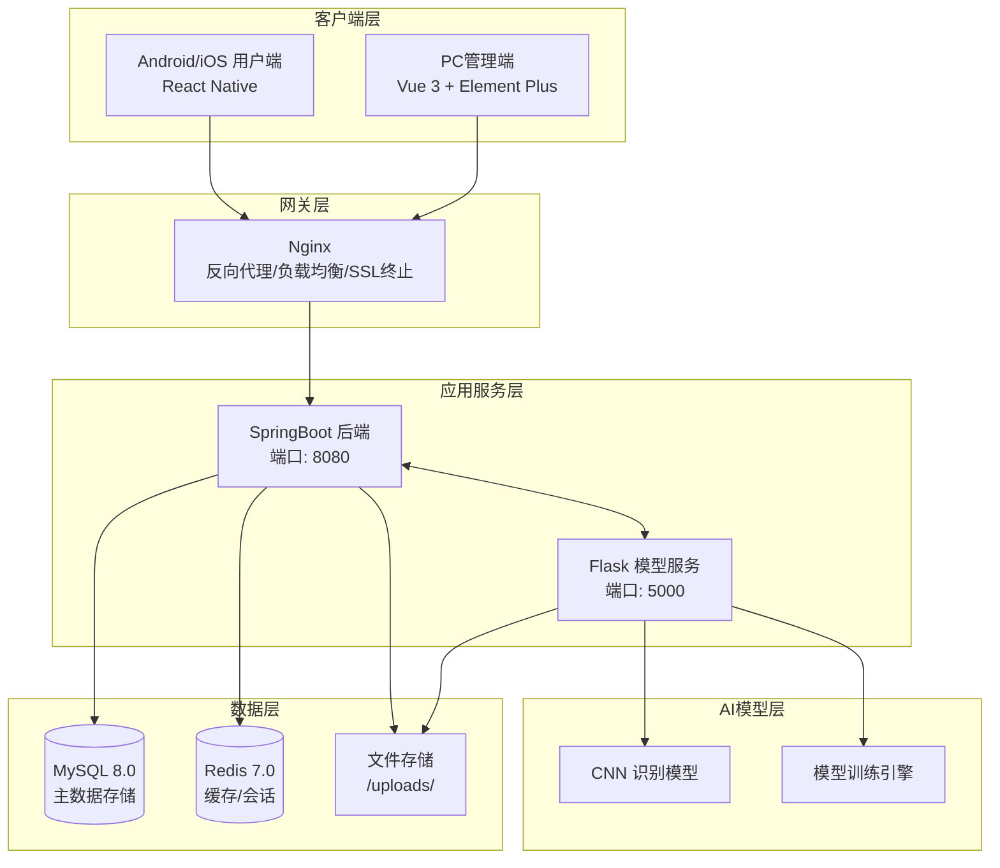
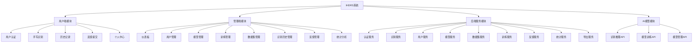
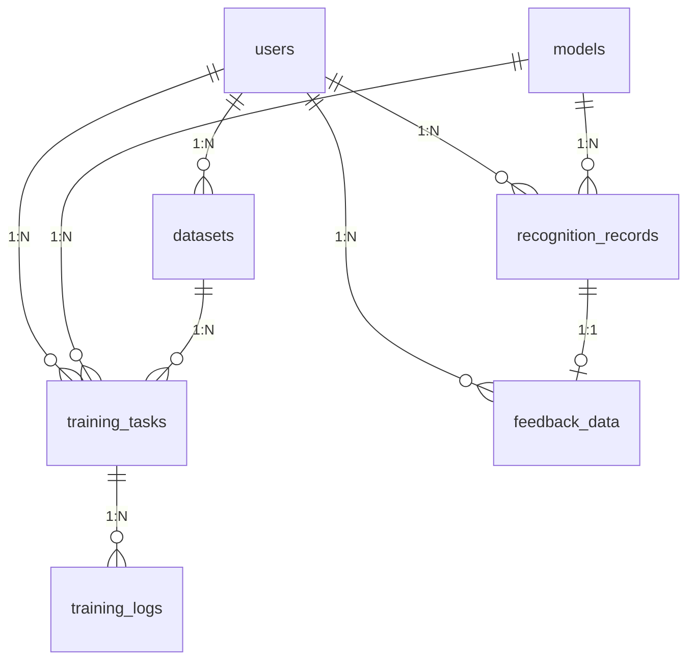
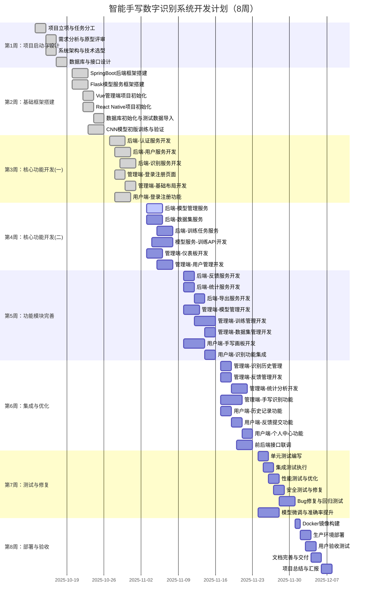
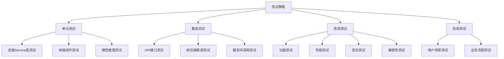

# 智能手写数字识别系统项目计划书

**Intelligent Handwritten Digit Recognition System (IHDRS)**
**Project Plan Document**

---

**文档编号:** IHDRS-PP-2025-001
**版本:** 2.0.0
**日期:** 2025-12-02
**编写人:** 刘家乐

---

## **修订历史**

| 版本号 | 修订日期   | 修订人 | 修订内容                     |
| ------ | ---------- | ------ | ---------------------------- |
| 1.0.0  | 2025-10-13 | 刘家乐 | 初稿                         |
| 1.1.0  | 2025-10-20 | 刘家乐 | 增加技术选型和团队分工       |
| 2.0.0  | 2025-12-02 | 刘家乐 | 细分工作内容，完善项目计划书 |

---

## **目录**

[TOC]

---

## **1.项目概述**

### **1.1 项目名称**

智能手写数字识别系统（Intelligent Handwritten Digit Recognition System，简称 **IHDRS**）

### **1.2 项目背景**

随着人工智能技术的快速发展，手写数字识别在教育、金融、邮政等领域有着广泛的应用需求。本项目旨在开发一个高准确率、易使用、可扩展的手写数字识别系统，采用深度学习技术，实现端到端的识别服务。

### **1.3 项目目标**

#### **1.3.1 核心目标**

| 目标类别     | 目标描述                                    | 量化指标        |
| ------------ | ------------------------------------------- | --------------- |
| **识别精度** | 基于CNN深度学习模型，实现高精度手写数字识别 | 准确率 ≥ 90%    |
| **响应速度** | 提供低延迟的实时识别服务                    | 响应时间 ≤ 2秒  |
| **跨平台**   | 支持Web管理端和移动用户端                   | iOS/Android/Web |
| **可用性**   | 系统稳定可靠运行                            | 可用性 ≥ 99%    |
| **并发能力** | 支持多用户同时使用                          | 并发用户 ≥ 100  |

#### **1.3.2 辅助目标**

- 提供完整的模型全生命周期管理功能
- 支持自定义数据集上传和模型训练
- 实现用户反馈闭环，持续优化模型性能
- 提供丰富的数据统计和可视化分析功能

### **1.4 项目范围**

#### **1.4.1 系统组成**

| 子系统         | 分支/目录名称       | 技术栈                      | 主要用户       |
| -------------- | ------------------- | --------------------------- | -------------- |
| **Web管理端**  | ihdrs-frontend      | Vue 3 + Vite + Element Plus | 管理员、分析师 |
| **移动用户端** | ihdrs-mobile        | React Native                | 普通用户       |
| **Java后端**   | src (Spring Boot)   | Spring Boot 3.5.6 + JPA     | 系统服务       |
| **模型服务**   | ihdrs-model-service | Python Flask + TensorFlow   | AI推理/训练    |

#### **1.4.2 功能范围**

**纳入范围:**
- 用户认证与授权（注册、登录、角色管理）
- 手写数字识别（单数字、多数字序列）
- 模型管理（训练、评估、激活、版本控制）
- 数据集管理（上传、解析、公开设置）
- 训练任务管理（创建、监控、可视化）
- 识别历史管理（查询、导出、删除）
- 用户反馈管理（提交、审核）
- 数据统计与可视化分析

**排除范围:**
- 分布式训练支持（v2.0规划）
- 中文/英文字符识别（未来扩展）
- 第三方OAuth登录集成

### **1.5 项目约束**

#### **1.5.1 时间约束**

- **项目周期:** 8周（2025年10月13日 - 2025年12月07日）
- **里程碑:** 每周设置关键交付节点

#### **1.5.2 技术约束**

- 后端采用 Java 17 + Spring Boot 3.x
- AI服务采用 Python 3.8+ + TensorFlow 2.x
- 数据库使用 MySQL 8.0
- 缓存使用 Redis 7.0
- 容器化部署使用 Docker + Docker Compose

#### **1.5.3 资源约束**

- 团队规模：6人
- 开发设备：个人电脑

---

## **2.技术架构设计**

### **2.1 整体架构**



### **2.2 技术栈选型**

| 层次            | 技术选型           | 版本       | 用途                  |
| --------------- | ------------------ | ---------- | --------------------- |
| **前端-用户端** | React Native       | 0.72+      | 跨平台移动应用        |
| **前端-管理端** | Vue 3 + Vite       | 3.3+ / 4.x | 响应式管理界面        |
| **UI组件库**    | Element Plus       | 2.4+       | 管理端UI组件          |
| **后端框架**    | Spring Boot        | 3.5.6      | Java应用框架          |
| **安全框架**    | Spring Security    | 6.x        | 认证授权              |
| **ORM框架**     | Spring Data JPA    | 3.x        | 数据持久化            |
| **AI框架**      | Flask + TensorFlow | 2.x + 2.x  | 模型服务API和深度学习 |
| **数据库**      | MySQL              | 8.0+       | 关系型数据存储        |
| **缓存**        | Redis              | 7.0+       | 会话缓存、结果缓存    |
| **Web服务器**   | Nginx              | 1.20+      | 反向代理              |
| **容器化**      | Docker + Compose   | 20.10+     | 容器编排部署          |
| **图表库**      | ECharts            | 5.4+       | 数据可视化            |

### **2.3 项目目录结构**

```
ihdrs-backend/                     # 项目根目录
├── src/                           # Spring Boot 后端源码
│   └── main/
│       ├── java/com/ihdrs/
│       │   ├── config/            # 配置类
│       │   ├── controller/        # 控制器层
│       │   ├── service/           # 业务逻辑层
│       │   ├── repository/        # 数据访问层
│       │   ├── entity/            # 实体类
│       │   ├── dto/               # 数据传输对象
│       │   └── util/              # 工具类
│       └── resources/
│           ├── application.yml    # 主配置文件
│           └── application-prod.yml
├── ihdrs-frontend/                # Vue管理端源码
│   ├── src/
│   │   ├── api/                   # API接口层
│   │   ├── components/            # 可复用组件
│   │   ├── views/                 # 页面组件
│   │   ├── stores/                # Pinia状态管理
│   │   ├── router/                # 路由配置
│   │   └── utils/                 # 工具函数
│   └── vite.config.js
├── ihdrs-mobile/                  # React Native用户端源码
│   ├── src/
│   │   ├── components/            # 可复用组件
│   │   ├── screens/               # 页面组件
│   │   ├── services/              # 业务服务
│   │   └── config/                # 配置文件
│   └── App.js
├── ihdrs-model-service/           # Python模型服务源码
│   ├── api/                       # API蓝图
│   ├── models/                    # 模型文件存储
│   ├── models_code/               # 模型定义代码
│   ├── services/                  # 业务服务
│   ├── utils/                     # 工具函数
│   ├── app.py                     # 主应用
│   └── requirements.txt           # Python依赖
├── uploads/                       # 文件存储目录
│   ├── datasets/                  # 数据集文件
│   ├── models/                    # 模型文件
│   └── images/                    # 识别图片
├── docker-compose.yml             # Docker编排配置
├── Dockerfile                     # Spring Boot Dockerfile
└── pom.xml                        # Maven配置
```

---

## **3. 功能模块设计**

### **3.1 功能模块总览**



### **3.2 功能优先级定义**

| 优先级 | 定义         | 交付要求           |
| ------ | ------------ | ------------------ |
| **P0** | 核心必须功能 | 必须100%完成       |
| **P1** | 重要增强功能 | 应完成，可简化实现 |
| **P2** | 改进优化功能 | 尽量完成           |
| **P3** | 未来扩展功能 | 本期不实现         |

### **3.3 用户端功能清单**

| 功能模块 | 功能项         | 优先级 | 描述                       |
| -------- | -------------- | ------ | -------------------------- |
| 用户认证 | 用户注册       | P0     | 用户名、密码、邮箱验证     |
|          | 用户登录       | P0     | 用户名密码验证、Token获取  |
|          | Token验证      | P0     | 自动登录、Token续期        |
| 手写识别 | 画布手写识别   | P0     | 在画布上绘制数字，实时识别 |
|          | 图片上传识别   | P1     | 从相册选择图片进行识别     |
|          | 相机拍照识别   | P1     | 使用相机拍摄数字图片识别   |
|          | 多数字序列识别 | P2     | 识别包含多个数字的图片     |
| 历史记录 | 历史列表查询   | P1     | 分页查询用户的识别历史     |
|          | 记录详情查看   | P1     | 查看图片、置信度、概率分布 |
|          | 记录删除       | P1     | 支持单个或批量删除记录     |
| 反馈提交 | 错误反馈       | P1     | 标记错误结果，提供正确答案 |
|          | 反馈列表       | P2     | 查询用户提交的反馈记录     |
| 个人中心 | 个人信息查看   | P1     | 显示用户账户信息           |
|          | 个人信息修改   | P2     | 修改邮箱、手机号等信息     |
|          | 密码修改       | P2     | 修改登录密码               |

### **3.4 管理端功能清单**

| 功能模块     | 功能项         | 优先级 | 描述                                     |
| ------------ | -------------- | ------ | ---------------------------------------- |
| 仪表板       | 数据概览卡片   | P0     | 总识别次数、注册用户数、模型数等         |
|              | 识别趋势图     | P1     | 折线图展示近期识别量变化                 |
|              | 数字分布图     | P1     | 饼图展示各数字识别比例                   |
|              | 最近活动       | P2     | 最近识别记录、系统状态                   |
| 用户管理     | 用户列表       | P0     | 分页展示、搜索、筛选、排序               |
|              | 角色管理       | P0     | USER/ADMIN角色变更                       |
|              | 状态管理       | P0     | 用户启用/禁用                            |
|              | 用户统计       | P1     | 总用户数、管理员数、活跃用户数           |
| 模型管理     | 模型列表       | P0     | 名称、版本、准确率、状态、创建时间       |
|              | 模型详情       | P0     | 基本信息、训练配置、性能指标             |
|              | 模型激活       | P0     | 设置为当前活跃模型                       |
|              | 模型停用/删除  | P1     | 停用或删除非活跃模型                     |
|              | 版本对比       | P2     | 多模型性能对比分析                       |
| 训练任务管理 | 创建训练任务   | P0     | 任务名称、数据集选择、模型类型、训练参数 |
|              | 任务列表       | P0     | 状态筛选、进度展示                       |
|              | 实时进度监控   | P0     | 当前Epoch、Batch进度、训练日志           |
|              | 训练曲线可视化 | P1     | 准确率曲线、损失曲线                     |
|              | 混淆矩阵分析   | P2     | 训练完成后展示混淆矩阵热力图             |
|              | 任务取消       | P1     | 取消运行中的任务                         |
| 数据集管理   | 数据集上传     | P0     | 拖拽上传、格式验证、进度展示             |
|              | 数据集列表     | P0     | 我的数据集、公开数据集                   |
|              | 数据集详情     | P1     | 类别数、样本数、图像信息                 |
|              | 公开设置       | P1     | 设置数据集公开/私有                      |
|              | 数据集删除     | P1     | 删除数据集及相关文件                     |
| 识别历史管理 | 高级搜索       | P1     | 结果、时间范围、用户ID、输入方式         |
|              | 数据展示       | P0     | 图像预览、识别结果、置信度               |
|              | 批量操作       | P1     | 批量删除、批量导出                       |
|              | 数据导出       | P1     | Excel、CSV、PDF格式                      |
| 反馈管理     | 反馈列表       | P1     | 状态筛选、类型筛选                       |
|              | 反馈审核       | P1     | 接受/拒绝反馈、添加审核备注              |
|              | 批量审核       | P2     | 批量接受、批量拒绝                       |
| 统计分析     | 识别量趋势图   | P1     | 每日/每周/每月识别量                     |
|              | 成功率趋势图   | P1     | 识别准确率变化                           |
|              | 数字分布图     | P1     | 各数字识别比例                           |
|              | 系统资源监控   | P2     | CPU使用率、内存使用率                    |

### **3.5 后端API功能清单**

| 模块       | API数量 | 优先级 | 主要接口                                    |
| ---------- | ------- | ------ | ------------------------------------------- |
| 认证接口   | 3       | P0     | login, register, validate                   |
| 用户管理   | 8       | P0     | CRUD, updateRole, updateStatus, profile     |
| 识别服务   | 7       | P0     | recognize, recognize_multi, history, delete |
| 模型管理   | 12      | P0     | list, detail, activate, disable, delete     |
| 训练管理   | 10      | P0     | create, list, progress, logs, cancel        |
| 数据集管理 | 8       | P0     | upload, list, detail, setPublic, delete     |
| 反馈管理   | 7       | P1     | submit, list, review, batchReview           |
| 统计分析   | 4       | P1     | dashboard, trends, distribution             |
| 导出服务   | 3       | P1     | excel, csv, pdf                             |

---

## **4.数据库设计**

### **4.1 核心数据表**

| 表名                | 中文名     | 描述                    |
| ------------------- | ---------- | ----------------------- |
| users               | 用户表     | 存储用户账户信息        |
| models              | 模型表     | 存储训练模型信息        |
| recognition_records | 识别记录表 | 存储每次识别的详细记录  |
| training_tasks      | 训练任务表 | 存储训练任务信息        |
| training_logs       | 训练日志表 | 存储每个Epoch的训练指标 |
| datasets            | 数据集表   | 存储上传的数据集信息    |
| feedback_data       | 反馈数据表 | 存储用户反馈信息        |
| operation_logs      | 操作日志表 | 存储系统操作日志        |
| user_logs           | 用户日志表 | 存储用户行为日志        |

### **4.2 E-R关系图**



---

## **5. 团队组织与分工**

### **5.1 团队成员**

| 成员   | 角色              | 主要职责                                     |
| ------ | ----------------- | -------------------------------------------- |
| 刘家乐 | 项目负责人/架构师 | 项目管理、系统架构、技术选型、后端核心开发   |
| 岑晓茵 | 全栈开发工程师    | 数据管理模块（识别记录、反馈、统计）         |
| 郑青惟 | 全栈开发工程师    | 用户认证和安全模块（注册、登录、用户管理）   |
| 陈家豪 | 全栈开发工程师    | 模型训练管理模块（训练任务、监控、结果分析） |
| 安娜   | 前端开发工程师    | Vue管理端手写识别模块、统计分析模块          |
| 高翔   | 移动端开发工程师  | React Native用户端手写识别模块               |

## **6. 项目进度计划**

### **6.1 项目时间表（8周开发计划）**



### **6.2 里程碑定义**

| 里程碑 | 日期       | 交付物                                         | 验收标准                   |
| ------ | ---------- | ---------------------------------------------- | -------------------------- |
| M1     | 2025-10-19 | 项目计划书、需求规格说明书、概要设计说明书     | 文档评审通过               |
| M2     | 2025-10-26 | 后端框架、模型服务框架、初版CNN模型            | 框架可运行，模型准确率>85% |
| M3     | 2025-11-02 | 认证/用户/识别服务、管理端登录、用户端登录     | 核心认证流程打通           |
| M4     | 2025-11-09 | 模型/数据集/训练服务、仪表板、用户管理页面     | 模型训练流程可用           |
| M5     | 2025-11-16 | 全部后端服务、大部分管理端页面、用户端核心功能 | 主流程可跑通               |
| M6     | 2025-11-23 | 全部前端功能完成、前后端联调完成               | 功能完整可用               |
| M7     | 2025-11-30 | 测试完成、Bug修复、性能优化                    | 准确率≥90%，响应时间≤2秒   |
| M8     | 2025-12-07 | 系统上线、文档交付、项目验收                   | 通过验收标准               |

### **6.3 各周详细任务分解**

#### **第1周：项目启动与设计（2025-10-13 ~ 2025-10-19）**

| 任务ID | 任务名称           | 负责人 | 产出物         |
| ------ | ------------------ | ------ | -------------- |
| T1.1   | 项目立项会议       | 刘家乐 | 会议纪要       |
| T1.2   | 团队分工确认       | 刘家乐 | 分工表         |
| T1.3   | 需求收集与分析     | 全体   | 需求清单       |
| T1.4   | 原型设计与评审     | 刘家乐 | 原型图         |
| T1.5   | 系统架构设计       | 刘家乐 | 架构图         |
| T1.6   | 技术选型确认       | 刘家乐 | 技术选型文档   |
| T1.7   | 数据库设计         | 刘家乐 | E-R图、表结构  |
| T1.8   | API接口设计        | 刘家乐 | 接口文档       |
| T1.9   | 编写需求规格说明书 | 刘家乐 | 需求规格说明书 |
| T1.10  | 编写概要设计说明书 | 刘家乐 | 概要设计说明书 |

#### **第2周：基础框架搭建（2025-10-20 ~ 2025-10-26）**

| 任务ID | 任务名称               | 负责人 | 产出物             |
| ------ | ---------------------- | ------ | ------------------ |
| T2.1   | Spring Boot项目初始化  | 刘家乐 | 后端工程骨架       |
| T2.2   | 数据库连接配置         | 刘家乐 | 数据源配置         |
| T2.3   | JPA Entity基类定义     | 刘家乐 | 基础实体类         |
| T2.4   | Spring Security配置    | 刘家乐 | 安全配置类         |
| T2.5   | JWT工具类开发          | 刘家乐 | JwtUtil            |
| T2.6   | 统一响应封装           | 刘家乐 | Result类           |
| T2.7   | 全局异常处理           | 刘家乐 | ExceptionHandler   |
| T2.8   | Flask项目初始化        | 刘家乐 | Python工程骨架     |
| T2.9   | Flask蓝图架构搭建      | 刘家乐 | API蓝图结构        |
| T2.10  | CNN模型代码编写        | 刘家乐 | models_code/cnn.py |
| T2.11  | MNIST数据集训练        | 刘家乐 | 初版模型文件       |
| T2.12  | 识别推理API开发        | 刘家乐 | /api/recognize     |
| T2.13  | Vue项目初始化          | 岑晓茵 | 前端工程骨架       |
| T2.14  | Vue路由配置            | 岑晓茵 | router/index.js    |
| T2.15  | Pinia状态管理配置      | 岑晓茵 | stores/            |
| T2.16  | Axios请求封装          | 岑晓茵 | utils/request.js   |
| T2.17  | React Native项目初始化 | 高翔   | 移动端工程骨架     |
| T2.18  | RN导航配置             | 高翔   | 导航结构           |
| T2.19  | MySQL数据库创建        | 刘家乐 | 数据库、用户       |
| T2.20  | 数据库表创建           | 刘家乐 | SQL脚本            |
| T2.21  | 测试数据导入           | 刘家乐 | 测试数据           |

#### **第3周：核心功能开发（一）（2025-10-27 ~ 2025-11-02）**

| 任务ID | 任务名称                  | 负责人 | 产出物                 |
| ------ | ------------------------- | ------ | ---------------------- |
| T3.1   | User实体类开发            | 刘家乐 | User.java              |
| T3.2   | UserRepository开发        | 刘家乐 | UserRepository.java    |
| T3.3   | AuthService开发           | 刘家乐 | 登录/注册/验证逻辑     |
| T3.4   | AuthController开发        | 刘家乐 | 认证API                |
| T3.5   | UserService开发           | 刘家乐 | 用户CRUD逻辑           |
| T3.6   | UserController开发        | 刘家乐 | 用户管理API            |
| T3.7   | RecognitionRecord实体类   | 刘家乐 | RecognitionRecord.java |
| T3.8   | RecognitionService开发    | 刘家乐 | 识别业务逻辑           |
| T3.9   | RecognitionController开发 | 刘家乐 | 识别API                |
| T3.10  | 管理端登录页面开发        | 刘家乐 | LoginView.vue          |
| T3.11  | 管理端注册页面开发        | 刘家乐 | RegisterView.vue       |
| T3.12  | 管理端布局组件开发        | 刘家乐 | BasicLayout.vue        |
| T3.13  | 管理端侧边栏菜单          | 刘家乐 | SideMenu.vue           |
| T3.14  | 管理端顶部导航            | 刘家乐 | TopNav.vue             |
| T3.15  | 用户端登录页面            | 郑青惟 | LoginScreen.js         |
| T3.16  | 用户端注册页面            | 郑青惟 | RegisterScreen.js      |
| T3.17  | 用户端authService         | 郑青惟 | authService.js         |

#### **第4周：核心功能开发（二）（2025-11-03 ~ 2025-11-09）**

| 任务ID | 任务名称                  | 负责人 | 产出物                 |
| ------ | ------------------------- | ------ | ---------------------- |
| T4.1   | Model实体类开发           | 刘家乐 | Model.java             |
| T4.2   | ModelRepository开发       | 刘家乐 | ModelRepository.java   |
| T4.3   | ModelManagementService    | 刘家乐 | 模型管理业务逻辑       |
| T4.4   | ModelManagementController | 刘家乐 | 模型管理API            |
| T4.5   | Dataset实体类开发         | 刘家乐 | Dataset.java           |
| T4.6   | DatasetRepository开发     | 刘家乐 | DatasetRepository.java |
| T4.7   | DatasetService开发        | 刘家乐 | 数据集上传解析逻辑     |
| T4.8   | DatasetController开发     | 刘家乐 | 数据集API              |
| T4.9   | TrainingTask实体类开发    | 刘家乐 | TrainingTask.java      |
| T4.10  | TrainingLog实体类开发     | 刘家乐 | TrainingLog.java       |
| T4.11  | TrainingTaskService开发   | 刘家乐 | 训练任务管理逻辑       |
| T4.12  | TrainingTaskController    | 刘家乐 | 训练任务API            |
| T4.13  | Flask训练API开发          | 刘家乐 | /api/train             |
| T4.14  | Flask训练回调机制         | 刘家乐 | 进度回调               |
| T4.15  | 管理端仪表板页面          | 安娜   | DashboardView.vue      |
| T4.16  | 仪表板统计卡片组件        | 安娜   | StatCard.vue           |
| T4.17  | 仪表板图表组件            | 安娜   | DashboardCharts.vue    |
| T4.18  | 管理端用户管理页面        | 岑晓茵 | UserManagement.vue     |
| T4.19  | 用户列表表格组件          | 岑晓茵 | UserTable.vue          |
| T4.20  | 用户编辑对话框            | 岑晓茵 | UserEditDialog.vue     |

#### **第5周：功能模块完善（2025-11-10 ~ 2025-11-16）**

| 任务ID | 任务名称               | 负责人 | 产出物                  |
| ------ | ---------------------- | ------ | ----------------------- |
| T5.1   | Feedback实体类开发     | 刘家乐 | Feedback.java           |
| T5.2   | FeedbackRepository开发 | 刘家乐 | FeedbackRepository.java |
| T5.3   | FeedbackService开发    | 刘家乐 | 反馈业务逻辑            |
| T5.4   | FeedbackController开发 | 刘家乐 | 反馈API                 |
| T5.5   | StatsService开发       | 刘家乐 | 统计业务逻辑            |
| T5.6   | StatsController开发    | 刘家乐 | 统计API                 |
| T5.7   | ExportService开发      | 刘家乐 | Excel/CSV/PDF导出       |
| T5.8   | ExportController开发   | 刘家乐 | 导出API                 |
| T5.9   | 管理端模型管理页面     | 刘家乐 | ModelManagement.vue     |
| T5.10  | 模型详情组件           | 刘家乐 | ModelDetail.vue         |
| T5.11  | 模型对比组件           | 刘家乐 | ModelCompare.vue        |
| T5.12  | 管理端训练管理页面     | 刘家乐 | TrainingManagement.vue  |
| T5.13  | 训练配置表单组件       | 刘家乐 | TrainingConfigForm.vue  |
| T5.14  | 训练进度监控组件       | 刘家乐 | TrainingProgress.vue    |
| T5.15  | 训练曲线图表组件       | 刘家乐 | TrainingCharts.vue      |
| T5.16  | 管理端数据集管理页面   | 刘家乐 | DatasetManagement.vue   |
| T5.17  | 数据集上传组件         | 刘家乐 | DatasetUpload.vue       |
| T5.18  | 用户端手写画布组件     | 高翔   | DrawingCanvas.js        |
| T5.19  | 用户端主界面开发       | 高翔   | MainScreen.js           |
| T5.20  | 用户端识别服务         | 高翔   | recognitionService.js   |

#### **第6周：集成与优化（2025-11-17 ~ 2025-11-23）**

| 任务ID | 任务名称                | 负责人 | 产出物                 |
| ------ | ----------------------- | ------ | ---------------------- |
| T6.1   | 管理端识别历史页面      | 郑青惟 | HistoryManagement.vue  |
| T6.2   | 识别记录表格组件        | 郑青惟 | RecordTable.vue        |
| T6.3   | 高级搜索组件            | 郑青惟 | AdvancedSearch.vue     |
| T6.4   | 管理端反馈管理页面      | 刘家乐 | FeedbackManagement.vue |
| T6.5   | 反馈审核对话框          | 刘家乐 | ReviewDialog.vue       |
| T6.6   | 管理端统计分析页面      | 安娜   | StatisticsView.vue     |
| T6.7   | 趋势图表组件            | 安娜   | TrendCharts.vue        |
| T6.8   | 分布图表组件            | 安娜   | DistributionCharts.vue |
| T6.9   | 管理端手写识别页面      | 安娜   | RecognitionView.vue    |
| T6.10  | 管理端画布组件          | 安娜   | DrawingBoard.vue       |
| T6.11  | 识别结果展示组件        | 安娜   | ResultDisplay.vue      |
| T6.12  | 用户端历史记录页面      | 郑青惟 | HistoryScreen.js       |
| T6.13  | 用户端历史服务          | 郑青惟 | historyService.js      |
| T6.14  | 用户端反馈页面          | 郑青惟 | FeedbackScreen.js      |
| T6.15  | 用户端反馈服务          | 郑青惟 | feedbackService.js     |
| T6.16  | 用户端个人中心页面      | 岑晓茵 | ProfileScreen.js       |
| T6.17  | 用户端用户服务          | 岑晓茵 | userService.js         |
| T6.18  | 前后端接口联调-认证模块 | 刘家乐 | 接口调试报告           |
| T6.19  | 前后端接口联调-识别模块 | 刘家乐 | 接口调试报告           |
| T6.20  | 前后端接口联调-训练模块 | 刘家乐 | 接口调试报告           |
| T6.21  | 前后端接口联调-数据管理 | 刘家乐 | 接口调试报告           |

#### **第7周：测试与修复（2025-11-24 ~ 2025-11-30）**

| 任务ID | 任务名称          | 负责人 | 产出物       |
| ------ | ----------------- | ------ | ------------ |
| T7.1   | 后端单元测试编写  | 刘家乐 | 测试用例代码 |
| T7.2   | 管理端组件测试    | 岑晓茵 | 测试报告     |
| T7.3   | 用户端功能测试    | 郑青惟 | 测试报告     |
| T7.4   | 集成测试-认证流程 | 岑晓茵 | 测试报告     |
| T7.5   | 集成测试-识别流程 | 郑青惟 | 测试报告     |
| T7.6   | 集成测试-训练流程 | 陈家豪 | 测试报告     |
| T7.7   | 性能测试-响应时间 | 刘家乐 | 性能报告     |
| T7.8   | 性能测试-并发能力 | 刘家乐 | 性能报告     |
| T7.9   | 安全测试-认证授权 | 刘家乐 | 安全报告     |
| T7.10  | 安全测试-输入验证 | 刘家乐 | 安全报告     |
| T7.11  | Bug修复-后端      | 刘家乐 | 修复记录     |
| T7.12  | Bug修复-管理端    | 刘家乐 | 修复记录     |
| T7.13  | Bug修复-用户端    | 刘家乐 | 修复记录     |
| T7.14  | 模型微调-数据增强 | 陈家豪 | 优化模型     |
| T7.15  | 模型微调-参数优化 | 陈家豪 | 优化模型     |

#### **第8周：部署与验收（2025-12-01 ~ 2025-12-07）**

| 任务ID | 任务名称               | 负责人 | 产出物             |
| ------ | ---------------------- | ------ | ------------------ |
| T8.1  | 用户验收测试-管理端    | 刘家乐 | UAT报告            |
| T8.2  | 用户验收测试-用户端    | 刘家乐 | UAT报告            |
| T8.3  | 问题修复               | 全体   | 修复记录           |
| T8.4 | 用户操作手册编写           | 刘家乐 | 用户操作手册                 |
| T8.5 | 部署运维手册编写           | 刘家乐 | 部署运维手册                 |
| T8.6 | API接口文档完善            | 刘家乐 | API文档                      |
| T8.7 | 详细设计说明书完善         | 刘家乐 | 详细设计说明书               |
| T8.8 | 项目总结报告编写           | 刘家乐 | 项目总结报告                 |
| T8.9 | 项目验收汇报准备           | 刘家乐 | PPT演示文稿                  |

## **7.风险管理**

### **7.1 风险识别与评估**

| 风险ID | 风险类别 | 风险描述                         | 可能性 | 影响程度 | 风险等级 |
| ------ | -------- | -------------------------------- | ------ | -------- | -------- |
| R01    | 技术风险 | Java-Python异构系统集成复杂度高  | 高     | 高       | **高**   |
| R02    | 技术风险 | CNN模型准确率达不到90%要求       | 中     | 高       | **高**   |
| R03    | 进度风险 | React Native开发经验不足导致延期 | 中     | 中       | **中**   |
| R04    | 技术风险 | 训练过程可视化WebSocket实现复杂  | 中     | 中       | **中**   |
| R05    | 资源风险 | 无GPU服务器，模型训练时间过长    | 高     | 中       | **中**   |
| R06    | 进度风险 | 前后端联调时间不足               | 中     | 中       | **中**   |
| R07    | 质量风险 | 测试覆盖不足导致上线后Bug多      | 低     | 高       | **中**   |
| R08    | 技术风险 | 文件上传和大数据集处理性能问题   | 中     | 中       | **中**   |
| R09    | 人员风险 | 团队成员技术栈差异导致协作困难   | 低     | 中       | **低**   |
| R10    | 外部风险 | 第三方库版本兼容性问题           | 低     | 低       | **低**   |

### **7.2 风险应对策略**

| 风险ID | 应对策略                                                     |
| ------ | ------------------------------------------------------------ |
| R01    | 1.制定详细的HTTP接口规范<br>2.统一使用JSON数据格式<br>3.建立服务健康检查机制<br>4. 实现请求重试和超时处理 |
| R02    | 1. 数据增强（旋转、缩放、噪声）<br>2. 尝试多种模型架构（ResNet、VGG）<br>3. 超参数调优（学习率、批次大小）<br>4.使用预训练模型微调 |
| R03    | 1. 优先使用成熟的RN组件库<br>2. 简化UI交互设计<br>3.备选方案：开发Web移动端 |
| R04    | 1. 先使用轮询方案实现<br>2.WebSocket作为增强功能<br>3.使用现成的WebSocket库 |
| R05    | 1. 使用较小的数据集进行开发测试<br>2.优化训练代码提高效率<br>3.考虑使用云GPU服务<br>4.预训练模型本地微调 |
| R06    | 1. 提前定义接口Mock数据<br>2.并行开发前后端<br>3.每周进行一次联调 |
| R07    | 1. 单元测试覆盖率要求≥80%<br>2.集成测试覆盖核心流程<br>3.代码评审制度 |
| R08    | 1. 分块上传大文件<br>2.异步处理数据集解析<br>3.使用Redis缓存热点数据 |
| R09    | 1. 每周技术检查<br>2.结对编程                                |
| R10    | 1. 锁定依赖版本<br>2.使用Docker确保环境一致<br>3.定期更新依赖 |

### **7.3 风险监控计划**

| 监控项目     | 监控频率 | 监控方式                |
| ------------ | -------- | ----------------------- |
| 项目进度     | 每日     | 站会、任务看板          |
| 代码质量     | 每周     | 代码评审、SonarQube扫描 |
| 模型准确率   | 每周     | 测试集评估              |
| 系统性能     | 每周     | 性能测试报告            |
| 接口联调问题 | 每周     | 联调问题清单            |
| 风险状态     | 每周     | 风险评审会议            |

---

## **8.质量保证计划**

### **8.1 质量目标**

| 质量维度     | 质量指标           | 目标值  |
| ------------ | ------------------ | ------- |
| **功能性**   | P0/P1功能完成率    | 100%    |
| **可靠性**   | 系统可用性         | ≥99%    |
| **性能**     | 识别响应时间       | ≤2秒    |
| **性能**     | 并发用户支持数     | ≥100    |
| **准确性**   | 手写数字识别准确率 | ≥90%    |
| **可维护性** | 代码注释覆盖率     | ≥20%    |
| **可维护性** | 单元测试覆盖率     | ≥80%    |
| **安全性**   | 安全漏洞数量       | 0个高危 |

### **8.2 编码规范**

#### **8.2.1 Java编码规范**

| 规范项目 | 规范要求                               |
| -------- | -------------------------------------- |
| 命名规范 | 遵循阿里巴巴Java开发手册               |
| 类命名   | 大驼峰命名法，如 `UserService`         |
| 方法命名 | 小驼峰命名法，如 `getUserById`         |
| 常量命名 | 全大写下划线分隔，如 `MAX_RETRY_COUNT` |
| 包命名   | 全小写，如 `com.ihdrs.service`         |
| 注释要求 | 类、方法必须有Javadoc注释              |
| 代码格式 | 使用IDE默认格式化，缩进4空格           |
| 异常处理 | 禁止catch后不处理，必须记录日志        |

#### **8.2.2 Python编码规范**

| 规范项目   | 规范要求                              |
| ---------- | ------------------------------------- |
| 代码风格   | 遵循PEP 8规范                         |
| 函数命名   | 小写下划线分隔，如 `predict_digit`    |
| 类命名     | 大驼峰命名法，如 `ModelService`       |
| 常量命名   | 全大写下划线分隔，如 `MAX_IMAGE_SIZE` |
| 文档字符串 | 所有公共函数必须有docstring           |
| 类型注解   | 推荐使用Type Hints                    |
| 导入顺序   | 标准库 → 第三方库 → 本地模块          |

#### **8.2.3 Vue/JavaScript编码规范**

| 规范项目  | 规范要求                               |
| --------- | -------------------------------------- |
| 代码风格  | 遵循Vue官方风格指南                    |
| 组件命名  | 大驼峰命名法，如 `UserTable.vue`       |
| 变量命名  | 小驼峰命名法，如 `userName`            |
| 常量命名  | 全大写下划线分隔，如 `API_BASE_URL`    |
| 组件结构  | template → script setup → style scoped |
| Props定义 | 必须定义类型和默认值                   |
| 事件命名  | 小写短横线分隔，如 `@update-user`      |

### **8.3 测试策略**

#### **8.3.1 测试层次**



#### **8.3.2 测试覆盖要求**

| 测试类型 | 覆盖范围          | 覆盖率要求 |
| -------- | ----------------- | ---------- |
| 单元测试 | Service层、工具类 | ≥80%       |
| 集成测试 | Controller层API   | ≥80%       |
| 接口测试 | 全部REST API      | ≥80%       |
| 性能测试 | 核心接口          | ≥80%       |
| 安全测试 | 认证授权相关接口  | ≥80%       |

## **9. 配置管理**

### **9.1 配置文件管理**

| 配置文件             | 环境     | 管理方式             |
| -------------------- | -------- | -------------------- |
| application.yml      | 开发     | Git版本控制          |
| application-test.yml | 测试     | Git版本控制          |
| application-prod.yml | 生产     | 环境变量覆盖敏感信息 |
| config.py            | Python   | Git版本控制          |
| .env.development     | 前端开发 | Git版本控制          |
| .env.production      | 前端生产 | 构建时注入           |

---

## **10. 交付计划**

### **10.1 交付物清单**

#### **10.1.1 软件交付物**

| 类别       | 交付物           | 交付时间 |
| ---------- | ---------------- | -------- |
| 后端服务   | Spring Boot应用  | M8       |
| 模型服务   | Flask应用        | M8       |
| 管理端     | Vue Web应用      | M8       |
| 用户端     | React Native应用 | M8       |
| 数据库     | MySQL数据库脚本  | M8       |
| 预训练模型 | CNN默认模型文件  | M8       |

#### **10.1.2 文档交付物**

| 文档名称         | 文档编号           | 交付时间 |
| ---------------- | ------------------ | -------- |
| 项目计划书       | IHDRS-PP-2025-001  | M1       |
| 需求规格说明书   | IHDRS-SRS-2025-001 | M1       |
| 概要设计说明书   | IHDRS-HLD-2025-001 | M1       |
| 详细设计说明书   | IHDRS-DDS-2025-001 | M8       |
| 数据库设计说明书 | IHDRS-DBS-2025-001 | M1       |
| API接口文档      | IHDRS-API-2025-001 | M8       |
| 用户操作手册     | IHDRS-UOM-2025-001 | M8       |
| 部署运维手册     | IHDRS-DOM-2025-001 | M8       |
| 测试计划和报告   | IHDRS-TR-2025-001  | M8       |
| 项目总结报告     | IHDRS-PSR-2025-001 | M8       |

### **10.2 验收标准**

#### **10.2.1 功能验收标准**

| 验收项目     | 验收标准                     | 验收方法 |
| ------------ | ---------------------------- | -------- |
| P0功能完成率 | 100%全部实现                 | 功能测试 |
| P1功能完成率 | ≥90%实现                     | 功能测试 |
| 核心业务流程 | 识别、训练、管理流程全部打通 | 场景测试 |
| 接口正确性   | 全部API接口符合设计文档      | 接口测试 |

#### **10.2.2 性能验收标准**

| 验收项目       | 验收标准            | 验收方法   |
| -------------- | ------------------- | ---------- |
| 识别准确率     | ≥90%                | 测试集评估 |
| 识别响应时间   | ≤2秒（95%请求）     | 性能测试   |
| 并发用户数     | ≥100用户同时在线    | 压力测试   |
| 系统可用性     | ≥99%                | 稳定性测试 |
| 训练任务稳定性 | 连续训练100轮不中断 | 稳定性测试 |
