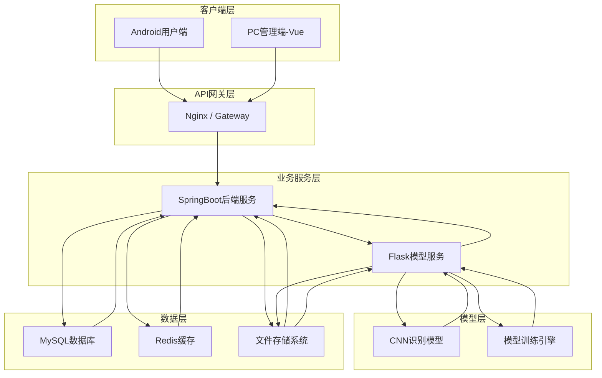
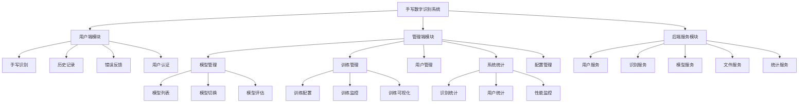
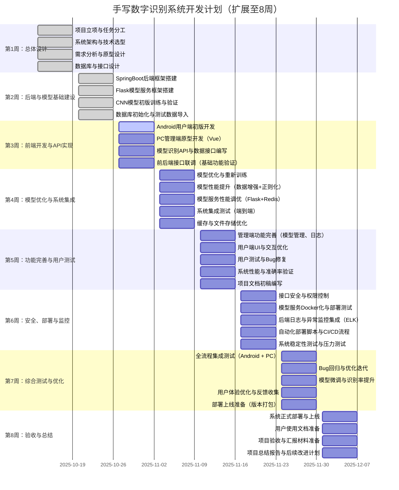

# 手写数字识别系统项目计划书

## 1. 项目概述

### 1.1 项目名称
智能手写数字识别系统（Intelligent Handwritten Digit Recognition System，简称IHDRS）

### 1.2 项目目标
构建一个基于深度学习的手写数字识别系统，支持PC端管理和Android端应用，实现准确率不低于90%的数字识别功能，并提供完整的模型训练管理功能。

### 1.3 项目范围
- **用户端（Android）**：手写数字识别、历史记录查看、错误反馈
- **管理端（PC Web）**：模型训练管理、用户管理、系统统计、模型切换
- **后端服务**：Java SpringBoot + Python Flask 异构系统集成
- **深度学习模型**：基于CNN的手写数字识别模型

### 1.4 项目背景
随着人工智能技术的快速发展，手写数字识别在教育、金融、邮政等领域有着广泛的应用需求。本项目旨在开发一个高准确率、易使用、可扩展的手写数字识别平台，同时提供可视化的模型训练管理功能，让用户能够直观地理解和参与深度学习模型的训练过程。

## 2. 技术架构设计

### 2.1 整体架构

具体步骤如下：

1. 用户在 Android 客户端写入数字，上传图像；
2. API 网关将请求转发至 SpringBoot；
3. SpringBoot 调用 Flask 模型服务；
4. Flask 调用 CNN 模型识别；
5. 结果返回 SpringBoot；
6. SpringBoot 将结果存入 Redis 缓存及 MySQL；
7. 返回识别结果给客户端。

### 2.2 技术栈选型

| 层次 | 技术选型 | 说明 |
|------|----------|------|
| 前端-用户端 | Android(Kotlin) + Canvas | 手写画板、识别展示 |
| 前端-管理端 | Vue 3 + Element Plus | 响应式管理界面 |
| 后端-业务服务 | SpringBoot + MyBatis | 用户管理、数据管理 |
| 后端-模型服务 | Python Flask + TensorFlow | 模型训练、推理服务 |
| 数据库 | MySQL 8.0 | 主数据存储 |
| 缓存 | Redis 6.0 | 会话缓存、识别缓存 |
| 文件存储 | 本地存储 | 图片、模型文件存储 |
| 部署 | Docker + Docker Compose | 容器化部署 |

### 2.3 异构系统集成方案
- **通信方式**：HTTP RESTful API
- **数据格式**：JSON标准格式
- **认证机制**：JWT Token统一认证
- **错误处理**：统一错误码和重试机制
- **监控告警**：健康检查和服务状态监控

## 3. 功能模块设计

### 3.1 功能架构

### 3.2 功能优先级

#### P0级功能（必须实现）
- 基础手写识别功能
- 用户注册登录
- 单模型训练和管理
- 简单的识别统计

#### P1级功能（重要功能）
- 历史记录保存和查询
- 训练过程可视化
- 模型版本切换管理
- 错误反馈机制

#### P2级功能（增强功能）
- 连续数字识别
- 用户反馈数据再训练
- 多模型对比分析
- 高级统计分析

#### P3级功能（未来扩展）
- 图片批量处理
- 自动化训练调度
- 模型性能自动优化
- 分布式训练支持

## 4. 开发计划

### 4.1 项目时间表（5周开发计划）

## 5. 团队分工与资源配置

### 5.1 团队角色分工
- **刘家乐**：项目管理、进度协调、系统架构、技术选型、测试
- **岑晓茵：**数据管理模块。设计Vue管理端和Android用户端的识别记录、用户反馈、数据统计等页面和业务逻辑。
- **郑青惟：**用户认证和安全模块。设计Vue管理端和Android用户端的用户注册、登录、用户信息展示、用户信息修改、用户管理的页面和业务逻辑。
- **陈家豪：**模型的训练和管理。设计Vue管理端的训练任务创建、监控、结果分析的界面和业务逻辑。
- **安娜：**Vue管理端的手写识别模块。设计Vue管理端手写识别的页面和业务逻辑。
- **高翔：**Android用户端的手写识别模块。设计Android用户端手写识别的页面和业务逻辑。

### 5.2 关键技能要求
- **后端开发**：Java、SpringBoot、MyBatis、Redis
- **算法工程师**：Python、TensorFlow、深度学习
- **前端开发**：Vue.js、Element Plus、Android开发
- **测试工程师**：自动化测试、性能测试
- **运维工程师**：Docker、Linux、监控工具

## 6. 风险评估与应对

### 6.1 技术风险

| 风险项 | 风险等级 | 影响 | 应对措施 |
|--------|----------|------|----------|
| Java-Python异构集成复杂 | 高 | 系统稳定性 | 使用HTTP API调用，制定详细接口规范 |
| 模型准确率达不到90% | 中 | 核心功能 | 数据增强、模型优化、集成学习 |
| Android开发时间不足 | 中 | 用户体验 | 采用跨平台方案或Web应用 |
| 训练可视化实现复杂 | 中 | 管理功能 | 使用现成可视化组件库 |

### 6.2 时间风险
- **开发进度延迟**：采用敏捷开发，每周评估调整
- **功能范围过大**：严格按优先级开发，P3功能可后期扩展
- **集成测试时间不足**：提前进行模块间接口联调

### 6.3 质量风险
- **代码质量控制**：代码评审、单元测试覆盖率≥80%
- **性能指标达标**：持续性能测试，及时优化
- **安全性保障**：安全评审、渗透测试

## 7. 质量保证计划

### 7.1 代码质量标准
- 遵循编码规范（阿里巴巴Java规范、PEP8）
- 代码注释覆盖率≥30%
- 单元测试覆盖率≥80%
- 代码评审机制

### 7.2 测试策略
- **单元测试**：开发阶段进行
- **集成测试**：模块完成后进行
- **系统测试**：功能完整后进行
- **性能测试**：识别响应时间<3秒
- **安全测试**：身份认证、数据加密

### 7.3 质量控制检查点
- 需求评审
- 设计评审
- 代码评审
- 测试评审
- 上线评审

## 8. 交付计划

### 8.1 交付物清单
- **文档交付物**
  - 项目计划书
  - 需求规格说明书
  - 概要设计说明书
  - 详细设计说明书
  - 数据库设计说明书
  - 用户操作手册
  - 部署运维手册

- **软件交付物**
  - SpringBoot后端服务
  - Flask模型服务
  - Vue管理端应用
  - Android用户端应用
  - 数据库脚本
  - Docker部署文件

### 8.2 验收标准
- 功能完整性：P0、P1功能100%实现
- 性能指标：识别准确率≥90%，响应时间≤2秒
- 稳定性：7×24小时稳定运行
- 安全性：通过安全测试
- 可用性：用户接受度测试通过

## 9. 项目成功标准

### 9.1 技术指标
- 手写数字识别准确率≥90%
- 系统响应时间≤2秒
- 并发用户数≥100
- 系统可用性≥99%

### 9.2 业务指标
- 用户满意度≥85%
- 功能完成度100%（P0、P1）
- 按时交付率100%
- 质量缺陷率≤5%

### 9.3 创新价值
- 异构系统集成方案可复用
- 可视化训练管理创新体验
- 深度学习技术普及应用
- 为后续AI项目积累经验
